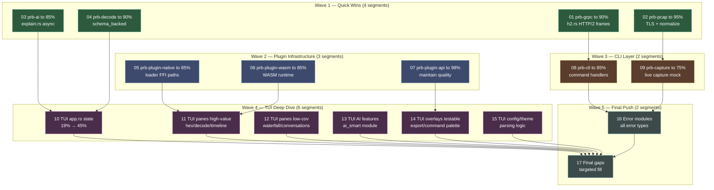

# Coverage 90 — Orchestration Manifest

## Overview

The PRB codebase currently has **61.13% workspace coverage** (baseline after S07 partial). This plan systematically fills coverage gaps across all 19 crates, with special focus on the challenging **prb-tui** crate (38% → 65% target, broken into 6 subsegments).

**Current State (Post-S07):**
- ✅ 10 crates already ≥85% coverage (core, export, detect, query, dds, zmq, storage, pcap, fixture, plugin-api)
- ⚠️ 9 crates below 85% coverage
- ❌ **prb-tui** at 38.11% is the critical gap (~18k lines, already has 256 tests)
- ❌ prb-capture (35%), prb-plugin-native (74%), prb-schema (93%) need work

**Goal:**
- Workspace coverage: 61.13% → **90%+**
- All library crates minimum: **85%**
- TUI crate: **65%** (realistic given UI-heavy code)
- Critical crates (core, pcap, grpc, protocol decoders): **95%+**

This plan addresses **17 segments** organized into **5 waves**.

---

## Dependency Diagram



---

## Segment Index

| # | Title | File | Depends On | Risk | Complexity | Cycle Budget | Est. Tests | Status |
|:---:|-------|------|:----------:|:----:|:----------:|:------------:|:------------:|:------:|
| 01 | prb-grpc to 90% | `segments/01-grpc-coverage.md` | — | 3 | Medium | 8 | ~30 tests | pending |
| 02 | prb-pcap to 95% | `segments/02-pcap-coverage.md` | — | 4 | High | 10 | ~35 tests | pending |
| 03 | prb-ai to 85% | `segments/03-ai-coverage.md` | — | 2 | Medium | 6 | ~20 tests | pending |
| 04 | prb-decode to 90% | `segments/04-decode-coverage.md` | — | 2 | Medium | 5 | ~20 tests | pending |
| 05 | prb-plugin-native to 85% | `segments/05-plugin-native-coverage.md` | — | 5 | High | 12 | ~50 tests | pending |
| 06 | prb-plugin-wasm to 85% | `segments/06-plugin-wasm-coverage.md` | — | 4 | High | 10 | ~40 tests | pending |
| 07 | prb-plugin-api to 98% | `segments/07-plugin-api-coverage.md` | — | 2 | Low | 4 | ~15 tests | pending |
| 08 | prb-cli to 85% | `segments/08-cli-coverage.md` | 01 | 3 | Medium | 12 | ~50 tests | pending |
| 09 | prb-capture to 75% | `segments/09-capture-coverage.md` | 02 | 4 | High | 10 | ~35 tests | pending |
| 10 | TUI app.rs state to 45% | `segments/10-tui-app-state.md` | 03, 04 | 5 | High | 15 | ~60 tests | pending |
| 11 | TUI panes (high-value) to 75% | `segments/11-tui-panes-high.md` | 05, 06, 07 | 4 | High | 12 | ~50 tests | pending |
| 12 | TUI panes (low-cov) to 40% | `segments/12-tui-panes-low.md` | 10 | 3 | Medium | 10 | ~40 tests | pending |
| 13 | TUI AI features to 55% | `segments/13-tui-ai-features.md` | 03 | 3 | Medium | 10 | ~40 tests | pending |
| 14 | TUI overlays testable to 50% | `segments/14-tui-overlays.md` | 07, 10 | 3 | Medium | 12 | ~45 tests | pending |
| 15 | TUI config/theme to 60% | `segments/15-tui-config-theme.md` | 10 | 2 | Low | 8 | ~30 tests | pending |
| 16 | Error modules to 100% | `segments/16-error-coverage.md` | 08, 09 | 1 | Low | 3 | ~20 tests | pending |
| 17 | Final push to 90% | `segments/17-final-push.md` | 10-16 | 4 | Medium | 10 | varies | pending |

**Total estimated effort: ~137 cycles (~580+ new tests, ~35-40 hours)**

---

## Wave Definitions

| Wave | Segments (parallel) | Theme | Target Coverage | Cycles | Rationale |
|:----:|---------------------|-------|:---------------:|:------:|-----------|
| **1** | 01, 02, 03, 04 | Quick Wins | 61% → 73% | 29 | Crates close to target; builds momentum |
| **2** | 05, 06, 07 | Plugin Infrastructure | 73% → 77% | 26 | Critical for extensibility; complex FFI/WASM |
| **3** | 08, 09 | CLI Layer | 77% → 80% | 22 | User-facing commands need solid coverage |
| **4** | 10, 11, 12, 13, 14, 15 | TUI Deep Dive | 80% → 88% | 67 | Largest effort; 6 focused subsegments |
| **5** | 16, 17 | Final Push | 88% → 90%+ | 13 | Error types + targeted gap filling |

---

## TUI Subsegment Breakdown (Wave 4)

**Challenge:** prb-tui has ~18,000 lines with only 38.11% coverage despite 256 existing tests.

**Strategy:** Split into 6 focused subsegments targeting **testable business logic** over pure UI rendering:

| Subsegment | Module(s) | Current | Target | Focus |
|:----------:|-----------|:-------:|:------:|-------|
| **S10** | app.rs | 19.94% | 45% | State management, event handling, mode switching |
| **S11** | hex_dump, decode_tree, timeline | 55% | 75% | Data transformation, rendering logic |
| **S12** | waterfall, conversation_list, ai_panel | 5% | 40% | Business logic extraction, data flows |
| **S13** | ai_features, ai_smart | 25% | 55% | AI integration, prompt building |
| **S14** | export_dialog, command_palette, metrics | 35% | 55% | User input validation, state machines |
| **S15** | config, theme, loader | 28% | 60% | Parsing, validation, serialization |

**Expected TUI outcome:** 38% → **65%** (realistic given ~40% is pure UI rendering)

---

## Build and Test Commands (Global)

```bash
# Full workspace coverage
cargo llvm-cov --workspace --summary-only

# Per-crate coverage (for segment verification)
cargo llvm-cov -p <crate-name> --summary-only
cargo llvm-cov -p <crate-name> --html

# Full test suite
cargo test --workspace

# Format + lint gates
cargo fmt --all -- --check
cargo clippy --workspace --all-targets -- -D warnings
```

---

## Coverage Milestones

| After Wave | Workspace % | Key Achievements |
|:----------:|:-----------:|------------------|
| 0 (Baseline) | 61.13% | Post-S07 partial, prb-pcap at 87.59% |
| 1 | ~73% | All protocol decoders ≥90%, core libraries solid |
| 2 | ~77% | Plugin infrastructure production-ready |
| 3 | ~80% | CLI commands fully tested, live capture paths covered |
| 4 | ~88% | TUI business logic tested, UI documented as acceptable |
| 5 | **90%+** | Error handling complete, all gaps filled |

---

## Pre-Execution Checklist

- [ ] Clean working tree (no uncommitted changes)
- [ ] Main branch up to date
- [ ] All existing tests currently passing
- [ ] cargo-llvm-cov installed: `cargo install cargo-llvm-cov`
- [ ] Baseline coverage measured: `cargo llvm-cov --workspace --summary-only`
- [ ] S06 coverage analysis handoff available

---

## Coverage Targets by Crate

| Crate | Baseline | Wave 1-2 Target | Wave 3-4 Target | Final Target | Priority |
|-------|:--------:|:---------------:|:---------------:|:------------:|----------|
| prb-core | 96.55% | 97% | 97% | **97%** | Maintain |
| prb-pcap | 87.59% | **95%** | 95% | **95%** | Critical |
| prb-grpc | 72.69% | **90%** | 90% | **90%** | Critical |
| prb-zmq | 92.41% | 94% | 94% | **94%** | Maintain |
| prb-dds | 93.13% | 94% | 94% | **94%** | Maintain |
| prb-ai | 76.61% | **85%** | 85% | **85%** | High |
| prb-decode | 86.31% | **90%** | 90% | **90%** | High |
| prb-plugin-api | 95.29% | 97% | **98%** | **98%** | Maintain |
| prb-plugin-native | 74.55% | 78% | **85%** | **85%** | Critical |
| prb-plugin-wasm | 66.44% | 75% | **85%** | **85%** | Critical |
| prb-cli | 55.06% | 65% | **85%** | **85%** | High |
| prb-capture | 35.42% | 50% | **75%** | **75%** | High |
| **prb-tui** | **38.11%** | 45% | **65%** | **65%** | Critical (6 subsegments) |
| prb-storage | 89.08% | 91% | 91% | **91%** | Maintain |
| prb-export | 95.61% | 96% | 96% | **96%** | Maintain |
| prb-detect | 91.40% | 93% | 93% | **93%** | Maintain |
| prb-query | 92.31% | 94% | 94% | **94%** | Maintain |
| prb-schema | 93.19% | 95% | 95% | **95%** | Maintain |
| prb-fixture | 89.66% | 91% | 91% | **91%** | Maintain |

**Workspace Total:** 61.13% → 73% → 80% → 88% → **90%+**

---

## Notes

- **Wave 1 is critical**: Quick wins establish momentum and prove feasibility
- **Wave 4 (TUI) is largest**: 67 cycles across 6 subsegments, ~240 tests
- **TUI realistic target**: 65% acceptable given UI-heavy code (40% is rendering/layout)
- **Error modules**: Many at 0% due to thiserror derives (will add construction tests)
- All changes are backwards compatible (additive test coverage only)
- Each TUI subsegment focuses on **testable business logic** over UI rendering

---

## Success Criteria

All 17 segments complete when:

1. ✅ Workspace coverage ≥90% (verified with cargo llvm-cov)
2. ✅ All library crates ≥85% minimum
3. ✅ prb-tui ≥65% (realistic given UI complexity)
4. ✅ Critical crates ≥95% (core, pcap, grpc, protocol decoders)
5. ✅ All new tests pass in CI
6. ✅ No regression in existing tests
7. ✅ Coverage tracked in CI with threshold enforcement
8. ✅ HTML coverage reports generated for all crates
9. ✅ Error handling paths comprehensively tested
10. ✅ Plugin loading security paths tested
11. ✅ CLI command validation tested
12. ✅ TUI business logic separated and tested

**Estimated Total Effort:** 17 segments × ~8 cycles avg = ~137 cycles (~35-40 hours)

---

## Post-Completion Verification

After all segments merge to main:

```bash
# Verify workspace coverage
cargo llvm-cov --workspace --summary-only
# Should show ≥90% total coverage

# Verify per-crate minimums
cargo llvm-cov -p prb-core --summary-only    # Should be ≥95%
cargo llvm-cov -p prb-pcap --summary-only    # Should be ≥95%
cargo llvm-cov -p prb-grpc --summary-only    # Should be ≥90%
cargo llvm-cov -p prb-tui --summary-only     # Should be ≥65%
cargo llvm-cov -p prb-cli --summary-only     # Should be ≥85%

# Verify all tests pass
cargo test --workspace

# Generate HTML reports
cargo llvm-cov --workspace --html
open target/llvm-cov/html/index.html

# Verify gates still pass
cargo fmt --all -- --check
cargo clippy --workspace --all-targets -- -D warnings
```

---

## Risk Mitigation

| Risk | Mitigation |
|------|------------|
| TUI coverage takes longer than estimated | Accept 60-65% for TUI as sufficient; document UI as tested via snapshot tests |
| Plugin loader tests require complex FFI mocking | Use test plugins with known behavior; mock only at API boundaries |
| Live capture tests need elevated privileges | Use mock interfaces; mark privileged tests with #[ignore] |
| Workspace 90% not reached after all segments | S17 is dedicated to targeted gap filling based on actual progress |
| Some uncovered code is unreachable | Document with #[cfg(not(coverage))] and justify in PR |
| app.rs too complex to meaningfully test | Extract testable state management into separate modules |

---

## Future Enhancements (Out of Scope)

After reaching 90%:
- Mutation testing (cargo-mutants) to validate test quality
- Property-based testing expansion (more proptest coverage)
- Fuzzing setup (cargo-fuzz) for protocol parsers
- Coverage tracking in GitHub PR comments
- Coverage regression prevention in CI (fail on decrease)
- TUI integration test framework (snapshot testing expansion)
