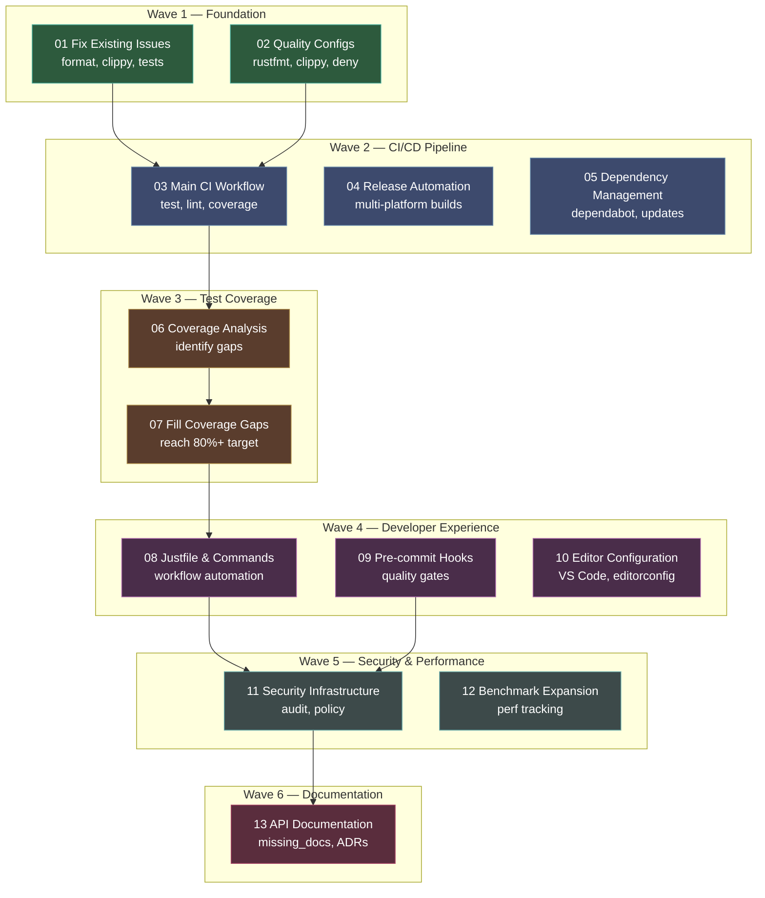

# Google-Level Infrastructure — Orchestration Manifest

## Overview

The PRB codebase is a sophisticated multi-protocol packet analyzer with 21 crates (~339 Rust files) demonstrating good architectural patterns and reasonable test coverage (904 test functions across 78 test files). However, it lacks the production-grade infrastructure expected at Google/tier-1 companies.

**Current State:**
- ✅ Well-organized workspace with clear separation of concerns
- ✅ Comprehensive test suite with unit, integration, snapshot (insta), and property tests (proptest)
- ✅ Good documentation structure (10 markdown docs)
- ✅ Minimal unsafe code (40 occurrences, justified in plugin loaders)
- ❌ **No CI/CD pipeline** (.github/workflows/ doesn't exist)
- ❌ **No code coverage tracking** (no llvm-cov or tarpaulin)
- ❌ **No security scanning** (no cargo-audit, cargo-deny)
- ❌ **Inconsistent formatting** (cargo fmt --check fails in ~20 files)
- ❌ **Active clippy warnings** (empty_line_after_doc_comments, useless vec!, etc.)
- ❌ **No quality gates** (no rustfmt.toml, clippy.toml, deny.toml)
- ❌ **No pre-commit hooks** (quality issues reach the repo)
- ❌ **No automated releases** (manual versioning/publishing)
- ❌ **1 failing test** (prb-ai config test with env var issue)

**Goal:**
Transform this into a production-ready codebase with:
- 80-90% test coverage with tracking
- Comprehensive CI/CD with multi-platform testing
- Strict code quality enforcement
- Security scanning and supply chain management
- Developer experience automation
- Performance regression tracking

This plan addresses 13 segments organized into 6 waves.

---

## Dependency Diagram



---

## Segment Index

| # | Title | File | Depends On | Risk | Complexity | Cycle Budget | Est. Changes | Status |
|:---:|-------|------|:----------:|:----:|:----------:|:------------:|:------------:|:------:|
| 01 | Fix Existing Issues | `segments/01-fix-existing-issues.md` | — | 2 | Low | 3 | ~20 files | pending |
| 02 | Quality Configuration | `segments/02-quality-configs.md` | — | 1 | Low | 2 | 4 new files | pending |
| 03 | Main CI Workflow | `segments/03-main-ci-workflow.md` | 01, 02 | 3 | Medium | 5 | 1 new file | pending |
| 04 | Release Automation | `segments/04-release-automation.md` | 03 | 4 | Medium | 4 | 2 new files | pending |
| 05 | Dependency Management | `segments/05-dependency-mgmt.md` | — | 2 | Low | 2 | 2 new files | pending |
| 06 | Coverage Analysis | `segments/06-coverage-analysis.md` | 03 | 2 | Low | 3 | analysis only | pending |
| 07 | Fill Coverage Gaps | `segments/07-fill-coverage-gaps.md` | 06 | 5 | High | 15 | ~1000 lines | pending |
| 08 | Justfile & Commands | `segments/08-justfile-commands.md` | — | 1 | Low | 2 | 1 new file | pending |
| 09 | Pre-commit Hooks | `segments/09-precommit-hooks.md` | 02 | 2 | Low | 2 | 2 new files | pending |
| 10 | Editor Configuration | `segments/10-editor-config.md` | — | 1 | Low | 1 | 2 new files | pending |
| 11 | Security Infrastructure | `segments/11-security-infra.md` | 03 | 3 | Medium | 4 | 3 new files | pending |
| 12 | Benchmark Expansion | `segments/12-benchmark-expansion.md` | — | 3 | Medium | 5 | ~600 lines | pending |
| 13 | API Documentation | `segments/13-api-documentation.md` | — | 4 | Medium | 8 | all crates | pending |

**Total estimated effort: ~52 cycles (approximately 10-15 hours)**

---

## Wave Definitions

| Wave | Segments (parallel) | Theme | Rationale |
|:----:|---------------------|-------|-----------|
| **1** | 01, 02 | Foundation | Fix all existing issues and establish quality gates before building CI |
| **2** | 03, 04, 05 | CI/CD Pipeline | Main workflow depends on clean codebase; release and deps are parallel |
| **3** | 06, 07 | Test Coverage | Analyze gaps then fill them systematically to reach 80%+ |
| **4** | 08, 09, 10 | Developer Experience | Parallel developer tooling setup for efficient workflows |
| **5** | 11, 12 | Security & Performance | Security scanning and benchmark expansion |
| **6** | 13 | Documentation | Final polish: complete API docs and architecture decision records |

---

## Build and Test Commands (Global)

```bash
# Full workspace build
cargo build --workspace

# Full lint gate (must pass)
cargo clippy --workspace --all-targets -- -D warnings

# Format check (must pass)
cargo fmt --all -- --check

# Format fix
cargo fmt --all

# Full test gate
cargo test --workspace  # or: cargo nextest run --workspace

# Coverage generation
cargo llvm-cov --workspace --lcov --output-path lcov.info
cargo llvm-cov --workspace --html  # HTML report

# Security checks
cargo audit
cargo deny check

# Documentation build
cargo doc --workspace --no-deps
RUSTDOCFLAGS="-D warnings" cargo doc --workspace --no-deps

# Benchmarks
cargo bench --workspace
```

---

## Track Summary

| Track | Segments | Focus | Est. Effort | Risk |
|-------|:--------:|-------|:-----------:|------|
| **Foundation** | 01, 02 | Fix issues, create configs | 5 cycles | Low |
| **CI/CD** | 03, 04, 05 | Workflows, automation | 11 cycles | Medium |
| **Coverage** | 06, 07 | Analysis & gap filling | 18 cycles | High |
| **DevEx** | 08, 09, 10 | Tooling & automation | 5 cycles | Low |
| **Security & Perf** | 11, 12 | Scanning & benchmarks | 9 cycles | Medium |
| **Documentation** | 13 | API docs & ADRs | 8 cycles | Medium |

---

## Pre-Execution Checklist

- [ ] Clean working tree (no uncommitted changes)
- [ ] Main branch up to date
- [ ] All existing tests currently passing (except known failure in prb-ai)
- [ ] Cargo tools available: clippy, rustfmt
- [ ] Python 3.11+ with toml, asyncio available
- [ ] Git configured for commits

---

## Tool Installation Requirements

The following cargo tools will be installed during execution:

```bash
cargo install cargo-llvm-cov    # Coverage reporting
cargo install cargo-audit       # Security audit
cargo install cargo-deny        # License & source checking
cargo install cargo-outdated    # Dependency updates
cargo install just              # Command runner
cargo install cargo-nextest     # Fast test runner (optional)
```

---

## Notes

- **Wave 1 is critical**: Must fix all existing format/lint issues before CI can enforce them
- **Wave 3 (coverage) is largest**: Filling gaps to 80%+ will take ~15 cycles
- **Security scanning** (Wave 5) may find issues requiring fixes
- **Documentation** (Wave 6) requires 100% coverage for public APIs (~93 items in prb-core alone)
- All changes are backwards compatible and additive (no breaking API changes)

---

## Success Criteria

All 13 segments complete when:

1. ✅ CI pipeline green with multi-platform tests (Linux, macOS, Windows)
2. ✅ Test coverage 80%+ across all crates (verified in CI)
3. ✅ Zero clippy warnings with strict lints enabled
4. ✅ Zero formatting issues (`cargo fmt --check` passes)
5. ✅ Zero security vulnerabilities (`cargo audit` clean)
6. ✅ Pre-commit hooks prevent bad commits locally
7. ✅ Documentation 100% for public APIs (no missing_docs warnings)
8. ✅ Automated releases on tag push with multi-platform binaries
9. ✅ Performance regression tracking active (benchmark CI job)
10. ✅ Developer tooling (just, hooks, editor config) in place

**Estimated Total Effort:** 13 segments × ~4 cycles avg = ~52 cycles (~10-15 hours)

---

## Post-Completion Verification

After all segments merge to main:

```bash
# Verify CI exists
ls -la .github/workflows/
# Should show: ci.yml, dependencies.yml, release.yml

# Verify quality gates pass
cargo fmt --all -- --check
cargo clippy --workspace --all-targets -- -D warnings
cargo test --workspace

# Verify coverage
cargo llvm-cov --workspace --summary-only
# Should show 80%+ total coverage

# Verify security
cargo audit
cargo deny check

# Verify tooling
just check  # Should pass
just coverage  # Should generate report

# Verify docs
cargo doc --workspace --no-deps
# Should build without warnings
```

---

## Risk Mitigation

| Risk | Mitigation |
|------|------------|
| Coverage gap-filling takes longer than estimated | Prioritize core crates (prb-core, prb-pcap) first; aim for 80% workspace-wide even if some crates are lower |
| CI workflows fail on Windows | Test locally with Windows VM or skip Windows initially and add later |
| cargo-deny license conflicts | Review and adjust deny.toml allow-list if legitimate dependencies flagged |
| Pre-commit hooks too strict | Make hooks warn-only initially, then enforce after team adaptation |
| Documentation effort underestimated | Focus on public API only; skip private/internal items |

---

## Future Enhancements (Out of Scope)

After this plan completes, consider:
- Continuous fuzzing setup (cargo-fuzz)
- MIRI testing for unsafe code validation
- Cross-compilation matrix expansion
- Container-based test environments
- Performance profiling in CI
- API stability guarantees (semver-check)
