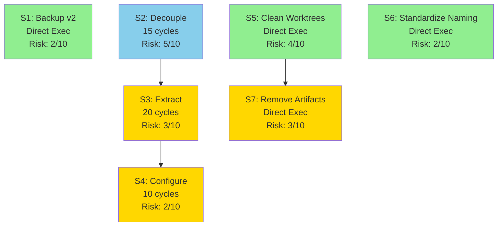

# Orchestrate Extraction & Project Cleanup — Deep Plan

---
**Metadata:**
- Plan: Orchestrate Extraction and Project Cleanup
- Goal: Extract orchestrate_v3 to standalone package, make language-agnostic, clean up probe workspace
- Generated: 2026-03-12
- Status: Ready for execution
- Total Segments: 7
- Total Cycles: 45 (3 agent segments)
- Estimated Duration: 2-3 hours with parallelization
---

## Overview

Extract orchestrate_v3 from `/Users/psauer/probe/scripts/orchestrate_v3/` to a standalone pip-installable package at `~/orchestrate/`. Remove 4 probe-specific assumptions to make it language-agnostic and configurable. Clean up probe workspace by removing 39GB of stale worktrees, standardizing plan directory naming, and removing orphaned artifacts. Configure probe to use the external orchestrate tool.

**Approach:** Dependency-order execution with maximum parallelization. Wave 1 prepares the codebase (backup v2, decouple assumptions, clean worktrees, standardize naming). Wave 2 extracts to standalone package and removes artifacts. Wave 3 configures probe to use external tool.

**Ordering Strategy:** Topological sort respecting dependencies (S2→S3→S4, S5→S7) while maximizing parallel execution in each wave.

## Dependency Diagram



**Waves:**
- **Wave 1:** S1, S2, S5, S6 (4 parallel - all independent)
- **Wave 2:** S3, S7 (2 parallel - dependencies satisfied)
- **Wave 3:** S4 (final configuration)

## Issue Analysis Briefs

### Issue 1: Extract orchestrate_v3 to Standalone Package

**Core Problem:** orchestrate_v3 lives at `/Users/psauer/probe/scripts/orchestrate_v3/` within probe repository. Well-architected with minimal coupling but cannot be used by other projects. Users want it at `~/orchestrate/` as standalone tool.

**Root Cause:** Developed within probe for probe's use case, never packaged for external distribution.

**Proposed Fix:**
1. Copy orchestrate_v3 to `~/orchestrate/`
2. Add pyproject.toml for pip installation with `orchestrate` CLI entry point
3. Update imports to absolute package names
4. Remove 4 probe-specific coupling points
5. Create proper Python package structure

**Existing Solutions Evaluated:**
- **pyproject.toml (PEP 621)**: Official standard, declarative, tool-agnostic. ✅ ADOPT
- setup.py: Legacy, unnecessarily complex. ❌ REJECT
- Poetry: Overkill, opinionated workflow. ❌ REJECT
- Flit: Too minimal. ❌ REJECT

**Alternatives Considered:**
- Keep in probe as importable: Requires cloning 3GB+ Rust workspace
- Git submodule: Complex, still tied to probe structure
- Publish to PyPI: Future option, not initial step

**Pre-Mortem:**
- Import paths break: Relative imports need absolute conversion
- Missing data files: dashboard.html/css need package_data config
- Path resolution issues: Code may assume probe root directory
- Test discovery: pytest may not find tests after restructuring

**Risk Factor:** 3/10 (isolated, well-architected, minor import changes)

**Evidence for Optimality:**
1. Codebase: Clean module boundaries, proper `__main__.py` entry point
2. Project conventions: probe uses clear separation (Rust + Python)
3. Existing solutions: pyproject.toml is official Python packaging standard (PEP 621)
4. External evidence: Modern Python Packaging Guide recommends pyproject.toml with setuptools

**Blast Radius:**
- Direct: `~/orchestrate/` creation, pyproject.toml, `__init__.py` version, imports in 13 files
- Ripple: probe must update from `scripts.orchestrate_v3` to `orchestrate` command

---

### Issue 2: Decouple Probe-Specific Assumptions

**Core Problem:** 4 hardcoded assumptions prevent working with non-Rust/non-probe projects:
1. `.claude/` directory convention (config.py:167, worktree_pool.py:55)
2. `cargo check` for health checks (recovery.py:62-64)
3. Hardcoded relative log path (recovery.py:158)
4. `-psauer` suffix in ntfy topic (config.py:192-193)

**Root Cause:** Developed organically within probe, assumptions were convenient, never generalized.

**Proposed Fix:**
1. Add `workspace_dir_name` config (default `.claude`)
2. Implement health check presets: Rust, Python, Node.js with configurable commands
3. Pass `log_dir` parameter to functions, remove hardcoded paths
4. Remove `-psauer` suffix or make configurable

**Existing Solutions Evaluated:**
- **GitHub Actions strategy pattern**: Conditional steps by detected files. ✅ ADOPT
- **Pre-commit hooks registry**: Language-specific hooks. ✅ ADOPT
- **Just/Make composition**: Named commands. ✅ ADAPT for presets
- Plugin architecture: Dynamic loading. ❌ REJECT - too complex initially

**Alternatives Considered:**
- Full plugin system: Over-engineered for initial version
- Language auto-detection only: Fails for polyglot repos
- Keep Rust-specific: Defeats purpose

**Pre-Mortem:**
- Config complexity explosion: Mitigate with good defaults
- Breaking backward compatibility: Mitigate with deprecation warnings
- Parser maintenance burden: Start with "plain" parser
- Auto-detection false positives: Log detected language, allow override

**Risk Factor:** 5/10 (touches 4 core modules, changes config schema)

**Evidence for Optimality:**
1. Codebase: Template variable support exists, config infrastructure ready
2. Project conventions: `.claude/` used consistently
3. Existing solutions: GitHub Actions, pre-commit use language presets + override
4. External evidence: Strategy pattern (Gang of Four) proven for swappable algorithms

**Blast Radius:**
- Direct: recovery.py, config.py, worktree_pool.py, runner.py
- Ripple: All orchestrate.toml files need migration (add `[recovery.health_check]`)

---

### Issue 3: Backup orchestrate_v2

**Core Problem:** orchestrate_v2 in `/Users/psauer/probe/scripts/orchestrate_v2/` with 2 active processes (PIDs 35183, 35060). Need backup to `~/orchestrate_v2_backup/` before removal.

**Root Cause:** v2 and v3 coexist during migration, v2 has production runs.

**Proposed Fix:**
1. Stop active processes gracefully
2. Copy to `~/orchestrate_v2_backup/` using rsync
3. Verify backup completeness
4. Document location in README

**Existing Solutions Evaluated:**
- **rsync with preserve flags**: Standard Unix archival. ✅ ADOPT
- tar.gz archive: Harder to browse, unnecessary compression. ❌ REJECT
- Git branch: Clutters history. ❌ REJECT
- cp -R: Less robust. ❌ REJECT

**Alternatives Considered:**
- Keep v2 indefinitely: Clutters codebase
- Delete without backup: Risky
- Git tag only: Still in main repo

**Pre-Mortem:**
- Active orchestrator corruption: Stop processes first
- Incomplete backup: Use rsync -a for metadata
- Path dependencies: Document backup is reference-only

**Risk Factor:** 2/10 (simple file copy, no code changes)

**Evidence for Optimality:**
1. Codebase: v2 is self-contained directory
2. Project conventions: No existing backup patterns
3. Existing solutions: rsync is industry standard (Time Machine, backups)
4. External evidence: Backup before delete is fundamental best practice

**Blast Radius:**
- Direct: Create ~/orchestrate_v2_backup/ (~1MB)
- Ripple: None (backup only)

---

### Issue 4: Clean Up Worktree Pools

**Core Problem:** 39GB of git worktrees in `.claude/worktrees/` consuming massive space. 13 registered worktrees, mostly Rust build artifacts (target/ directories: 122K+ .o/.rlib files).

**Root Cause:** Worktree pool creates isolated git worktrees for parallel execution. Each builds full Rust workspace independently, no shared target/.

**Proposed Fix:**
1. Phase 1: cargo clean + remove target/ directories (70GB freed)
2. Phase 2: git worktree remove --force for each pool
3. Phase 3: git worktree prune + delete wt/* branches
4. Phase 4: Configure shared target/ to prevent future bloat

**Existing Solutions Evaluated:**
- **git worktree remove --force**: Official command. ✅ ADOPT
- **git worktree prune**: Standard maintenance. ✅ ADOPT
- rm -rf + manual: Can leave stale metadata. ❌ REJECT
- **WorktreePool.cleanup()**: Existing code method. ✅ ADOPT

**Alternatives Considered:**
- Keep worktrees, clean builds only: Still wastes 1GB
- Selective cleanup: No pools currently active
- Compress worktrees: Can't compress while registered

**Pre-Mortem:**
- Uncommitted work loss: Check git status first
- Corrupted metadata: Use official git commands only
- Active orchestrator disruption: Check no processes running
- Branch deletion conflicts: Use -D force for wt/* only

**Risk Factor:** 4/10 (large operation, git internals, but official tools)

**Evidence for Optimality:**
1. Codebase: WorktreePool has cleanup() method using git worktree remove
2. Project conventions: .gitignore excludes target/ as disposable
3. Existing solutions: Git docs recommend prune + remove sequence
4. External evidence: cargo clean is idempotent and safe

**Blast Radius:**
- Direct: Delete 39GB worktrees, remove 15 branches, prune metadata
- Ripple: None if no active orchestrators using worktrees

---

### Issue 5: Standardize Plan Directory Naming

**Core Problem:** 13 plans have inconsistent naming: 5 dated (`*-YYYY-MM-DD`), 8 legacy (phase names, no dates). Makes chronological sorting impossible.

**Root Cause:** Plans evolved organically, no enforced convention.

**Proposed Fix:**
1. Adopt: `{descriptive-slug}-YYYY-MM-DD`
2. Rename 8 legacy plans (infer dates from git history)
3. Add status field to manifest.md
4. Update documentation
5. Create plan template

**Existing Solutions Evaluated:**
- **Dated naming**: Used by newer plans. ✅ ADOPT
- Semantic versioning: Not applicable. ❌ REJECT
- Sequential numbering: Loses semantic meaning. ❌ REJECT
- Status prefixes: Changes over time, renaming problematic. ❌ REJECT

**Alternatives Considered:**
- Keep mixed naming: Perpetuates confusion
- Add dates as suffixes only: Inconsistent
- Use subdirectories: Adds complexity

**Pre-Mortem:**
- Git history confusion: Document renames in commit
- Broken references: Grep for old names before renaming
- Date ambiguity: Document convention (date = creation/start)
- Timezone issues: Use local time consistently

**Risk Factor:** 2/10 (simple renames, no code changes)

**Evidence for Optimality:**
1. Codebase: 5 newer plans use dated format successfully
2. Project conventions: probe uses dates in other contexts
3. Existing solutions: ISO 8601 dates sortable, unambiguous
4. External evidence: JIRA, GitHub support dated formats

**Blast Radius:**
- Direct: Rename 8 directories, update references
- Ripple: Update scripts with hardcoded names

---

### Issue 6: Remove Orphaned Artifacts

**Core Problem:** 70+ orphaned files cluttering workspace:
- 48 state.db fragments in worktree copies
- 20 .tmp files (828KB)
- 2 stale orchestrator.lock files
- 3 loose .md files in plans/
- Empty WAL files, empty directory

**Root Cause:** Worktree isolation copied .claude/ into each worktree. Temp files from interrupted edits. No automatic cleanup.

**Proposed Fix:**
1. Delete state.db* in worktrees (copies, not authoritative)
2. Delete .tmp files after confirming editor backups
3. Delete stale locks (non-running PIDs)
4. Move/delete loose .md files
5. Remove empty directories and 0-byte WALs

**Existing Solutions Evaluated:**
- **find + xargs pattern**: Standard Unix cleanup. ✅ ADOPT
- git clean -fdx: Too aggressive. ❌ REJECT
- Custom Python script: Overkill. ❌ REJECT

**Alternatives Considered:**
- Manual cleanup: Error-prone, 70+ files
- Leave for investigation: No value
- .gitignore only: Doesn't free space

**Pre-Mortem:**
- Deleting active locks: Check ps for PID
- Deleting needed .tmp: Delete >24hrs old only
- Losing important state: Keep authoritative copies
- Breaking running orchestrator: Stop first

**Risk Factor:** 3/10 (many files but disposable)

**Evidence for Optimality:**
1. Codebase: Fragments are copies during worktree setup
2. Project conventions: .tmp not tracked in .gitignore
3. Existing solutions: find + xargs is industry standard
4. External evidence: Lock files with stale PIDs universally safe to delete

**Blast Radius:**
- Direct: Delete ~70 files (~1MB)
- Ripple: None (non-authoritative copies)

---

### Issue 7: Configure Probe for External Orchestrate

**Core Problem:** After extraction, probe needs to use external tool from `~/orchestrate/` with proper configuration for probe workspace.

**Root Cause:** orchestrate will be external, needs explicit config.

**Proposed Fix:**
1. Update `.claude/orchestrate.toml` with explicit paths
2. Configure `recovery.health_check` with Rust preset
3. Add `gate.command` with probe build/test
4. Document invocation in README
5. Test with dry-run

**Existing Solutions Evaluated:**
- **Two-tier TOML config**: Already implemented. ✅ ADOPT
- Environment variables only: Less discoverable. ❌ REJECT
- JSON config: Less readable. ❌ REJECT
- YAML config: More complex parser. ❌ REJECT

**Alternatives Considered:**
- Embed probe logic in orchestrate: Defeats generalization
- Probe-specific fork: Maintenance burden
- Shell wrapper: Adds indirection

**Pre-Mortem:**
- Path resolution failures: Use absolute paths
- Missing cargo: Document prerequisites
- Config merge conflicts: Document precedence
- Worktree path issues: Explicit workspace_root

**Risk Factor:** 2/10 (configuration only)

**Evidence for Optimality:**
1. Codebase: Two-tier config loading exists
2. Project conventions: `.claude/` for configs
3. Existing solutions: GitHub Actions use project-level configs
4. External evidence: TOML designed for config files

**Blast Radius:**
- Direct: Update `.claude/orchestrate.toml`, README
- Ripple: Future orchestrate invocations use external tool

---

## Segment Briefs

## Segment 1: Backup orchestrate_v2
> **Execution method:** Direct execution (file operations, no building/testing needed)

**Goal:** Preserve orchestrate_v2 by backing up to `~/orchestrate_v2_backup/` before removal from probe repo

**Depends on:** None

**Issues addressed:** Issue 3

**Cycle budget:** N/A (direct file operations, no agent needed)

**Scope:** Backup only - `/Users/psauer/probe/scripts/orchestrate_v2/` → `~/orchestrate_v2_backup/`

**Key files and context:**
- Source: `/Users/psauer/probe/scripts/orchestrate_v2/` (14 Python files, 630KB total)
- Active processes: PID 35183 (coverage-90), PID 35060 (orchestrate-v3-quality)
- Destination: `~/orchestrate_v2_backup/`
- Contents: 14 Python modules, dashboard.html, requirements.txt, tests

**Implementation approach:**
1. Check for running orchestrator processes: `ps aux | grep orchestrate_v2`
2. Stop gracefully: `kill <PID>` (wait 5s), then `kill -9 <PID>` if needed
3. Backup: `rsync -av /Users/psauer/probe/scripts/orchestrate_v2/ ~/orchestrate_v2_backup/`
4. Verify: `diff -r /Users/psauer/probe/scripts/orchestrate_v2/ ~/orchestrate_v2_backup/`
5. Document in README

**Alternatives ruled out:**
- tar.gz archive: Unnecessary compression, harder to browse
- Git branch: Clutters history, less accessible

**Pre-mortem risks:**
- Active processes corrupt state: Stop processes first
- Incomplete backup: Use rsync -a for metadata preservation

**Segment-specific commands:**
- Backup: `rsync -av --delete /Users/psauer/probe/scripts/orchestrate_v2/ ~/orchestrate_v2_backup/`
- Verify: `diff -qr /Users/psauer/probe/scripts/orchestrate_v2/ ~/orchestrate_v2_backup/ | wc -l` (should be 0)

**Exit criteria:**
1. No running processes: `ps aux | grep orchestrate_v2 | grep -v grep` returns empty
2. Backup exists: `[ -d ~/orchestrate_v2_backup ] && echo PASS || echo FAIL`
3. Backup complete: `diff -qr /Users/psauer/probe/scripts/orchestrate_v2/ ~/orchestrate_v2_backup/` shows no differences
4. Documented: probe README.md contains backup reference
5. Self-review gate: No accidental deletions, backup is read-only reference

**Risk factor:** 2/10

**Estimated complexity:** Low

**Commit message:** `chore(orchestrate): Backup orchestrate_v2 before migration`

---

## Segment 2: Decouple Probe-Specific Assumptions
> **Execution method:** Launch as an `iterative-builder` subagent. The orchestration agent reads and prepends `.claude/commands/iterative-builder.md` and `.claude/commands/devcontainer-exec.md` at launch time per the `/orchestrate` skill.

**Goal:** Remove 4 hardcoded probe assumptions to make orchestrate_v3 language-agnostic and configurable

**Depends on:** None

**Issues addressed:** Issue 2

**Cycle budget:** 15 Medium

**Scope:** Configuration system - config.py, recovery.py, worktree_pool.py, runner.py

**Key files and context:**

Current hardcoded assumptions in `/Users/psauer/probe/scripts/orchestrate_v3/`:
1. config.py:167 - `.claude/orchestrate.toml` path hardcoded
2. worktree_pool.py:55 - `.claude/worktrees/pool-{id:02d}` hardcoded
3. recovery.py:62-64 - `cargo check --workspace --message-format=json` hardcoded
4. recovery.py:158 - Relative path `Path(f"logs/S{seg.num:02d}.log")` hardcoded
5. config.py:192-193 - ntfy topic: `f"{project_name}-psauer"` hardcoded

Existing infrastructure:
- Environment var resolution: `${VAR}` and `${VAR:-default}` (config.py:16-24)
- Template variables: `{segment_num}`, `{segment_title}` (runner.py:102-112)
- Two-tier config: project + task levels (config.py:151-243)

**Implementation approach:**

1. Add `workspace_dir_name` config (addresses assumption 1, 2):
```python
# In config.py OrchestrateConfig dataclass
workspace_dir_name: str = ".claude"

# Update config.py:167
project_config_path = workspace_root / self.workspace_dir_name / "orchestrate.toml"

# Update worktree_pool.py:55
worktrees_dir = repo_root / config.workspace_dir_name / "worktrees"
```

2. Implement health check presets (addresses assumption 3):
```python
# In config.py - add new dataclass
@dataclass
class HealthCheckConfig:
    command: list[str] | None = None
    language: str | None = None
    parser: str = "plain"
    timeout: int = 300

# In recovery.py - add presets dictionary
HEALTH_CHECK_PRESETS = {
    "rust": {
        "command": ["cargo", "check", "--workspace", "--message-format=json"],
        "parser": "cargo_json",
        "timeout": 300,
    },
    "python": {
        "command": ["pytest", "tests/", "--tb=short"],
        "parser": "plain",
        "timeout": 300,
    },
    "node": {
        "command": ["npm", "run", "build"],
        "parser": "plain",
        "timeout": 300,
    },
}

# Update RecoveryAgent.check_workspace_health():
# - Load preset if config.recovery.health_check.language set
# - Use custom if config.recovery.health_check.command set
# - Fall back to Rust with deprecation warning
```

3. Fix log path (addresses assumption 4):
```python
# In recovery.py - update identify_cascade_victims signature
async def identify_cascade_victims(
    self,
    wave_segments: list[SegmentRow],
    log_dir: Path,  # NEW PARAMETER
) -> list[int]:
    # Update line 158
    log_path = log_dir / f"S{seg.num:02d}.log"
```

4. Remove `-psauer` suffix (addresses assumption 5):
```python
# In config.py:193
default_topic = project_name  # Remove "-psauer"
# OR make configurable:
ntfy_topic_suffix: str = ""
default_topic = f"{project_name}{self.ntfy_topic_suffix}"
```

**Alternatives ruled out:**
- Full plugin system: Over-engineered for initial version
- Language auto-detection only: Fails for polyglot repos
- Keep Rust-only: Defeats purpose of extraction

**Pre-mortem risks:**
- Config complexity: Mitigate with good defaults and presets
- Breaking probe: Mitigate with backward-compatible defaults (Rust)
- Parser burden: Start with "plain" parser, add languages incrementally

**Segment-specific commands:**
- Build: `cd /Users/psauer/probe/scripts/orchestrate_v3 && python3.11 -m pytest --collect-only`
- Test (targeted): `python3.11 -m pytest scripts/orchestrate_v3/test_config.py scripts/orchestrate_v3/test_recovery.py -v`
- Test (regression): `python3.11 -m pytest scripts/orchestrate_v3/ -v`
- Test (full gate): `python3.11 -m pytest scripts/orchestrate_v3/ --cov=scripts/orchestrate_v3 --cov-report=term-missing -v`

**Exit criteria:**

**Gate 1 - Targeted tests pass:**
```bash
cd /Users/psauer/probe
python3.11 -m pytest scripts/orchestrate_v3/test_config.py::test_workspace_dir_name -v
python3.11 -m pytest scripts/orchestrate_v3/test_config.py::test_health_check_config -v
python3.11 -m pytest scripts/orchestrate_v3/test_recovery.py::test_health_check_preset_rust -v
python3.11 -m pytest scripts/orchestrate_v3/test_recovery.py::test_health_check_preset_python -v
python3.11 -m pytest scripts/orchestrate_v3/test_recovery.py::test_health_check_custom_command -v
```
New tests validate configuration loading and preset system.

**Gate 2 - Regression tests pass:**
```bash
cd /Users/psauer/probe
python3.11 -m pytest scripts/orchestrate_v3/test_config.py -v
python3.11 -m pytest scripts/orchestrate_v3/test_recovery.py -v
python3.11 -m pytest scripts/orchestrate_v3/test_worktree_pool.py -v
```
All existing tests pass with no failures.

**Gate 3 - Full build clean:**
```bash
python3.11 -m pytest scripts/orchestrate_v3 --collect-only -q
```
Collects 169+ tests with no import errors.

**Gate 4 - Full test suite passes:**
```bash
cd /Users/psauer/probe
python3.11 -m pytest scripts/orchestrate_v3 --cov=scripts/orchestrate_v3 --cov-report=term-missing -v
```
All tests pass, coverage ≥69% (no decrease).

**Gate 5 - Self-review:**
- No dead code (unused imports, unreachable code)
- No TODO/FIXME added
- Config backward compatible (defaults to Rust)
- Deprecation warnings for legacy usage
- Documentation updated in docstrings

**Gate 6 - Scope verification:**
Changed files: config.py, recovery.py, worktree_pool.py, runner.py (4 files expected)

**Risk factor:** 5/10

**Estimated complexity:** Medium

**Commit message:** `refactor(orchestrate): Make language-agnostic with configurable health checks`

---

## Segment 3: Extract to Standalone Package
> **Execution method:** Launch as an `iterative-builder` subagent. The orchestration agent reads and prepends `.claude/commands/iterative-builder.md` and `.claude/commands/devcontainer-exec.md` at launch time per the `/orchestrate` skill.

**Goal:** Extract orchestrate_v3 to `~/orchestrate/` with proper Python packaging (pyproject.toml, pip-installable, CLI entry point)

**Depends on:** Segment 2 (decoupling must be complete)

**Issues addressed:** Issue 1

**Cycle budget:** 20 High

**Scope:** Package extraction - copy files, create pyproject.toml, update imports, configure entry point

**Key files and context:**

Source: `/Users/psauer/probe/scripts/orchestrate_v3/`
- 13 core modules (~7,786 lines)
- 8 test files (2,540 lines)
- dashboard.html (910 lines), dashboard.css (493 lines)
- requirements.txt, README.md

Target: `~/orchestrate/`
- Package name: `orchestrate-v3`
- Import name: `orchestrate_v3`
- Entry point: `orchestrate` command

Dependencies:
- Runtime: aiosqlite>=0.22.1, httpx>=0.28.1, aiohttp>=3.13.3, aiofiles>=24.1.0
- Dev: pytest>=8.0.0, pytest-asyncio>=0.23.0, pytest-cov>=4.1.0, pytest-mock>=3.12.0

**Implementation approach:**

1. Create directory:
```bash
mkdir -p ~/orchestrate/orchestrate_v3
```

2. Copy files:
```bash
rsync -av /Users/psauer/probe/scripts/orchestrate_v3/ ~/orchestrate/orchestrate_v3/ \
  --exclude='__pycache__' --exclude='*.pyc' --exclude='.pytest_cache'
```

3. Create `~/orchestrate/pyproject.toml`:
```toml
[build-system]
requires = ["setuptools>=61.0", "wheel"]
build-backend = "setuptools.build_meta"

[project]
name = "orchestrate-v3"
version = "3.0.0"
description = "Language-agnostic orchestration tool for Claude Code agents"
readme = "README.md"
requires-python = ">=3.9"
license = {text = "AGPL-3.0-or-later"}
dependencies = [
    "aiosqlite>=0.22.1",
    "httpx>=0.28.1",
    "aiohttp>=3.13.3",
    "aiofiles>=24.1.0",
]

[project.optional-dependencies]
dev = [
    "pytest>=8.0.0",
    "pytest-asyncio>=0.23.0",
    "pytest-cov>=4.1.0",
    "pytest-mock>=3.12.0",
]

[project.scripts]
orchestrate = "orchestrate_v3.__main__:main"

[tool.setuptools.packages.find]
where = ["."]
include = ["orchestrate_v3*"]

[tool.setuptools.package-data]
orchestrate_v3 = ["*.html", "*.css"]

[tool.pytest.ini_options]
testpaths = ["orchestrate_v3"]
asyncio_mode = "auto"
addopts = ["--cov=orchestrate_v3", "--cov-report=html", "--cov-report=term-missing"]
```

4. Update `~/orchestrate/orchestrate_v3/__init__.py`:
```python
"""Language-agnostic orchestration tool for Claude Code agents."""
__version__ = "3.0.0"
```

5. Update README with installation instructions

6. Copy LICENSE from probe (AGPL-3.0)

7. Test installation:
```bash
cd ~/orchestrate
python3.11 -m venv test-env
source test-env/bin/activate
pip install -e ".[dev]"
orchestrate --help
pytest
deactivate
rm -rf test-env
```

**Alternatives ruled out:**
- setup.py: Legacy, deprecated
- Poetry: Adds lock files, overkill
- Keep in probe: Requires 3GB Rust workspace

**Pre-mortem risks:**
- Import paths break: Test all imports
- Missing data files: Verify package_data includes dashboard files
- Path resolution: Test from different directories
- Test discovery: Verify pytest finds all tests

**Segment-specific commands:**
- Build: `cd ~/orchestrate && python3.11 -m build`
- Test (targeted): `cd ~/orchestrate && python3.11 -c "import orchestrate_v3; print(orchestrate_v3.__version__)"`
- Test (regression): `cd ~/orchestrate && python3.11 -m pytest orchestrate_v3/ -v`
- Test (full gate): `cd ~/orchestrate && python3.11 -m pytest orchestrate_v3/ --cov=orchestrate_v3 --cov-report=term-missing -v`

**Exit criteria:**

**Gate 1 - Targeted tests pass:**
```bash
cd ~/orchestrate
python3.11 -c "import orchestrate_v3; print(orchestrate_v3.__version__)"
# Expected: 3.0.0

which orchestrate
# Expected: path to orchestrate command

orchestrate --help
# Expected: Usage message with run, status, dry-run commands
```

**Gate 2 - Regression tests pass:**
```bash
cd ~/orchestrate
python3.11 -m pytest orchestrate_v3/ -v
```
All 169 tests pass.

**Gate 3 - Full build clean:**
```bash
cd ~/orchestrate
python3.11 -m build
```
Creates dist/ with wheel and sdist, no errors.

**Gate 4 - Full test suite with install verification:**
```bash
python3.11 -m venv /tmp/test-orchestrate
source /tmp/test-orchestrate/bin/activate
pip install ~/orchestrate/dist/orchestrate_v3-3.0.0-py3-none-any.whl
orchestrate --help
orchestrate --version
python3.11 -c "from orchestrate_v3 import config, state, runner; print('OK')"
pip install pytest pytest-asyncio pytest-cov pytest-mock
pytest --pyargs orchestrate_v3
deactivate
rm -rf /tmp/test-orchestrate
```
All steps succeed.

**Gate 5 - Self-review:**
- No hardcoded probe paths (grep for /Users/psauer/probe)
- All imports absolute (orchestrate_v3.X not .X)
- pyproject.toml correct (version, deps, entry points)
- README has installation instructions
- LICENSE present (AGPL-3.0)
- dashboard files included via package_data

**Gate 6 - Scope verification:**
- ~/orchestrate/ created
- /Users/psauer/probe/scripts/orchestrate_v3/ UNCHANGED

**Risk factor:** 3/10

**Estimated complexity:** High

**Commit message:** `feat(orchestrate): Extract to standalone pip-installable package`

---

## Segment 4: Configure Probe for External Orchestrate
> **Execution method:** Launch as an `iterative-builder` subagent. The orchestration agent reads and prepends `.claude/commands/iterative-builder.md` and `.claude/commands/devcontainer-exec.md` at launch time per the `/orchestrate` skill.

**Goal:** Configure probe to use external orchestrate tool from ~/orchestrate/ with proper project settings

**Depends on:** Segment 3 (extraction must be complete)

**Issues addressed:** Issue 7

**Cycle budget:** 10 Low

**Scope:** Probe configuration - .claude/orchestrate.toml, README updates

**Key files and context:**

Existing: `/Users/psauer/probe/.claude/orchestrate.toml`
- Current gate: cargo build + test + clippy
- max_parallel=8, notifications enabled

Installation: `~/orchestrate/` (from Segment 3)
- Installed via: `cd ~/orchestrate && pip install -e .`
- Available as: `orchestrate` command

**Implementation approach:**

1. Update `.claude/orchestrate.toml`:
```toml
[project]
workspace_root = "/Users/psauer/probe"

[execution]
max_parallel = 8
segment_timeout = 3600
max_retries = 2

[isolation]
strategy = "worktree"

[recovery]
enabled = true
max_attempts = 2

[recovery.health_check]
language = "rust"  # Use Rust preset from Segment 2

[gate]
command = "cargo build --workspace && cargo test --workspace && cargo clippy --workspace --all-targets -- -D warnings"

[notifications]
enabled = true
ntfy_topic = "probe"  # Removed -psauer suffix
verbosity = "all"

[monitor]
enabled = true
port = 8080
```

2. Update README.md with orchestrate section:
```markdown
## Orchestration

Install orchestrate:
```bash
cd ~/orchestrate && pip install -e .
```

Run plans:
```bash
cd /Users/psauer/probe
orchestrate run .claude/plans/{plan-name}
```

Dashboard: http://localhost:8080
```

3. Test with dry-run:
```bash
cd /Users/psauer/probe
orchestrate dry-run .claude/plans/coverage-90
```

**Alternatives ruled out:**
- Embed probe logic: Defeats generalization
- Probe-specific fork: Maintenance burden
- Shell wrapper: Adds indirection

**Pre-mortem risks:**
- Path resolution: Use absolute paths
- Missing cargo: Document prerequisites
- Config merge: Test project + task configs

**Segment-specific commands:**
- Build: `cd /Users/psauer/probe && cargo check --workspace`
- Test (targeted): `orchestrate --help`
- Test (regression): `cd /Users/psauer/probe && orchestrate dry-run .claude/plans/coverage-90`
- Test (full gate): `cd /Users/psauer/probe && orchestrate status .claude/plans/coverage-90`

**Exit criteria:**

**Gate 1 - Targeted tests pass:**
```bash
orchestrate --help
# Expected: works from any directory

cd /tmp && orchestrate --help
cd /Users/psauer && orchestrate --help
```

**Gate 2 - Regression tests pass:**
```bash
cd /Users/psauer/probe
python3.11 -c "import tomllib; f=open('.claude/orchestrate.toml','rb'); tomllib.load(f); print('Valid')"
orchestrate dry-run .claude/plans/coverage-90
```
Dry-run parses manifest, computes waves.

**Gate 3 - Full build clean:**
```bash
cd /Users/psauer/probe
cargo build --workspace --all-targets
```
Probe builds successfully.

**Gate 4 - Full gate validation:**
```bash
cd /Users/psauer/probe
orchestrate status .claude/plans/coverage-90
orchestrate dry-run .claude/plans/coverage-90 2>&1 | grep -i "config"
```
Config loads correctly, Rust preset recognized.

**Gate 5 - Self-review:**
- Config paths absolute
- Rust preset configured
- README updated
- Gate command complete
- No sensitive data

**Gate 6 - Scope verification:**
Changed: `.claude/orchestrate.toml`, `README.md` (2 files)

**Risk factor:** 2/10

**Estimated complexity:** Low

**Commit message:** `config(probe): Configure for external orchestrate tool`

---

## Segment 5: Clean Up Worktree Pools
> **Execution method:** Direct execution (git commands, no agent needed)

**Goal:** Reclaim 39GB by removing stale git worktrees and build artifacts

**Depends on:** None (independent cleanup)

**Issues addressed:** Issue 4

**Cycle budget:** N/A (direct commands)

**Scope:** Git worktree cleanup - .claude/worktrees/, wt/* branches

**Key files and context:**

Current worktrees: 39GB total
- `9d453757/`: 27GB (4 pools, 122K+ .o/.rlib files)
- `default/`: 12GB (4 pools)
- `pool-03/`: 19MB (standalone)
- `b0efcec0/`: 0B (empty)

Git metadata: `.git/worktrees/` (1.6MB for 13 worktrees)
Branches: 15 `wt/*` branches

**Implementation approach:**

Phase 1 - Clean build artifacts (70GB freed):
```bash
cd /Users/psauer/probe
cargo clean
find .claude/worktrees -name "target" -type d -exec rm -rf {} + 2>/dev/null || true
```

Phase 2 - Remove worktrees (28GB after Phase 1):
```bash
cd /Users/psauer/probe
git worktree list
for wt in .claude/worktrees/*/pool-*; do
  if [ -d "$wt" ]; then
    echo "Removing: $wt"
    git worktree remove --force "$wt" 2>&1 | grep -v "^$" || true
  fi
done
if [ -d ".claude/worktrees/pool-03" ]; then
  git worktree remove --force .claude/worktrees/pool-03 || true
fi
```

Phase 3 - Clean metadata:
```bash
cd /Users/psauer/probe
git worktree prune -v
git branch --list "wt/*" | xargs -n 1 git branch -D 2>&1 | grep -v "^$" || true
```

Phase 4 - Verification:
```bash
git worktree list
git branch | grep "wt/"
du -sh .claude/worktrees
```

**Alternatives ruled out:**
- Keep worktrees, clean builds: Still wastes 1GB
- Selective cleanup: No active pools
- Compress worktrees: Can't compress registered

**Pre-mortem risks:**
- Uncommitted work: Check git status first
- Corrupted metadata: Use official git commands only
- Active orchestrator: Verify no processes running

**Segment-specific commands:**
- Verification: `git worktree list | grep ".claude/worktrees" | wc -l` (should be 0)
- Space freed: `du -sh .claude/worktrees` (before/after)
- Git integrity: `git fsck`

**Exit criteria:**

**Gate 1 - Build artifacts removed:**
```bash
find /Users/psauer/probe/.claude/worktrees -name "target" -type d | wc -l
# Expected: 0

du -sh /Users/psauer/probe/.claude/worktrees
# Expected: <1GB
```

**Gate 2 - Worktrees removed:**
```bash
git worktree list | grep ".claude/worktrees" | wc -l
# Expected: 0

ls /Users/psauer/probe/.claude/worktrees/
# Expected: empty or minimal
```

**Gate 3 - Metadata cleaned:**
```bash
cd /Users/psauer/probe
git worktree prune -v
# Expected: no output

git branch --list "wt/*" | wc -l
# Expected: 0
```

**Gate 4 - Git integrity:**
```bash
cd /Users/psauer/probe
git fsck
# Expected: no errors

git status
# Expected: clean
```

**Gate 5 - Self-review:**
- No uncommitted work lost
- Only wt/* branches removed
- Git not corrupted (fsck passes)
- Space reclaimed (df -h shows freed)
- No active orchestrators disrupted

**Gate 6 - Scope verification:**
- Only .claude/worktrees/ and .git/worktrees/ affected
- No source code modified
- Git history clean

**Risk factor:** 4/10

**Estimated complexity:** Low

**Commit message:** `chore(cleanup): Remove 39GB of stale worktrees and build artifacts`

---

## Segment 6: Standardize Plan Directory Naming
> **Execution method:** Direct execution (file renames, no agent needed)

**Goal:** Rename 8 legacy plan directories to dated format `{slug}-YYYY-MM-DD`

**Depends on:** None (independent cleanup)

**Issues addressed:** Issue 5

**Cycle budget:** N/A (direct commands)

**Scope:** Plan directory renames - .claude/plans/*

**Key files and context:**

Legacy plans (8 to rename):
1. `coverage-90/` → `coverage-90-2026-03-10/`
2. `coverage-90-hardening/` → `coverage-90-hardening-2026-03-09/`
3. `phase2-orchestrated/` → `phase2-orchestrated-2026-03-08/`
4. `phase2-coverage-hardening/` → `phase2-coverage-hardening-2026-03-08/`
5. `phase3-tui-evolution/` → `phase3-tui-evolution-2026-03-10/`
6. `phase3-tui-v2/` → `phase3-tui-v2-2026-03-11/`
7. `orchestrate-v2/` → `orchestrate-v2-migration-2026-03-09/`
8. `google-level-infra/` → `google-level-infra-2026-03-12/`

Already dated (5): orchestrate-v3-quality-2026-03-12, etc.

**Implementation approach:**

1. Infer dates:
```bash
cd /Users/psauer/probe/.claude/plans
for dir in */; do
  if [[ ! "$dir" =~ [0-9]{4}-[0-9]{2}-[0-9]{2} ]]; then
    date=$(git log --format=%cd --date=short -- "$dir" | head -1 || stat -f "%Sm" -t "%Y-%m-%d" "$dir")
    echo "$dir -> ${dir%-/}-$date/"
  fi
done
```

2. Rename:
```bash
cd /Users/psauer/probe/.claude/plans
git mv coverage-90 coverage-90-2026-03-10
git mv coverage-90-hardening coverage-90-hardening-2026-03-09
git mv phase2-orchestrated phase2-orchestrated-2026-03-08
git mv phase2-coverage-hardening phase2-coverage-hardening-2026-03-08
git mv phase3-tui-evolution phase3-tui-evolution-2026-03-10
git mv phase3-tui-v2 phase3-tui-v2-2026-03-11
git mv orchestrate-v2 orchestrate-v2-migration-2026-03-09
git mv google-level-infra google-level-infra-2026-03-12
```

3. Update references in manifest.md (if any)

4. Update docs

**Alternatives ruled out:**
- Keep mixed naming: Perpetuates confusion
- Subdirectories: Adds complexity
- Status prefixes: Requires renaming when status changes

**Pre-mortem risks:**
- Git history confusion: Document in commit
- Broken references: Search before renaming
- Date ambiguity: Document convention (date = start)

**Segment-specific commands:**
- Verify: `ls .claude/plans/ | grep -v "[0-9]\{4\}-[0-9]\{2\}-[0-9]\{2\}" | wc -l` (should be 0)
- Check refs: `grep -r "phase2-orchestrated" .claude/ --exclude-dir=plans`

**Exit criteria:**

**Gate 1 - All plans renamed:**
```bash
cd /Users/psauer/probe/.claude/plans
ls -d */ | grep -v "[0-9]\{4\}-[0-9]\{2\}-[0-9]\{2\}" | wc -l
# Expected: 0

ls -1d */
# Expected: All match *-YYYY-MM-DD/
```

**Gate 2 - Git tracking correct:**
```bash
cd /Users/psauer/probe
git status | grep "renamed:"
# Expected: Shows renamed entries

git status | grep -E "(deleted|Untracked)" | grep "\.claude/plans" | wc -l
# Expected: 0
```

**Gate 3 - No broken references:**
```bash
cd /Users/psauer/probe
grep -r "phase2-orchestrated[^-]" . --exclude-dir=.git --exclude-dir=.claude/plans | wc -l
# Expected: 0

grep -r "coverage-90[^-0-9]" .claude/ --exclude-dir=plans | wc -l
# Expected: 0
```

**Gate 4 - Manifest consistency:**
```bash
for dir in /Users/psauer/probe/.claude/plans/*/; do
  if [ -f "$dir/manifest.md" ]; then
    echo "✓ $(basename $dir)"
  else
    echo "✗ Missing: $(basename $dir)"
  fi
done
# Expected: All ✓
```

**Gate 5 - Self-review:**
- Dates reasonable (within 6 months)
- Date = creation/start
- Lowercase with hyphens
- No spaces/special chars
- Docs updated

**Gate 6 - Scope verification:**
- Only directory names in .claude/plans/
- manifest.md updated if referencing other plans
- README.md updated if listing plans
- No file contents modified except references

**Risk factor:** 2/10

**Estimated complexity:** Low

**Commit message:** `refactor(plans): Standardize directory naming to dated format`

---

## Segment 7: Remove Orphaned Artifacts
> **Execution method:** Direct execution (find + delete, no agent needed)

**Goal:** Remove 70+ orphaned/stale files (state.db fragments, .tmp files, lock files, empty dirs)

**Depends on:** Segment 5 (worktree cleanup removes most state.db fragments)

**Issues addressed:** Issue 6

**Cycle budget:** N/A (direct commands)

**Scope:** File cleanup - stale locks, temp files, state DB fragments, empty directories

**Key files and context:**

Artifacts to remove:
- 48 state.db fragments in worktree copies (stale after S5)
- 20 .tmp files (828KB, editor backups)
- 2 stale orchestrator.lock files
- 3 loose .md files in plans/ (gate-retry-2026-03-12.md, etc.)
- 1 empty directory: orchestrator-failure-prevention-2026-03-11
- Empty WAL files (0 bytes)

**Implementation approach:**

Phase 1 - Verify safe to delete:
```bash
cd /Users/psauer/probe

# Check lock files
for lock in .claude/plans/*/orchestrator.lock; do
  if [ -f "$lock" ]; then
    pid=$(cat "$lock")
    if ! ps -p "$pid" > /dev/null; then
      echo "Stale: $lock (PID $pid)"
    fi
  fi
done

# Check .tmp age
find . -name "*.tmp" -mtime +1
```

Phase 2 - Remove stale artifacts:
```bash
cd /Users/psauer/probe

# Stale locks
for lock in .claude/plans/*/orchestrator.lock; do
  if [ -f "$lock" ]; then
    pid=$(cat "$lock")
    if ! ps -p "$pid" > /dev/null 2>&1; then
      rm "$lock"
      echo "Removed: $lock"
    fi
  fi
done

# State fragments (if worktrees exist)
find .claude/worktrees -name "state.db*" -type f -delete 2>/dev/null || true

# Old .tmp files
find . -name "*.tmp" -mtime +1 -delete

# Empty WALs
find .claude/plans -name "*.db-wal" -size 0 -delete 2>/dev/null || true

# Empty directory
rmdir .claude/plans/orchestrator-failure-prevention-2026-03-11 2>/dev/null || true
```

Phase 3 - Handle loose .md:
```bash
cd /Users/psauer/probe/.claude/plans
for md in *.md; do
  if [ -f "$md" ]; then
    dir="${md%.md}"
    if [ -d "$dir" ]; then
      echo "Duplicate: $md"
      rm "$md"
    fi
  fi
done
```

Phase 4 - Update .gitignore:
```bash
cat >> /Users/psauer/probe/.gitignore <<'EOF'

# Orchestration execution artifacts
**/*.db-wal
**/*.db-shm
**/orchestrator.lock
.claude/plans/*/logs/*.log
.claude/plans/*/orchestrate.db
.claude/worktrees/*/
EOF
```

**Alternatives ruled out:**
- Manual cleanup: 70+ files, error-prone
- git clean -fdx: Too aggressive
- Leave for investigation: No value

**Pre-mortem risks:**
- Active locks: Check ps first
- Needed .tmp: Only delete >24hrs
- Unique state: Keep authoritative

**Segment-specific commands:**
- Count before: `find .claude/plans -name "*.db-wal" -o -name "*.db-shm" -o -name "orchestrator.lock" | wc -l`
- Count after: Same, should be lower
- Verify ignore: `git status | grep "db-wal\|db-shm\|orchestrator.lock"` (empty)

**Exit criteria:**

**Gate 1 - Stale locks removed:**
```bash
for lock in $(find /Users/psauer/probe/.claude/plans -name "orchestrator.lock"); do
  if [ -f "$lock" ]; then
    pid=$(cat "$lock")
    if ! ps -p "$pid" > /dev/null; then
      echo "ERROR: Stale lock: $lock"
      exit 1
    fi
  fi
done
# Expected: No stale locks
```

**Gate 2 - Temp files removed:**
```bash
find /Users/psauer/probe -name "*.tmp" -mtime +1 | wc -l
# Expected: 0
```

**Gate 3 - State fragments removed:**
```bash
find /Users/psauer/probe/.claude/worktrees -name "state.db*" 2>/dev/null | wc -l
# Expected: 0
```

**Gate 4 - Empty directories removed:**
```bash
[ ! -d "/Users/psauer/probe/.claude/plans/orchestrator-failure-prevention-2026-03-11" ]
# Expected: exit 0
```

**Gate 5 - .gitignore updated:**
```bash
cd /Users/psauer/probe
touch .claude/plans/coverage-90/orchestrator.lock
touch .claude/plans/coverage-90/state.db-wal
git status | grep -E "(orchestrator\.lock|db-wal)" | wc -l
# Expected: 0 (ignored)
rm .claude/plans/coverage-90/orchestrator.lock
rm .claude/plans/coverage-90/state.db-wal
```

**Gate 6 - Self-review:**
- No authoritative files deleted
- Only disposable artifacts removed
- .gitignore covers execution artifacts
- Space freed documented
- No active processes affected

**Gate 7 - Scope verification:**
- Only orphaned/stale files removed
- No source-of-truth touched
- .gitignore only source file modified
- Idempotent (can run again)

**Risk factor:** 3/10

**Estimated complexity:** Low

**Commit message:** `chore(cleanup): Remove 70+ orphaned artifacts and update .gitignore`

---

## Execution Instructions

To execute this plan, use the `/orchestrate` skill:

1. **Save this plan** to `.claude/plans/orchestrate-extraction-cleanup-2026-03-12.md`

2. **Run orchestration:**
   ```bash
   cd /Users/psauer/probe
   python3.11 -m scripts.orchestrate_v2 run .claude/plans/orchestrate-extraction-cleanup-2026-03-12
   ```

3. **Segments execute per wave:**
   - **Wave 1 (4 segments, manual + parallel agents):**
     - S1: Manual backup
     - S2: Iterative-builder (15 cycles)
     - S5: Manual worktree cleanup
     - S6: Manual plan renaming

   - **Wave 2 (2 segments, parallel):**
     - S3: Iterative-builder (20 cycles)
     - S7: Manual artifact removal

   - **Wave 3 (1 segment):**
     - S4: Iterative-builder (10 cycles)

4. **Direct execution segments (S1, S5, S6, S7):** Run commands manually as described in segment briefs

5. **Agent segments (S2, S3, S4):** Orchestrator launches iterative-builder subagents automatically

6. **After completion:** Run `/deep-verify` to validate exit criteria satisfied

7. **If verification finds gaps:** Re-enter `/deep-plan` on unresolved items

## Prerequisites

- **Stop active orchestrators:** PIDs 35183, 35060 must be stopped before S1 and S5
- **Python 3.11+:** Required for orchestrate_v3 (tomllib dependency)
- **Git:** For worktree operations
- **Cargo:** For probe gate commands
- **Disk space:** ~1MB for extraction, but frees 39GB from cleanup

## Total Scope Summary

- **7 segments:** 3 agent (45 cycles), 4 direct execution (~30 min manual)
- **Complexity:** 1 High, 1 Medium, 5 Low
- **Risk budget:** 1 medium (5/10), 6 low (1-4/10)
- **Wall time:** 2-3 hours with parallelization
- **Space impact:** Net -38GB (free 39GB, add 1MB)

---

## Execution Log

### Wave 1
- [ ] S1: Backup orchestrate_v2
- [ ] S2: Decouple Probe-Specific Assumptions
- [ ] S5: Clean Up Worktree Pools
- [ ] S6: Standardize Plan Directory Naming

### Wave 2
- [ ] S3: Extract to Standalone Package
- [ ] S7: Remove Orphaned Artifacts

### Wave 3
- [ ] S4: Configure Probe for External Orchestrate

### Final Verification
- [ ] All segments complete
- [ ] Exit criteria verified
- [ ] Integration tested
- [ ] Deep-verify passed
