# Phase 2 Coverage Hardening — Manifest

## Overview

After the Phase 2 feature build, workspace coverage sits at 71.29% (24,505 lines,
17,469 covered). 63 source files are below the 90% target, requiring ~4,859
additional covered lines. This plan groups them into 12 unit/integration test segments
plus 12 real-data protocol test segments (24 total) for parallel execution.

**Current:** 71.29% line / 69.35% function / 71.22% branch
**Target:** ≥90% line coverage across every source file with ≥5 lines

## Coverage Gap Summary

| Crate | Files <90% | Lines Deficit | Primary Gap |
|-------|-----------|---------------|-------------|
| prb-core | 3 | ~648 | engine.rs, metrics.rs, conversation.rs at 0% |
| prb-tui | 6 | ~869 | app.rs (0%), timeline.rs (0%), event_list (66%) |
| prb-cli | 7 | ~736 | plugins.rs (0%), inspect (38%), capture (20%) |
| prb-pcap | 9 | ~376 | normalize, streaming, keylog, reader, pipeline |
| prb-grpc | 1 | ~199 | h2.rs frame parser (48%) |
| prb-capture | 4 | ~226 | capture.rs (9%), adapter (40%), stats (42%) |
| prb-ai | 2 | ~161 | explain.rs (36%), context.rs (84%) |
| prb-plugin-* | 5 | ~698 | native loader (0%), wasm adapter (0%) |
| prb-decode | 2 | ~219 | schema_backed (49%), wire_format (78%) |
| prb-detect | 3 | ~24 | detector.rs (86%), engine.rs (87%) |
| prb-export | 2 | ~57 | har_export (80%), otlp_import (83%) |
| prb-zmq/dds/query/misc | 6 | ~133 | zmq correlation (75%), query ast (11%) |

## Dependency Diagram

```mermaid
flowchart TD
    subgraph tier1["Tier 1 — Pure Unit Test Segments (all parallel)"]
        S01[01 prb-core coverage]
        S02[02 prb-tui coverage]
        S03[03 prb-cli coverage]
        S04[04 prb-pcap coverage]
        S05[05 prb-grpc coverage]
        S06[06 prb-capture coverage]
        S07[07 prb-ai coverage]
        S08[08 prb-plugin coverage]
        S09[09 prb-decode coverage]
        S10[10 prb-detect + export + misc]
    end

    subgraph tier2["Tier 2 — Integration Tests (after Tier 1)"]
        S11[11 Cross-crate integration tests]
        S12[12 CLI end-to-end tests]
    end

    subgraph tier3["Tier 3 — Real-Data Protocol Tests (after Tier 2)"]
        S13[13 gRPC/HTTP2 captures]
        S14[14 TLS decryption captures]
        S15[15 TCP/IP edge cases]
        S16[16 DNS/DHCP captures]
        S17[17 HTTP/1.x + WebSocket]
        S18[18 SMB/RDP/Enterprise]
        S19[19 RTPS/DDS/MQTT/IoT]
        S20[20 QUIC/SSH/Modern]
        S21[21 Malicious traffic robustness]
    end

    subgraph tier4["Tier 4 — Real-Data Validation (after Tier 3)"]
        S22[22 Conversation + Export validation]
        S23[23 OTel trace correlation]
        S24[24 E2E regression suite]
    end

    S01 --> S11
    S02 --> S11
    S03 --> S12
    S04 --> S11
    S05 --> S11
    S06 --> S11
    S07 --> S12
    S08 --> S12
    S09 --> S11
    S10 --> S11
    S11 --> S12

    S05 & S11 --> S13
    S04 & S11 --> S14
    S04 & S11 --> S15
    S11 --> S16
    S11 --> S17
    S11 --> S18
    S11 & S13 --> S19
    S11 & S14 --> S20
    S15 & S16 & S17 --> S21

    S13 & S17 & S18 --> S22
    S13 & S22 --> S23
    S13 & S14 & S15 & S16 & S17 & S18 & S19 & S20 & S21 & S22 & S23 --> S24

    classDef t1 fill:#e8f5e9,stroke:#4caf50
    classDef t2 fill:#e3f2fd,stroke:#2196f3
    classDef t3 fill:#fff3e0,stroke:#ff9800
    classDef t4 fill:#fce4ec,stroke:#e91e63
    class S01,S02,S03,S04,S05,S06,S07,S08,S09,S10 t1
    class S11,S12 t2
    class S13,S14,S15,S16,S17,S18,S19,S20,S21 t3
    class S22,S23,S24 t4
```



## Segment Index

### Part A: Coverage Hardening (Segments 01-12)

| # | Title | File | Depends On | Risk | Complexity | Status |
|---|-------|------|------------|------|------------|--------|
| 1 | prb-core Unit Tests | segments/01-core-coverage.md | None | 3/10 | Medium | pending |
| 2 | prb-tui Unit + Render Tests | segments/02-tui-coverage.md | None | 5/10 | High | pending |
| 3 | prb-cli Command Tests | segments/03-cli-coverage.md | None | 4/10 | Medium | pending |
| 4 | prb-pcap Pipeline Tests | segments/04-pcap-coverage.md | None | 4/10 | Medium | pending |
| 5 | prb-grpc H2 Parser Tests | segments/05-grpc-coverage.md | None | 3/10 | Medium | pending |
| 6 | prb-capture Mock Tests | segments/06-capture-coverage.md | None | 5/10 | Medium | pending |
| 7 | prb-ai Explain Tests | segments/07-ai-coverage.md | None | 3/10 | Low | pending |
| 8 | prb-plugin Test Harness | segments/08-plugin-coverage.md | None | 6/10 | High | pending |
| 9 | prb-decode Codec Tests | segments/09-decode-coverage.md | None | 3/10 | Medium | pending |
| 10 | prb-detect + export + misc | segments/10-misc-coverage.md | None | 2/10 | Low | pending |
| 11 | Cross-Crate Integration | segments/11-integration-tests.md | 1-10 | 4/10 | Medium | pending |
| 12 | CLI End-to-End Tests | segments/12-cli-e2e-tests.md | 3, 11 | 4/10 | Medium | pending |

### Part B: Real-Data Protocol Testing (Segments 13-24)

| # | Title | File | Depends On | Risk | Complexity | Status |
|---|-------|------|------------|------|------------|--------|
| 13 | gRPC/HTTP2 Real Captures | segments/13-real-data-grpc-http2.md | 5, 11 | 4/10 | Medium | pending |
| 14 | TLS Decryption Captures | segments/14-real-data-tls.md | 4, 11 | 5/10 | Medium | pending |
| 15 | TCP/IP Edge Cases | segments/15-real-data-tcp-ip.md | 4, 11 | 3/10 | Medium | pending |
| 16 | DNS/DHCP Captures | segments/16-real-data-dns-dhcp.md | 11 | 2/10 | Low | pending |
| 17 | HTTP/1.x + WebSocket | segments/17-real-data-http1-websocket.md | 11 | 2/10 | Low | pending |
| 18 | SMB/RDP/Enterprise | segments/18-real-data-smb-rdp.md | 11 | 3/10 | Medium | pending |
| 19 | RTPS/DDS/MQTT/IoT | segments/19-real-data-rtps-dds-mqtt.md | 11, 13 | 4/10 | Medium | pending |
| 20 | QUIC/SSH/Modern Transport | segments/20-real-data-quic-ssh.md | 11, 14 | 4/10 | Medium | pending |
| 21 | Malicious Traffic Robustness | segments/21-real-data-malicious.md | 15, 16, 17 | 5/10 | High | pending |
| 22 | Conversation + Export Validation | segments/22-real-data-conversation-export.md | 13, 17, 18 | 3/10 | Medium | pending |
| 23 | OTel Trace Correlation | segments/23-real-data-otel-correlation.md | 13, 22 | 4/10 | High | pending |
| 24 | E2E Regression Suite | segments/24-real-data-e2e-regression.md | 13-23 | 3/10 | Medium | pending |

## Parallelization Opportunities

| Wave | Segments | Notes |
|------|----------|-------|
| **Wave 1** | 01, 02, 03, 04, 05, 06, 07, 08, 09, 10 | All 10 unit test segments in parallel (4 at a time) |
| **Wave 2** | 11 | Cross-crate integration tests |
| **Wave 3** | 12 | CLI end-to-end tests |
| **Wave 4** | 13, 14, 15, 16, 17, 18 | Real-data capture segments in parallel (4 at a time) — download fixtures + write tests |
| **Wave 5** | 19, 20, 21 | IoT, modern transport, and adversarial tests (depend on earlier fixtures) |
| **Wave 6** | 22, 23 | Conversation/export validation + OTel correlation |
| **Wave 7** | 24 | Final E2E regression suite (depends on all above) |

## Real-Data Protocol Coverage Matrix

| Protocol | Segment | Source | Captures |
|----------|---------|--------|----------|
| gRPC | S13 | Wireshark Wiki/GitLab | grpc_person_search, grpc_json_streamtest, etc. |
| HTTP/2 | S13 | Wireshark Wiki | http2-h2c.pcap, http2-16-ssl.pcapng |
| TLS 1.2 | S14 | tex2e/openssl-playground, lbirchler/tls-decryption | pcap + keylog pairs |
| TLS 1.3 | S14 | tex2e/openssl-playground | pcap + keylog pairs |
| TCP (retrans/OOO) | S15 | Wireshark Wiki | tcp-ecn-sample, 200722_tcp_anon |
| IPv6 | S15 | Wireshark Wiki | v6.pcap, ipv6-ripng.pcap |
| VLAN (802.1Q) | S15 | Wireshark Wiki | vlan.cap |
| IP Fragments | S15 | Wireshark Wiki | teardrop.cap |
| DNS | S16 | Wireshark Wiki | dns.cap, dns-zone-transfer-axfr.pcap |
| DHCP | S16 | Wireshark Wiki | dhcp.pcap, dhcp-and-dnsupdate.pcap |
| HTTP/1.1 | S17 | Wireshark Wiki | http.cap, http_gzip.cap, http-chunked-gzip.pcap |
| WebSocket | S17 | Wireshark Wiki / self-gen | websocket.cap or self-generated |
| SMB2/3 | S18 | Wireshark Wiki | smb-on-windows-10.pcapng, smb2-peter.pcap |
| RDP | S18 | Wireshark Wiki | rdp.pcap, rdp-ssl.pcap |
| Kerberos | S18 | Wireshark Wiki | krb-816.pcap |
| LDAP | S18 | Wireshark Wiki | ldap-controls-dirsync-01.pcap |
| SNMP | S18 | Wireshark Wiki | snmp_usm.pcap |
| SIP/RTP | S18 | Wireshark Wiki | sip-rtp-example.pcap |
| RTPS/DDS | S19 | RTI docs / self-gen | RTPS discovery + data captures |
| MQTT | S19 | Wireshark Wiki / self-gen | mqtt.pcap or self-generated |
| CoAP | S19 | Wireshark Wiki | coap.pcap |
| AMQP | S19 | Wireshark Wiki | amqp.pcap |
| QUIC/HTTP3 | S20 | Wireshark Wiki / self-gen | quic_v1_handshake.pcapng |
| SSH | S20 | Wireshark Wiki / self-gen | ssh.pcap |
| WireGuard | S20 | Wireshark Wiki | wireguard.pcap |
| SCTP | S20 | Wireshark Wiki | sctp.cap |
| Malicious/Adversarial | S21 | Malware-Traffic-Analysis.net, Wireshark fuzz | teardrop, SYN flood, DNS tunnel, malware C2 |

**Total protocols covered: 27+**

## Preamble Injection

Before launching any builder subagent, the orchestration agent assembles the prompt:
1. Read `.claude/commands/iterative-builder.md`
2. Read `.claude/commands/devcontainer-exec.md`
3. Read the segment file from `segments/{NN}-{slug}.md`

Assembled prompt = [preamble contents] + [segment file contents]

## Coverage Verification

After each segment, verify coverage improved:
```bash
COPYFILE_DISABLE=1 CARGO_TARGET_DIR=/tmp/prb-llvm-cov cargo llvm-cov --workspace --summary-only --ignore-run-fail 2>&1 | grep "^TOTAL"
```

Final target: TOTAL line coverage ≥ 90%.

## Execution

Run via the overnight orchestration script:
```bash
# Update script wave definitions for this plan, then:
./scripts/orchestrate-overnight.sh
```
