# Phase 2: Full Feature Build — Orchestration Manifest

## Overview

This manifest orchestrates 29 segments across 8 feature tracks into a parallelized
execution plan. Segments are numbered by dependency tier so that lower-numbered
segments can run before higher-numbered ones. Within each tier, all segments are
independent and can execute in parallel.

The original plans live in `.claude/plans/phase2/` and are preserved as-is.
Reference copies of sub-manifests are in `reference/`.

---

## Dependency Diagram

```mermaid
flowchart TD
    subgraph tier1["Tier 1 — Foundations (all parallel)"]
        S01[01 Query Language<br/>prb-query]
        S02[02 Conversation Model<br/>prb-core]
        S03[03 Export Framework<br/>prb-export]
        S04[04 OTel Trace Correlation<br/>prb-core + prb-otel]
        S05[05 AI Explanation<br/>prb-ai]
        S06[06 TUI Core<br/>prb-tui]
        S07[07 Data Integration<br/>prb-tui]
    end

    subgraph tier2["Tier 2 — Feature Panes & Protocol Strategies (parallel)"]
        S08[08 Event List Pane]
        S09[09 Decode Tree Pane]
        S10[10 Hex Dump Pane]
        S11[11 Timeline Pane]
    end

    subgraph tier3["Tier 3 — Live Capture (mostly sequential)"]
        S12[12 Capture Engine<br/>prb-capture]
        S13[13 Live Pipeline<br/>prb-pcap refactor]
        S14[14 Capture CLI]
        S15[15 TUI Live Mode]
    end

    subgraph tier4["Tier 4 — Parallel Pipeline (sequential chain)"]
        S16[16 Pipeline Traits<br/>prb-pcap refactor]
        S17[17 Mmap Reader]
        S18[18 Parallel Normalization]
        S19[19 Flow-Partitioned Reassembly]
        S20[20 Parallel TLS + Decode]
        S21[21 Streaming Pipeline]
        S22[22 Benchmarks]
        S23[23 Parallel CLI]
    end

    subgraph tier5["Tier 5 — Protocol Detection & Plugins (independent track)"]
        S24[24 Protocol Detector<br/>prb-detect]
        S25[25 Decoder Registry]
        S26[26 Pipeline Integration]
        S27[27 Native Plugins<br/>prb-plugin-native]
        S28[28 WASM Plugins<br/>prb-plugin-wasm]
        S29[29 Plugin CLI]
    end

    %% Tier 1 → Tier 2 dependencies
    S01 --> S08
    S06 --> S08
    S07 --> S08
    S06 --> S09
    S06 --> S10
    S06 --> S11
    S07 --> S11

    %% Live capture chain
    S12 --> S13
    S13 --> S14
    S06 --> S15
    S08 --> S15
    S14 --> S15

    %% Parallel pipeline chain
    S16 --> S17
    S16 --> S18
    S17 --> S18
    S18 --> S19
    S19 --> S20
    S18 --> S21
    S19 --> S21
    S20 --> S21
    S21 --> S22
    S21 --> S23

    %% Cross-track dependency: Conversation TUI integration needs Event List
    S02 --> S08

    %% Protocol detection chain
    S24 --> S25
    S25 --> S26
    S26 --> S27
    S26 --> S28
    S27 --> S29
    S28 --> S29

    classDef t1 fill:#2d5a3d,stroke:#4a9,color:#fff
    classDef t2 fill:#3d4a6d,stroke:#68a,color:#fff
    classDef t3 fill:#5a3d2d,stroke:#a84,color:#fff
    classDef t4 fill:#4a2d4a,stroke:#a6a,color:#fff
    classDef t5 fill:#3d4a4a,stroke:#6aa,color:#fff

    class S01,S02,S03,S04,S05,S06,S07 t1
    class S08,S09,S10,S11 t2
    class S12,S13,S14,S15 t3
    class S16,S17,S18,S19,S20,S21,S22,S23 t4
    class S24,S25,S26,S27,S28,S29 t5
```



---

## Segment Index

| # | Title | File | Track | Depends On | QoL | Risk | Priority | Est. Lines | Status |
|:---:|-------|------|-------|:----------:|:---:|:----:|:--------:|:----------:|:------:|
| 01 | Query Language Engine | `segments/01-query-language.md` | TUI | — | 7 | 3 | 7.0 | ~800 | pending |
| 02 | Conversation Reconstruction | `segments/02-conversation-reconstruction.md` | Core | — | 9 | 7 | 7.0 | ~1,500 | pending |
| 03 | Export Formats | `segments/03-export-formats.md` | Export | — | 8 | 4 | 7.3 | ~1,200 | pending |
| 04 | OTel Trace Correlation | `segments/04-otel-trace-correlation.md` | OTel | — | 9 | 6 | 7.3 | ~1,000 | pending |
| 05 | AI-Powered Explanation | `segments/05-ai-explanation.md` | AI | — | 6 | 5 | 5.7 | ~500 | pending |
| 06 | TUI Core & App Shell | `segments/06-tui-core.md` | TUI | — | 7 | 5 | 6.3 | ~600 | pending |
| 07 | Data Layer & CLI Integration | `segments/07-data-integration.md` | TUI | — | 7 | 4 | 6.7 | ~500 | pending |
| 08 | Event List Pane | `segments/08-event-list-pane.md` | TUI | 01, 02, 06, 07 | 8 | 4 | 7.3 | ~500 | pending |
| 09 | Decode Tree Pane | `segments/09-decode-tree-pane.md` | TUI | 06 | 6 | 3 | 6.3 | ~400 | pending |
| 10 | Hex Dump Pane | `segments/10-hex-dump-pane.md` | TUI | 06 | 4 | 2 | 5.3 | ~350 | pending |
| 11 | Timeline Pane | `segments/11-timeline-pane.md` | TUI | 06, 07 | 5 | 2 | 6.0 | ~250 | pending |
| 12 | Capture Engine | `segments/12-capture-engine.md` | Capture | — | 9 | 8 | 6.7 | ~800 | pending |
| 13 | Live Pipeline Integration | `segments/13-live-pipeline.md` | Capture | 12 | 9 | 8 | 6.7 | ~400 | pending |
| 14 | Capture CLI | `segments/14-capture-cli.md` | Capture | 12, 13 | 9 | 8 | 6.7 | ~350 | pending |
| 15 | TUI Live Mode | `segments/15-tui-live-mode.md` | Capture | 06, 08, 14 | 9 | 8 | 6.7 | ~600 | pending |
| 16 | Pipeline Trait Refactoring | `segments/16-pipeline-traits.md` | Parallel | — | 5 | 9 | 3.7 | ~400 | pending |
| 17 | Mmap Reader | `segments/17-mmap-reader.md` | Parallel | 16 | 5 | 9 | 3.7 | ~300 | pending |
| 18 | Parallel Normalization | `segments/18-parallel-normalization.md` | Parallel | 16, 17 | 5 | 9 | 3.7 | ~300 | pending |
| 19 | Flow-Partitioned Reassembly | `segments/19-flow-partitioned-reassembly.md` | Parallel | 18 | 5 | 9 | 3.7 | ~450 | pending |
| 20 | Parallel TLS + Decode | `segments/20-parallel-tls-decode.md` | Parallel | 19 | 5 | 9 | 3.7 | ~250 | pending |
| 21 | Streaming Pipeline | `segments/21-streaming-pipeline.md` | Parallel | 18, 19, 20 | 5 | 9 | 3.7 | ~400 | pending |
| 22 | Benchmarks | `segments/22-benchmarks.md` | Parallel | 21 | 5 | 9 | 3.7 | ~250 | pending |
| 23 | Parallel CLI Integration | `segments/23-parallel-cli.md` | Parallel | 21 | 5 | 9 | 3.7 | ~150 | pending |
| 24 | Protocol Detector Trait + Built-ins | `segments/24-protocol-detector.md` | Detect | — | 8 | 3 | 7.3 | ~400 | pending |
| 25 | Decoder Registry + Dispatch | `segments/25-decoder-registry.md` | Detect | 24 | 8 | 4 | 7.3 | ~350 | pending |
| 26 | Pipeline Integration | `segments/26-pipeline-integration.md` | Detect | 24, 25 | 8 | 6 | 6.7 | ~400 | pending |
| 27 | Native Plugin System | `segments/27-native-plugins.md` | Detect | 25, 26 | 7 | 5 | 6.3 | ~350 | pending |
| 28 | WASM Plugin System | `segments/28-wasm-plugins.md` | Detect | 25, 26 | 7 | 6 | 6.0 | ~400 | pending |
| 29 | Plugin Management CLI | `segments/29-plugin-cli.md` | Detect | 27, 28 | 7 | 3 | 6.7 | ~200 | pending |

**Total estimated new code: ~13,800 lines across 8 tracks.**

---

## Track Summary

| Track | Segments | New Crates | Est. Lines | Risk Profile |
|-------|:--------:|-----------|:----------:|:-------------|
| **TUI** | 01, 06, 07, 08, 09, 10, 11 | `prb-query`, `prb-tui` | ~3,400 | Low-moderate. ratatui is proven, query parser is well-defined. |
| **Core** | 02 | — (prb-core additions) | ~1,500 | Moderate-high. Per-protocol state machines are complex. |
| **Export** | 03 | `prb-export` | ~1,200 | Low. Each exporter is independent and well-specified. |
| **OTel** | 04 | `prb-otel` | ~1,000 | Moderate. Cross-crate changes, 4 propagation format parsers. |
| **AI** | 05 | `prb-ai` | ~500 | Moderate. External LLM dependency, prompt engineering. |
| **Capture** | 12, 13, 14, 15 | `prb-capture` | ~2,150 | High. OS privileges, real-time constraints, platform-specific. |
| **Parallel** | 16-23 | — (prb-pcap refactor) | ~2,500 | Very high. Concurrency correctness, ordering guarantees. |
| **Detect** | 24-29 | `prb-detect`, `prb-plugin-api`, `prb-plugin-native`, `prb-plugin-wasm` | ~2,100 | Moderate. Auto-detection is low risk; WASM/native plugin ABI stability is the main concern. |

---

## Parallelization Opportunities

### Maximum Parallelism Plan

**Wave 1** (8 segments, all independent — launch simultaneously):
- `01-query-language` — prb-query crate, no deps
- `02-conversation-reconstruction` — prb-core additions, no deps
- `03-export-formats` — prb-export crate, no deps
- `04-otel-trace-correlation` — prb-core + prb-otel, no deps
- `05-ai-explanation` — prb-ai crate, no deps
- `06-tui-core` — prb-tui crate scaffold, no deps
- `07-data-integration` — EventStore + file loaders, no deps
- `24-protocol-detector` — prb-detect crate, no deps

**Wave 2** (4 segments, parallel after Wave 1):
- `08-event-list-pane` — needs 01 (query), 06 (tui core), 07 (data layer)
- `09-decode-tree-pane` — needs 06 (tui core)
- `10-hex-dump-pane` — needs 06 (tui core)
- `11-timeline-pane` — needs 06 (tui core), 07 (data layer)

**Wave 3** (can start during Wave 1, independent tracks):
- `12-capture-engine` — new prb-capture crate, no cross-deps
- `16-pipeline-traits` — prb-pcap refactor, no cross-deps
- `25-decoder-registry` → `26-pipeline-integration` (continues detect track)

**Wave 4** (sequential chains after Wave 3):
- `13-live-pipeline` → `14-capture-cli` → `15-tui-live-mode` (needs Wave 2 done)
- `17-mmap-reader` → `18-parallel-normalization` → `19-flow-partitioned-reassembly` → `20-parallel-tls-decode` → `21-streaming-pipeline` → `22-benchmarks` + `23-parallel-cli`
- `27-native-plugins` + `28-wasm-plugins` (parallel after 26) → `29-plugin-cli`

### Recommended Execution Schedule

Given the priority ranking, the recommended order maximizes value delivery:

| Phase | Segments (parallel) | Rationale |
|-------|--------------------|-----------|
| **Phase A** | 01, 03, 04, 24 | Highest priority foundations: query, export, OTel, protocol detect |
| **Phase B** | 02, 06, 07, 05, 25 | Second-tier foundations: conversations, TUI, AI, decoder registry |
| **Phase C** | 08, 09, 10, 11, 26 | TUI panes (parallel after B) + pipeline integration |
| **Phase D** | 12 → 13 → 14 → 15 | Live capture track (sequential) |
| **Phase E** | 27 + 28 (parallel) → 29 | Plugin systems (after Phase C segment 26) |
| **Phase F** | 16 → 17 → 18 → 19 → 20 → 21 → 22, 23 | Parallel pipeline (sequential, lowest priority) |

Phases A and B can overlap. Phase C starts when Phase B completes. Phases D, E,
and F can run alongside C if builder capacity allows.

---

## Preamble Injection

Before launching any builder subagent, the orchestration agent assembles the prompt:
1. Read `.claude/commands/iterative-builder.md` (if it exists)
2. Read `.claude/commands/devcontainer-exec.md` (if it exists)
3. Read the segment file from `segments/{NN}-{slug}.md`

Assembled prompt = [preamble contents] + [segment file contents]

---

## Build and Test Commands (Global)

```bash
# Full workspace build
cargo build --workspace

# Full lint gate
cargo clippy --workspace --all-targets -- -D warnings

# Full test gate
cargo test --workspace

# Targeted crate build (replace prb-query with any crate)
cargo build -p prb-query
cargo test -p prb-query
cargo clippy -p prb-query --all-targets -- -D warnings
```

---

## Reference Plans

The original detailed plans are preserved for context:
- `reference/tui-manifest.md` — Interactive TUI plan (segments 01, 06-11)
- `reference/live-capture-manifest.md` — Live Capture plan (segments 12-15)
- `reference/parallel-pipeline-manifest.md` — Parallel Pipeline plan (segments 16-23)
- `reference/protocol-detection-manifest.md` — Protocol Detection & Plugin plan (segments 24-29)

Standalone plans (segments 02-05) are self-contained in their segment files.

Issue files from the protocol detection plan are in `issues/`.
