# Phase 3: TUI Evolution — Orchestration Manifest

## Overview

This manifest orchestrates 25 segments across 7 waves into a parallelized execution
plan. The TUI currently has a working 4-pane layout (event list, decode tree, hex
dump, timeline) with filter bar, keyboard navigation, and file loading. This plan
builds every missing feature: visual polish, schema decode, conversations, live
capture, AI integration, trace correlation, metrics, waterfall, multi-tab, and more.

Segments are numbered by dependency tier. Within each wave, all segments are
independent and execute in parallel (max 4 concurrent).

---

## Dependency Diagram

```mermaid
flowchart TD
    subgraph wave0["Wave 0 — Test Infrastructure"]
        S00[00 Test Infra<br/>insta snapshots, buf helpers]
    end

    subgraph wave1["Wave 1 — Foundations (all parallel)"]
        S01[01 Visual Polish<br/>theme, selection, status bar]
        S02[02 Column Layout<br/>adaptive, smart fallback]
        S03[03 Error Intelligence<br/>status codes, warnings]
        S04[04 Schema-Aware Decode<br/>proto, desc, wire-format]
    end

    subgraph wave2["Wave 2 — Navigation & UX"]
        S05[05 Zoom & Mouse<br/>maximize, resize, click]
        S06[06 Filter & Search<br/>incremental, history, quick]
        S07[07 Onboarding & Help<br/>welcome, which-key, palette]
        S08[08 Hex & Decode Enhance<br/>search, diff, expand-all]
    end

    subgraph wave3["Wave 3 — Core Features"]
        S09[09 Conversation View<br/>follow stream, metrics]
        S10[10 Export & Clipboard<br/>dialog, copy, save]
        S11[11 Live Capture Mode<br/>async loop, follow, ring]
        S12[12 AI Explain Panel<br/>streaming, narrator]
    end

    subgraph wave4["Wave 4 — Advanced Analytics"]
        S13[13 AI Smart Features<br/>NL filter, anomaly scan]
        S14[14 Trace Correlation<br/>OTel, trace tree]
        S15[15 Metrics Dashboard<br/>p50/p95/p99, throughput]
        S16[16 Request Waterfall<br/>timing bars, breakdown]
    end

    subgraph wave5["Wave 5 — Polish & Performance"]
        S17[17 Timeline Enhance<br/>interactive, heatmap]
        S18[18 Live Config UI<br/>interface picker, BPF]
        S19[19 Theme & Config<br/>runtime switch, TOML]
        S20[20 Large File Perf<br/>streaming, virtual scroll]
    end

    subgraph wave6["Wave 6 — Final Features"]
        S21[21 Accessibility<br/>colorblind, high contrast]
        S22[22 Session & TLS<br/>MCAP, keylog, save]
        S23[23 Multi-Tab<br/>tab bar, per-tab state]
        S24[24 Session Comparison<br/>diff, regression detect]
    end

    subgraph wave7["Wave 7 — Extensibility"]
        S25[25 Plugin System<br/>UI, custom decoders]
    end

    %% Wave 0 → Wave 1
    S00 --> S01
    S00 --> S02
    S00 --> S03
    S00 --> S04

    %% Wave 1 → Wave 2
    S01 --> S05
    S01 --> S06
    S01 --> S07
    S02 --> S06
    S04 --> S08

    %% Wave 2 → Wave 3
    S05 --> S09
    S06 --> S09
    S05 --> S10
    S01 --> S11
    S04 --> S12
    S06 --> S12

    %% Wave 3 → Wave 4
    S12 --> S13
    S06 --> S13
    S09 --> S14
    S09 --> S15
    S09 --> S16

    %% Wave 4 → Wave 5
    S09 --> S17
    S11 --> S18
    S01 --> S19
    S11 --> S20

    %% Wave 5 → Wave 6
    S19 --> S21
    S04 --> S22
    S11 --> S22
    S09 --> S23
    S09 --> S24
    S15 --> S24

    %% Wave 6 → Wave 7
    S04 --> S25

    classDef w0 fill:#1a1a2e,stroke:#66f,color:#fff
    classDef w1 fill:#2d5a3d,stroke:#4a9,color:#fff
    classDef w2 fill:#3d4a6d,stroke:#68a,color:#fff
    classDef w3 fill:#5a3d2d,stroke:#a84,color:#fff
    classDef w4 fill:#4a2d4a,stroke:#a6a,color:#fff
    classDef w5 fill:#3d4a4a,stroke:#6aa,color:#fff
    classDef w6 fill:#5a4a2d,stroke:#a96,color:#fff
    classDef w7 fill:#2d4a5a,stroke:#4aa,color:#fff

    class S00 w0
    class S01,S02,S03,S04 w1
    class S05,S06,S07,S08 w2
    class S09,S10,S11,S12 w3
    class S13,S14,S15,S16 w4
    class S17,S18,S19,S20 w5
    class S21,S22,S23,S24 w6
    class S25 w7
```



---

## Segment Index

| # | Title | File | Depends On | Risk | Complexity | Cycle Budget | Est. Lines | Status |
|:---:|-------|------|:----------:|:----:|:----------:|:------------:|:----------:|:------:|
| 00 | Test Infrastructure Uplift | `segments/00-test-infrastructure.md` | — | 1 | Low | 3 | ~200 | pending |
| 01 | Visual Polish & Status Bar | `segments/01-visual-polish.md` | 00 | 2 | Low | 5 | ~350 | pending |
| 02 | Column Layout & Smart Display | `segments/02-column-layout.md` | — | 3 | Medium | 5 | ~400 | pending |
| 03 | Error Intelligence | `segments/03-error-intelligence.md` | — | 2 | Low | 5 | ~500 | pending |
| 04 | Schema-Aware Decode Pipeline | `segments/04-schema-decode.md` | — | 6 | High | 10 | ~700 | pending |
| 05 | Pane Zoom, Resize & Mouse | `segments/05-zoom-mouse.md` | 01 | 4 | Medium | 7 | ~550 | pending |
| 06 | Filter & Search UX | `segments/06-filter-search.md` | 01, 02 | 4 | Medium | 7 | ~600 | pending |
| 07 | Onboarding & Discoverability | `segments/07-onboarding-discoverability.md` | 01 | 3 | Medium | 7 | ~550 | pending |
| 08 | Hex Dump & Decode Tree Enhance | `segments/08-hex-decode-enhance.md` | 04 | 4 | Medium | 7 | ~450 | pending |
| 09 | Conversation View & Follow Stream | `segments/09-conversation-view.md` | 05, 06 | 6 | High | 10 | ~800 | pending |
| 10 | Export & Clipboard | `segments/10-export-clipboard.md` | 05 | 3 | Medium | 5 | ~500 | pending |
| 11 | Live Capture Mode | `segments/11-live-capture.md` | 01 | 7 | High | 12 | ~750 | pending |
| 12 | AI Explain Panel | `segments/12-ai-explain.md` | 04, 06 | 5 | Medium | 7 | ~550 | pending |
| 13 | AI Smart Features | `segments/13-ai-smart.md` | 12, 06 | 5 | Medium | 7 | ~450 | pending |
| 14 | Trace Correlation View | `segments/14-trace-correlation.md` | 09 | 5 | Medium | 7 | ~500 | pending |
| 15 | Metrics Dashboard | `segments/15-metrics-dashboard.md` | 09 | 4 | Medium | 5 | ~400 | pending |
| 16 | Request Waterfall | `segments/16-request-waterfall.md` | 09 | 5 | Medium | 7 | ~550 | pending |
| 17 | Timeline Enhancements | `segments/17-timeline-enhance.md` | 09 | 4 | Medium | 5 | ~400 | pending |
| 18 | Live Capture Config UI | `segments/18-live-config-ui.md` | 11 | 4 | Medium | 5 | ~350 | pending |
| 19 | Theme System & Configuration | `segments/19-theme-config.md` | 01 | 4 | Medium | 7 | ~650 | pending |
| 20 | Large File Performance | `segments/20-large-file-perf.md` | 11 | 6 | High | 10 | ~550 | pending |
| 21 | Accessibility | `segments/21-accessibility.md` | 19 | 2 | Low | 5 | ~300 | pending |
| 22 | Session & TLS Management | `segments/22-session-tls.md` | 04, 11 | 4 | Medium | 5 | ~400 | pending |
| 23 | Multi-Tab Support | `segments/23-multi-tab.md` | 09 | 7 | High | 10 | ~650 | pending |
| 24 | Session Comparison | `segments/24-session-comparison.md` | 09, 15 | 6 | High | 10 | ~550 | pending |
| 25 | Plugin System in TUI | `segments/25-plugin-system.md` | 04 | 5 | Medium | 7 | ~350 | pending |

**Total estimated new code: ~13,000 lines across 26 segments.**

---

## Wave Definitions

| Wave | Segments (parallel) | Theme | Rationale |
|:----:|---------------------|-------|-----------|
| **0** | 00 | Test Infrastructure | Must run before Wave 1. Establishes `insta` snapshot baseline, `buf_helpers` utilities, and upgrades weak assertions. All subsequent segments inherit these tools. |
| **1** | 01, 02, 03, 04 | Foundations | All independent, no cross-deps. Fix visual issues, add data display, add static intelligence, wire schema pipeline. |
| **2** | 05, 06, 07, 08 | Navigation & UX | Depend on visual foundation. Add interaction patterns, filter power, onboarding, pane enhancements. |
| **3** | 09, 10, 11, 12 | Core Features | Major new capabilities: conversation analysis, export, live capture, AI explain. |
| **4** | 13, 14, 15, 16 | Advanced Analytics | Build on conversations + AI: smart filters, trace trees, metrics, waterfall. |
| **5** | 17, 18, 19, 20 | Polish & Performance | Enhance existing panes, add config system, optimize for scale. |
| **6** | 21, 22, 23, 24 | Final Features | Accessibility, session management, multi-tab, comparison. |
| **7** | 25 | Extensibility | Plugin system integration. |

---

## Build and Test Commands (Global)

```bash
# Full workspace build
cargo build --workspace

# Targeted TUI build
cargo check -p prb-tui
cargo build -p prb-tui

# Full lint gate
cargo clippy --workspace --all-targets -- -D warnings

# Full test gate
cargo nextest run --workspace

# Targeted TUI tests
cargo nextest run -p prb-tui

# TUI snapshot tests only
cargo nextest run -p prb-tui -- snapshot

# Accept new/changed snapshots interactively (after S00 lands)
cargo insta review

# Accept all new snapshots non-interactively (CI first-run or after intentional change)
INSTA_UPDATE=new cargo nextest run -p prb-tui
```

---

## Track Summary

| Track | Segments | Touches | Est. Lines | Risk |
|-------|:--------:|---------|:----------:|------|
| **Test Infrastructure** | 00 | Cargo.toml, tests/*.rs | ~200 | Low |
| **Visual & UX** | 01, 02, 05, 07, 19, 21 | theme.rs, app.rs, event_list.rs | ~2,800 | Low-moderate |
| **Data & Decode** | 03, 04, 08 | decode_tree.rs, hex_dump.rs, new error_intel.rs | ~1,650 | Moderate |
| **Filter & Search** | 06, 13 | filter module, prb-query integration | ~1,050 | Moderate |
| **Conversation** | 09, 14, 15, 16, 17 | new conversation.rs, new panes | ~2,650 | High |
| **Live Capture** | 11, 18, 20 | app.rs event loop, live.rs, capture integration | ~1,650 | High |
| **AI** | 12, 13 | new ai_panel.rs, prb-ai integration | ~1,000 | Moderate |
| **Export & Session** | 10, 22, 24 | new export_dialog.rs, session management | ~1,450 | Moderate |
| **Infrastructure** | 23, 25 | app.rs tab system, plugin UI | ~1,000 | High |
