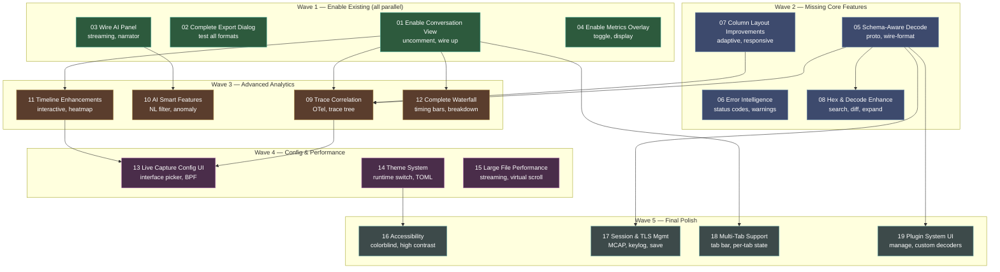

# Phase 3 TUI v2: Remaining Work — Orchestration Manifest

## Overview

This manifest focuses on completing the TUI evolution work. Several features from the original Phase 3 plan have been implemented:
- ✅ Visual Polish (S01) - themes, status bar, focus indicators
- ✅ Zoom & Mouse (S05) - pane zoom, mouse selection, resize
- ✅ Filter & Search (S06) - filter bar, history, quick filters
- ✅ Live Capture (S11) - fully functional
- ✅ Session Comparison (S24) - diff mode working

This plan addresses the remaining 19 segments, organized into 5 waves.

---

## Dependency Diagram



---

## Segment Index

| # | Title | File | Depends On | Risk | Complexity | Cycle Budget | Est. Lines | Status |
|:---:|-------|------|:----------:|:----:|:----------:|:------------:|:----------:|:------:|
| 01 | Enable Conversation View | `segments/01-enable-conversation.md` | — | 3 | Low | 3 | ~150 | pending |
| 02 | Complete Export Dialog | `segments/02-complete-export.md` | — | 2 | Low | 3 | ~200 | pending |
| 03 | Wire AI Panel | `segments/03-wire-ai-panel.md` | — | 4 | Medium | 5 | ~300 | pending |
| 04 | Enable Metrics Overlay | `segments/04-enable-metrics.md` | — | 2 | Low | 3 | ~150 | pending |
| 05 | Schema-Aware Decode Pipeline | `segments/05-schema-decode.md` | — | 6 | High | 10 | ~700 | pending |
| 06 | Error Intelligence | `segments/06-error-intelligence.md` | — | 2 | Low | 5 | ~500 | pending |
| 07 | Column Layout Improvements | `segments/07-column-layout.md` | — | 3 | Medium | 5 | ~400 | pending |
| 08 | Hex Dump & Decode Enhance | `segments/08-hex-decode-enhance.md` | 05 | 4 | Medium | 7 | ~450 | pending |
| 09 | Trace Correlation View | `segments/09-trace-correlation.md` | 01, 05, 07 | 5 | Medium | 7 | ~500 | pending |
| 10 | AI Smart Features | `segments/10-ai-smart.md` | 03 | 5 | Medium | 7 | ~450 | pending |
| 11 | Timeline Enhancements | `segments/11-timeline-enhance.md` | 01 | 4 | Medium | 5 | ~400 | pending |
| 12 | Complete Request Waterfall | `segments/12-complete-waterfall.md` | 01 | 5 | Medium | 7 | ~550 | pending |
| 13 | Live Capture Config UI | `segments/13-live-config-ui.md` | 09 | 4 | Medium | 5 | ~350 | pending |
| 14 | Theme System & Configuration | `segments/14-theme-config.md` | — | 4 | Medium | 7 | ~650 | pending |
| 15 | Large File Performance | `segments/15-large-file-perf.md` | — | 6 | High | 10 | ~550 | pending |
| 16 | Accessibility | `segments/16-accessibility.md` | 14 | 2 | Low | 5 | ~300 | pending |
| 17 | Session & TLS Management | `segments/17-session-tls.md` | 05 | 4 | Medium | 5 | ~400 | pending |
| 18 | Multi-Tab Support | `segments/18-multi-tab.md` | 01 | 7 | High | 10 | ~650 | pending |
| 19 | Plugin System UI | `segments/19-plugin-system-ui.md` | 05 | 5 | Medium | 7 | ~350 | pending |

**Total estimated new/modified code: ~7,500 lines across 19 segments.**

---

## Wave Definitions

| Wave | Segments (parallel) | Theme | Rationale |
|:----:|---------------------|-------|-----------|
| **1** | 01, 02, 03, 04 | Enable Existing | All independent. Uncomment/wire features that exist but are disabled. Quick wins. |
| **2** | 05, 06, 07, 08 | Missing Core Features | Schema decode, error handling, layout fixes, hex enhancements. Foundation for analytics. |
| **3** | 09, 10, 11, 12 | Advanced Analytics | Build on conversations + schema: traces, AI, timeline, waterfall. |
| **4** | 13, 14, 15 | Config & Performance | Live capture UI, theme system, large file optimization. |
| **5** | 16, 17, 18, 19 | Final Polish | Accessibility, session mgmt, multi-tab, plugin UI. |

---

## Build and Test Commands (Global)

```bash
# Full workspace build
cargo build --workspace

# Targeted TUI build
cargo check -p prb-tui
cargo build -p prb-tui

# Full lint gate
cargo clippy --workspace --all-targets -- -D warnings

# Full test gate
cargo nextest run --workspace

# Targeted TUI tests
cargo nextest run -p prb-tui

# TUI snapshot tests only
cargo nextest run -p prb-tui -- snapshot

# Accept new/changed snapshots interactively
cargo insta review

# Accept all new snapshots non-interactively
INSTA_UPDATE=new cargo nextest run -p prb-tui
```

---

## Track Summary

| Track | Segments | Touches | Est. Lines | Risk |
|-------|:--------:|---------|:----------:|------|
| **Enable Existing** | 01, 02, 03, 04 | app.rs, ai_panel.rs, export_dialog.rs | ~800 | Low |
| **Data & Decode** | 05, 06, 08 | decode_tree.rs, hex_dump.rs, error_intel.rs | ~1,650 | Moderate-high |
| **Layout & Display** | 07 | event_list.rs, panes/*.rs | ~400 | Low |
| **Advanced Analytics** | 09, 10, 11, 12 | conversation.rs, trace.rs, waterfall.rs | ~1,900 | Moderate-high |
| **Config & Perf** | 13, 14, 15 | live_config.rs, theme.rs, streaming.rs | ~1,550 | Moderate-high |
| **Final Polish** | 16, 17, 18, 19 | accessibility.rs, session.rs, tabs.rs, plugin_ui.rs | ~1,700 | Moderate-high |

---

## Pre-Execution Checklist

- [x] Phase 2 complete (all segments merged to main)
- [x] Live capture working
- [x] Filter system functional
- [x] Visual polish complete
- [x] Session comparison (diff mode) working
- [ ] Clean working tree (no uncommitted changes)
- [ ] All existing tests passing
- [ ] Clippy clean on workspace

---

## Notes

- Several original Phase 3 features already implemented: visual polish, zoom/mouse, filter/search, live capture, session comparison
- Wave 1 focuses on quick wins by enabling existing but disabled features
- Schema-aware decode (S05) is critical foundation for many later features
- Multi-tab (S18) is highest complexity remaining work
- Plugin system UI (S19) builds on existing plugin infrastructure

---

## Success Criteria

All 19 segments complete when:
1. All exit criteria met for each segment
2. All tests passing (unit, integration, regression)
3. Clippy clean with zero warnings
4. Documentation updated (inline comments, user-facing features)
5. Manual smoke test passes (launch TUI, exercise key workflows)

**Estimated Total Effort:** 19 segments × ~5 cycles avg = ~95 cycles (~20-25 hours)
