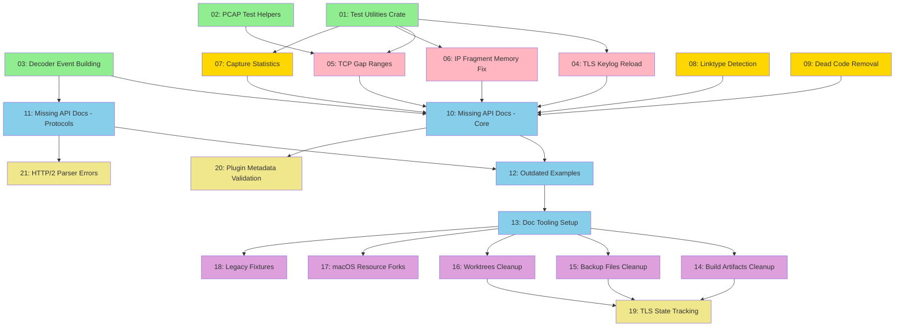

# Refactor and Cleanup Sprint -- Manifest

## Overview

This plan addresses comprehensive code quality improvements across the probe project:
- **1,570 LOC of code duplication** across test utilities, PCAP helpers, and decoder patterns
- **9 bugs** (3 critical, 3 high priority, 3 medium priority) affecting correctness and user trust
- **37 documentation issues** (9 high severity, 17 medium, 11 low) preventing adoption and causing confusion
- **19.8GB of stale files** (build artifacts, backups, worktrees) cluttering the repository

### Delivery Strategy

**Ordering: Dependency-based with quality-first approach**
- Wave 1: High-ROI refactoring (test utilities, decoder helpers) - enables cleaner bug fixes
- Wave 2: Critical bugs (unimplemented features, data loss, memory leaks)
- Wave 3: High-priority bugs (fake data, incorrect defaults)
- Wave 4: Documentation (missing APIs, outdated examples, tooling setup)
- Wave 5: Cleanup (stale files, build artifacts)
- Wave 6: Medium-priority bugs (polish and edge cases)

Benefits:
1. Test utilities established early → cleaner bug fix tests
2. Critical bugs fixed before documentation → docs reflect working features
3. Documentation complete before file cleanup → no risk of removing referenced files
4. Parallelization opportunities in each wave (up to 4 concurrent segments)

## Dependency Diagram



**Legend:**
- 🟢 Green: Wave 1 (High-ROI Refactoring)
- 🔴 Pink: Wave 2 (Critical Bugs)
- 🟡 Gold: Wave 3 (High Priority Bugs)
- 🔵 Blue: Wave 4 (Documentation)
- 🟣 Purple: Wave 5 (Cleanup)
- 🟡 Yellow: Wave 6 (Medium Priority Bugs)

## Segment Index

| # | Title | File | Depends On | Risk | Complexity | Status |
|---|-------|------|------------|------|------------|--------|
| 1 | Create Test Utilities Crate | segments/01-test-utils-crate.md | None | 3/10 | Medium | pending |
| 2 | Extract PCAP Test Helpers | segments/02-pcap-test-helpers.md | None | 2/10 | Low | pending |
| 3 | Refactor Decoder Event Building | segments/03-decoder-event-building.md | None | 4/10 | Medium | pending |
| 4 | Implement TLS Keylog Reload | segments/04-tls-keylog-reload.md | 1 | 6/10 | Medium | pending |
| 5 | Expose TCP Gap Ranges | segments/05-tcp-gap-ranges.md | 1, 2 | 5/10 | Medium | pending |
| 6 | Fix IP Fragment Memory Leak | segments/06-ip-fragment-memory.md | 1 | 7/10 | High | pending |
| 7 | Implement Real Capture Statistics | segments/07-capture-statistics.md | 1 | 4/10 | Low | pending |
| 8 | Implement Linktype Detection | segments/08-linktype-detection.md | 1 | 5/10 | Medium | pending |
| 9 | Remove Dead Code in Adapter | segments/09-dead-code-removal.md | 1 | 2/10 | Low | pending |
| 10 | Document Core APIs | segments/10-document-core-apis.md | 3, 4, 5, 6, 7, 8, 9 | 2/10 | Medium | pending |
| 11 | Document Protocol Decoders | segments/11-document-protocol-decoders.md | 3 | 2/10 | Low | pending |
| 12 | Fix Outdated API Examples | segments/12-fix-outdated-examples.md | 10, 11 | 3/10 | Low | pending |
| 13 | Setup Documentation Tooling | segments/13-doc-tooling-setup.md | 12 | 2/10 | Low | pending |
| 14 | Clean Build Artifacts | segments/14-clean-build-artifacts.md | 13 | 1/10 | Low | pending |
| 15 | Remove Backup Files | segments/15-remove-backup-files.md | 13 | 1/10 | Low | pending |
| 16 | Archive Inactive Worktrees | segments/16-archive-worktrees.md | 13 | 3/10 | Low | pending |
| 17 | Remove macOS Resource Forks | segments/17-remove-resource-forks.md | 13 | 1/10 | Low | pending |
| 18 | Migrate Legacy Fixtures | segments/18-migrate-legacy-fixtures.md | 13 | 2/10 | Low | pending |
| 19 | Improve TLS State Tracking | segments/19-tls-state-tracking.md | 14, 15, 16 | 4/10 | Medium | pending |
| 20 | Enhance Plugin Metadata Validation | segments/20-plugin-metadata-validation.md | 10 | 3/10 | Low | pending |
| 21 | Improve HTTP/2 Parser Errors | segments/21-http2-parser-errors.md | 11 | 3/10 | Low | pending |

## Parallelization Opportunities

### Wave 1 (Independent - can run 3 in parallel)
- Segment 1: Test Utilities Crate
- Segment 2: PCAP Test Helpers
- Segment 3: Decoder Event Building

### Wave 2 (After Wave 1 - can run 3 in parallel)
- Segment 4: TLS Keylog Reload (depends on S1)
- Segment 5: TCP Gap Ranges (depends on S1, S2)
- Segment 6: IP Fragment Memory (depends on S1)

### Wave 3 (After S1 - can run 3 in parallel)
- Segment 7: Capture Statistics
- Segment 8: Linktype Detection
- Segment 9: Dead Code Removal

### Wave 4 (After Waves 2-3 - can run 3 in parallel)
- Segment 10: Document Core APIs (depends on S3-S9)
- Segment 11: Document Protocol Decoders (depends on S3)
- (Then S12, S13 sequentially)

### Wave 5 (After S13 - can run 5 in parallel)
- Segment 14: Clean Build Artifacts
- Segment 15: Remove Backup Files
- Segment 16: Archive Worktrees
- Segment 17: Remove Resource Forks
- Segment 18: Migrate Legacy Fixtures

### Wave 6 (After Waves 4-5 - can run 3 in parallel)
- Segment 19: TLS State Tracking
- Segment 20: Plugin Metadata Validation
- Segment 21: HTTP/2 Parser Errors

## Preamble Injection

Before launching any builder subagent, the orchestration agent assembles the prompt from three sources:

1. **Read `.claude/commands/iterative-builder.md`** - Full contents (iteration budget, structured reporting, checkpoint strategy)
2. **Read `.claude/commands/devcontainer-exec.md`** - Full contents (Rust/Cargo commands, workspace structure, crate naming)
3. **Read the segment file** from `segments/{NN}-{slug}.md` - The entire file IS the brief

**Assembled prompt structure:**
```
[iterative-builder.md contents]
[devcontainer-exec.md contents]
[segment file contents]
```

Always inject from skill files - do NOT rely on inline preamble in old plan files.

## Execution Instructions

To execute this plan, use the `/orchestrate` skill with the following workflow:

### 1. Pre-Execution Cross-Plan Verification
If sibling plans exist in `.claude/plans/`, run cross-plan verification first using the `/restructure-plan` skill (Step 7 only). Present inconsistencies to user before launching builders.

### 2. For Each Segment (in Dependency Order)
Execute segments in waves according to the dependency diagram above:

**For each segment:**
1. **Read segment brief** from `segments/{NN}-{slug}.md`
2. **Assemble prompt** with preamble injection (iterative-builder.md + devcontainer-exec.md + segment)
3. **Launch iterative-builder subagent** via Agent tool with assembled prompt
4. **Monitor builder** - wait for completion (PASS, PARTIAL, or BLOCKED)
5. **Verify exit gates independently**:
   - Run targeted tests
   - Run regression tests
   - Run full build gate
   - Run full test suite gate
   - Perform self-review (no dead code, no scope creep)
   - Verify scope (changed files match stated scope)
6. **Commit if all gates pass**:
   - Identify WIP commits: `git log --oneline | grep "WIP:"`
   - Squash N WIP commits: `git reset --soft HEAD~N && git commit -m "<commit message from segment>"`
   - If no WIP commits, commit directly
7. **Update execution log** in `execution-log.md`
8. **Incremental verification** for segments with risk ≥7/10 or High complexity
9. **Adapt if needed** - update later segment briefs if implementation changes assumptions
10. **Move to next segment**

### 3. If Builder Reports PARTIAL or BLOCKED
1. **Launch iterative-debugger subagent** with:
   - Full `.claude/commands/iterative-debugger.md`
   - Full `.claude/commands/devcontainer-exec.md`
   - Builder's structured final report
   - Segment brief
   - Failure details (test names, error output)
2. **If debugger resolves** - re-verify gates and commit
3. **If debugger identifies design flaw** - stop, return to plan, update affected issue briefs

### 4. Resuming After Debugger Resolution
If debugger reports RESOLVED but gates not fully satisfied:
1. **Re-launch iterative-builder** with:
   - Standard preamble injection (fresh from skill files)
   - Prepend to segment brief: "RESUME MODE: Previous builder made partial progress, debugger resolved blocking issue. WIP commits exist. Start by running targeted tests to assess current state, then continue from where previous builder left off."
   - Fresh cycle budget (not remainder)
2. **On completion** - verify gates and commit

### 5. Post-Execution Verification (Deep-Verify Loop)
After all segments complete:
1. **Run deep-verify** against materialized plan file
2. **Review verification report** (criterion-by-criterion with PASS/PARTIAL/FAIL verdicts)
3. **If FULLY VERIFIED** - Plan complete, update execution log
4. **If PARTIALLY VERIFIED or NOT VERIFIED**:
   - Collect all PARTIAL, FAIL, HIGH-severity gaps
   - Re-enter deep-plan at Entry Point B (Enrich Existing Plan)
   - Materialize follow-up plan with `-followup` suffix
   - Execute follow-up using same orchestration protocol
   - Run deep-verify against combined scope
   - Repeat until FULLY VERIFIED or user decides to stop
5. **Loop budget** - Flag if >2 follow-up cycles needed (likely requires human design decisions)

## Estimated Scope

- **Total segments**: 21
- **Estimated duration**: 8-10 days (with parallel execution)
- **Complexity distribution**:
  - Low: 12 segments
  - Medium: 8 segments
  - High: 1 segment
- **Risk distribution**:
  - 1/10: 4 segments (safe cleanup)
  - 2/10: 5 segments (low risk refactoring)
  - 3/10: 5 segments (moderate risk changes)
  - 4/10: 3 segments (cross-cutting changes)
  - 5/10: 2 segments (TCP/linktype logic)
  - 6/10: 1 segment (TLS keylog)
  - 7/10: 1 segment (memory safety)
- **Risk budget**: 1 segment at 7/10 risk (within acceptable limits)

### Caveats
- Segment 6 (IP fragment memory) requires careful review of unsafe code and Arc/clone semantics
- Segments 14-16 (cleanup) require verification that files are truly unused before deletion
- Documentation segments assume cargo-rdme adoption (can fall back to manual if needed)
- Wave execution assumes 4-core machine; adjust max_parallel_builders if needed

## Plan Metadata

**Generated by**: deep-plan workflow (Step 9: Materialize)
**Rules version**: 2026-03-13 (orchestrate v3 format)
**Entry point**: Fresh goal (user requested comprehensive refactoring/cleanup)
**Execution protocol**: orchestrate skill (authoritative orchestration protocol)
**Verification protocol**: deep-verify skill (post-execution verification)

**Research foundation**:
- Source 1 (Codebase): 4 explore agents (duplication, bugs, docs, unused files)
- Source 2 (Project Conventions): ADRs, CONTRIBUTING.md, architecture.md, CI workflows
- Source 3 (Existing Solutions): rust crates (rstest, cargo-rdme, tokio-util, trycmd, lychee)
- Source 4 (External Best Practices): Rust API Guidelines, Rust Book, tokio/serde/reqwest patterns

All segment briefs include:
- Self-contained handoff contracts (no back-references)
- Concrete build/test commands (not placeholders)
- Pre-mortem risk analysis
- Evidence for optimality (≥2 sources)
- Exact commit messages (conventional commits format)
