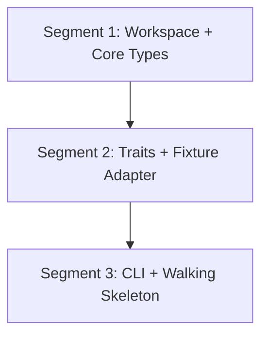

# Subsection 1: Foundation & Core Model -- Deep Plan

**Goal:** Establish the Cargo workspace, canonical DebugEvent model, core extension traits, error conventions, JSON fixture adapter, and a walking-skeleton CLI that validates the end-to-end architecture.
**Generated:** 2026-03-08
**Rules version:** 2026-03-08
**Entry point:** B (Enrich Existing Plan)
**Status:** Ready for execution
**Parent plan:** `universal-message-debugger-phase1-2026-03-08.md`

---

## Overview

This plan decomposes Subsection 1 of the Universal Message Debugger Phase 1 into 3 sequential segments. The ordering is dependency-order (topological): Segment 1 defines the data model, Segment 2 builds the extension points and first adapter, Segment 3 wires everything into a working CLI. Every segment delivers testable functionality end-to-end. The final segment produces a walking skeleton: `prb ingest fixtures/sample.json | prb inspect --format table`.

All traits are synchronous for Phase 1. This avoids the async trait dyn-compatibility gap (async fn in traits is stable since Rust 1.75 for static dispatch but NOT dyn-safe). Phase 2 can introduce `AsyncCaptureAdapter` with `Stream`-based signatures if live capture requires it.

The workspace uses Rust edition 2024 with resolver 3 (MSRV-aware dependency resolution, default for edition 2024 since Rust 1.84).

---

## Dependency Diagram



All segments are strictly sequential. No parallelization is possible at the segment level because each depends on the types and traits from its predecessor.

---

## Issue Analysis Briefs

### Issue S1-1: DebugEvent Canonical Model Under-specified

**Core Problem:**
The parent plan states "The DebugEvent type that every later subsection produces or consumes" but defines zero fields. This is the single most critical type in the project -- every one of the 14 planned crates and all 5 subsections either produces, transforms, or consumes DebugEvents. Getting the field set wrong means refactoring the entire project.

**Root Cause:**
The parent plan was scoped as a decomposition plan, not an implementation plan. It deferred field-level design to the deep-plan phase.

**Proposed Fix:**
Define the DebugEvent struct and its supporting types with fields informed by three reference models (MCAP Message, Wireshark packet, CloudEvents spec) and the needs of all 5 subsections:

```rust
pub struct DebugEvent {
    pub id: EventId,
    pub timestamp: Timestamp,
    pub source: EventSource,
    pub transport: TransportKind,
    pub direction: Direction,
    pub payload: Payload,
    pub metadata: BTreeMap<String, String>,
    pub correlation_keys: Vec<CorrelationKey>,
    pub sequence: Option<u64>,
    pub warnings: Vec<String>,
}
```

Supporting types:

- `EventId`: newtype over `uuid::Uuid` (or a monotonic u64 counter for perf)
- `Timestamp`: wrapper holding nanoseconds since Unix epoch (maps to MCAP `log_time`)
- `EventSource`: struct with `adapter: String`, `origin: String`, optional `NetworkAddr`
- `NetworkAddr`: `src_addr`, `src_port`, `dst_addr`, `dst_port`
- `TransportKind`: enum `{ Grpc, Zmq, DdsRtps, RawTcp, RawUdp, JsonFixture }`
- `Direction`: enum `{ Inbound, Outbound, Unknown }`
- `Payload`: enum `{ Raw(Bytes), Decoded { raw: Bytes, fields: serde_json::Value, schema_name: Option<String> } }`
- `CorrelationKey`: enum `{ StreamId(u32), Topic(String), ConnectionId(String), Custom(String, String) }`

The `warnings` field carries parse warnings per the project's no-ignore-failure rule -- malformed data surfaces as warnings, not silent drops.

The `metadata` BTreeMap carries protocol-specific key-value pairs (gRPC method name, HTTP/2 stream ID, ZMQ topic, DDS domain). This avoids making DebugEvent aware of protocol-specific types while still carrying the data the correlation engine needs.

**Existing Solutions Evaluated:**
- MCAP `Message` struct (mcap v0.24.0): has `channel`, `sequence`, `log_time`, `publish_time`, `data`. Our DebugEvent is richer -- it carries decoded fields, correlation keys, and metadata that MCAP stores in Channel metadata. DebugEvent serializes into MCAP Message data, with transport/source info mapped to MCAP Channel topic and metadata.
- CloudEvents spec (CNCF v1.0.2): defines `id`, `source`, `type`, `time`, `data`, `datacontenttype`, `subject`, `extensions`. Our model adopts the same pattern (id, source, timestamp, typed payload, extensible metadata) but is domain-specific to message debugging.
- Wireshark packet model: `timestamp`, `source`, `destination`, `protocol`, `info`, `data`. Our model expands this with directional info, correlation keys, and decoded payload.

**Alternatives Considered:**
- Use an untyped `serde_json::Value` as the entire event model. Rejected: loses compile-time guarantees, makes trait signatures vague, and forces every consumer to do runtime key lookups.
- Use protobuf `DynamicMessage` (via prost-reflect) as the event model. Rejected: creates a circular dependency (the tool decodes protobuf, storing events as protobuf means decoding its own storage) and is less ergonomic than native Rust structs.

**Pre-Mortem -- What Could Go Wrong:**
- The `metadata: BTreeMap<String, String>` is too loose -- protocol decoders may use inconsistent key names, breaking the correlation engine. Mitigation: define well-known metadata key constants in prb-core (e.g., `METADATA_KEY_GRPC_METHOD`, `METADATA_KEY_H2_STREAM_ID`).
- `Payload::Decoded.fields` as `serde_json::Value` may be too heavyweight for high-throughput scenarios (100k+ events/sec). Mitigation: benchmark in Subsection 5 and consider a more compact representation if needed.
- `Bytes` from the bytes crate adds a dependency but is justified for zero-copy slicing of large capture payloads.
- Adding fields later is backward-compatible for serde (new fields deserialize as defaults), but removing or renaming fields is breaking.

**Risk Factor:** 4/10

**Evidence for Optimality:**
- External evidence: CloudEvents v1.0.2 (CNCF) uses the same pattern of required context attributes + extensible metadata for event systems, validating the struct-plus-metadata design.
- External evidence: MCAP's Channel metadata (BTreeMap<String, String>) uses the same pattern for per-channel extensible metadata, confirming that key-value pairs are the right abstraction for protocol-specific data.
- Project conventions: The `no-ignore-failure` rule (.cursor/rules/no-ignore-failure.mdc) requires surfacing errors, which motivates the `warnings: Vec<String>` field.

**Blast Radius:**
- Direct changes: `crates/prb-core/src/event.rs` (new file)
- Potential ripple: every crate in the workspace imports DebugEvent; changes to its fields require coordinated updates

---

### Issue S1-2: Core Trait Sync/Async Design Decision Missing

**Core Problem:**
The parent plan lists 5 core traits (CaptureAdapter, ProtocolDecoder, SchemaResolver, EventNormalizer, CorrelationStrategy) but does not address whether they should be synchronous or asynchronous. This is a foundational architectural decision because: (a) async fn in traits is stable (Rust 1.75) only for static dispatch -- trait objects (`Box<dyn Trait>`) are NOT supported, (b) the CaptureAdapter will be implemented by both sync adapters (JSON fixture) and potentially async adapters (live capture in Phase 2), and (c) choosing wrong means refactoring every implementation.

**Root Cause:**
The parent plan deferred implementation details to deep-planning. The sync/async decision was not flagged as an architectural concern.

**Proposed Fix:**
Make all 5 traits synchronous for Phase 1. Phase 1 is offline analysis only -- all I/O is file reads, which are blocking. The key trait signatures:

```rust
pub trait CaptureAdapter {
    fn name(&self) -> &str;
    fn ingest(&mut self) -> Box<dyn Iterator<Item = Result<DebugEvent, CoreError>> + '_>;
}

pub trait ProtocolDecoder {
    fn protocol(&self) -> TransportKind;
    fn decode_stream(&mut self, stream: &[u8], ctx: &DecodeContext)
        -> Result<Vec<DebugEvent>, CoreError>;
}

pub trait SchemaResolver {
    fn resolve(&self, name: &str) -> Result<Option<ResolvedSchema>, CoreError>;
    fn list_schemas(&self) -> Vec<String>;
}

pub trait EventNormalizer {
    fn normalize(&self, events: Vec<DebugEvent>) -> Result<Vec<DebugEvent>, CoreError>;
}

pub trait CorrelationStrategy {
    fn transport(&self) -> TransportKind;
    fn correlate<'a>(&self, events: &'a [DebugEvent]) -> Result<Vec<Flow<'a>>, CoreError>;
}
```

CaptureAdapter uses `Box<dyn Iterator>` for streaming -- this is the standard Rust pattern for sync streaming and avoids loading entire captures into memory. The dynamic dispatch cost (~3ns per call) is negligible compared to I/O.

**Existing Solutions Evaluated:**
- N/A -- internal architectural decision. No external tool addresses "should our traits be async."

**Alternatives Considered:**
- Use `async-trait` crate for all traits. Rejected: adds heap allocation per trait method call, forces async runtime even for sync adapters, and Phase 1 has no async I/O needs. The `async-trait` crate is still at v0.1.x and the ecosystem is moving toward native async traits.
- Use native `async fn` in traits. Rejected: not dyn-compatible (cannot use `Box<dyn CaptureAdapter>`). While we don't need dyn dispatch for known adapters, keeping the option open is valuable for plugin architectures.
- Use `Stream` (from futures/tokio-stream) instead of `Iterator`. Rejected for Phase 1: adds async runtime dependency for no benefit. Can add `AsyncCaptureAdapter` in Phase 2 if needed.

**Pre-Mortem -- What Could Go Wrong:**
- Phase 2 live capture may require async traits, forcing a migration. Mitigation: the sync traits remain valid for offline analysis; async variants are additive, not replacements.
- `Box<dyn Iterator>` prevents the caller from knowing the concrete iterator type, which may limit optimizations. Mitigation: for hot paths, concrete types can bypass the trait.
- Large captures may block the thread during `ingest()`. Mitigation: acceptable for Phase 1 CLI; Phase 2 can use `spawn_blocking` or async adapters.

**Risk Factor:** 3/10

**Evidence for Optimality:**
- External evidence: The sans-I/O pattern (used by h2-sans-io, Python's sans-io protocol libraries) is inherently synchronous. The Rust PCAP ecosystem (pcap-parser, etherparse) is entirely sync. Matching the ecosystem avoids impedance mismatches.
- External evidence: Rust async-fn-in-traits stabilization blog post (blog.rust-lang.org, Dec 2023) explicitly recommends using sync traits when async is not needed, and adding async variants later as separate traits rather than forcing async everywhere.

**Blast Radius:**
- Direct changes: `crates/prb-core/src/traits.rs` (new file)
- Potential ripple: every adapter and decoder implementation in Subsections 2-5 implements these traits

---

### Issue S1-3: Workspace Crate Structure Undefined

**Core Problem:**
The parent plan mentions "12+ crates in the workspace" but does not name them, define the directory layout, or specify which crates are created in which subsection. Without this, each subsection's deep-plan must independently invent crate names, leading to inconsistency.

**Root Cause:**
The parent plan focused on subsection-level decomposition, not workspace-level structure.

**Proposed Fix:**
Define the full workspace structure now. Subsection 1 creates the first 3 crates; later subsections add theirs.

```
prb/
├── Cargo.toml                  # Virtual workspace manifest
├── Cargo.lock
├── README.md
├── crates/
│   ├── prb-core/               # Subsection 1: types, traits, errors
│   ├── prb-fixture/            # Subsection 1: JSON fixture adapter
│   ├── prb-cli/                # Subsection 1+: CLI binary
│   ├── prb-storage/            # Subsection 2: MCAP read/write
│   ├── prb-schema/             # Subsection 2: protobuf schema subsystem
│   ├── prb-decode/             # Subsection 2: protobuf decode engine
│   ├── prb-pcap/               # Subsection 3: PCAP/pcapng ingest
│   ├── prb-tcp/                # Subsection 3: TCP reassembly
│   ├── prb-tls/                # Subsection 3: TLS decryption
│   ├── prb-grpc/               # Subsection 4: gRPC decoder
│   ├── prb-zmq/                # Subsection 4: ZMQ/ZMTP decoder
│   ├── prb-dds/                # Subsection 4: DDS/RTPS decoder
│   ├── prb-correlation/        # Subsection 5: correlation engine
│   └── prb-replay/             # Subsection 5: replay engine
├── fixtures/                   # Test fixture files
│   └── sample.json
└── tests/                      # Workspace-level integration tests
```

Workspace `Cargo.toml` uses `workspace.dependencies` for all shared dependencies with pinned versions. Crate naming follows `prb-{domain}` convention. All crates use edition 2024.

**Existing Solutions Evaluated:**
- N/A -- internal project structure decision.

**Alternatives Considered:**
- Flat workspace (all crates at root level, no `crates/` directory). Rejected: becomes unwieldy with 14 crates. The `crates/` convention is standard (used by rustc, cargo, tokio, bevy).
- Fewer, larger crates (e.g., single `prb-network` instead of `prb-pcap`, `prb-tcp`, `prb-tls`). Rejected: coarser crate boundaries mean longer recompile times and entangled error types. Fine-grained crates match the subsection decomposition.

**Pre-Mortem -- What Could Go Wrong:**
- 14 crates may be excessive, increasing compile times from inter-crate dependency resolution. Mitigation: Cargo workspaces share a build cache; incremental builds only recompile changed crates.
- Crate names may collide with crates.io packages. Mitigation: the `prb-` prefix is unlikely to collide; these are private crates not published to crates.io.
- The `tests/` directory at workspace root may confuse cargo (it expects `tests/` per-crate). Mitigation: workspace-level integration tests use `[[test]]` entries in the CLI crate's Cargo.toml, not the workspace root.

**Risk Factor:** 2/10

**Evidence for Optimality:**
- External evidence: Cargo workspace best practices (doc.rust-lang.org/cargo/reference/workspaces) recommend virtual manifests for multi-crate projects, `workspace.dependencies` for version deduplication, and the `crates/` directory convention.
- External evidence: Major Rust projects (tokio, bevy, rustc) use the `crates/` layout with domain-specific crate names, validating this structure at scale.

**Blast Radius:**
- Direct changes: root `Cargo.toml`, `crates/prb-core/Cargo.toml`, `crates/prb-fixture/Cargo.toml`, `crates/prb-cli/Cargo.toml`
- Potential ripple: every subsequent subsection adds crates to this structure

---

### Issue S1-4: JSON Fixture Format Not Defined

**Core Problem:**
The parent plan says "JSON fixture adapter" and "a working end-to-end pipeline: JSON fixture -> DebugEvent -> CLI output" but does not specify what a fixture file looks like. The format must be stable because users will author fixtures for testing and development, and the format is the first thing users interact with.

**Root Cause:**
The parent plan focused on the adapter as a code artifact, not on its input format.

**Proposed Fix:**
Define a versioned JSON fixture format:

```json
{
  "version": 1,
  "description": "Optional human-readable description of the fixture",
  "events": [
    {
      "timestamp_ns": 1709913600000000000,
      "transport": "grpc",
      "direction": "inbound",
      "payload_base64": "AAAAABIKCAESB...",
      "metadata": {
        "grpc.method": "/myservice.v1.MyService/GetItem",
        "h2.stream_id": "1"
      }
    },
    {
      "timestamp_ns": 1709913600100000000,
      "transport": "raw_tcp",
      "direction": "outbound",
      "payload_utf8": "HTTP/1.1 200 OK\r\n...",
      "source": {
        "src_addr": "10.0.0.1",
        "src_port": 8080,
        "dst_addr": "10.0.0.2",
        "dst_port": 45321
      }
    }
  ]
}
```

Design decisions:
- `version` field for forward compatibility
- Timestamps are nanoseconds (matches MCAP log_time precision)
- Payload has two representations: `payload_base64` for binary, `payload_utf8` for text (exactly one required)
- `metadata` uses dotted-prefix keys matching well-known constants from prb-core (`grpc.method`, `h2.stream_id`, `zmq.topic`, `dds.domain_id`)
- `source` is optional (fixtures may not have network addresses)
- `transport` uses snake_case enum variant names

**Existing Solutions Evaluated:**
- CloudEvents JSON format (CNCF): uses `data_base64` for binary payloads and `data` for structured payloads. Our format adopts this same dual-representation pattern.
- Wireshark's `-T json` export format: outputs packet dissection as nested JSON. Too complex for hand-authored fixtures.
- MCAP's JSON-based schema support: MCAP supports schemaless JSON messages (schema_id=0). Our fixture format is simpler because it's a flat event list, not an MCAP container.

**Alternatives Considered:**
- Use MCAP files as fixtures. Rejected: MCAP is a binary format; hand-authoring fixtures requires a tool that doesn't exist yet (circular dependency).
- Use YAML instead of JSON. Rejected: adds a dependency (serde_yaml); JSON is sufficient and universally supported. YAML can be added later if requested.
- Use newline-delimited JSON (NDJSON). Rejected: harder to hand-edit (no outer structure for version/description). Standard JSON is better for small fixture files.

**Pre-Mortem -- What Could Go Wrong:**
- Base64 encoding is error-prone for hand-authored fixtures. Mitigation: the `payload_utf8` alternative avoids base64 for text-based protocols; provide example fixtures with both.
- The format may need fields not yet anticipated (e.g., schema references for Subsection 2). Mitigation: the `version` field enables non-breaking format evolution; unknown fields are ignored by serde's `#[serde(deny_unknown_fields)]` at the event level (strict) or skipped (lenient).
- Users may submit invalid JSON (trailing commas, comments). Mitigation: use `serde_json` strict parsing; provide clear error messages citing line/column.

**Risk Factor:** 2/10

**Evidence for Optimality:**
- External evidence: CloudEvents JSON format (CNCF v1.0.2) uses the same dual-payload pattern (`data` for structured, `data_base64` for binary), validating this approach for event serialization.
- External evidence: JSON Schema specification (json-schema.org) recommends versioned schemas for forward compatibility; our `version` field follows this practice.

**Blast Radius:**
- Direct changes: `crates/prb-fixture/src/` (adapter implementation), `fixtures/` (sample files)
- Potential ripple: documentation, README examples, integration tests

---

### Issue S1-5: Error Convention Requires Concrete Implementation

**Core Problem:**
Parent plan Issue 11 defines the error convention (thiserror for libs, anyhow for CLI) but does not specify the concrete error types, variant names, or conversion chains. Each library crate needs its own error enum, and the CLI needs to convert all library errors into user-friendly messages.

**Root Cause:**
The parent plan defined the convention at the policy level but not at the implementation level.

**Proposed Fix:**
Define error types for the 3 crates created in Subsection 1:

```rust
// crates/prb-core/src/error.rs
#[derive(Debug, thiserror::Error)]
pub enum CoreError {
    #[error("invalid timestamp: {0}")]
    InvalidTimestamp(String),
    #[error("payload decode failed: {0}")]
    PayloadDecode(String),
    #[error("unsupported transport: {0}")]
    UnsupportedTransport(String),
    #[error("serialization error: {0}")]
    Serialization(#[from] serde_json::Error),
}

// crates/prb-fixture/src/error.rs
#[derive(Debug, thiserror::Error)]
pub enum FixtureError {
    #[error("fixture I/O error: {path}")]
    Io { path: String, #[source] source: std::io::Error },
    #[error("fixture parse error: {0}")]
    Parse(String),
    #[error("unsupported fixture version: {version} (supported: 1)")]
    UnsupportedVersion { version: u64 },
    #[error(transparent)]
    Core(#[from] CoreError),
}

// crates/prb-cli/src/main.rs uses anyhow::Result throughout
```

Conversion chain: `CoreError` -> `FixtureError` (via `#[from]`) -> `anyhow::Error` (via `Into` at CLI boundary).

**Existing Solutions Evaluated:**
- N/A -- internal architectural convention following standard Rust ecosystem practice.

**Alternatives Considered:**
- Single monolithic error enum for the whole workspace. Rejected per parent plan Issue 11 rationale: creates coupling between unrelated crates.
- Use `anyhow` everywhere including libraries. Rejected: library consumers lose the ability to match on specific error variants, violating the Rust API Guidelines.

**Pre-Mortem -- What Could Go Wrong:**
- Error variant names may need to change as more error conditions are discovered. Mitigation: thiserror enums are additive (new variants don't break existing matches unless using exhaustive patterns). Use `#[non_exhaustive]` on public error enums.
- Deep conversion chains (`CoreError` -> `FixtureError` -> `anyhow::Error`) may obscure the root cause in error messages. Mitigation: thiserror's `#[source]` attribute preserves the error chain; `anyhow`'s `{:#}` format prints the full chain.

**Risk Factor:** 2/10

**Evidence for Optimality:**
- External evidence: Rust API Guidelines (rust-lang.github.io/api-guidelines, C-GOOD-ERR) recommend typed errors for libraries with `#[non_exhaustive]` for public enums.
- External evidence: `thiserror` v2.0.18 README explicitly recommends this split: thiserror for libraries, anyhow for applications.

**Blast Radius:**
- Direct changes: `crates/prb-core/src/error.rs`, `crates/prb-fixture/src/error.rs`, `crates/prb-cli/src/main.rs`
- Potential ripple: every future crate follows this pattern; changing the convention after Subsection 1 is expensive

---

## Segment Briefs

### Segment 1: Workspace Skeleton + Core Types + Error Convention
> **Execution method:** Launch as an `iterative-builder` subagent (Task tool, subagent_type="generalPurpose"). The orchestration agent reads and prepends `iterative-builder-prompt.mdc` and `devcontainer-exec.mdc` at launch time per `orchestration-protocol.mdc`.

**Goal:** Create the Cargo workspace with the core types crate containing DebugEvent, all supporting types, and the error convention.

**Depends on:** None

**Issues addressed:** Issue S1-1 (DebugEvent model), Issue S1-3 (workspace structure), Issue S1-5 (error convention)

**Cycle budget:** 10 cycles

**Scope:**
- Root workspace manifest
- `crates/prb-core/` crate (types + errors)
- `crates/prb-cli/` minimal binary stub (just enough to compile)
- `fixtures/sample.json` (one example fixture)

**Key files and context:**

Files to create:
- `Cargo.toml` -- virtual workspace manifest, edition 2024, resolver 3
- `crates/prb-core/Cargo.toml` -- lib crate
- `crates/prb-core/src/lib.rs` -- re-exports
- `crates/prb-core/src/event.rs` -- DebugEvent and all supporting types
- `crates/prb-core/src/error.rs` -- CoreError enum
- `crates/prb-cli/Cargo.toml` -- binary crate (depends on prb-core)
- `crates/prb-cli/src/main.rs` -- minimal `fn main()` that compiles

The DebugEvent type is the most critical artifact. It must carry:
- `id: EventId` -- newtype over u64 (monotonic counter, not UUID -- UUID is 16 bytes overhead per event and unnecessary for a single-process tool)
- `timestamp: Timestamp` -- newtype over u64 (nanoseconds since Unix epoch)
- `source: EventSource` -- struct with `adapter: String`, `origin: String`, `network: Option<NetworkAddr>`
- `transport: TransportKind` -- enum { Grpc, Zmq, DdsRtps, RawTcp, RawUdp, JsonFixture }
- `direction: Direction` -- enum { Inbound, Outbound, Unknown }
- `payload: Payload` -- enum { Raw(Bytes), Decoded { raw: Bytes, fields: serde_json::Value, schema_name: Option<String> } }
- `metadata: BTreeMap<String, String>` -- protocol-specific key-value pairs
- `correlation_keys: Vec<CorrelationKey>` -- enum { StreamId(u32), Topic(String), ConnectionId(String), Custom(String, String) }
- `sequence: Option<u64>` -- ordering within a stream
- `warnings: Vec<String>` -- parse warnings (per no-ignore-failure rule)

Well-known metadata key constants must be defined in `prb-core`:
```rust
pub const METADATA_KEY_GRPC_METHOD: &str = "grpc.method";
pub const METADATA_KEY_H2_STREAM_ID: &str = "h2.stream_id";
pub const METADATA_KEY_ZMQ_TOPIC: &str = "zmq.topic";
pub const METADATA_KEY_DDS_DOMAIN_ID: &str = "dds.domain_id";
pub const METADATA_KEY_DDS_TOPIC_NAME: &str = "dds.topic_name";
```

Workspace dependencies to set up in root `Cargo.toml`:
```toml
[workspace.dependencies]
serde = { version = "1", features = ["derive"] }
serde_json = "1"
bytes = { version = "1", features = ["serde"] }
thiserror = "2"
anyhow = "1"
clap = { version = "4", features = ["derive"] }
camino = { version = "1.2", features = ["serde1"] }
tracing = "0.1"
tracing-subscriber = { version = "0.3", features = ["env-filter", "json"] }
tokio = { version = "1", features = ["full"] }
```

Testing dependencies:
```toml
[workspace.dependencies]
insta = { version = "1", features = ["json", "yaml"] }
proptest = "1"
assert_cmd = "2"
predicates = "3"
tempfile = "3"
```

All types must derive `Debug, Clone, PartialEq, Serialize, Deserialize`. TransportKind and Direction must also derive `Copy`. DebugEvent must use `#[serde(tag = "type")]` for internal tagging when serialized to JSON.

CoreError must be `#[non_exhaustive]` since it's a public library type.

**Implementation approach:**
1. Create root `Cargo.toml` as virtual workspace with `workspace.dependencies`
2. Create `crates/prb-core/` with Cargo.toml inheriting workspace deps
3. Implement all types in `event.rs` with full serde derives
4. Implement `CoreError` in `error.rs` with thiserror
5. Create `crates/prb-cli/` with minimal main.rs
6. Write unit tests: serde round-trip for every type, Display impls, error chain verification
7. Create `fixtures/sample.json` with one valid fixture matching the format spec

**Alternatives ruled out:**
- UUID for EventId: 16 bytes overhead per event, unnecessary for single-process tool. Monotonic u64 counter is sufficient and cheaper.
- `serde_json::Value` as the entire event model: loses compile-time guarantees.
- Protobuf `DynamicMessage` as event model: circular dependency with the decode engine.
- `anyhow` in library crates: violates the error convention; library consumers can't match on specific variants.

**Pre-mortem risks:**
- DebugEvent field set may be incomplete for later subsections. Defensive measure: use `#[serde(default)]` on optional fields so new fields don't break deserialization of old data. Use `#[non_exhaustive]` on enums.
- `serde_json::Value` in Payload::Decoded may be slow for high-throughput. This is acceptable for Phase 1; Subsection 5 benchmarks will validate.
- `BTreeMap<String, String>` for metadata doesn't enforce well-known keys at compile time. The constant definitions mitigate this -- clippy lints or a metadata builder can be added later.

**Segment-specific commands:**
- Build: `cargo build -p prb-core && cargo build -p prb-cli`
- Test (targeted): `cargo nextest run -p prb-core`
- Test (regression): N/A (first segment, no prior code)
- Test (full gate): `cargo nextest run --workspace && cargo clippy --workspace -- -D warnings && cargo fmt --all -- --check`

**Exit criteria:**

All of the following must be satisfied:

1. **Targeted tests:**
   - `test_debug_event_serde_roundtrip`: serialize DebugEvent to JSON and deserialize back, assert equality
   - `test_timestamp_nanosecond_precision`: verify Timestamp preserves nanosecond values
   - `test_payload_raw_serde`: verify Raw payload base64-encodes/decodes correctly with serde
   - `test_payload_decoded_serde`: verify Decoded payload round-trips with fields and schema_name
   - `test_transport_kind_display`: verify Display impl for all TransportKind variants
   - `test_direction_display`: verify Display impl for all Direction variants
   - `test_core_error_display`: verify CoreError variants produce meaningful messages
   - `test_core_error_source_chain`: verify #[source] chains are preserved
   - `test_event_id_monotonic`: verify EventId counter is monotonically increasing
   - `test_correlation_key_variants`: verify all CorrelationKey variants serialize/deserialize
2. **Regression tests:** N/A (first segment)
3. **Full build gate:** `cargo build --workspace`
4. **Full test gate:** `cargo nextest run --workspace`
5. **Self-review gate:** No dead code, no commented-out blocks, no TODO hacks, no changes outside stated scope.
6. **Scope verification gate:** Changed files are limited to: root `Cargo.toml`, `Cargo.lock`, `crates/prb-core/**`, `crates/prb-cli/Cargo.toml`, `crates/prb-cli/src/main.rs`, `fixtures/sample.json`. No other files.

**Risk factor:** 2/10

**Estimated complexity:** Low

**Commit message:**
`feat(core): add workspace skeleton, DebugEvent model, and error types`

---

### Segment 2: Core Traits + JSON Fixture Adapter
> **Execution method:** Launch as an `iterative-builder` subagent (Task tool, subagent_type="generalPurpose"). The orchestration agent reads and prepends `iterative-builder-prompt.mdc` and `devcontainer-exec.mdc` at launch time per `orchestration-protocol.mdc`.

**Goal:** Define all 5 core extension traits in prb-core and implement the first CaptureAdapter (JSON fixture adapter) in a new prb-fixture crate.

**Depends on:** Segment 1

**Issues addressed:** Issue S1-2 (sync trait design), Issue S1-4 (fixture format), Issue S1-5 (error convention -- FixtureError)

**Cycle budget:** 15 cycles

**Scope:**
- `crates/prb-core/src/traits.rs` (5 trait definitions + supporting types)
- `crates/prb-fixture/` (new crate: JSON fixture adapter)
- `fixtures/` (additional test fixtures)

**Key files and context:**

After Segment 1, the following exist:
- `crates/prb-core/src/event.rs` -- DebugEvent, TransportKind, Direction, EventSource, NetworkAddr, Payload, CorrelationKey, Timestamp, EventId
- `crates/prb-core/src/error.rs` -- CoreError with #[non_exhaustive]
- `crates/prb-core/src/lib.rs` -- re-exports

Files to create:
- `crates/prb-core/src/traits.rs` -- CaptureAdapter, ProtocolDecoder, SchemaResolver, EventNormalizer, CorrelationStrategy traits
- `crates/prb-core/src/decode.rs` -- DecodeContext and DecodedPayload supporting types for ProtocolDecoder
- `crates/prb-core/src/flow.rs` -- Flow type for CorrelationStrategy return value
- `crates/prb-core/src/schema.rs` -- ResolvedSchema type for SchemaResolver return value
- `crates/prb-fixture/Cargo.toml` -- depends on prb-core, serde, serde_json, thiserror, camino, bytes
- `crates/prb-fixture/src/lib.rs` -- re-exports
- `crates/prb-fixture/src/adapter.rs` -- JsonFixtureAdapter implementing CaptureAdapter
- `crates/prb-fixture/src/format.rs` -- FixtureFile, FixtureEvent serde types (the JSON schema)
- `crates/prb-fixture/src/error.rs` -- FixtureError enum
- `fixtures/grpc_sample.json` -- gRPC fixture with base64 payload
- `fixtures/multi_transport.json` -- mixed transport types
- `fixtures/empty.json` -- empty events array
- `fixtures/malformed.json` -- intentionally invalid for error testing

Trait definitions (all sync, all in `crates/prb-core/src/traits.rs`):

```rust
use crate::{DebugEvent, CoreError, TransportKind};

/// Reads from a capture source and produces DebugEvents.
/// Implemented by: JsonFixtureAdapter (Subsection 1), PcapAdapter (Subsection 3)
pub trait CaptureAdapter {
    fn name(&self) -> &str;
    fn ingest(&mut self) -> Box<dyn Iterator<Item = Result<DebugEvent, CoreError>> + '_>;
}

/// Decodes protocol-specific byte sequences into structured events.
/// Implemented by: GrpcDecoder (Subsection 4), ZmqDecoder (Subsection 4), DdsDecoder (Subsection 4)
pub trait ProtocolDecoder {
    fn protocol(&self) -> TransportKind;
    fn decode_stream(&mut self, data: &[u8], ctx: &DecodeContext) -> Result<Vec<DebugEvent>, CoreError>;
}

/// Resolves message schemas for payload decoding.
/// Implemented by: ProtobufSchemaResolver (Subsection 2)
pub trait SchemaResolver {
    fn resolve(&self, schema_name: &str) -> Result<Option<ResolvedSchema>, CoreError>;
    fn list_schemas(&self) -> Vec<String>;
}

/// Normalizes events from adapter-specific format to canonical DebugEvent.
/// Implemented by: per-adapter normalizers as needed
pub trait EventNormalizer {
    fn normalize(&self, events: Vec<DebugEvent>) -> Result<Vec<DebugEvent>, CoreError>;
}

/// Groups related events into correlation flows.
/// Implemented by: per-protocol strategies (Subsection 5)
pub trait CorrelationStrategy {
    fn transport(&self) -> TransportKind;
    fn correlate<'a>(&self, events: &'a [DebugEvent]) -> Result<Vec<Flow<'a>>, CoreError>;
}
```

The JSON fixture format (implemented in `crates/prb-fixture/src/format.rs`):
```rust
#[derive(Debug, Deserialize)]
pub struct FixtureFile {
    pub version: u64,
    #[serde(default)]
    pub description: Option<String>,
    pub events: Vec<FixtureEvent>,
}

#[derive(Debug, Deserialize)]
pub struct FixtureEvent {
    pub timestamp_ns: u64,
    pub transport: String,
    #[serde(default = "default_direction")]
    pub direction: String,
    pub payload_base64: Option<String>,
    pub payload_utf8: Option<String>,
    #[serde(default)]
    pub metadata: BTreeMap<String, String>,
    pub source: Option<FixtureSource>,
}
```

JsonFixtureAdapter reads a file path, parses the JSON, converts each FixtureEvent to a DebugEvent, and yields them via the Iterator. Validation: exactly one of payload_base64 or payload_utf8 must be present. Version must be 1. Transport string must map to a valid TransportKind.

**Implementation approach:**
1. Add `traits.rs`, `decode.rs`, `flow.rs`, `schema.rs` to prb-core
2. Update `prb-core/src/lib.rs` to re-export traits and supporting types
3. Create `crates/prb-fixture/` with Cargo.toml inheriting workspace deps
4. Implement FixtureFile/FixtureEvent serde types in `format.rs`
5. Implement FixtureError in `error.rs`
6. Implement JsonFixtureAdapter in `adapter.rs`: constructor takes `Utf8PathBuf`, `ingest()` reads file, parses JSON, converts events
7. Add prb-fixture to workspace members in root Cargo.toml
8. Create test fixtures in `fixtures/`
9. Write comprehensive tests in prb-fixture

**Alternatives ruled out:**
- Async traits: not dyn-safe, no async I/O needed for Phase 1 offline analysis.
- `Stream` instead of `Iterator`: adds tokio dependency for no benefit in sync context.
- YAML fixture format: adds dependency, JSON is sufficient.
- Newline-delimited JSON: harder to hand-edit.
- Single payload field with auto-detection: ambiguous; explicit `payload_base64` vs `payload_utf8` is clearer.

**Pre-mortem risks:**
- Trait signatures may need revision when Subsection 2-5 implement them. Mitigation: traits use only types from prb-core (no external types in signatures). `#[non_exhaustive]` on error enums. Supporting types (DecodeContext, Flow, ResolvedSchema) are intentionally minimal -- they carry only the data needed for the trait contract, not implementation details.
- Base64 decoding errors in fixture adapter may produce unhelpful error messages. Mitigation: FixtureError::Parse includes the event index and field name.
- Empty fixtures (zero events) should succeed, not error. Test this explicitly.

**Segment-specific commands:**
- Build: `cargo build -p prb-core && cargo build -p prb-fixture`
- Test (targeted): `cargo nextest run -p prb-core -p prb-fixture`
- Test (regression): `cargo nextest run -p prb-core` (Segment 1 tests must still pass)
- Test (full gate): `cargo nextest run --workspace && cargo clippy --workspace -- -D warnings && cargo fmt --all -- --check`

**Exit criteria:**

All of the following must be satisfied:

1. **Targeted tests:**
   - `test_capture_adapter_trait_object_safe`: verify CaptureAdapter can be used as `Box<dyn CaptureAdapter>`
   - `test_fixture_parse_grpc_sample`: parse `fixtures/grpc_sample.json`, verify correct number of events and transport type
   - `test_fixture_parse_multi_transport`: parse `fixtures/multi_transport.json`, verify mixed transport types are correct
   - `test_fixture_parse_empty`: parse `fixtures/empty.json` with zero events, verify success with empty iterator
   - `test_fixture_parse_malformed`: parse `fixtures/malformed.json`, verify FixtureError::Parse is returned
   - `test_fixture_unsupported_version`: fixture with `"version": 99`, verify FixtureError::UnsupportedVersion
   - `test_fixture_missing_payload`: fixture event with neither payload_base64 nor payload_utf8, verify error
   - `test_fixture_both_payloads`: fixture event with both payload fields, verify error
   - `test_fixture_base64_decode`: verify binary payload round-trips through base64
   - `test_fixture_utf8_payload`: verify UTF-8 payload stored as Bytes in DebugEvent
   - `test_fixture_metadata_preserved`: verify metadata key-value pairs pass through to DebugEvent.metadata
   - `test_fixture_network_addr`: verify source with network addresses populates EventSource.network
   - `test_fixture_adapter_name`: verify `name()` returns `"json-fixture"`
   - `test_fixture_io_error_nonexistent_file`: verify FixtureError::Io for missing file
   - proptest: `test_fixture_event_arbitrary` -- generate random FixtureEvents, verify they convert to valid DebugEvents without panicking
2. **Regression tests:** All Segment 1 tests pass (`cargo nextest run -p prb-core`)
3. **Full build gate:** `cargo build --workspace`
4. **Full test gate:** `cargo nextest run --workspace`
5. **Self-review gate:** No dead code, no commented-out blocks, no TODO hacks, no changes outside stated scope.
6. **Scope verification gate:** Changed files are limited to: `Cargo.toml` (workspace members), `Cargo.lock`, `crates/prb-core/src/traits.rs`, `crates/prb-core/src/decode.rs`, `crates/prb-core/src/flow.rs`, `crates/prb-core/src/schema.rs`, `crates/prb-core/src/lib.rs`, `crates/prb-fixture/**`, `fixtures/**`.

**Risk factor:** 3/10

**Estimated complexity:** Medium

**Commit message:**
`feat(core): add extension traits and JSON fixture adapter`

---

### Segment 3: CLI Skeleton + Walking Skeleton Integration
> **Execution method:** Launch as an `iterative-builder` subagent (Task tool, subagent_type="generalPurpose"). The orchestration agent reads and prepends `iterative-builder-prompt.mdc` and `devcontainer-exec.mdc` at launch time per `orchestration-protocol.mdc`.

**Goal:** Build the `prb` CLI binary with `ingest` and `inspect` subcommands, wire the fixture adapter end-to-end, and validate the walking skeleton with integration tests.

**Depends on:** Segment 2

**Issues addressed:** All issues (integration validates the full architecture)

**Cycle budget:** 15 cycles

**Scope:**
- `crates/prb-cli/` (full CLI implementation)
- Workspace-level integration tests

**Key files and context:**

After Segment 2, the following exist:
- `crates/prb-core/` -- DebugEvent, all traits (CaptureAdapter etc.), CoreError, supporting types
- `crates/prb-fixture/` -- JsonFixtureAdapter implementing CaptureAdapter, FixtureError
- `fixtures/*.json` -- test fixtures

Files to create/modify:
- `crates/prb-cli/Cargo.toml` -- add deps: prb-core, prb-fixture, clap, anyhow, tracing, tracing-subscriber, serde_json, camino
- `crates/prb-cli/src/main.rs` -- entry point with tracing setup
- `crates/prb-cli/src/cli.rs` -- clap derive structs (Cli, Commands enum)
- `crates/prb-cli/src/commands/mod.rs` -- command module
- `crates/prb-cli/src/commands/ingest.rs` -- `prb ingest <file>` command
- `crates/prb-cli/src/commands/inspect.rs` -- `prb inspect <file>` command (reads ingested events)
- `crates/prb-cli/src/output.rs` -- output formatting (table + JSON modes)
- `crates/prb-cli/tests/integration.rs` -- CLI integration tests

CLI structure:
```
prb ingest <fixture.json> [--output <session.json>]
    Reads a JSON fixture file, converts to DebugEvents, writes to stdout (or file).
    Output is newline-delimited JSON (one DebugEvent per line).

prb inspect [<session.json>] [--format table|json] [--filter <transport>]
    Reads DebugEvents from stdin or file, displays in human-readable format.
    Default format: table (compact, one line per event).
    JSON format: pretty-printed full events.
```

For Subsection 1, the "session" is a simple NDJSON file of serialized DebugEvents. MCAP storage replaces this in Subsection 2. This is intentional -- the walking skeleton validates the pipeline without requiring the MCAP dependency.

Output table format example:
```
TIMESTAMP           TRANSPORT  DIR   SOURCE         METADATA
2024-03-08T12:00:00 grpc       IN    10.0.0.1:8080  grpc.method=/svc/Method
2024-03-08T12:00:01 raw_tcp    OUT   10.0.0.2:443   -
```

tracing-subscriber setup: `EnvFilter` from `RUST_LOG` env var, default level `warn`, `fmt` subscriber with compact format to stderr (so it doesn't interfere with stdout data pipeline).

CLI uses `anyhow::Result` for all command handlers. Library errors (CoreError, FixtureError) convert automatically via `Into<anyhow::Error>`.

**Implementation approach:**
1. Update prb-cli Cargo.toml with all dependencies
2. Create `cli.rs` with clap derive structs:
   ```rust
   #[derive(Parser)]
   #[command(name = "prb", about = "Universal message debugger")]
   struct Cli {
       #[command(subcommand)]
       command: Commands,
       #[arg(long, default_value = "warn")]
       log_level: String,
   }

   #[derive(Subcommand)]
   enum Commands {
       Ingest(IngestArgs),
       Inspect(InspectArgs),
   }
   ```
3. Implement `ingest` command: instantiate JsonFixtureAdapter, call `ingest()`, write each DebugEvent as JSON to stdout or file
4. Implement `inspect` command: read NDJSON from stdin or file, format and display
5. Implement output formatting in `output.rs`: table formatter (fixed-width columns) and JSON formatter (pretty-print)
6. Set up tracing in `main.rs`
7. Write integration tests using `assert_cmd` and `insta`:
   - Pipe: `prb ingest fixtures/sample.json | prb inspect --format table`
   - File: `prb ingest fixtures/sample.json --output /tmp/session.json && prb inspect /tmp/session.json`
   - Error cases: nonexistent file, malformed JSON, invalid format flag

**Alternatives ruled out:**
- MCAP as the intermediate format in Subsection 1: adds a heavy dependency before the storage crate exists. NDJSON is simple and validates the pipeline.
- TUI/interactive mode: out of scope per the parent plan's non-goals.
- Colored output by default: can interfere with piping. Use `--color auto|always|never` flag (defer to later if not needed).

**Pre-mortem risks:**
- Integration tests that pipe `prb ingest | prb inspect` may be flaky if the binary isn't built before the test runs. Mitigation: `assert_cmd` uses `cargo_bin()` which builds the binary. Use `cargo nextest run` which handles this automatically.
- Table formatting may break with long field values (metadata, addresses). Mitigation: truncate with `...` at a configurable max column width.
- Snapshot tests (insta) are sensitive to formatting changes. Mitigation: use `insta::assert_snapshot!` with named snapshots so diffs are clear.
- The NDJSON intermediate format will be replaced by MCAP in Subsection 2. The `prb ingest` command signature should use a `--format` flag or detect by extension, so the switch is backward-compatible.

**Segment-specific commands:**
- Build: `cargo build --workspace`
- Test (targeted): `cargo nextest run -p prb-cli`
- Test (regression): `cargo nextest run -p prb-core -p prb-fixture`
- Test (full gate): `cargo nextest run --workspace && cargo clippy --workspace -- -D warnings && cargo fmt --all -- --check`

**Exit criteria:**

All of the following must be satisfied:

1. **Targeted tests:**
   - `test_cli_ingest_fixture_to_stdout`: `prb ingest fixtures/sample.json` exits 0, stdout contains valid NDJSON DebugEvents
   - `test_cli_ingest_fixture_to_file`: `prb ingest fixtures/sample.json --output /tmp/test.json` creates file with valid content
   - `test_cli_inspect_from_stdin`: pipe NDJSON to `prb inspect`, verify table output matches snapshot
   - `test_cli_inspect_from_file`: `prb inspect /tmp/test.json --format table`, verify snapshot
   - `test_cli_inspect_json_format`: `prb inspect /tmp/test.json --format json`, verify pretty-printed JSON
   - `test_cli_ingest_nonexistent_file`: `prb ingest nonexistent.json` exits non-zero with helpful error message
   - `test_cli_ingest_malformed`: `prb ingest fixtures/malformed.json` exits non-zero with parse error
   - `test_cli_inspect_filter_transport`: `prb inspect --filter grpc` shows only gRPC events
   - `test_cli_help`: `prb --help` exits 0, output contains "Universal message debugger"
   - `test_cli_pipe_end_to_end`: `prb ingest fixtures/grpc_sample.json | prb inspect --format table` produces expected table output (insta snapshot)
   - `test_cli_version`: `prb --version` exits 0
2. **Regression tests:** All Segment 1 and 2 tests pass (`cargo nextest run -p prb-core -p prb-fixture`)
3. **Full build gate:** `cargo build --workspace`
4. **Full test gate:** `cargo nextest run --workspace`
5. **Self-review gate:** No dead code, no commented-out blocks, no TODO hacks, no changes outside stated scope.
6. **Scope verification gate:** Changed files are limited to: `Cargo.toml` (if workspace members change), `Cargo.lock`, `crates/prb-cli/**`. No changes to prb-core or prb-fixture source (only their tests may be referenced).

**Risk factor:** 3/10

**Estimated complexity:** Medium

**Commit message:**
`feat(cli): add ingest/inspect commands with fixture pipeline`

---

## Parallelization Opportunities

All 3 segments are strictly sequential:
- Segment 2 depends on Segment 1's types and error convention
- Segment 3 depends on Segment 2's traits and fixture adapter

No parallelization is possible within Subsection 1. This is expected for a foundation subsection that establishes interfaces consumed by everything else.

---

## Execution Instructions

To execute this plan, switch to Agent Mode. For each segment in order (1, 2, 3), launch an `iterative-builder` subagent (Task tool, subagent_type="generalPurpose") with the full segment brief as the prompt. Do not implement segments directly -- always delegate to iterative-builder subagents. The orchestration agent reads and prepends `iterative-builder-prompt.mdc` at launch time per `orchestration-protocol.mdc`.

**Important:** This project runs directly on the host machine using standard `cargo` commands. The `devcontainer-exec.mdc` rule (designed for a different project's bazel/nix setup) does NOT apply. All build/test commands run natively: `cargo build`, `cargo nextest run`, `cargo clippy`, `cargo fmt`.

After all segments are built, run `deep-verify` against this plan file. If verification finds gaps, re-enter `deep-plan` on the unresolved items.

---

## Total Estimated Scope

- **Segments:** 3
- **Total estimated complexity:** Low-Medium (one Low, two Medium)
- **Total risk budget:** 8/30 (max single segment: 3/10) -- well within budget
- **Estimated total cycles:** 40 (10 + 15 + 15)
- **Crates created:** 3 (prb-core, prb-fixture, prb-cli)
- **Crates planned but not yet created:** 11 (deferred to Subsections 2-5)
- **Caveats:**
  - The NDJSON intermediate format in Segment 3 is a temporary bridge. Subsection 2 replaces it with MCAP storage. The CLI command signatures are designed to make this switch backward-compatible.
  - Trait signatures are designed based on research into later subsections' needs, but may require minor adjustments when those subsections are deep-planned and implemented. The `#[non_exhaustive]` attributes on enums provide a safety valve.
  - `cargo-nextest` must be installed on the builder's machine. If not available, fall back to `cargo test`.

---

## Execution Log

| Segment | Est. Complexity | Risk | Cycles Used | Status | Notes |
|---------|----------------|------|-------------|--------|-------|
| 1: Workspace + Core Types | Low | 2/10 | -- | -- | -- |
| 2: Traits + Fixture Adapter | Medium | 3/10 | -- | -- | -- |
| 3: CLI + Walking Skeleton | Medium | 3/10 | -- | -- | -- |

**Deep-verify result:** --
**Follow-up plans:** --
