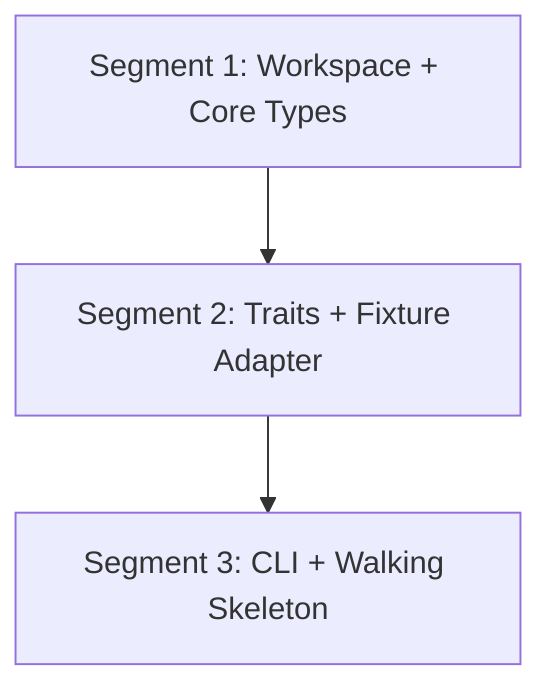

# Subsection 1: Foundation & Core Model -- Manifest

## Dependency Diagram

All segments are strictly sequential. No parallelization is possible at the segment level because each depends on the types and traits from its predecessor.

## Segment Index

| # | Title | File | Depends On | Risk | Complexity | Status |
|---|-------|------|------------|------|------------|--------|
| 1 | Workspace Skeleton + Core Types + Error Convention | segments/01-workspace-core-types.md | None | 2/10 | Low | pending |
| 2 | Core Traits + JSON Fixture Adapter | segments/02-traits-fixture-adapter.md | 1 | 3/10 | Medium | pending |
| 3 | CLI Skeleton + Walking Skeleton Integration | segments/03-cli-walking-skeleton.md | 2 | 3/10 | Medium | pending |

## Parallelization

All 3 segments are strictly sequential. No parallelization possible.

## Preamble Injection

Before launching any builder subagent, the orchestration agent assembles the prompt:
1. Read `iterative-builder-prompt.mdc` from `.cursor/rules/`
2. Read the segment file from `segments/{NN}-{slug}.md`

Assembled prompt = [preamble contents] + [segment file contents]

**Important:** This project runs directly on the host machine using standard `cargo` commands. The `devcontainer-exec.mdc` rule does NOT apply. All build/test commands run natively.

## Execution Instructions

For each segment in order (1, 2, 3), launch an iterative-builder subagent with the full segment brief as the prompt. After all segments pass, run deep-verify.
