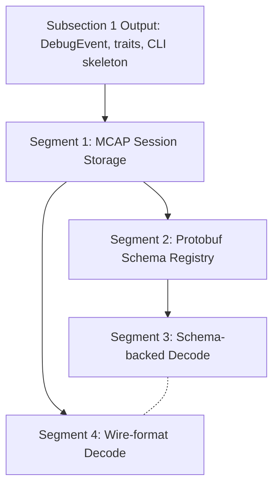

# Storage & Schema Engine -- Deep Plan

**Goal:** Decompose Subsection 2 (Storage & Schema Engine) into implementation-level segments with verified library choices, concrete APIs, and builder-ready handoff contracts.
**Generated:** 2026-03-08
**Rules version:** 2026-03-08
**Entry point:** B (Enrich Existing Plan)
**Status:** Planning
**Parent plan:** `.cursor/plans/universal-message-debugger-phase1-2026-03-08.md` (Subsection 2)

---

## Overview

This deep plan expands Subsection 2 of the Universal Message Debugger Phase 1 plan into 4 vertical-slice segments. Research verified that all primary library choices (mcap v0.24.0, prost-reflect v0.16.3, protox v0.9.1) are sound. Five new issues were identified beyond the original Issue 6 (schema-less decode scoping): the DebugEvent-to-MCAP mapping is unspecified, schema session self-containment is undefined, the `protobuf-decode` crate referenced in the plan does not exist, wire-format ambiguities are broader than stated, and runtime .proto compilation deserves first-class support. Segments are ordered by dependency: MCAP storage first, then schema registry, then schema-backed and wire-format decode in parallel. Execution follows dependency-order strategy with parallelization of the final two segments.

---

## Dependency Diagram



Segments 3 and 4 are independent and can run as parallel iterative-builder subagents.

---

## Research Verification Summary

| Claim in Parent Plan | Status | Detail |
|---|---|---|
| mcap v0.24.0+ | Correct | v0.24.0 is current; 5.6M downloads; sync API; protobuf schema support via encoding="protobuf" with FileDescriptorSet bytes |
| prost-reflect v0.16.3, actively maintained | Correct | 16.5M downloads/90d; DynamicMessage::decode(descriptor, buf) works for runtime decode; DescriptorPool::decode() loads FileDescriptorSets |
| protox for .proto compilation | Correct | v0.9.1; pure Rust; no protoc dependency; Compiler API returns DescriptorPool or FileDescriptorSet |
| prost, prost-types | Correct | v0.14.3 / v0.14.x; prost-reflect depends on prost ^0.14.0 |
| protobuf-decode crate for schema-less decode | INCORRECT | Crate does not exist on crates.io. Closest alternatives: protobin (v0.6.0, active, zero-copy wire primitives), decode_raw (v0.2.0, unmaintained since 2022), anybuf (v1.0.0, no fixed-length types) |
| Wire type 2 ambiguity | Partially correct | Type 2 ambiguity verified. Additional ambiguities found: type 0 (signed vs unsigned vs bool vs enum), type 1 (fixed64 vs sfixed64 vs double), type 5 (fixed32 vs sfixed32 vs float) |
| ~200 lines for custom decoder | Correct | 200-350 lines is realistic for a complete implementation with heuristics |

---

## Issue Analysis Briefs

### Issue S2-1: DebugEvent-to-MCAP Mapping Unspecified

**Core Problem:**
The parent plan says "events written to MCAP, readable later" but never specifies how DebugEvents map to MCAP's channel/schema/message model. MCAP requires each message to belong to a channel, each channel to reference a schema, and each message to carry raw bytes in the channel's declared encoding. Without this mapping, the storage layer cannot be implemented.

**Root Cause:**
The parent plan defines the storage format (MCAP) and the event model (DebugEvent) but does not bridge the gap between them.

**Proposed Fix:**
Define the mapping as follows:

- **Message encoding:** `"json"` -- DebugEvents are serialized via serde_json. JSON is human-readable, works with Foxglove Studio for visualization, and avoids bootstrapping a protobuf schema for the tool's own internal types.
- **Channel strategy:** One channel per (source_type, source_identifier) pair. For example, a gRPC capture from a specific connection gets its own channel. Fixture data gets a "fixture" channel. This groups related events for efficient reading.
- **Schema:** Optional for Phase 1. The JSON encoding does not strictly require a schema in MCAP. If desired later, a JSON Schema for DebugEvent can be added.
- **Message headers:** `log_time` = DebugEvent timestamp (nanoseconds since epoch). `publish_time` = ingest time. `sequence` = monotonic counter per channel.
- **Session metadata:** Stored as MCAP Metadata records with name="session_info" containing: source file path, capture tool, ingest timestamp, tool version, and command-line arguments.

API sketch:

```rust
pub struct SessionWriter<W: Write + Seek> {
    writer: mcap::write::Writer<W>,
    channels: HashMap<ChannelKey, u16>,
    sequence: HashMap<u16, u32>,
}

impl<W: Write + Seek> SessionWriter<W> {
    pub fn new(writer: W, metadata: SessionMetadata) -> Result<Self>;
    pub fn write_event(&mut self, event: &DebugEvent) -> Result<()>;
    pub fn finish(self) -> Result<()>;
}

pub struct SessionReader { /* memory-mapped MCAP */ }

impl SessionReader {
    pub fn open(path: &Path) -> Result<Self>;
    pub fn events(&self) -> impl Iterator<Item = Result<DebugEvent>>;
    pub fn metadata(&self) -> Result<SessionMetadata>;
    pub fn channels(&self) -> Vec<ChannelInfo>;
}
```

**Existing Solutions Evaluated:**
N/A -- internal design decision about how to map our event model to the MCAP container. MCAP's schema registry spec (mcap.dev/spec/registry) defines the conventions for protobuf, JSON, and other encodings. We follow those conventions.

**Alternatives Considered:**

- Protobuf encoding for DebugEvents (define a .proto for DebugEvent, compile at build time). Rejected for Phase 1: adds build-time protobuf compilation, makes debugging the debugger's own storage harder, and Foxglove would need the .proto to visualize. JSON is simpler for Phase 1; protobuf encoding can be added as an optimization in a later phase.
- MessagePack/bincode encoding. Rejected: not recognized by MCAP ecosystem tools (Foxglove, mcap CLI). Loses human readability.

**Pre-Mortem -- What Could Go Wrong:**

- JSON serialization is slower than binary formats. For large sessions (1M+ events), ingest time may be dominated by serde_json. Mitigation: benchmark and add a `--encoding` flag later.
- Channel-per-source creates many channels in sessions with many connections. MCAP handles this fine (the format supports 65535 channels), but readers must handle the proliferation.
- Memory-mapped reading requires the full file to be accessible. Very large MCAP files may exceed available address space on 32-bit targets (not a concern for the Linux+macOS 64-bit target).

**Risk Factor:** 4/10

**Evidence for Optimality:**

- External evidence: MCAP's format registry (mcap.dev/spec/registry) defines JSON as a supported message encoding with well-defined semantics.
- External evidence: Foxglove Studio, the primary MCAP visualization tool, supports JSON-encoded messages natively.

**Blast Radius:**

- Direct changes: new `prb-storage` crate (SessionWriter, SessionReader, SessionMetadata)
- Potential ripple: CLI commands (`prb ingest` output path, `prb inspect` input path)

---

### Issue S2-2: Schema Storage and Session Self-Containment

**Core Problem:**
The plan says "schema storage" but does not specify whether protobuf schemas are stored inside MCAP session files (making them self-contained and shareable) or kept as external files that must accompany the session. For a debug tool, self-contained sessions are critical: users share session files with teammates, and broken external references make sessions useless.

**Root Cause:**
The plan treats schema loading and session storage as orthogonal concerns, but they are tightly coupled: a session without its schemas cannot decode protobuf payloads.

**Proposed Fix:**
Store schemas inside MCAP sessions using MCAP's native schema mechanism:

- When a user loads schemas (via `prb schemas load foo.desc` or `prb schemas load foo.proto`), the schemas are registered in the SchemaRegistry.
- When writing a session, all schemas from the registry that were used during decode are stored as MCAP Schema records with `encoding="protobuf"` and `data=FileDescriptorSet bytes`.
- When reading a session, the reader extracts MCAP Schema records and populates the SchemaRegistry automatically. No external .desc files needed.
- Channels that carry protobuf-encoded application payloads (after Phase 3/4 decoders extract them) reference these schemas by ID.

This means sessions are fully self-contained: open the .mcap file, and all schemas needed to decode its contents are embedded.

Additionally, support a `prb schemas export session.mcap` command that extracts stored schemas for reuse.

**Existing Solutions Evaluated:**
N/A -- internal design decision. MCAP's spec explicitly supports this pattern: schemas are first-class records in the MCAP format (mcap.dev/spec, Section "Schema").

**Alternatives Considered:**

- Store schemas as MCAP Attachments instead of Schema records. Rejected: Schema records are the semantically correct mechanism and integrate with MCAP readers/viewers. Attachments are for arbitrary files.
- Store schemas externally in a sidecar file (e.g., session.mcap.schemas). Rejected: breaks self-containment and creates a coupling between files.

**Pre-Mortem -- What Could Go Wrong:**

- Embedding full FileDescriptorSets (with all imports) can be large (100KB+ for complex service definitions). For sessions with many schemas, this adds overhead. Mitigation: deduplicate schemas by content hash.
- Schema version conflicts: a session might embed schema version A, but the user's current .proto files are version B. The session should always use its embedded schemas for consistency, with an override flag for reinterpretation.

**Risk Factor:** 3/10

**Evidence for Optimality:**

- External evidence: MCAP's format specification defines Schema records specifically for this purpose, with encoding and data fields designed to hold FileDescriptorSets.
- Existing solutions: Foxglove Studio reads schemas from MCAP Schema records to decode protobuf messages, confirming this is the intended usage pattern.

**Blast Radius:**

- Direct changes: SessionWriter (schema embedding), SessionReader (schema extraction), SchemaRegistry (MCAP integration)
- Potential ripple: `prb inspect` (auto-loads schemas from session)

---

### Issue S2-3: protobuf-decode Crate Reference Incorrect

**Core Problem:**
The parent plan's Issue 6 references `protobuf-decode (crates.io)` as an existing crate for heuristic protobuf decoding. This crate does not exist on crates.io. The builder would waste cycles searching for a nonexistent dependency.

**Root Cause:**
Library name was likely confused with `protoc --decode_raw` (the protoc subcommand for schema-less decode) or hallucinated during planning.

**Proposed Fix:**
Correct the parent plan's Issue 6 to reference the actual alternatives found on crates.io:

- `protobin` (v0.6.0, crates.io, actively maintained, last release 2026-02-07) -- zero-copy wire-format primitives with MsgDecoder, supports all wire types, no dependencies. Provides the parsing layer but not heuristic disambiguation.
- `decode_raw` (v0.2.0, crates.io, unmaintained since 2022) -- heuristic schema-less decoding built on protofish. Shows the pattern but is not suitable as a dependency.
- `anybuf` (v1.0.0, crates.io, 2025-06-01) -- schema-less Bufany decoder, but does not support fixed-length types or packed encoding.

Recommendation unchanged: build a custom wire-format decoder (~200-350 lines). The wire format is simple enough that a dependency is not justified, and existing crates either lack heuristic logic (protobin) or are unmaintained (decode_raw).

However, `protobin` is worth noting as a fallback: if the custom implementation proves problematic, protobin's MsgDecoder can serve as the parsing foundation.

**Existing Solutions Evaluated:**
See above -- protobin, decode_raw, anybuf all evaluated. None fully solve the problem.

**Alternatives Considered:**

- Adopt protobin and build heuristics on top. Evaluated but not recommended: protobin provides ~50 lines worth of parsing logic. A custom implementation avoids the dependency and gives full control over error recovery.

**Pre-Mortem -- What Could Go Wrong:**

- A builder agent reading the uncorrected parent plan would search for `protobuf-decode` on crates.io, not find it, and waste cycles. This correction prevents that.

**Risk Factor:** 1/10

**Evidence for Optimality:**

- Existing solutions: Direct verification on crates.io confirms no crate named `protobuf-decode` exists. `protobin` is the closest active alternative.
- External evidence: `protoc --decode_raw` is the canonical tool for this task, confirming the custom-build approach.

**Blast Radius:**

- Direct changes: parent plan Issue 6 text correction
- Potential ripple: none (no code yet)

---

### Issue S2-4: Wire-Format Ambiguities Broader Than Stated

**Core Problem:**
The parent plan's Issue 6 states: "wire type 2 (length-delimited) is used for strings, bytes, nested messages, and packed repeated fields. Without a schema, these are indistinguishable." This is correct but incomplete. The protobuf wire format has disambiguation problems across all data-carrying wire types:

- **Wire type 0 (VARINT):** int32, int64, uint32, uint64, sint32, sint64, bool, and enum all use varints. sint32/sint64 use ZigZag encoding; others use raw varints. Without a schema, you cannot distinguish signed from unsigned, or bool from integer.
- **Wire type 1 (I64):** fixed64, sfixed64, and double all use 8-byte little-endian. Same bits, three possible interpretations.
- **Wire type 5 (I32):** fixed32, sfixed32, and float all use 4-byte little-endian. Same bits, three possible interpretations.

**Root Cause:**
The plan focused on the most visible ambiguity (type 2) and overlooked the numeric type ambiguities.

**Proposed Fix:**
The wire-format decoder must handle all ambiguities:

- **Wire type 0:** Display as both unsigned and signed (ZigZag-decoded) values. If value is 0 or 1, also note it could be bool.
- **Wire type 1:** Display as uint64, int64 (signed reinterpretation), and f64 (IEEE 754). Let the user decide which interpretation is correct.
- **Wire type 2:** Heuristic cascade as planned: try sub-message -> try UTF-8 string -> hex dump. Add recursion depth limit of 64.
- **Wire type 5:** Display as uint32, int32 (signed reinterpretation), and f32 (IEEE 754).

Output format should show the "most likely" interpretation prominently with alternatives in parentheses:

```
field 1: 150 (varint; also: sint=-75, bool=N/A)
field 2: "hello world" (string; 11 bytes)
field 3: {nested message} (1 field parsed)
field 4: 3.14 (float; also: fixed32=1078523331)
```

**Existing Solutions Evaluated:**
N/A -- internal design decision about output formatting and heuristic logic.

**Alternatives Considered:**

- Show only one interpretation per wire type (e.g., always unsigned for varints). Rejected: loses information that could help the user identify the correct type.
- Show all interpretations with equal weight. Rejected: too noisy. A primary interpretation with alternatives in parentheses balances completeness and readability.

**Pre-Mortem -- What Could Go Wrong:**

- Multi-interpretation output is confusing for users unfamiliar with protobuf wire format. Mitigation: clear documentation and a `--raw` flag that shows only wire types and hex values.
- f64/f32 display of integer values produces nonsensical floating-point numbers. Mitigation: only show float interpretation if the value is a plausible float (not NaN, not denormalized, not extremely large).

**Risk Factor:** 2/10

**Evidence for Optimality:**

- External evidence: The protobuf encoding specification (developers.google.com/protocol-buffers/docs/encoding) documents all five wire types and their ambiguities.
- External evidence: `protoc --decode_raw` shows only varints and raw bytes, without multi-interpretation display. Our approach is strictly more informative.

**Blast Radius:**

- Direct changes: wire-format decoder output formatting
- Potential ripple: CLI display formatting, documentation

---

### Issue S2-5: Runtime .proto Compilation Path Under-Emphasized

**Core Problem:**
The parent plan's Subsection 2 says "descriptor set loading, message lookup" for the schema subsystem. This implies users must pre-compile .proto files into .desc files using `protoc --descriptor_set_out`. However, `protox` (already listed as a dependency) enables runtime .proto compilation without protoc. This is a major UX improvement that deserves first-class support.

**Root Cause:**
The plan lists protox as a dependency but describes the schema workflow in terms of pre-compiled descriptor sets only.

**Proposed Fix:**
Support two schema loading paths with equal prominence:

1. **Pre-compiled descriptors:** `prb schemas load service.desc` -- loads a binary FileDescriptorSet produced by protoc or protox CLI.
2. **Raw .proto files:** `prb schemas load service.proto --include-path ./protos/` -- compiles .proto files at runtime using protox's Compiler API, resolving imports from the specified include paths. No protoc installation required.

The protox Compiler API:

```rust
let fds = protox::Compiler::new(include_paths)?
    .open_files(proto_files)?
    .file_descriptor_set();
```

The SchemaRegistry accepts both paths and normalizes them into a DescriptorPool:

```rust
impl SchemaRegistry {
    pub fn load_descriptor_set(&mut self, bytes: &[u8]) -> Result<()>;
    pub fn load_proto_files(
        &mut self,
        files: &[&Path],
        includes: &[&Path],
    ) -> Result<()>;
}
```

**Existing Solutions Evaluated:**

- `protox` (v0.9.1, crates.io, same author as prost-reflect, 3.7M downloads/90d, actively maintained) -- pure Rust protobuf compiler. Handles imports, dependencies, and well-known types. Produces FileDescriptorSet compatible with prost-reflect's DescriptorPool. Adopted.
- `protobuf-parse` (v3.7.2, crates.io, 5.9M downloads/90d) -- parses .proto files but belongs to the rust-protobuf ecosystem, not prost. Rejected: ecosystem mismatch.

**Alternatives Considered:**

- Require protoc installation for .proto compilation. Rejected: adds a heavyweight external dependency (protoc binary, system package), hurts cross-platform UX, and is unnecessary given protox.
- Support only .desc files. Rejected: forces users through a two-step workflow (compile then load) when a one-step workflow (load .proto directly) is possible.

**Pre-Mortem -- What Could Go Wrong:**

- protox may not support all protobuf language features (e.g., editions, custom options). Mitigation: document supported proto2/proto3 features and fall back to .desc loading for unsupported features.
- Import resolution may fail if include paths are not correctly specified. Mitigation: clear error messages naming the missing import and the searched paths.
- protox compilation adds latency (~100ms for typical schemas). Mitigation: cache compiled DescriptorPools; schemas rarely change during a debug session.

**Risk Factor:** 2/10

**Evidence for Optimality:**

- Existing solutions: protox is pure Rust, actively maintained by the prost-reflect author, and produces DescriptorPool directly -- zero impedance mismatch.
- External evidence: The trend in Rust protobuf tooling is toward removing protoc as a dependency (prost-build supports protox as a backend, tonic-build supports protox).

**Blast Radius:**

- Direct changes: SchemaRegistry (new load_proto_files method), CLI (prb schemas load accepts .proto files)
- Potential ripple: documentation, user-facing error messages

---

## Segment Briefs

### Segment 1: MCAP Session Storage Layer

> **Execution method:** Launch as an `iterative-builder` subagent (Task tool, subagent_type="generalPurpose"). The orchestration agent reads and prepends `iterative-builder-prompt.mdc` and `devcontainer-exec.mdc` at launch time per `orchestration-protocol.mdc`.

**Goal:** Implement the MCAP-backed storage layer that writes and reads DebugEvent sessions, replacing the transient in-memory pipeline from Subsection 1 with persistent file-backed sessions.

**Depends on:** Subsection 1 complete (DebugEvent type, CaptureAdapter trait, error conventions, CLI skeleton with `prb ingest` and `prb inspect` for fixtures)

**Issues addressed:** Issue S2-1 (DebugEvent-to-MCAP mapping), Issue S2-2 (schema storage and session self-containment -- storage side only)

**Cycle budget:** 15 cycles (Medium complexity)

**Scope:**

- New crate: `crates/storage/` (prb-storage)
- Modified: `crates/cli/` (prb-cli -- add --output to ingest, update inspect to read MCAP)

**Key files and context:**

Subsection 1 produces:

- `crates/core/src/event.rs` -- DebugEvent struct with serde Serialize/Deserialize
- `crates/core/src/traits.rs` -- CaptureAdapter, SchemaResolver, EventNormalizer traits
- `crates/core/src/error.rs` -- thiserror-based error types
- `crates/cli/src/main.rs` -- clap-based CLI with `ingest` and `inspect` subcommands
- `Cargo.toml` workspace root

MCAP Rust API (v0.24.0):

- Writer: `mcap::write::Writer<W: Write + Seek>` with `add_schema()`, `add_channel()`, `write_to_known_channel()`, `write_metadata()`, `finish()`
- Reader: `mcap::MessageStream::new(&mapped_bytes)` returns Iterator of Messages with channel and schema info
- Schema: `{ name: String, encoding: String, data: Cow<[u8]> }`
- Channel: references schema by ID, has topic name and message_encoding
- Metadata: `{ name: String, metadata: BTreeMap<String, String> }`
- Memory-mapped reading is the standard pattern (mmap the file, pass to MessageStream)

Design decisions:

- Message encoding = "json" (serde_json serialization of DebugEvent)
- Channel strategy = one channel per (source_type, source_id)
- Message header: log_time = event timestamp nanos, publish_time = ingest time nanos, sequence = monotonic per channel
- Session metadata = MCAP Metadata record "session_info" with source_file, capture_tool, ingest_timestamp, tool_version
- Compression = zstd (MCAP default feature), configurable via WriteOptions

**Implementation approach:**

1. Create `crates/storage/` crate with deps: `mcap = "0.24"`, `serde_json`, plus workspace deps (prb-core, thiserror, tracing, bytes, camino).
2. Implement `SessionWriter<W: Write + Seek>`:
   - Constructor takes a writer and SessionMetadata. Writes metadata record immediately.
   - `write_event(&mut self, event: &DebugEvent)` -- looks up or creates channel for event's source, serializes event to JSON bytes, writes via `write_to_known_channel`.
   - `finish(self)` -- finalizes the MCAP file.
3. Implement `SessionReader`:
   - `open(path: &Path)` -- mmap the file, validate MCAP magic bytes.
   - `events(&self) -> impl Iterator<Item = Result<DebugEvent>>` -- wraps MessageStream, deserializes JSON.
   - `metadata(&self)` -- reads Metadata record "session_info".
   - `channels(&self)` -- list channels with event counts.
4. Extend CLI:
   - `prb ingest` gains `--output <path.mcap>` flag. When provided, writes events to MCAP instead of (or in addition to) stdout.
   - `prb inspect <path.mcap>` reads from MCAP file instead of re-ingesting.
   - `prb inspect` without a path continues to work with piped/fixture input (backward compat).
5. Write tests using tempfile for MCAP round-trip (write events, read them back, assert equality).

**Alternatives ruled out:**

- Protobuf encoding for DebugEvents: adds build-time protobuf compilation, makes debugging harder. JSON is appropriate for Phase 1.
- MessagePack/bincode: not recognized by MCAP ecosystem tools (Foxglove).
- Store schemas as attachments instead of Schema records: Schema records are semantically correct and integrate with MCAP viewers.

**Pre-mortem risks:**

- JSON serialization may be slow for large sessions. Write a benchmark as part of exit criteria.
- Channel proliferation: a capture with 1000 connections creates 1000 channels. Verify MCAP handles this.
- Memory-mapped reads fail if the file is being written concurrently. SessionReader must require the file to be finalized.

**Segment-specific commands:**

- Build: `cargo build -p prb-storage`
- Test (targeted): `cargo nextest run -p prb-storage`
- Test (regression): `cargo nextest run -p prb-core -p prb-fixture -p prb-cli`
- Test (full gate): `cargo nextest run --workspace`

**Exit criteria:**

All of the following must be satisfied:

1. **Targeted tests:**
   - `test_session_roundtrip`: write 100 DebugEvents, read back, assert all fields match including timestamps.
   - `test_session_metadata`: write session with metadata, read metadata back, assert values match.
   - `test_multi_channel`: write events from 3 different sources, verify 3 channels created, events correctly partitioned.
   - `test_empty_session`: create and finalize an empty session, verify it can be read without error.
   - `test_large_session`: write 10,000 events, read back, verify count and ordering preserved.
   - `test_cli_ingest_output`: run `prb ingest fixture.json --output out.mcap`, verify .mcap file is valid.
   - `test_cli_inspect_mcap`: run `prb inspect session.mcap`, verify events are printed to stdout.
2. **Regression tests:** All Subsection 1 tests pass (prb-core, prb-fixture, prb-cli existing tests).
3. **Full build gate:** `cargo build --workspace`
4. **Full test gate:** `cargo nextest run --workspace`
5. **Self-review gate:** No dead code, no commented-out blocks, no TODO hacks, no changes outside stated scope.
6. **Scope verification gate:** Changed files are in `crates/storage/`, `crates/cli/`, and `Cargo.toml` (workspace). No other crates modified.

**Risk factor:** 4/10

**Estimated complexity:** Medium

**Commit message:**
`feat(storage): add MCAP session storage with read/write support`

---

### Segment 2: Protobuf Schema Registry

> **Execution method:** Launch as an `iterative-builder` subagent (Task tool, subagent_type="generalPurpose"). The orchestration agent reads and prepends `iterative-builder-prompt.mdc` and `devcontainer-exec.mdc` at launch time per `orchestration-protocol.mdc`.

**Goal:** Implement the protobuf schema registry that loads, stores, and resolves message types from both pre-compiled descriptor sets and raw .proto files.

**Depends on:** Segment 1 (MCAP storage layer for schema embedding in sessions)

**Issues addressed:** Issue S2-2 (schema session self-containment -- registry side), Issue S2-5 (runtime .proto compilation)

**Cycle budget:** 15 cycles (Medium complexity)

**Scope:**

- New crate: `crates/schema/` (prb-schema)
- Modified: `crates/storage/` (schema embedding/extraction in MCAP sessions)
- Modified: `crates/cli/` (add `prb schemas` subcommand)

**Key files and context:**

Subsection 1 produces:

- `crates/core/src/traits.rs` -- `SchemaResolver` trait. Expected signature: `fn resolve(&self, type_name: &str) -> Option<SchemaInfo>` where SchemaInfo contains encoding, name, and raw descriptor bytes.
- `crates/core/src/error.rs` -- thiserror error types.

Segment 1 produces:

- `crates/storage/src/writer.rs` -- SessionWriter with `add_schema()` support via MCAP Schema records.
- `crates/storage/src/reader.rs` -- SessionReader with schema extraction from MCAP Schema records.

Key library APIs:

prost-reflect (v0.16.3):

- `DescriptorPool::decode(bytes)` -- load from serialized FileDescriptorSet
- `DescriptorPool::from_file_descriptor_set(fds)` -- load from in-memory FDS
- `pool.add_file_descriptor_set(fds)` -- add more descriptors to existing pool
- `pool.get_message_by_name("pkg.MessageName")` -- lookup by FQN
- `pool.all_messages()` -- iterate all known message types

protox (v0.9.1):

- `protox::compile(files, includes)` -- compile .proto files to FileDescriptorSet
- `Compiler::new(includes)?.open_files(files)?.file_descriptor_set()` -- more control
- `Compiler::new(includes)?.open_files(files)?.descriptor_pool()` -- get DescriptorPool directly
- Pure Rust, no protoc dependency. Handles imports and well-known types.

MCAP Schema convention for protobuf:

- encoding = "protobuf"
- name = fully qualified message name (e.g., "foo.bar.MyMessage")
- data = binary FileDescriptorSet (with --include_imports)

**Implementation approach:**

1. Create `crates/schema/` crate with deps: `prost-reflect = "0.16"`, `protox = "0.9"`, `prost-types`, plus workspace deps (prb-core, thiserror, tracing, camino).
2. Implement `SchemaRegistry` struct wrapping prost-reflect's DescriptorPool:
   ```rust
   pub struct SchemaRegistry {
       pool: DescriptorPool,
       loaded_sets: Vec<Vec<u8>>, // raw FDS bytes for MCAP embedding
   }
   ```
3. Loading methods:
   - `load_descriptor_set(&mut self, bytes: &[u8])` -- decode and add to pool. Store raw bytes for later MCAP embedding.
   - `load_descriptor_set_file(&mut self, path: &Path)` -- read file, delegate to load_descriptor_set.
   - `load_proto_files(&mut self, files: &[&Path], includes: &[&Path])` -- compile via protox, encode result to bytes, delegate to load_descriptor_set.
4. Query methods:
   - `get_message(&self, fqn: &str) -> Option<MessageDescriptor>` -- delegate to pool.
   - `list_messages(&self) -> Vec<String>` -- collect all message FQNs.
   - `list_services(&self) -> Vec<String>` -- for gRPC discovery.
   - `descriptor_sets(&self) -> &[Vec<u8>]` -- raw bytes for MCAP embedding.
5. Implement the core `SchemaResolver` trait from prb-core for SchemaRegistry.
6. Integrate with SessionWriter: when finishing a session, embed all loaded schemas as MCAP Schema records.
7. Integrate with SessionReader: when opening a session, extract MCAP Schema records and populate a SchemaRegistry.
8. Add CLI subcommand `prb schemas`:
   - `prb schemas load <path>` -- accepts .desc or .proto files (detected by extension). For .proto, accepts `--include-path`.
   - `prb schemas list <session.mcap>` -- list message types in a session's embedded schemas.
   - `prb schemas export <session.mcap> --output schemas.desc` -- export embedded schemas.

**Alternatives ruled out:**

- Use the protobuf (rust-protobuf) crate instead of prost-reflect. Rejected: ecosystem mismatch with prost/tonic stack.
- Store schemas only externally. Rejected: breaks session self-containment.
- Support only .desc files (no protox). Rejected: poor UX forcing users to install and run protoc.

**Pre-mortem risks:**

- protox may fail on complex .proto files with unusual features (custom options, proto2 extensions). Write a test with a non-trivial .proto that uses imports and nested messages.
- DescriptorPool::decode may reject malformed descriptor sets silently. Test with truncated/corrupted .desc files.
- Schema embedding bloats MCAP files if many schemas are loaded but few are used. Consider tracking which schemas were actually referenced during the session.

**Segment-specific commands:**

- Build: `cargo build -p prb-schema`
- Test (targeted): `cargo nextest run -p prb-schema`
- Test (regression): `cargo nextest run -p prb-core -p prb-storage -p prb-cli`
- Test (full gate): `cargo nextest run --workspace`

**Exit criteria:**

All of the following must be satisfied:

1. **Targeted tests:**
   - `test_load_descriptor_set`: create a FileDescriptorSet programmatically (using prost-types), load it, verify message lookup by FQN succeeds.
   - `test_load_proto_file`: write a .proto file to tempdir, load via protox, verify message lookup succeeds.
   - `test_load_proto_with_imports`: write two .proto files (one imports the other), load the root, verify both message types are available.
   - `test_list_messages`: load a schema with 3 message types, verify list_messages returns all 3 FQNs.
   - `test_schema_roundtrip_mcap`: load schemas, write session with embedded schemas, read session, verify schemas are recovered and messages can be looked up.
   - `test_load_invalid_descriptor`: load garbage bytes as a descriptor set, verify a typed error is returned (not a panic).
   - `test_cli_schemas_load`: run `prb schemas load test.proto --include-path ./protos/`, verify success output.
   - `test_cli_schemas_list`: run `prb schemas list session.mcap`, verify message types are printed.
2. **Regression tests:** All Segment 1 tests and Subsection 1 tests pass.
3. **Full build gate:** `cargo build --workspace`
4. **Full test gate:** `cargo nextest run --workspace`
5. **Self-review gate:** No dead code, no commented-out blocks, no TODO hacks, no changes outside stated scope.
6. **Scope verification gate:** Changed files are in `crates/schema/`, `crates/storage/` (schema integration), `crates/cli/` (schemas subcommand), and `Cargo.toml`. No other crates modified beyond Cargo.toml dependency additions.

**Risk factor:** 4/10

**Estimated complexity:** Medium

**Commit message:**
`feat(schema): add protobuf schema registry with .proto and .desc loading`

---

### Segment 3: Schema-backed Protobuf Decode

> **Execution method:** Launch as an `iterative-builder` subagent (Task tool, subagent_type="generalPurpose"). The orchestration agent reads and prepends `iterative-builder-prompt.mdc` and `devcontainer-exec.mdc` at launch time per `orchestration-protocol.mdc`.

**Goal:** Implement protobuf message decoding using loaded schemas, producing structured human-readable output from raw protobuf bytes.

**Depends on:** Segment 2 (SchemaRegistry provides MessageDescriptor for decode)

**Issues addressed:** Original Issue 6 (the schema-backed decode path -- the "properly functioning" mode alongside wire-format decode)

**Cycle budget:** 10 cycles (Low complexity)

**Scope:**

- New crate: `crates/decode/` (prb-decode) -- or new module in existing crate
- Modified: `crates/cli/` (prb inspect shows decoded payloads)

**Key files and context:**

Segment 2 produces:

- `crates/schema/src/registry.rs` -- SchemaRegistry with `get_message(fqn) -> Option<MessageDescriptor>`
- MessageDescriptor is from prost-reflect and supports `DynamicMessage::decode(descriptor, bytes)`

prost-reflect DynamicMessage API:

- `DynamicMessage::decode(descriptor: MessageDescriptor, buf: impl Buf) -> Result<Self, DecodeError>`
- DynamicMessage implements Display for human-readable output
- DynamicMessage implements serde::Serialize for JSON output
- Fields accessed via `message.get_field_by_name("field")` returning a `Value` enum
- Nested messages, repeated fields, maps, oneofs all supported

DebugEvent has a payload field (raw bytes) and a type_name field (FQN of the protobuf message).

**Implementation approach:**

1. Create `crates/decode/` crate with deps: `prost-reflect`, plus workspace deps (prb-core, thiserror, tracing, bytes).
2. Implement schema-backed decode function:
   ```rust
   pub fn decode_with_schema(
       payload: &[u8],
       descriptor: &MessageDescriptor,
   ) -> Result<DecodedMessage, DecodeError>
   ```
   Where `DecodedMessage` wraps prost-reflect's DynamicMessage with display formatting.
3. Implement `DecodedMessage` display:
   - Tree-formatted output showing field names, types, and values
   - Nested messages indented
   - Repeated fields shown as lists
   - Bytes fields shown as hex with length
   - Enum fields shown as name (numeric value)
4. Integrate with `prb inspect`:
   - When inspecting events with protobuf payloads, attempt schema-backed decode if schemas are available.
   - If decode succeeds, show decoded fields instead of raw hex.
   - If decode fails (wrong schema, corrupted payload), show error and fall back to raw display.
   - Add `--decode-type <fqn>` flag to force a specific message type for decode.
5. Add JSON output mode: `prb inspect --format json` outputs DynamicMessage as JSON (via serde).

**Alternatives ruled out:**

- Use prost codegen (compile-time generated structs). Rejected: requires build-time protobuf compilation for user schemas; runtime decode via prost-reflect is the whole point.
- Use the protobuf (rust-protobuf) crate's reflect module. Rejected: ecosystem mismatch with prost.

**Pre-mortem risks:**

- DynamicMessage::decode may produce confusing errors for truncated or partially valid payloads. Wrap errors with context (payload size, expected message type).
- Performance of DynamicMessage decode is slower than compiled prost. For the inspect use case (human reads output), this is acceptable.
- prost-reflect's Display impl may not format output the way we want. If so, implement custom display logic.

**Segment-specific commands:**

- Build: `cargo build -p prb-decode`
- Test (targeted): `cargo nextest run -p prb-decode`
- Test (regression): `cargo nextest run -p prb-core -p prb-schema -p prb-storage -p prb-cli`
- Test (full gate): `cargo nextest run --workspace`

**Exit criteria:**

All of the following must be satisfied:

1. **Targeted tests:**
   - `test_decode_simple_message`: encode a known message with prost, decode with DynamicMessage, verify all fields match.
   - `test_decode_nested_message`: message with nested sub-messages, verify recursive decode.
   - `test_decode_repeated_fields`: message with repeated int32 and repeated string, verify list output.
   - `test_decode_enum_field`: message with enum field, verify name and numeric value shown.
   - `test_decode_wrong_schema`: attempt decode with mismatched schema, verify error (not panic).
   - `test_decode_truncated_payload`: decode truncated bytes, verify error with context.
   - `test_decode_json_output`: decode message, serialize to JSON, verify valid JSON with correct field names.
   - `test_cli_inspect_decoded`: ingest fixture with protobuf payload and schema, run `prb inspect`, verify decoded fields in output.
2. **Regression tests:** All prior segment and subsection tests pass.
3. **Full build gate:** `cargo build --workspace`
4. **Full test gate:** `cargo nextest run --workspace`
5. **Self-review gate:** No dead code, no commented-out blocks, no TODO hacks, no changes outside stated scope.
6. **Scope verification gate:** Changed files are in `crates/decode/`, `crates/cli/`, and `Cargo.toml`.

**Risk factor:** 3/10

**Estimated complexity:** Low

**Commit message:**
`feat(decode): add schema-backed protobuf decode with prost-reflect`

---

### Segment 4: Wire-format Protobuf Decode

> **Execution method:** Launch as an `iterative-builder` subagent (Task tool, subagent_type="generalPurpose"). The orchestration agent reads and prepends `iterative-builder-prompt.mdc` and `devcontainer-exec.mdc` at launch time per `orchestration-protocol.mdc`.

**Goal:** Implement best-effort protobuf wire-format decoding without schemas, with documented limitations and multi-interpretation output for ambiguous wire types.

**Depends on:** Segment 1 (MCAP storage for CLI integration). Independent of Segments 2 and 3.

**Issues addressed:** Issue S2-3 (corrected crate evaluation), Issue S2-4 (broader wire-format ambiguities), Original Issue 6 (schema-less decode scoping and limitations)

**Cycle budget:** 10 cycles (Low complexity)

**Scope:**

- New module in `crates/decode/` (if Segment 3 has created the crate) or new crate `crates/wire-decode/`
- Modified: `crates/cli/` (add --wire-format flag to inspect)

**Key files and context:**

Protobuf wire format (per developers.google.com/protocol-buffers/docs/encoding):

- Tag = (field_number << 3) | wire_type
- Wire type 0 (VARINT): variable-length integer. Used for int32, int64, uint32, uint64, sint32 (ZigZag), sint64 (ZigZag), bool, enum.
- Wire type 1 (I64): fixed 8 bytes. Used for fixed64, sfixed64, double.
- Wire type 2 (LEN): varint length + N bytes. Used for string, bytes, nested messages, packed repeated fields.
- Wire type 3 (SGROUP): deprecated group start marker.
- Wire type 4 (EGROUP): deprecated group end marker.
- Wire type 5 (I32): fixed 4 bytes. Used for fixed32, sfixed32, float.

Heuristic cascade for wire type 2 (ordered by specificity):

1. Try parsing as nested protobuf message (recursive). Accept if: at least one valid tag parsed, no trailing garbage, all wire types valid.
2. Try UTF-8 decode. Accept if: valid UTF-8, contains mostly printable characters (>80%).
3. Fall back to hex dump.

Recursion depth limit: 64 (consistent with protobuf library defaults).

Ambiguity display for other wire types:

- Type 0: show unsigned value, signed ZigZag-decoded value, bool interpretation (if 0 or 1)
- Type 1: show u64, i64, f64 (suppress f64 if NaN or subnormal)
- Type 5: show u32, i32, f32 (suppress f32 if NaN or subnormal)

Output format:

```
field 1: 150 (varint; also: sint=-75, bool=N/A)
field 2: {
  field 1: 42 (varint)
} (submessage; 1 field)
field 3: "hello world" (string; 11 bytes)
field 4: 0xdeadbeef... (bytes; 128 bytes)
```

**Implementation approach:**

1. Implement in `crates/decode/src/wire_format.rs` (~250-350 lines):
   - `pub fn decode_wire_format(bytes: &[u8]) -> Result<WireMessage, WireDecodeError>`
   - `WireMessage` contains a Vec of `WireField` structs.
   - `WireField` has field_number, wire_type, and `WireValue` enum.
   - `WireValue` variants: Varint(u64), Fixed64([u8; 8]), Fixed32([u8; 4]), LengthDelimited(WireLenValue).
   - `WireLenValue` enum: SubMessage(WireMessage), String(String), Bytes(Vec<u8>).
2. Implement varint decoder (standard LEB128).
3. Implement tag parser: extract field_number and wire_type from varint.
4. Implement heuristic cascade for LEN fields with recursion depth tracking.
5. Implement Display for WireMessage with multi-interpretation annotations.
6. Add `--wire-format` flag to `prb inspect` that shows wire-format decode instead of schema-backed decode.
7. Wire-format output must clearly state "WIRE FORMAT DECODE (best-effort, no schema)" at the top.

**Alternatives ruled out:**

- Use protobin crate for wire parsing. Evaluated: protobin provides MsgDecoder with zero-copy iteration, but the wire format parsing is ~50 lines of code. Adding a dependency for this is not justified. If implementation proves problematic, protobin is a known fallback.
- Use decode_raw crate. Rejected: unmaintained since 2022 (v0.2.0), depends on protofish.
- Use anybuf crate. Rejected: does not support fixed-length types (I32, I64) or packed repeated fields.

**Pre-mortem risks:**

- Heuristic cascade on random binary data may produce deeply nested false-positive sub-messages. The recursion depth limit (64) and "at least one valid tag" check mitigate this, but add a "confidence" indicator.
- UTF-8 heuristic may misidentify binary data that happens to be valid UTF-8. The printable-character ratio check (>80%) helps, but add a fallback display showing both interpretations.
- Infinite loops on malformed varints (MSB always set). Add a maximum varint length check (10 bytes per protobuf spec).

**Segment-specific commands:**

- Build: `cargo build -p prb-decode`
- Test (targeted): `cargo nextest run -p prb-decode`
- Test (regression): `cargo nextest run -p prb-core -p prb-storage -p prb-cli`
- Test (full gate): `cargo nextest run --workspace`

**Exit criteria:**

All of the following must be satisfied:

1. **Targeted tests:**
   - `test_wire_varint`: encode field 1 as varint 150, decode, verify field_number=1 and value=150.
   - `test_wire_string`: encode field 2 as string "hello", decode, verify detected as string.
   - `test_wire_nested_message`: encode a nested message, decode, verify sub-message parsed recursively.
   - `test_wire_bytes_fallback`: encode field 3 as random binary bytes, decode, verify falls back to hex.
   - `test_wire_fixed32_float`: encode field 4 as fixed32, decode, verify both u32 and f32 interpretations shown.
   - `test_wire_fixed64_double`: encode field 5 as fixed64, decode, verify both u64 and f64 interpretations shown.
   - `test_wire_recursion_limit`: create deeply nested (100 levels) message bytes, verify decode stops at depth 64 without panic.
   - `test_wire_malformed_varint`: create bytes with never-ending varint (all MSB set), verify error (not hang).
   - `test_wire_empty_input`: decode empty bytes, verify empty WireMessage (not error).
   - `test_wire_zigzag`: encode sint32 field, decode, verify both unsigned and ZigZag-decoded values shown.
   - `test_cli_inspect_wire_format`: run `prb inspect session.mcap --wire-format`, verify wire-format output for protobuf payloads.
2. **Regression tests:** All prior segment and subsection tests pass.
3. **Full build gate:** `cargo build --workspace`
4. **Full test gate:** `cargo nextest run --workspace`
5. **Self-review gate:** No dead code, no commented-out blocks, no TODO hacks, no changes outside stated scope.
6. **Scope verification gate:** Changed files are in `crates/decode/` (wire_format module), `crates/cli/`, and `Cargo.toml`.

**Risk factor:** 3/10

**Estimated complexity:** Low

**Commit message:**
`feat(decode): add wire-format protobuf decode with heuristic disambiguation`

---

## Parallelization Opportunities

Segments 3 (Schema-backed Decode) and 4 (Wire-format Decode) are independent of each other:

- Segment 3 depends on Segment 2 (needs SchemaRegistry) but not Segment 4.
- Segment 4 depends on Segment 1 (needs MCAP storage for CLI integration) but not Segments 2 or 3.

These can be launched as parallel iterative-builder subagents after their respective dependencies complete. Since Segment 4 only depends on Segment 1, it can start as soon as Segment 1 finishes -- it does not need to wait for Segment 2.

Optimal execution timeline:

```
Time  -->
[--- Segment 1 ---]
                   [--- Segment 2 ---][--- Segment 4 ---]
                                      [--- Segment 3 ---]
```

Segment 4 starts in parallel with Segment 2. Segment 3 starts after Segment 2 completes and can run in parallel with Segment 4 if 4 is still running.

---

## Execution Instructions

To execute this plan, switch to Agent Mode. For each segment in execution order:

1. Launch Segment 1 as an `iterative-builder` subagent with the full segment brief as the prompt.
2. After Segment 1 passes all exit gates, commit with the specified message.
3. Launch Segment 2 and Segment 4 in parallel as iterative-builder subagents.
4. After Segment 2 passes all exit gates, commit and launch Segment 3.
5. After Segments 3 and 4 both pass all exit gates, commit.
6. Run `deep-verify` against this plan file.
7. If verification finds gaps, re-enter `deep-plan` on the unresolved items.

Do not implement segments directly -- always delegate to iterative-builder subagents. The orchestration agent reads and prepends `iterative-builder-prompt.mdc` and `devcontainer-exec.mdc` at launch time per `orchestration-protocol.mdc`.

---

## Main Plan Updates Required

The following changes should be applied to the parent plan's Subsection 2 description and Issue 6 brief when switching to Agent Mode:

**Subsection 2 description updates:**

- Add "runtime .proto compilation via protox" to scope description
- Add "Schema self-containment: schemas stored within MCAP sessions" to "What this establishes"
- Add "DebugEvents serialized as JSON to MCAP channels" to "What this establishes"
- Add deep plan reference and segment count (4 segments, 2 parallelizable)
- Update "When to deep-plan" to "Complete"

**Issue 6 corrections:**

- Replace `protobuf-decode (crates.io)` with `protobin (crates.io, v0.6.0, actively maintained)` and note that it provides wire-format primitives but not heuristic disambiguation
- Add `decode_raw (v0.2.0, unmaintained since 2022)` and `anybuf (v1.0.0, no fixed-type support)` as evaluated alternatives
- Add paragraph noting wire type 0, 1, and 5 ambiguities in addition to type 2

---

## Total Estimated Scope

- **Segments:** 4
- **Estimated overall complexity:** Medium (2 Medium + 2 Low segments)
- **Total cycle budget:** 50 cycles (15 + 15 + 10 + 10)
- **Total risk budget:** 14/40 (4 + 4 + 3 + 3) -- well within acceptable range
- **Segments at risk 8+:** 0 (no risk budget concern)
- **Parallelizable segments:** 2 (Segments 3 and 4)
- **New crates introduced:** 2 (prb-storage, prb-schema) plus decode module
- **New CLI commands:** `prb schemas load`, `prb schemas list`, `prb schemas export`
- **New CLI flags:** `--output` (ingest), `--wire-format` (inspect), `--decode-type` (inspect), `--format json` (inspect), `--include-path` (schemas load)

---

## Execution Log

| Segment | Est. Complexity | Risk | Cycles Used | Status | Notes |
|---------|----------------|------|-------------|--------|-------|
| 1: MCAP Session Storage | Medium | 4/10 | -- | -- | -- |
| 2: Protobuf Schema Registry | Medium | 4/10 | -- | -- | -- |
| 3: Schema-backed Decode | Low | 3/10 | -- | -- | -- |
| 4: Wire-format Decode | Low | 3/10 | -- | -- | -- |

**Deep-verify result:** --
**Follow-up plans:** --
