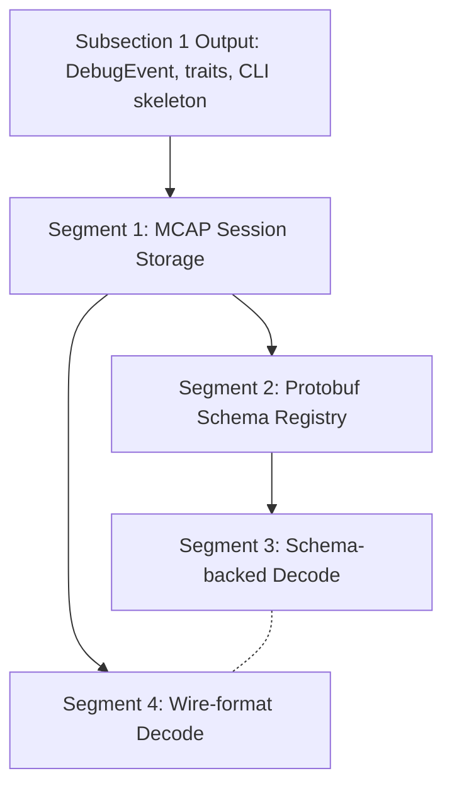

# Subsection 2: Storage & Schema Engine -- Manifest

## Dependency Diagram



Segments 3 and 4 are independent and can run as parallel iterative-builder subagents.

## Segment Index

| # | Title | File | Depends On | Risk | Complexity | Status |
|---|-------|------|------------|------|------------|--------|
| 1 | MCAP Session Storage Layer | segments/01-mcap-session-storage.md | None | 4/10 | Medium | pending |
| 2 | Protobuf Schema Registry | segments/02-protobuf-schema-registry.md | 1 | 4/10 | Medium | pending |
| 3 | Schema-backed Protobuf Decode | segments/03-schema-backed-decode.md | 2 | 3/10 | Low | pending |
| 4 | Wire-format Protobuf Decode | segments/04-wire-format-decode.md | 1 | 3/10 | Low | pending |

## Parallelization

Segments 3 and 4 are independent and can run in parallel after their respective dependencies.
- Segment 4 can start as soon as Segment 1 finishes (does not need Segment 2).
- Segment 3 starts after Segment 2 completes.

Optimal execution timeline:
```
Time  -->
[--- Segment 1 ---]
                   [--- Segment 2 ---][--- Segment 4 ---]
                                      [--- Segment 3 ---]
```

## Preamble Injection

Before launching any builder subagent, the orchestration agent assembles the prompt:
1. Read `iterative-builder-prompt.mdc` from `.cursor/rules/`
2. Read `devcontainer-exec.mdc` from `.cursor/rules/` (if applicable)
3. Read the segment file from `segments/{NN}-{slug}.md`

Assembled prompt = [preamble contents] + [segment file contents]

## Execution Instructions

1. Launch Segment 1 as an iterative-builder subagent with the full segment brief as the prompt.
2. After Segment 1 passes all exit gates, commit with the specified message.
3. Launch Segment 2 and Segment 4 in parallel as iterative-builder subagents.
4. After Segment 2 passes all exit gates, commit and launch Segment 3.
5. After Segments 3 and 4 both pass all exit gates, commit.
6. Run `deep-verify` against this plan.
7. If verification finds gaps, re-enter `deep-plan` on the unresolved items.

Do not implement segments directly -- always delegate to iterative-builder subagents. The orchestration agent reads and prepends `iterative-builder-prompt.mdc` and `devcontainer-exec.mdc` at launch time per `orchestration-protocol.mdc`.
