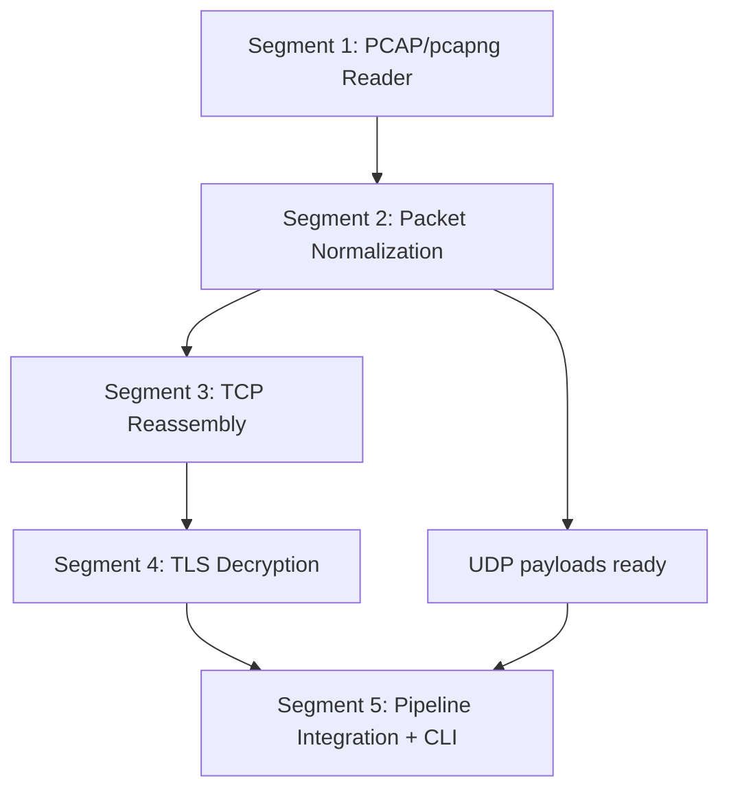

# Subsection 3: Network Capture Pipeline -- Deep Plan

**Goal:** Build a complete pipeline from raw PCAP/pcapng capture files to reassembled, optionally TLS-decrypted byte streams (TCP and UDP) ready for protocol-specific decoding.
**Generated:** 2026-03-08
**Rules version:** 2026-03-08
**Entry point:** B (Enrich Existing Plan)
**Status:** Ready for execution
**Parent plan:** `universal-message-debugger-phase1-2026-03-08.md`

---

## Overview

This plan decomposes Subsection 3 of the Universal Message Debugger Phase 1 into 5 sequential segments. The ordering is confidence-first: Segments 1-3 are well-understood (risk 3-5/10) and build momentum before tackling the high-risk TLS decryption in Segment 4 (risk 8/10). Segment 5 integrates everything into the CLI. No parallelization is possible -- each segment feeds into the next.

Research verification against the parent plan uncovered 6 corrections:

1. **IP fragment reassembly**: `etherparse` v0.19.0 now provides `defrag::IpDefragPool` -- no custom implementation needed (parent plan said ~150 lines from scratch)
2. **SLL2 linktype gap**: `etherparse` does NOT support SLL2 (linktype 276) despite the parent plan implying it does; a thin custom parser (~40 lines) is needed
3. **TCP reassembly library**: `pcap_tcp_assembler` has 0 stars and is not on crates.io; replaced with `smoltcp::storage::Assembler` (12K+ stars, crates.io, battle-tested)
4. **TLS reference implementation**: `pcapsql-core` v0.3.1 (MIT) provides a validated reference architecture for TLS decryption (not evaluated in parent plan)
5. **etherparse version pin**: Must be v0.19.0+ for the `defrag` module
6. **TLS cipher suite scope**: Limited to AEAD suites (AES-GCM, ChaCha20-Poly1305); CBC-mode deferred to later phase

---

## Dependency Diagram



All segments are strictly sequential. No parallelization is possible at the segment level because each depends on the output types and interfaces of its predecessor.

---

## Research Verification Summary

### Libraries Verified

| Library | Version | Status | Key Finding |
|---------|---------|--------|-------------|
| `pcap-parser` | 0.17.0 | Confirmed | Supports pcapng, DSB blocks, multiple sections/interfaces, MIT/Apache-2.0, 834K downloads |
| `etherparse` | 0.19.0 | Updated | Now has `defrag` module with `IpDefragPool`. Supports SLL v1 but NOT SLL2. 5.6M+ downloads |
| `tls-parser` | 0.12.2 | Confirmed | Parses TLS record/handshake messages without decryption. Rusticata project, 1.5M+ downloads |
| `ring` | 0.17+ | Confirmed | AES-GCM, ChaCha20-Poly1305, HKDF, HMAC -- all needed for TLS record decryption |
| `smoltcp` | 0.12+ | New recommendation | 12K+ GitHub stars, MIT/Apache-2.0, `storage::Assembler` for TCP segment reassembly |
| `pcapsql-core` | 0.3.1 | New finding | MIT, TLS 1.2/1.3 decryption with SSLKEYLOGFILE, TCP reassembly. Reference implementation |
| `fluke-hpack` | 0.3.1 | Confirmed | HPACK implementation, 69K downloads, maintained by fasterthanlime (Subsection 4 dependency) |
| `h2-sans-io` | 0.1.0 | Risk flagged | Only 107 downloads, created 2026-02-15. Subsection 4 concern, not this subsection |

### Libraries Rejected

| Library | Reason |
|---------|--------|
| `pcap_tcp_assembler` | 0 stars, not on crates.io, single maintainer. Useful as design reference only |
| `protolens` v0.2.3 | TCP reassembly not separable from bundled protocol parsers |
| `pcap-file` | Older, less maintained than `pcap-parser`, redundant for read-only use |
| `pnet` | Requires libpcap C dependency, designed for live capture not offline analysis |
| `boring` | `ring` has better Rust-native API and wider adoption for our AEAD needs |

### Protocol/Format Claims Verified

| Claim | Verdict |
|-------|---------|
| SSLKEYLOGFILE is the standard for offline TLS decryption | Confirmed -- now RFC 9850 |
| pcapng DSB can embed TLS keys | Confirmed -- `pcap-parser` exposes `DecryptionSecretsBlock` |
| pcapng is Wireshark's default since 2012 | Confirmed |
| Wireshark sample captures are available for testing | Confirmed -- wiki.wireshark.org/SampleCaptures |
| pcap magic bytes: `0xa1b2c3d4` / `0xd4c3b2a1` | Confirmed |
| pcapng magic bytes: `0x0a0d0d0a` | Confirmed |

---

## Issue Analysis Briefs

### Issue S3-1: PCAP/pcapng File Reading and Format Detection

**Core Problem:**
The pipeline must transparently handle both legacy pcap and modern pcapng formats. pcapng is Wireshark's default since 2012 and can embed TLS key material via Decryption Secrets Blocks (DSB). Users will submit either format without knowing the difference.

**Root Cause:**
Two container formats exist for packet captures with different capabilities. The tool must support both seamlessly.

**Proposed Fix:**
Use `pcap-parser` v0.17.0 as the sole file reading library. Auto-detect format via magic bytes (pcap: `0xa1b2c3d4`/`0xd4c3b2a1`; pcapng: `0x0a0d0d0a`). Use `PcapNGReader` for streaming large files with constant memory. Extract DSB blocks for embedded TLS keys. Track per-interface linktype (pcapng allows different linktypes per interface).

**Existing Solutions Evaluated:**
- `pcap-parser` (Rusticata, v0.17.0, 834K total downloads, MIT/Apache-2.0, actively maintained) -- handles both formats, multiple sections, multiple interfaces, DSB blocks. Adopted.
- `pcap-file` (crates.io, 6.3M total downloads, last release 3+ years ago) -- older, less actively maintained. Rejected: `pcap-parser` handles both formats alone.
- `libpcap` FFI bindings via `pcap` crate -- adds C dependency, designed for live capture. Rejected.

**Alternatives Considered:**
- Using `pcap-file` alongside `pcap-parser` -- rejected, redundant.
- Using `libpcap` FFI bindings -- rejected, adds C dependency and is designed for live capture.

**Pre-Mortem -- What Could Go Wrong:**
- pcapng files with multiple sections reset interface numbering; state management across section boundaries must be tested.
- Unusual pcapng option blocks may cause parse warnings that should not abort ingestion.
- Compressed pcapng sections are not supported by `pcap-parser` (document as known limitation).

**Risk Factor:** 3/10

**Evidence for Optimality:**
- Existing solutions: `pcap-parser` docs confirm DSB support (`DecryptionSecretsBlock` struct) and both-format handling.
- External evidence: pcapng is IETF-specified (draft-ietf-opsawg-pcapng) and Wireshark's default since 2012, making dual-format support mandatory.

**Blast Radius:**
- Direct: new `prb-pcap` crate file reader module
- Ripple: TLS decryption module receives embedded keys from DSB

---

### Issue S3-2: Network Packet Normalization and IP Defragmentation

**Core Problem:**
Raw packets from PCAP files arrive with different link-layer encapsulations (Ethernet, SLL, SLL2, Raw IP, Loopback) and may be IP-fragmented. The pipeline must normalize all packets to a common representation before TCP/UDP processing. The parent plan claims IP fragment reassembly must be built from scratch (~150 lines). This is now incorrect -- `etherparse` v0.19.0 provides `defrag::IpDefragPool`. The parent plan also implies etherparse handles SLL2, but it does not.

**Root Cause:**
Real-world captures come from diverse capture points (physical NIC, `any` device, loopback, tunnels) producing different link-layer headers. The parent plan was written against an older etherparse version without the `defrag` module and without verifying SLL2 support.

**Proposed Fix:**
Use `etherparse` v0.19.0 for Ethernet/SLL/VLAN/IP/TCP/UDP parsing. Use its `defrag` module (`IpDefragPool`) for IP fragment reassembly. For SLL2 (linktype 276), implement a thin custom parser (~40 lines) since etherparse does not support SLL2; use `pcap-parser`'s `get_packetdata_linux_sll2()` to extract the protocol type and payload, then feed into etherparse's `from_ip()` for network-layer-and-above parsing. Linktype dispatch: Ethernet (1) and Loopback/Null (0) through `from_ethernet()`; SLL (113) through `from_linux_sll()`; Raw IP (101) through `from_ip()`; SLL2 (276) through custom parser + `from_ip()`.

**Existing Solutions Evaluated:**
- `etherparse` v0.19.0 (5.6M+ downloads, actively maintained, MIT/Apache-2.0) -- includes `defrag` module for IP fragment reassembly. Supports Ethernet II, 802.1Q VLAN (single and double), SLL v1, IPv4, IPv6, TCP, UDP. Does NOT support SLL2. Adopted.
- `pnet` crate -- requires libpcap, live capture focus. Rejected.
- `pkts` crate -- less mature than etherparse. Rejected.
- Building IP defrag from scratch -- rejected now that etherparse provides `IpDefragPool`.

**Alternatives Considered:**
- Building IP fragment reassembly from scratch (~150 lines) -- rejected, etherparse now provides this natively via `defrag::IpDefragPool`.
- Using `pnet` for comprehensive packet handling -- rejected, requires libpcap C dependency and targets live capture.

**Pre-Mortem -- What Could Go Wrong:**
- `IpDefragPool` may grow unbounded with many incomplete fragment trains; need a cleanup/timeout strategy with configurable max buffer count.
- Loopback/Null linktype (0) has platform-dependent header format (4-byte AF value: AF_INET6=30 on macOS, AF_INET6=10 on Linux); must handle both.
- Double VLAN tags (QinQ) need testing.
- VXLAN/GRE tunneled traffic adds another encapsulation layer not handled here (document as known limitation).
- IPv6 Jumbograms are not supported by etherparse (document as known limitation).

**Risk Factor:** 4/10

**Evidence for Optimality:**
- Existing solutions: etherparse docs confirm `defrag` module with `IpDefragPool` for both IPv4 and IPv6 fragment reassembly. `LinuxSllHeader` support confirmed. GitHub issue #97 confirms SLL2 is not yet supported.
- External evidence: Wireshark's packet dissection pipeline follows the same architecture: linktype dispatch, link layer, network layer (with defrag), transport layer.

**Blast Radius:**
- Direct: packet normalization module in `prb-pcap`
- Ripple: all downstream processing (TCP reassembly, UDP extraction) receives normalized packets

---

### Issue S3-3: TCP Stream Reassembly Library Selection

**Core Problem:**
The parent plan recommends `pcap_tcp_assembler` as the primary TCP reassembly library. This crate has 0 stars, 0 forks, is not published on crates.io, and was created by a single developer with last activity in November 2024. Using it as a foundational dependency is risky.

**Root Cause:**
Library selection in the parent plan was based on use-case fit without evaluating community adoption and maintenance indicators.

**Proposed Fix:**
Use `smoltcp`'s `storage::Assembler` as the core segment reassembly engine, wrapped in a custom connection tracker. `smoltcp` (12K+ stars, actively maintained, MIT/Apache-2.0) is the most battle-tested Rust TCP implementation. The `Assembler` handles out-of-order segments, overlaps, and gap tracking. We build ~300 lines of connection tracking around it (keyed by 4-tuple, handling SYN/FIN/RST state transitions, configurable timeout). This approach gives us a proven reassembly core with our own PCAP-specific tolerance for missing segments.

**Existing Solutions Evaluated:**
- `smoltcp` v0.12+ (crates.io, MIT/Apache-2.0, 12K+ GitHub stars, 1.4K+ forks) -- mature embedded TCP stack. `storage::Assembler` is the exact component needed. Adopted.
- `pcap_tcp_assembler` (GitHub, MIT) -- purpose-built for PCAP but 0 stars, not on crates.io, single maintainer. Rejected as primary due to adoption risk. Useful as design reference (it wraps smoltcp's assembler, validating our approach).
- `protolens` v0.2.3 (crates.io, MIT) -- high performance (2-5 GiB/s) but bundles application-layer protocol parsers. TCP reassembly API may not be separable from protocol parsing. Rejected for composability concerns.
- `pcapsql-core` v0.3.1 (crates.io, MIT) -- has TCP reassembly but brings large dependency graph including `anyhow` in library code. Rejected for library-level use due to convention conflict.
- Building from scratch using RFC 793 state machine -- rejected, months of work to reach reliability of existing libraries.

**Alternatives Considered:**
- Adopting `pcap_tcp_assembler` as a git dependency -- rejected, single maintainer risk and no crates.io presence means no versioning guarantees.
- Using `protolens` just for TCP reassembly -- rejected, tight coupling with its protocol parsers makes selective use impractical.

**Pre-Mortem -- What Could Go Wrong:**
- `smoltcp`'s `Assembler` is designed for embedded contexts with fixed-size buffers; our PCAP use case needs dynamic allocation. May need to adapt buffer management.
- Connection tracking for PCAP must tolerate captures that start mid-connection (no SYN seen); must infer initial sequence number from first seen segment.
- Performance with high connection counts (10K+) needs benchmarking; HashMap lookups per packet must not become a bottleneck.
- TCP timestamp option handling may affect sequence number wrapping detection for long-lived connections.

**Risk Factor:** 5/10

**Evidence for Optimality:**
- Existing solutions: smoltcp GitHub (12K+ stars, 1.4K+ forks) confirms active maintenance and battle-tested status. `pcap_tcp_assembler` README confirms it wraps smoltcp's assembler, validating the approach.
- External evidence: Production network analysis tools (Wireshark, Zeek, Suricata) all use dedicated TCP reassembly engines that took years to mature, confirming build-from-scratch is not viable for Phase 1.

**Blast Radius:**
- Direct: TCP reassembly module in `prb-pcap`
- Ripple: all TCP-based protocol decoders (gRPC, ZMQ) depend on reassembled streams

---

### Issue S3-4: TLS Offline Decryption

**Core Problem:**
gRPC traffic is almost always TLS-encrypted. Without TLS decryption, the gRPC pipeline produces opaque ciphertext. The parent plan correctly identifies SSLKEYLOGFILE as the approach but the implementation is complex: key log parsing, TLS handshake tracking, key derivation (different for TLS 1.2 and 1.3), and symmetric record decryption.

**Root Cause:**
TLS sits between TCP and application protocols, creating an opaque layer that must be decrypted before protocol decoders can function.

**Proposed Fix:**
Build a TLS decryption module following `pcapsql-core`'s architecture (validated reference implementation) but with `thiserror`-based error types:

1. **Key log parser:** Parse SSLKEYLOGFILE (RFC 9850) and pcapng DSB blocks. Support labels: `CLIENT_RANDOM` (TLS 1.2), `CLIENT_HANDSHAKE_TRAFFIC_SECRET`, `SERVER_HANDSHAKE_TRAFFIC_SECRET`, `CLIENT_TRAFFIC_SECRET_0`, `SERVER_TRAFFIC_SECRET_0` (TLS 1.3).
2. **Session identification:** Use `tls-parser` v0.12.2 to parse TLS handshake messages from the reassembled TCP stream. Extract `client_random` from ClientHello, `server_random` and cipher suite from ServerHello.
3. **Key derivation:** TLS 1.2: PRF(master_secret, "key expansion", server_random + client_random) using `ring::hmac`. TLS 1.3: HKDF-Expand-Label using `ring::hkdf` with traffic secrets from the key log.
4. **Record decryption:** Use `ring::aead` (AES-128-GCM, AES-256-GCM, ChaCha20-Poly1305). Construct per-record nonce from IV XOR sequence number (64-bit big-endian, zero-padded to 12 bytes). Validate authentication tag. AAD: TLS record header (5 bytes: content_type + version + length).
5. **Integration:** Transparent to downstream -- decrypted streams look identical to plaintext streams. When no key material is available for a session, pass through encrypted stream with metadata flag `encrypted: true`.

**Existing Solutions Evaluated:**
- `pcapsql-core` v0.3.1 TLS module (MIT) -- clean architecture: `keylog.rs` (SSLKEYLOGFILE parser), `kdf.rs` (key derivation), `session.rs` (session tracking), `decrypt.rs` (record decryption). Works. But uses `anyhow` in library code and brings heavy dependencies. Used as reference implementation, not adopted directly.
- `rustls` -- live TLS library, not usable for offline decryption. Provides HKDF implementations via `rustls::crypto::tls13` module that could be referenced.
- `tls-parser` v0.12.2 (Rusticata, 1.5M+ downloads) -- parses TLS record and handshake messages without decryption. Adopted for parsing only.
- `ring` v0.17+ (BoringSSL-derived, extensively audited) -- provides AEAD, HKDF, HMAC for all crypto operations. Adopted.
- `boring` crate -- alternative to ring with OpenSSL-compatible API. Rejected, ring has better Rust-native API and wider adoption.

**Alternatives Considered:**
- Require plaintext captures only -- rejected, unrealistic for production gRPC debugging.
- Shell out to `tshark -o ssl.keylog_file` for decryption -- rejected, adds heavyweight external dependency and breaks self-contained CLI design.
- Adopt `pcapsql-core` wholesale -- rejected, `anyhow` in library code violates project's thiserror-in-libs convention.

**Pre-Mortem -- What Could Go Wrong:**
- TLS 1.3 HKDF-Expand-Label string encoding is fiddly (label prefixed with "tls13 "). Wrong label strings produce garbage silently.
- Captures starting mid-TLS-session lack the handshake, making key matching impossible. Must fall through gracefully.
- Incomplete key log files cause silent decryption failures for some sessions.
- AES-GCM nonce construction errors cause authentication tag failures on every record.
- TLS session resumption (PSK, session tickets) requires additional key log labels not always present.
- CBC-mode cipher suites (TLS 1.2 without GCM) are significantly more complex (padding oracle concerns, MAC-then-encrypt) -- scoped to AEAD suites only for Phase 1.
- Memory: decrypted streams temporarily double memory usage since both encrypted and decrypted forms may coexist.

**Risk Factor:** 8/10

**Evidence for Optimality:**
- Existing solutions: `pcapsql-core`'s TLS module (MIT, v0.3.1) demonstrates the architecture works in Rust with `tls-parser` + `ring`, validating the approach.
- External evidence: RFC 9850 standardizes SSLKEYLOGFILE format. Wireshark's SSLKEYLOGFILE approach is the de facto standard for offline TLS decryption (wiki.wireshark.org/TLS).

**Blast Radius:**
- Direct: new TLS decryption module in `prb-pcap`
- Ripple: protocol decoders must accept both plaintext and decrypted-ciphertext byte streams identically

---

### Issue S3-5: Pipeline Architecture and Data Flow

**Core Problem:**
The four components (file reader, packet normalizer, TCP reassembler, TLS decryptor) must be composed into a coherent pipeline that produces reassembled byte streams suitable for Subsection 4's protocol decoders. The pipeline must handle errors gracefully without aborting the entire ingest.

**Root Cause:**
Each component has its own data model and error modes. Integration requires defining clear interfaces between stages.

**Proposed Fix:**
Define a layered pipeline with explicit stage boundaries:

```
File Reader -> [raw packets + metadata]
  -> Packet Normalizer -> [IP datagrams, defragmented]
    -> TCP Reassembler -> [byte streams per connection]
      -> TLS Decryptor (optional) -> [plaintext byte streams]
    -> UDP Extractor -> [datagrams per src:dst pair]
```

Each stage produces typed output consumed by the next. Errors at any stage produce warnings (logged via `tracing`) and skip the affected packet/stream, not abort the pipeline. The pipeline implements the `CaptureAdapter` trait from Subsection 1.

**Existing Solutions Evaluated:**
N/A -- internal architecture design. No external tool solves "compose our custom pipeline stages."

**Alternatives Considered:**
- Pull-based (iterator) pipeline -- rejected for TCP reassembly which needs to buffer across packets.
- Separate binary for PCAP ingest -- rejected, should be unified CLI.

**Pre-Mortem -- What Could Go Wrong:**
- Stage boundaries may cause unnecessary copies if not designed with zero-copy in mind (use `bytes::Bytes` for shared ownership).
- Streaming vs. batch tradeoff: streaming is more memory-efficient but harder for TCP reassembly (need all packets for a connection).
- Large captures (multi-GB) need bounded memory usage; must not load entire file.

**Risk Factor:** 4/10

**Evidence for Optimality:**
- Existing solutions: `pcapsql-core` follows the same layered architecture (file -> packet -> stream -> TLS -> protocol), validating the design.
- External evidence: Wireshark's dissector pipeline follows identical layering (link -> network -> transport -> application).

**Blast Radius:**
- Direct: pipeline orchestration module in `prb-pcap`
- Ripple: CLI integration (`prb ingest`), all protocol decoders consume pipeline output

---

### Issue S3-6: CLI Extension for PCAP Ingest

**Core Problem:**
The CLI must be extended to support `prb ingest capture.pcapng [--tls-keylog keys.log]` with progress reporting and error summaries for large files.

**Root Cause:**
Subsection 1 establishes CLI with fixture ingest only; PCAP ingest needs new arguments and UX.

**Proposed Fix:**
Add `--tls-keylog <path>` flag to `prb ingest`. Auto-detect file format (JSON fixture vs PCAP/pcapng) from magic bytes. Report progress for large files (packet count, stream count, bytes processed). Summarize warnings at end (skipped packets, failed TLS sessions, incomplete streams).

**Existing Solutions Evaluated:**
N/A -- internal CLI design for project-specific command.

**Alternatives Considered:**
- Separate `prb ingest-pcap` subcommand -- rejected, format auto-detection makes a single `prb ingest` command cleaner UX.

**Pre-Mortem -- What Could Go Wrong:**
- Progress reporting for streaming parsers requires periodic flush; must not slow down ingest.
- Error summary formatting needs care to be useful without overwhelming.

**Risk Factor:** 2/10

**Evidence for Optimality:**
- Project conventions: Subsection 1 establishes `prb ingest` as the entry point; extending it maintains CLI consistency.
- External evidence: Wireshark/tshark use format auto-detection, validating the approach.

**Blast Radius:**
- Direct: CLI binary crate (`prb-cli`)
- Ripple: none

---

## Segment Briefs

### Segment 1: PCAP/pcapng File Reader
> **Execution method:** Launch as an `iterative-builder` subagent (Task tool, subagent_type="generalPurpose"). The orchestration agent reads and prepends `iterative-builder-prompt.mdc` at launch time per `orchestration-protocol.mdc`.

**Goal:** Create a file reader module that transparently reads both pcap and pcapng formats, extracts per-packet data with linktype, and extracts embedded TLS keys from pcapng DSB blocks.

**Depends on:** Subsection 1 (Cargo workspace, core traits, error conventions) and Subsection 2 (MCAP storage) must be complete.

**Issues addressed:** Issue S3-1 (PCAP/pcapng file reading and format detection)

**Cycle budget:** 10 cycles

**Scope:**
- New crate `prb-pcap`, module `reader`

**Key files and context:**
The `CaptureAdapter` trait from `prb-core` (defined in Subsection 1) must be implemented. Error types use `thiserror` per project convention (parent plan Issue 11). `pcap-parser` v0.17.0 provides `PcapNGReader` for streaming reads, `PcapCapture` for in-memory reads, and `DecryptionSecretsBlock` for DSB extraction. pcap magic: `0xa1b2c3d4`/`0xd4c3b2a1`; pcapng magic: `0x0a0d0d0a`. pcapng tracks per-interface linktype via Interface Description Blocks; each Enhanced Packet Block references an interface ID.

**Implementation approach:**
Create `PcapFileReader` struct wrapping `pcap-parser`'s streaming reader (works for both formats when using auto-detection from magic bytes). Yield `(linktype, timestamp, raw_bytes)` tuples per packet. Collect DSB blocks into a `TlsKeyStore` (simple `HashMap` keyed by client_random bytes). Expose `fn embedded_tls_keys(&self) -> &TlsKeyStore`. Handle both-endian pcap files (pcap-parser handles this internally). Test with crafted minimal pcap and pcapng fixtures generated programmatically using `etherparse::PacketBuilder`.

**Alternatives ruled out:**
- Using `pcap-file` (older, redundant for read-only use).
- Using libpcap FFI (adds C dependency, designed for live capture).
- Reading entire file into memory (breaks on multi-GB captures).

**Pre-mortem risks:**
- pcapng section boundary resets interface numbering -- must test with multi-section fixtures.
- Large files must stream without OOM -- verify constant memory usage with >1MB generated fixture.
- Compressed pcapng sections are not supported by `pcap-parser` -- document as known limitation.

**Segment-specific commands:**
- Build: `cargo build -p prb-pcap`
- Test (targeted): `cargo test -p prb-pcap -- reader`
- Test (regression): `cargo test -p prb-core -p prb-storage`
- Test (full gate): `cargo test --workspace`

**Exit criteria:**

All of the following must be satisfied:

1. **Targeted tests:**
   - `test_read_pcap_legacy`: reads a legacy pcap file, yields correct packet count and linktype
   - `test_read_pcapng`: reads a pcapng file with multiple interfaces, yields correct per-packet linktype
   - `test_read_pcapng_dsb`: reads pcapng with embedded DSB, extracts TLS key material correctly
   - `test_format_autodetect`: auto-detects pcap vs pcapng from magic bytes
   - `test_streaming_large_file`: reads a >1MB generated pcap without exceeding bounded memory
2. **Regression tests:** all `prb-core` and `prb-storage` tests pass
3. **Full build gate:** `cargo build --workspace`
4. **Full test gate:** `cargo test --workspace`
5. **Self-review gate:** No dead code, no commented-out blocks, no TODO hacks, no changes outside stated scope.
6. **Scope verification gate:** Changes limited to `prb-pcap` crate and workspace `Cargo.toml`.

**Risk factor:** 3/10

**Estimated complexity:** Low

**Commit message:**
`feat(pcap): add PCAP/pcapng file reader with DSB extraction`

---

### Segment 2: Packet Parsing and Network Normalization
> **Execution method:** Launch as an `iterative-builder` subagent (Task tool, subagent_type="generalPurpose"). The orchestration agent reads and prepends `iterative-builder-prompt.mdc` at launch time per `orchestration-protocol.mdc`.

**Goal:** Parse raw packets from the file reader into normalized (IP header + transport header + payload) tuples, handling multiple linktypes, VLAN stripping, and IP fragment reassembly.

**Depends on:** Segment 1

**Issues addressed:** Issue S3-2 (network packet normalization and IP defragmentation)

**Cycle budget:** 15 cycles

**Scope:**
- `prb-pcap` crate, module `normalize`

**Key files and context:**
`etherparse` v0.19.0 provides: `SlicedPacket::from_ethernet()` for Ethernet/VLAN, `SlicedPacket::from_linux_sll()` for SLL v1, `SlicedPacket::from_ip()` for Raw IP. `etherparse::defrag::IpDefragPool` handles IPv4/IPv6 fragment reassembly with configurable buffer limits. For SLL2 (linktype 276): etherparse does NOT support it; use `pcap-parser::data::get_packetdata_linux_sll2()` to extract protocol type + payload, then feed into etherparse's `from_ip()` or `from_ether_type()`. Loopback/Null (linktype 0): 4-byte AF family header; AF_INET=2 for IPv4, AF_INET6=30 (macOS) or 10 (Linux) for IPv6; strip header and use `from_ip()`. Output type: `NormalizedPacket { timestamp, src_ip, dst_ip, transport: TcpSegment | UdpDatagram | Other, vlan_id: Option<u16>, raw_payload: &[u8] }`.

**Implementation approach:**
Create a `PacketNormalizer` struct that: (1) dispatches on linktype to the appropriate etherparse entry point, (2) extracts VLAN IDs from 802.1Q headers, (3) feeds IP-fragmented packets into `IpDefragPool` and yields reassembled datagrams, (4) separates TCP segments and UDP datagrams. For SLL2, write a minimal `LinuxSll2Header::from_slice()` parser (~40 lines: 20 bytes header, extract protocol_type at offset 0 and interface_index at offset 4). UDP datagrams are immediately available as complete payloads. TCP segments are yielded individually for the reassembler (Segment 3). Configure `IpDefragPool` with a max buffer count and per-packet timeout to prevent unbounded memory growth.

**Alternatives ruled out:**
- Using `pnet` (requires libpcap, live capture focus).
- Building custom IP defrag (etherparse now provides it).
- Ignoring SLL2 (too common in Linux `any` device captures to skip).

**Pre-mortem risks:**
- `IpDefragPool` unbounded growth with many incomplete fragment trains -- must enforce max buffer count and timeout.
- Loopback AF values differ between macOS (AF_INET6=30) and Linux (AF_INET6=10) -- must handle both.
- Double VLAN tags (QinQ) need testing via etherparse's `DoubleVlanHeader` support.
- IPv6 Jumbograms are not supported by etherparse -- document as known limitation.

**Segment-specific commands:**
- Build: `cargo build -p prb-pcap`
- Test (targeted): `cargo test -p prb-pcap -- normalize`
- Test (regression): `cargo test -p prb-pcap -- reader`
- Test (full gate): `cargo test --workspace`

**Exit criteria:**

All of the following must be satisfied:

1. **Targeted tests:**
   - `test_ethernet_ipv4_tcp`: parses standard Ethernet+IPv4+TCP packet
   - `test_ethernet_ipv4_udp`: parses standard Ethernet+IPv4+UDP packet
   - `test_vlan_single`: strips single VLAN tag, exposes VLAN ID in metadata
   - `test_vlan_double`: strips double VLAN (QinQ) tags correctly
   - `test_sll_v1`: parses SLL v1 encapsulated packet (linktype 113)
   - `test_sll_v2`: parses SLL v2 encapsulated packet (linktype 276) via custom parser
   - `test_raw_ip`: parses Raw IP (linktype 101) packet
   - `test_loopback_null`: parses Loopback/Null (linktype 0) on both macOS and Linux AF values
   - `test_ip_fragment_reassembly`: reassembles a 3-fragment IPv4 packet via `IpDefragPool`
   - `test_ip_fragment_timeout`: incomplete fragment train is cleaned up after configured limit
   - `test_ipv6_fragment`: reassembles IPv6 fragmented packet
2. **Regression tests:** `cargo test -p prb-pcap -- reader`
3. **Full build gate:** `cargo build --workspace`
4. **Full test gate:** `cargo test --workspace`
5. **Self-review gate:** No dead code, no commented-out blocks, no TODO hacks, no changes outside stated scope.
6. **Scope verification gate:** Changes in `prb-pcap/src/normalize.rs`, custom SLL2 parser, and test fixtures only.

**Risk factor:** 4/10

**Estimated complexity:** Medium

**Commit message:**
`feat(pcap): add packet normalization with linktype dispatch and IP defrag`

---

### Segment 3: TCP Stream Reassembly
> **Execution method:** Launch as an `iterative-builder` subagent (Task tool, subagent_type="generalPurpose"). The orchestration agent reads and prepends `iterative-builder-prompt.mdc` at launch time per `orchestration-protocol.mdc`.

**Goal:** Reassemble individual TCP segments into ordered byte streams per connection, tolerating out-of-order delivery, retransmissions, and capture-tool packet loss.

**Depends on:** Segment 2

**Issues addressed:** Issue S3-3 (TCP stream reassembly library selection)

**Cycle budget:** 20 cycles

**Scope:**
- `prb-pcap` crate, module `tcp`

**Key files and context:**
`smoltcp` (crates.io, v0.12+, MIT/Apache-2.0, 12K+ GitHub stars) provides `storage::Assembler` for TCP segment reassembly. The `Assembler` tracks contiguous ranges of received data and reports gaps. We wrap it with: (1) A `ConnectionTracker` keyed by 4-tuple `(src_ip, src_port, dst_ip, dst_port)` mapping packets to connections. (2) A `TcpStreamState` per connection tracking: SYN/FIN/RST flags seen, initial sequence number, current assembler state, timeout timer. (3) A `ReassembledStream` output type: `{ connection_key, direction: Client|Server, data: Vec<u8>, is_complete: bool, missing_ranges: Vec<Range<u64>> }`. The module must handle captures starting mid-connection (no SYN): infer initial sequence number from first seen segment. Packet loss tolerance: when a gap persists beyond a configurable threshold (packet count or timeout), skip the gap and continue reassembly, logging a warning. `pcap_tcp_assembler` (GitHub, MIT) demonstrates this pattern by wrapping smoltcp's assembler with capture-specific gap tolerance -- use as design reference.

**Implementation approach:**
Add `smoltcp` as a dependency (feature-gate to pull in `storage` module). For each TCP segment from the normalizer: (1) look up or create connection state by 4-tuple, (2) adjust sequence number relative to ISN, (3) feed payload into smoltcp's `Assembler`, (4) if assembler reports contiguous data, yield it to callback. Track bidirectional streams (client-to-server, server-to-client) independently. Connection cleanup: on FIN/RST, flush remaining data and mark stream complete. Timeout: connections with no new data for N seconds (configurable, default 30s) are flushed and closed. Expose a `TcpReassembler` struct with `fn process_segment(&mut self, segment: TcpSegment) -> Vec<StreamEvent>` API.

**Alternatives ruled out:**
- Using `pcap_tcp_assembler` directly (not on crates.io, 0 community adoption, single maintainer risk).
- Using `protolens` (TCP reassembly not separable from bundled protocol parsing).
- Building from scratch without smoltcp (reinventing a complex, error-prone wheel).

**Pre-mortem risks:**
- smoltcp's `Assembler` uses fixed-size contiguous range tracking; may need custom buffer growth strategy for large streams.
- High connection counts (10K+) may cause memory pressure -- need per-connection buffer limits and eviction strategy.
- Captures with heavy packet loss produce many fragmented stream segments rather than clean byte streams.
- TCP timestamp option handling may affect sequence number wrapping detection for connections exceeding 4GB.

**Segment-specific commands:**
- Build: `cargo build -p prb-pcap`
- Test (targeted): `cargo test -p prb-pcap -- tcp`
- Test (regression): `cargo test -p prb-pcap -- reader normalize`
- Test (full gate): `cargo test --workspace`

**Exit criteria:**

All of the following must be satisfied:

1. **Targeted tests:**
   - `test_simple_stream`: reassembles a 3-segment in-order TCP stream
   - `test_out_of_order`: reassembles segments arriving out of order
   - `test_retransmission`: handles duplicate segments without producing duplicate data
   - `test_packet_loss_tolerance`: skips gap after threshold and continues reassembly with warning
   - `test_bidirectional`: tracks client-to-server and server-to-client independently
   - `test_fin_rst_cleanup`: connection state is flushed on FIN and RST
   - `test_mid_connection_start`: handles capture starting mid-connection (no SYN)
   - `test_connection_timeout`: idle connections are flushed after timeout
   - `test_multiple_connections`: tracks 100+ concurrent connections without error
2. **Regression tests:** `cargo test -p prb-pcap -- reader normalize`
3. **Full build gate:** `cargo build --workspace`
4. **Full test gate:** `cargo test --workspace`
5. **Self-review gate:** No dead code, no commented-out blocks, no TODO hacks, no changes outside stated scope.
6. **Scope verification gate:** Changes in `prb-pcap/src/tcp.rs` and test fixtures only.

**Risk factor:** 5/10

**Estimated complexity:** Medium

**Commit message:**
`feat(pcap): add TCP stream reassembly using smoltcp assembler`

---

### Segment 4: TLS Key Import and Record Decryption
> **Execution method:** Launch as an `iterative-builder` subagent (Task tool, subagent_type="generalPurpose"). The orchestration agent reads and prepends `iterative-builder-prompt.mdc` at launch time per `orchestration-protocol.mdc`.

**Goal:** Decrypt TLS-encrypted TCP streams using SSLKEYLOGFILE key material or pcapng-embedded DSB keys, supporting TLS 1.2 and TLS 1.3 AEAD cipher suites.

**Depends on:** Segment 3 (reassembled TCP streams), Segment 1 (DSB key extraction)

**Issues addressed:** Issue S3-4 (TLS offline decryption)

**Cycle budget:** 20 cycles

**Scope:**
- `prb-pcap` crate, module `tls` (with sub-modules `keylog`, `session`, `kdf`, `decrypt`)

**Key files and context:**
Reference implementation: `pcapsql-core` v0.3.1 `tls/` module (MIT) demonstrates the full architecture: `keylog.rs` (SSLKEYLOGFILE parser), `kdf.rs` (key derivation), `session.rs` (session tracking), `decrypt.rs` (record decryption). Our implementation follows the same architecture with `thiserror` errors instead of `anyhow`.

Key libraries:
- `tls-parser` v0.12.2 for TLS record/handshake parsing (`parse_tls_plaintext()`, `parse_tls_encrypted()`).
- `ring` v0.17+ for crypto: `ring::aead` (AES-128-GCM, AES-256-GCM, ChaCha20-Poly1305), `ring::hkdf` (TLS 1.3 key derivation), `ring::hmac` (TLS 1.2 PRF).

SSLKEYLOGFILE format (RFC 9850): text file with lines like `CLIENT_RANDOM <hex_client_random> <hex_master_secret>` (TLS 1.2) or `CLIENT_TRAFFIC_SECRET_0 <hex_client_random> <hex_traffic_secret>` (TLS 1.3).

TLS 1.2 key derivation: `PRF(master_secret, "key expansion", server_random + client_random)` yields `client_write_key + server_write_key + client_write_IV + server_write_IV`.

TLS 1.3 key derivation: `HKDF-Expand-Label(traffic_secret, "key", "", key_len)` and `HKDF-Expand-Label(traffic_secret, "iv", "", 12)`.

Per-record nonce: XOR of IV with 64-bit sequence number (big-endian, zero-padded to 12 bytes). AAD for AES-GCM: TLS record header (5 bytes: content_type + version + length).

When no key material is available for a session, pass through the encrypted stream with metadata flag `encrypted: true`.

**Implementation approach:**
Four sub-modules:
1. `tls::keylog` -- parse SSLKEYLOGFILE, merge with DSB keys from Segment 1, store in `HashMap<[u8; 32], KeyMaterial>` keyed by client_random.
2. `tls::session` -- fed reassembled TCP bytes, uses `tls-parser` to identify TLS handshake messages, extracts client_random, server_random, cipher suite, looks up key material, initializes decryption context.
3. `tls::kdf` -- implements TLS 1.2 PRF and TLS 1.3 HKDF-Expand-Label key schedule.
4. `tls::decrypt` -- takes initialized context + encrypted TLS records, performs AEAD decryption, yields plaintext.

The module presents the same interface as a passthrough for non-TLS streams: `fn process_stream(&mut self, stream: ReassembledStream) -> DecryptedStream`.

**Alternatives ruled out:**
- Requiring plaintext captures only (unrealistic for production gRPC).
- Shelling out to tshark (external dependency, breaks self-contained design).
- Adopting pcapsql-core wholesale (anyhow in library code violates thiserror-in-libs convention).
- Using `boring` instead of `ring` (ring has better Rust-native API).
- Supporting CBC-mode cipher suites (MAC-then-encrypt complexity deferred to later phase).

**Pre-mortem risks:**
- TLS 1.3 HKDF-Expand-Label string encoding is fiddly (label prefixed with "tls13 "). Wrong label strings produce garbage silently. Build test with RFC 8448 known test vectors.
- Captures starting mid-TLS-session have no handshake -- cannot decrypt, must fall through gracefully.
- Incomplete key log files cause silent decryption failures for some sessions.
- AES-GCM nonce construction errors cause authentication tag failures on every record.
- TLS session resumption (PSK) requires `EARLY_TRAFFIC_SECRET` label which may not be in all key logs.
- Memory: decrypted streams temporarily double memory usage.

**Segment-specific commands:**
- Build: `cargo build -p prb-pcap`
- Test (targeted): `cargo test -p prb-pcap -- tls`
- Test (regression): `cargo test -p prb-pcap -- reader normalize tcp`
- Test (full gate): `cargo test --workspace`

**Exit criteria:**

All of the following must be satisfied:

1. **Targeted tests:**
   - `test_keylog_parse`: parses SSLKEYLOGFILE with TLS 1.2 and 1.3 entries correctly
   - `test_keylog_merge_dsb`: merges DSB-extracted keys with file-based keys without duplicates
   - `test_tls12_key_derivation`: derives correct keys using RFC 5246 test vectors
   - `test_tls13_key_derivation`: derives correct keys using RFC 8448 test vectors
   - `test_aes128gcm_decrypt`: decrypts a TLS record with AES-128-GCM using known key+nonce+ciphertext
   - `test_aes256gcm_decrypt`: decrypts a TLS record with AES-256-GCM using known vectors
   - `test_chacha20poly1305_decrypt`: decrypts a TLS record with ChaCha20-Poly1305 using known vectors
   - `test_session_identification`: extracts client_random and cipher suite from TLS handshake bytes
   - `test_no_key_passthrough`: stream without matching key material passes through as `encrypted: true`
   - `test_end_to_end_tls12`: full decrypt of a captured TLS 1.2 session with known test vectors
   - `test_end_to_end_tls13`: full decrypt of a captured TLS 1.3 session with known test vectors
2. **Regression tests:** `cargo test -p prb-pcap -- reader normalize tcp`
3. **Full build gate:** `cargo build --workspace`
4. **Full test gate:** `cargo test --workspace`
5. **Self-review gate:** No dead code, no commented-out blocks, no TODO hacks, no secrets in test fixtures (use synthetic test vectors only).
6. **Scope verification gate:** Changes in `prb-pcap/src/tls/` and test fixtures only.

**Risk factor:** 8/10

**Estimated complexity:** High

**Commit message:**
`feat(pcap): add TLS 1.2/1.3 offline decryption with SSLKEYLOGFILE support`

---

### Segment 5: Pipeline Integration and CLI Extension
> **Execution method:** Launch as an `iterative-builder` subagent (Task tool, subagent_type="generalPurpose"). The orchestration agent reads and prepends `iterative-builder-prompt.mdc` at launch time per `orchestration-protocol.mdc`.

**Goal:** Wire Segments 1-4 into an end-to-end pipeline implementing `CaptureAdapter` for PCAP files, extend the CLI with `prb ingest <capture> [--tls-keylog <keys.log>]`, and add integration tests with real-world PCAP fixtures.

**Depends on:** Segments 1-4

**Issues addressed:** Issue S3-5 (pipeline architecture and data flow), Issue S3-6 (CLI extension for PCAP ingest)

**Cycle budget:** 15 cycles

**Scope:**
- `prb-pcap` crate (pipeline module)
- `prb-cli` crate (ingest command extension)

**Key files and context:**
The pipeline composes: `PcapFileReader` -> `PacketNormalizer` -> `TcpReassembler` + UDP extraction -> `TlsDecryptor` (optional) -> `DebugEvent` emission -> MCAP storage. The `CaptureAdapter` trait (from `prb-core`, Subsection 1) defines the interface: `fn ingest(&self, source: &Path, options: IngestOptions) -> Result<Session>`. `IngestOptions` must include `tls_keylog_path: Option<PathBuf>`. The pipeline must: (a) auto-detect file format from magic bytes (JSON fixture vs PCAP/pcapng), (b) report progress (packet count, stream count), (c) emit `DebugEvent` for each complete TCP stream and each UDP datagram, (d) summarize warnings on completion. For CLI: add `--tls-keylog` to `prb ingest`, display progress via simple stderr output. Integration test fixtures: generate synthetic PCAP files using `etherparse::PacketBuilder` for reproducible tests.

**Implementation approach:**
Create `PcapCaptureAdapter` implementing `CaptureAdapter`. Wire the components in a push-based pipeline: iterate packets from reader, normalize, feed TCP segments to reassembler (collecting stream events), feed streams to TLS decryptor if key material available, convert output to `DebugEvent` with transport metadata, write to MCAP session. UDP path is simpler: each datagram becomes a `DebugEvent` immediately. Error handling: packet-level errors are logged via `tracing::warn!` and skipped; stream-level errors produce partial events with warning metadata. CLI extension: modify `prb ingest` command to accept file path, detect format, configure adapter with optional `--tls-keylog` argument.

**Alternatives ruled out:**
- Pull-based (iterator) pipeline -- rejected for TCP reassembly which needs to buffer across packets.
- Separate `prb ingest-pcap` subcommand -- rejected, format auto-detection makes a single `prb ingest` command cleaner UX.
- Separate binary for PCAP ingest -- rejected, should be unified CLI.

**Pre-mortem risks:**
- End-to-end integration may reveal interface mismatches between segments built independently.
- Performance bottleneck at any stage (especially TCP reassembly for high-connection-count captures) affects the whole pipeline.
- Large PCAP files (multi-GB) need streaming without OOM -- verify with large generated fixture.
- Progress reporting must not become a performance bottleneck.

**Segment-specific commands:**
- Build: `cargo build --workspace`
- Test (targeted): `cargo test -p prb-pcap -- pipeline && cargo test -p prb-cli -- ingest_pcap`
- Test (regression): `cargo test -p prb-pcap && cargo test -p prb-core && cargo test -p prb-storage`
- Test (full gate): `cargo test --workspace`

**Exit criteria:**

All of the following must be satisfied:

1. **Targeted tests:**
   - `test_pipeline_tcp_stream`: end-to-end ingest of PCAP with TCP stream produces correct DebugEvents
   - `test_pipeline_udp_datagram`: end-to-end ingest of PCAP with UDP produces correct DebugEvents
   - `test_pipeline_tls_decrypt`: end-to-end ingest of PCAP with TLS + keylog produces decrypted DebugEvents
   - `test_pipeline_mixed`: PCAP with TCP + UDP + TLS streams all produce correct events
   - `test_pipeline_error_tolerance`: corrupt packets are skipped, pipeline continues, warning count reported
   - `test_cli_ingest_pcap`: `prb ingest test.pcap` succeeds (assert_cmd integration test)
   - `test_cli_ingest_pcapng_tls`: `prb ingest test.pcapng --tls-keylog keys.log` succeeds
   - `test_cli_format_autodetect`: `prb ingest` handles both pcap and pcapng without explicit format flag
2. **Regression tests:** all existing `prb-pcap`, `prb-core`, and `prb-storage` tests pass
3. **Full build gate:** `cargo build --workspace`
4. **Full test gate:** `cargo test --workspace`
5. **Self-review gate:** No dead code, no commented-out blocks, no TODO hacks, `CaptureAdapter` trait properly implemented.
6. **Scope verification gate:** Changes in `prb-pcap/src/pipeline.rs`, `prb-cli/src/ingest.rs`, and test fixtures only.

**Risk factor:** 4/10

**Estimated complexity:** Medium

**Commit message:**
`feat(pcap): integrate capture pipeline and extend CLI for PCAP ingest`

---

## Parallelization Opportunities

No parallelization is possible. All 5 segments form a strict linear dependency chain:

```
Segment 1 -> Segment 2 -> Segment 3 -> Segment 4 -> Segment 5
```

Each segment produces output types consumed by the next.

---

## Execution Instructions

To execute this plan, switch to Agent Mode. For each segment in order (1 through 5), launch an `iterative-builder` subagent (Task tool, subagent_type="generalPurpose") with the full segment brief as the prompt. Do not implement segments directly -- always delegate to iterative-builder subagents. After all segments are built, run `deep-verify` against this plan file. If verification finds gaps, re-enter `deep-plan` on the unresolved items.

---

## Total Estimated Scope

- **Segments:** 5
- **Overall complexity:** High (driven by Segment 4: TLS decryption)
- **Risk budget:** 1 segment at risk 8/10 (TLS), 1 at risk 5/10 (TCP), rest at 2-4/10. Well within budget (threshold is 2+ at 8+).
- **Caveats:**
  - If TLS decryption (Segment 4) proves too complex, it can be deferred to Phase 1.5 without breaking the pipeline. Plaintext captures still work.
  - TLS decryption is scoped to AEAD cipher suites only (AES-GCM, ChaCha20-Poly1305). CBC-mode suites are deferred.
  - SLL2 linktype support requires a small custom parser since etherparse does not support it.
  - VXLAN/GRE tunnel decapsulation is not in scope (documented as known limitation).

---

## Execution Log

| Segment | Est. Complexity | Risk | Cycles Used | Status | Notes |
|---------|----------------|------|-------------|--------|-------|
| 1: PCAP/pcapng Reader | Low | 3/10 | -- | -- | -- |
| 2: Packet Normalization | Medium | 4/10 | -- | -- | -- |
| 3: TCP Reassembly | Medium | 5/10 | -- | -- | -- |
| 4: TLS Decryption | High | 8/10 | -- | -- | -- |
| 5: Pipeline Integration + CLI | Medium | 4/10 | -- | -- | -- |

**Deep-verify result:** --
**Follow-up plans:** --
