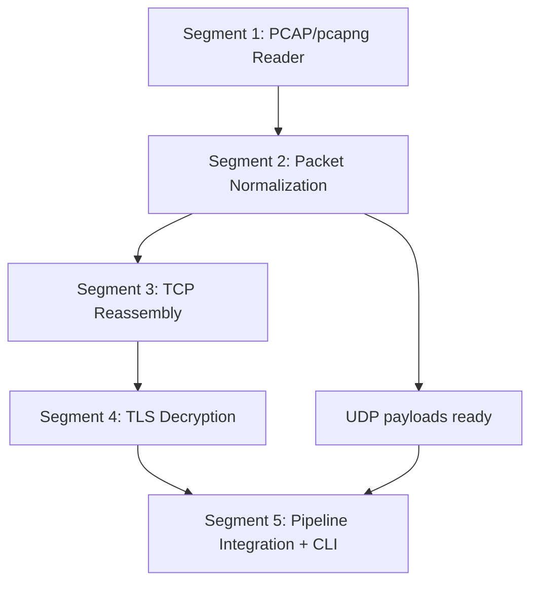

# Subsection 3: Network Capture Pipeline -- Manifest

## Dependency Diagram



All segments are strictly sequential. No parallelization is possible at the segment level because each depends on the output types and interfaces of its predecessor.

## Segment Index

| # | Title | File | Depends On | Risk | Complexity | Status |
|---|-------|------|------------|------|------------|--------|
| 1 | PCAP/pcapng File Reader | segments/01-pcap-reader.md | None | 3/10 | Low | pending |
| 2 | Packet Parsing and Network Normalization | segments/02-packet-normalization.md | 1 | 4/10 | Medium | pending |
| 3 | TCP Stream Reassembly | segments/03-tcp-reassembly.md | 2 | 5/10 | Medium | pending |
| 4 | TLS Key Import and Record Decryption | segments/04-tls-decryption.md | 3, 1 | 8/10 | High | pending |
| 5 | Pipeline Integration and CLI Extension | segments/05-pipeline-integration.md | 1, 2, 3, 4 | 4/10 | Medium | pending |

## Parallelization

No parallelization possible. All 5 segments form a strict linear dependency chain:

```
Segment 1 -> Segment 2 -> Segment 3 -> Segment 4 -> Segment 5
```

Each segment produces output types consumed by the next.

## Preamble Injection

Before launching any builder subagent, the orchestration agent assembles the prompt:
1. Read `iterative-builder-prompt.mdc` from `.cursor/rules/`
2. Read `devcontainer-exec.mdc` from `.cursor/rules/` (if applicable)
3. Read the segment file from `segments/{NN}-{slug}.md`

Assembled prompt = [preamble contents] + [segment file contents]

## Execution Instructions

For each segment in order (1 through 5), launch an iterative-builder subagent (Task tool, subagent_type="generalPurpose") with the full segment brief as the prompt. Do not implement segments directly -- always delegate to iterative-builder subagents. After all segments are built, run `deep-verify` against this plan. If verification finds gaps, re-enter `deep-plan` on the unresolved items.
