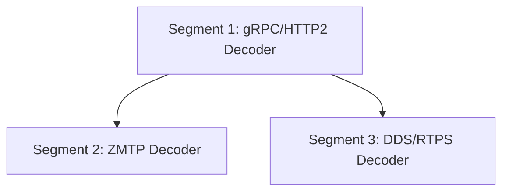

# Subsection 4: Protocol Decoders -- Deep Plan

**Goal:** Decompose Subsection 4 (Protocol Decoders) into implementation-level segments with research-verified library choices, concrete wire-format specifications, and iterative-builder handoff contracts.
**Generated:** 2026-03-08
**Rules version:** 2026-03-08
**Entry point:** B (Enrich Existing Plan)
**Status:** Ready for execution
**Parent plan:** `universal-message-debugger-phase1-2026-03-08.md` (Subsection 4)

---

## Overview

This deep plan expands Subsection 4 of the Universal Message Debugger Phase 1 plan into 3 vertical-slice segments, one per protocol (gRPC, ZMTP, DDS/RTPS). Research verified that `h2-sans-io` is architecturally correct but extremely new (v0.1.0, 107 downloads, published 2026-02-15), that the `zmtp` crate is dead (last updated 2016) and must be replaced with a custom parser, and that `rtps-parser` works but pulls in the full `dust_dds` stack. Six new issues were identified beyond the three from the parent plan: the dead `zmtp` crate, h2-sans-io adoption risk, missing gRPC compression handling, missing gRPC trailers/status parsing, ZMTP mid-stream capture limitations, and DDS topic name extraction requiring SEDP discovery observation. Segment 1 (gRPC) establishes the protocol dispatch infrastructure and must come first. Segments 2 (ZMTP) and 3 (DDS/RTPS) are independent and can run as parallel iterative-builder subagents.

---

## Dependency Diagram



Segments 2 and 3 depend on Segment 1 (which defines the protocol dispatch infrastructure) but are independent of each other and can run in parallel.

---

## Issue Analysis Briefs

### Issue D1: zmtp Crate Is Dead

**Core Problem:**
The parent plan lists `zmtp` (crates.io) as a key dependency for the ZMQ/ZMTP decoder, but the crate was last updated on 2016-06-19, depends on ancient `byteorder` 0.5.3, has 52 downloads in 90 days, and its repository is on Bitbucket. It is effectively abandoned.

**Root Cause:**
The parent plan selected the crate by name match without checking maintenance status.

**Proposed Fix:**
Build a custom ZMTP wire protocol parser. The ZMTP 3.0/3.1 wire format is well-specified (RFC 23/ZMTP, RFC 37/ZMTP) and consists of:
- 64-byte greeting (fixed format: signature, version, mechanism, as-server, filler)
- Handshake commands (READY/ERROR with metadata properties)
- Traffic frames: 1-byte flags (MORE|LONG|COMMAND bits) + 1-or-8-byte size + body

Implementation: a `ZmtpParser` struct maintaining greeting/handshake state, with a `feed(&mut self, data: &[u8]) -> Vec<ZmtpEvent>` method that emits greeting, command, and message events. Estimated ~300 lines.

**Existing Solutions Evaluated:**
- `zmtp` v0.6.0 (crates.io, 3,925 total downloads, Bitbucket repo) -- Last updated 2016-06-19. Depends on `byteorder` 0.5.3 (ancient). **Dead. Rejected.**
- `rzmq` v0.5.13 (crates.io, 3,004 downloads, updated 2026-02-02, MPL-2.0) -- Active, has internal `ZmtpCodec` and `ZmtpManualParser`. But tightly coupled to tokio async runtime; not extractable for passive offline parsing. Useful as reference implementation. **Rejected for direct use.**
- `zeromq/zmq.rs` (GitHub, 1.1K stars) -- Has `zmq_codec.rs` internally. Also async-coupled (`asynchronous_codec` traits). Not extractable. **Rejected.**
- `zedmq` (GitHub) -- Minimal, also live-connection-oriented. **Rejected.**

**Alternatives Considered:**
- Fork and modernize the `zmtp` crate. Rejected: the crate is small enough that starting fresh is faster than updating 10-year-old code with ancient dependencies.
- Use `rzmq` as a dependency and extract its parser. Rejected: MPL-2.0 license adds complexity, and the parser is deeply integrated with the async engine.

**Pre-Mortem -- What Could Go Wrong:**
- Custom parser may miss ZMTP edge cases (version negotiation fallback to ZMTP 2.0/1.0, CURVE security mechanism framing).
- Parser may not handle malformed frames gracefully (captures often contain truncated packets).
- Multipart message reassembly across TCP segment boundaries is tricky.

**Risk Factor:** 4/10

**Evidence for Optimality:**
- External evidence: ZMTP spec (RFC 23) is simple enough that Wireshark's Lua-based dissector (`whitequark/zmtp-wireshark`) is ~400 lines. A Rust parser should be comparable.
- Existing solutions: Reference implementations in rzmq and zmq.rs provide behavioral specifications and implicit test vectors.

**Blast Radius:**
- Direct: new ZMTP decoder crate
- Ripple: Cargo.toml dependency list (remove `zmtp`, add nothing -- it is custom code)

---

### Issue D2: h2-sans-io Has Near-Zero Adoption

**Core Problem:**
The parent plan specifies `h2-sans-io` as the HTTP/2 frame codec, but the crate was published 3 weeks ago (2026-02-15), has only 107 total downloads, one version (0.1.0), and a single author. This is a significant bus-factor and quality risk for a foundational dependency.

**Root Cause:**
The crate was selected because it is the only Rust crate that provides synchronous, offline HTTP/2 frame parsing with integrated HPACK. The alternatives (hyperium/h2, fluke) are all async or incomplete.

**Proposed Fix:**
Use h2-sans-io as primary but with explicit mitigations:
1. Pin exact version in Cargo.toml (`h2-sans-io = "=0.1.0"`).
2. Write extensive integration tests against known-good HTTP/2 byte sequences.
3. Document fallback path: `fluke-h2-parse` (v0.1.1, from bearcove/fluke, maintained by fasterthanlime) for frame parsing + `fluke-hpack` (v0.3.1, 70K downloads, recommended by RustSec advisory RUSTSEC-2023-0084) for header decompression. This combination replicates h2-sans-io's functionality with two crates instead of one.
4. Vendor the crate (copy source into workspace) if maintenance concern materializes.

**Existing Solutions Evaluated:**
- `h2-sans-io` v0.1.0 (crates.io, 107 downloads, MIT, created 2026-02-15) -- Correct API (`H2Codec::process(&bytes) -> Vec<H2Event>`), handles CONTINUATION assembly, HPACK via fluke-hpack, flow control. Very new. **Adopted with mitigations.**
- `fluke-h2-parse` v0.1.1 (crates.io, from bearcove/fluke, maintained by fasterthanlime) -- nom-based HTTP/2 frame parser. Parses frame structure but does NOT handle HPACK decompression. More established author. **Documented as fallback in combination with fluke-hpack.**
- `fluke-hpack` v0.3.1 (crates.io, 70K downloads, 40K/90 days, MIT) -- Fork of unmaintained `hpack` crate. Recommended by RustSec advisory. Well-maintained. **Confirmed as solid transitive dependency.**
- `h2` (hyperium, crates.io, 65M+ downloads) -- Async client/server. Cannot parse offline captures. **Rejected.**

**Alternatives Considered:**
- Build a custom HTTP/2 frame parser. Rejected: HTTP/2 has many frame types, CONTINUATION assembly, padding, priority, and flow control. h2-sans-io handles these correctly. Reimplementing is unjustified.
- Use fluke-h2-parse + fluke-hpack from the start (skip h2-sans-io). Considered but h2-sans-io provides a cleaner integrated API. If h2-sans-io fails, this becomes the fallback.

**Pre-Mortem -- What Could Go Wrong:**
- h2-sans-io has a bug in CONTINUATION assembly that corrupts header blocks for large header sets.
- The crate is abandoned and a security issue in fluke-hpack requires an update h2-sans-io does not pick up.
- API changes in a future version break the integration.

**Risk Factor:** 5/10

**Evidence for Optimality:**
- Existing solutions: fluke-hpack (the core dependency) is well-maintained and recommended by RustSec.
- External evidence: The sans-I/O pattern is the correct architecture for offline protocol analysis (sans-io.readthedocs.io).

**Blast Radius:**
- Direct: gRPC decoder module
- Ripple: none if fallback path is documented

---

### Issue D3: gRPC Compression Handling Missing

**Core Problem:**
gRPC messages include a 5-byte Length-Prefixed-Message (LPM) header with a compression flag byte. When this flag is 1, the message payload is compressed using the algorithm specified in the `grpc-encoding` HTTP/2 header (typically gzip). The parent plan does not mention message-level compression at all.

**Root Cause:**
The plan focused on HTTP/2 framing and protobuf extraction without examining the gRPC message envelope format in detail.

**Proposed Fix:**
After extracting bytes from HTTP/2 DATA frames, parse the 5-byte LPM header:
```
compressed_flag: u8   // 0 = no compression, 1 = compressed
message_length:  u32  // big-endian network byte order
message:         [u8; message_length]
```
If `compressed_flag == 1`, read `grpc-encoding` from HEADERS and decompress using the appropriate algorithm. Support `gzip` (primary), `deflate`, and `identity`. Use `flate2` crate for gzip/deflate decompression.

**Existing Solutions Evaluated:**
- `flate2` (crates.io, 80M+ downloads, actively maintained) -- Standard Rust gzip/deflate library. **Adopted.**
- The LPM parsing itself is 5 bytes of trivial format; no library needed.

**Alternatives Considered:**
- Ignore compression and fail with an error message. Rejected: gRPC compression is common in production; ignoring it makes the tool useless for many real captures.

**Pre-Mortem -- What Could Go Wrong:**
- gRPC messages may span multiple HTTP/2 DATA frames. The LPM header and compressed payload must be reassembled across frame boundaries.
- Unusual compression algorithms (snappy, zstd) are not handled by flate2. These are rare but possible.
- Decompression of large messages could spike memory usage.

**Risk Factor:** 3/10

**Evidence for Optimality:**
- External evidence: gRPC spec (PROTOCOL-HTTP2.md at grpc/grpc) defines the exact 5-byte LPM format and compression semantics.
- Existing solutions: `flate2` is the standard Rust compression library with 80M+ downloads.

**Blast Radius:**
- Direct: gRPC decoder (LPM parsing + decompression step)
- Ripple: Cargo.toml (add `flate2` dependency)

---

### Issue D4: gRPC Trailers/Status Not Addressed

**Core Problem:**
gRPC responses end with trailers carried in an HTTP/2 HEADERS frame with END_STREAM. Trailers contain `grpc-status` (0=OK, 1=CANCELLED, 2=UNKNOWN, etc.) and optionally `grpc-message` (error description). Without parsing trailers, the decoder cannot report whether a gRPC call succeeded or failed -- the single most important debugging signal.

**Root Cause:**
The plan focused on request/response data payloads without considering gRPC's status reporting mechanism.

**Proposed Fix:**
When h2-sans-io emits an `H2Event::Headers` with `end_stream: true` on a response stream, parse the headers for `grpc-status` and `grpc-message`. Store these in the `DebugEvent` as `grpc_status: Option<u32>` and `grpc_message: Option<String>`. For Trailers-Only responses (no DATA frames, just trailers), this is the entire response.

**Existing Solutions Evaluated:**
- N/A -- internal implementation. The gRPC status codes are defined in the gRPC spec.

**Alternatives Considered:**
- Skip status extraction; let users grep for it manually. Rejected: status is the single most important debugging signal in gRPC.

**Pre-Mortem -- What Could Go Wrong:**
- Trailers-Only responses (error before any data is sent) might be misidentified as request headers.
- `grpc-status-details-bin` contains a serialized `google.rpc.Status` proto; parsing it requires the Status proto descriptor. Initial implementation should extract the raw bytes and defer detailed parsing.

**Risk Factor:** 2/10

**Evidence for Optimality:**
- External evidence: gRPC spec (PROTOCOL-HTTP2.md) requires trailers for every response.
- External evidence: Wireshark's gRPC dissector prominently displays grpc-status in its protocol tree.

**Blast Radius:**
- Direct: gRPC decoder (trailer parsing)
- Ripple: DebugEvent type (new optional fields), CLI output formatting

---

### Issue D5: ZMTP Mid-Stream Capture Limitation

**Core Problem:**
ZMTP connections begin with a fixed 64-byte greeting that negotiates version and security mechanism. If a PCAP capture starts after the greeting has been exchanged, the parser cannot determine frame boundaries, security mode, or connection metadata. This is the same class of problem as HPACK statefulness (Issue 2 in the parent plan).

**Root Cause:**
ZMTP is a stateful protocol where the greeting establishes parsing context for all subsequent traffic.

**Proposed Fix:**
Implement a two-tier detection strategy:
1. **Full greeting detection:** If the first bytes of a reassembled TCP stream match ZMTP greeting signature (`0xFF` at byte 0, `0x7F` at byte 9), proceed with full protocol parsing.
2. **Heuristic fallback:** If no greeting is detected, attempt to parse frames using heuristic flag-byte detection. Valid ZMTP frame flags have bits 7-3 as zero, giving only 8 valid flag values (0x00-0x07). Scan for these, validate that the subsequent size field produces a plausible frame boundary. Log a warning that parsing is best-effort.
3. **Give up gracefully:** If heuristics fail, emit the stream as raw TCP data with a diagnostic message.

**Existing Solutions Evaluated:**
- N/A -- no tool handles mid-stream ZMTP recovery. Wireshark's ZMTP dissector also fails on mid-stream captures.

**Alternatives Considered:**
- Require full-connection captures only. Rejected: same reasoning as the HPACK issue (too restrictive for real-world use).

**Pre-Mortem -- What Could Go Wrong:**
- Heuristic frame detection produces false positives on binary data that happens to have valid-looking flag bytes.
- ZMTP with CURVE encryption makes frame bodies opaque; heuristic parsing on encrypted streams will fail.
- Performance overhead of scanning for frame boundaries in large captures.

**Risk Factor:** 4/10

**Evidence for Optimality:**
- External evidence: Wireshark's ZMTP dissector also requires full connection observation, confirming this is a fundamental protocol limitation.
- External evidence: The ZMTP spec's flag byte constraints (bits 7-3 must be zero) provide a useful heuristic signal not available in most protocols.

**Blast Radius:**
- Direct: ZMTP decoder (detection/parsing logic)
- Ripple: CLI output (degraded-mode warnings)

---

### Issue D6: DDS Topic Name Extraction Requires Discovery

**Core Problem:**
RTPS entity IDs are numeric identifiers. Topic names are exchanged via the Simple Endpoint Discovery Protocol (SEDP) at connection establishment using well-known built-in entity IDs. If a capture does not include the initial SEDP exchange, the decoder cannot map entity IDs to topic names, which is the primary correlation metadata for DDS.

**Root Cause:**
RTPS separates naming (discovery) from data transfer (user traffic). This is architecturally different from gRPC where the method name is in every request's HTTP/2 HEADERS.

**Proposed Fix:**
1. Implement an `RtpsDiscoveryTracker` that processes SEDP DATA submessages (sent to well-known entity IDs like `ENTITYID_SEDP_BUILTIN_PUBLICATIONS_WRITER = {0x00,0x00,0x03,0xC2}`) and builds a lookup table: `(GuidPrefix, EntityId) -> TopicName`.
2. When processing user DATA submessages, look up the writer entity in the discovery table.
3. If lookup fails (discovery not observed), display entity ID in hex as fallback.
4. Include `topic_name: Option<String>` in the DebugEvent. Document that topic name resolution requires the capture to include the initial discovery phase.

**Existing Solutions Evaluated:**
- N/A -- internal design. Discovery tracking is domain-specific to the event model.

**Alternatives Considered:**
- Always display entity IDs without attempting name resolution. Rejected: topic names are far more useful for debugging than raw entity IDs.
- Parse ALL RTPS submessages to reconstruct full DDS state. Rejected for Phase 1: massive scope expansion. Focused SEDP parsing is sufficient.

**Pre-Mortem -- What Could Go Wrong:**
- SEDP serialized data uses CDR (Common Data Representation) encoding, not protobuf. Parsing CDR parameter lists adds complexity.
- Multiple DDS domains in the same capture may have overlapping entity IDs. Must scope lookup by GUID prefix.
- SEDP data may be fragmented across multiple DATA_FRAG submessages.

**Risk Factor:** 5/10

**Evidence for Optimality:**
- External evidence: OMG DDSI-RTPS spec (v2.5) defines SEDP as the standard discovery mechanism. Topic names are in `DiscoveredWriterData.topic_name`.
- External evidence: Wireshark's RTPS dissector uses the same approach (tracks discovery to annotate data submessages with topic names).

**Blast Radius:**
- Direct: DDS/RTPS decoder (new discovery tracker module)
- Ripple: DebugEvent (topic_name field), correlation engine in Subsection 5 (can use topic names when available)

---

## Segment Briefs

### Segment 1: gRPC/HTTP/2 Decoder

> **Execution method:** Launch as an `iterative-builder` subagent (Task tool, subagent_type="iterative-builder"). The orchestration agent reads and prepends `iterative-builder-prompt.mdc` and `devcontainer-exec.mdc` at launch time per `orchestration-protocol.mdc`.

**Goal:** Implement gRPC protocol decoding from reassembled TCP streams, including HTTP/2 frame parsing, HPACK header decompression, gRPC message extraction with compression support, trailer/status parsing, and the protocol dispatch infrastructure shared by all decoders.

**Depends on:** Subsection 3 complete (reassembled TCP streams available), Subsection 2 complete (protobuf decode engine available), Subsection 1 complete (ProtocolDecoder trait defined)

**Issues addressed:** Issue D2 (h2-sans-io adoption risk), Issue D3 (gRPC compression), Issue D4 (gRPC trailers), parent plan Issue 2 (HPACK statefulness), parent plan Issue 3 (h2 library replacement)

**Cycle budget:** 20 cycles (High complexity)

**Scope:**
- Protocol dispatch infrastructure (port/magic-byte detection with user override via `--protocol` flag)
- gRPC protocol decoder crate
- HTTP/2 frame parsing with h2-sans-io
- HPACK header decompression with graceful degradation for mid-stream captures
- gRPC Length-Prefixed-Message parsing (5-byte header: compress_flag + message_length)
- gRPC message decompression (gzip/deflate via flate2 when compress_flag=1)
- gRPC trailer parsing (grpc-status, grpc-message from trailing HEADERS)
- Per-stream state tracking (request headers, response headers, data frames, trailers)
- Correlation metadata population: connection_id, stream_id, method_name, authority, grpc_status
- CLI integration: `prb inspect` showing decoded gRPC call details

**Key files and context:**

The `ProtocolDecoder` trait is defined in the core crate (established by Subsection 1). It accepts byte streams and produces `DebugEvent` instances. The pipeline from Subsection 3 provides reassembled TCP byte streams; each stream represents one TCP connection (both directions). The protobuf decode engine from Subsection 2 provides `SchemaResolver` for decoding protobuf payloads when schemas are available. `DebugEvent` is the canonical event type defined in Subsection 1.

h2-sans-io API (v0.1.0):
- `H2Codec::new()` creates a new codec instance.
- `codec.process(&bytes) -> Result<Vec<H2Event>>` feeds raw bytes and returns parsed events.
- `H2Event::Headers { stream_id, header_block, end_stream }` -- decoded headers on a stream.
- `H2Event::Data { stream_id, data, end_stream }` -- data payload on a stream.
- `H2Event::Settings { ack, settings }` -- SETTINGS frame.
- Additional events for RST_STREAM, GOAWAY, PING, WINDOW_UPDATE.
- HPACK decompression is integrated via fluke-hpack (v0.3.1, 70K downloads).
- CONTINUATION frames are automatically assembled before emitting Headers events.

gRPC wire format over HTTP/2:
- gRPC uses HTTP/2 with POST method. Request path is `/{service}/{method}`.
- Client sends: HEADERS (method, authority, content-type=application/grpc, grpc-encoding) + DATA frames.
- Server sends: HEADERS (status=200, content-type) + DATA frames + trailing HEADERS (grpc-status, grpc-message).
- Each DATA frame carries gRPC Length-Prefixed-Messages: `{compressed_flag: u8, message_length: u32 (big-endian), payload: [u8]}`.
- Messages may span multiple DATA frames; must accumulate until `message_length` bytes received.
- Stream IDs are odd (client-initiated). Stream 0 is the connection control stream.
- Stream IDs can be reused after RST_STREAM; correlation must scope to stream lifetime.
- Trailers-Only responses have no DATA frames, just trailers with grpc-status.

Error handling convention (from Subsection 1): library crates use `thiserror` with typed error enums. The `no-ignore-failure` rule requires loud failures, not silent swallowing.

**Implementation approach:**
1. Create a protocol dispatch module in the appropriate crate. Register decoders by (transport, port_hint) and (transport, magic_bytes). When a new stream arrives from the Subsection 3 pipeline, attempt identification and route to the appropriate decoder. Support `--protocol grpc --port 8080` user override.
2. Create the gRPC decoder implementing `ProtocolDecoder`:
   - Maintain an `H2Codec` instance per TCP connection.
   - Feed reassembled bytes to `codec.process()`.
   - For each `H2Event::Headers`, use the integrated HPACK to decompress header blocks. Extract `:path` for method name, `:authority`, `grpc-encoding`, `content-type`.
   - For HPACK failures (mid-stream captures): log warning via `tracing::warn!`, set `hpack_degraded: true` on the connection, continue with payload-only analysis. Do NOT silently ignore the error.
   - For each `H2Event::Data`, accumulate bytes per stream. Parse gRPC LPM: read 1 byte compress flag + 4 bytes big-endian length + payload. If compressed, decompress with flate2 using the algorithm from `grpc-encoding` header.
   - For trailing `H2Event::Headers` with `end_stream: true` on a stream that has already seen initial headers, extract `grpc-status` and `grpc-message`.
   - Emit `DebugEvent` for each complete gRPC message (request body, response body) and for call completion (status).
3. Handle gRPC messages spanning multiple DATA frames (accumulate until LPM message_length bytes received).
4. Wire into CLI `prb inspect` to display method name, status, request/response payload summaries.

**Alternatives ruled out:**
- Using hyperium/h2 for frame parsing. Rejected: async client/server, cannot parse offline captures.
- Ignoring gRPC compression. Rejected: common in production, would produce corrupt protobuf.
- Building a custom HTTP/2 parser from scratch. Rejected: too many edge cases (CONTINUATION, padding, priority).
- Using fluke-h2-parse + fluke-hpack from the start instead of h2-sans-io. Evaluated but deferred: h2-sans-io provides a cleaner integrated API. This combination is the documented fallback if h2-sans-io proves buggy.

**Pre-mortem risks:**
- h2-sans-io may have bugs in CONTINUATION assembly for large header sets. Write tests with multi-frame headers.
- gRPC messages larger than a single DATA frame require careful buffer management. Write tests with multi-frame messages.
- HPACK degradation may hide real parsing bugs. Ensure degradation only triggers when the specific HPACK error indicates missing context (dynamic table reference failure), not malformed data.
- Stream ID reuse after RST_STREAM means correlation must scope to stream lifetime, not just stream ID.

**Segment-specific commands:**
- Build: `cargo build -p prb-protocol-grpc` (exact crate name depends on workspace layout from Subsection 1; adjust if different)
- Test (targeted): `cargo test -p prb-protocol-grpc`
- Test (regression): `cargo test -p prb-core -p prb-decode -p prb-pcap`
- Test (full gate): `cargo test --workspace`

**Exit criteria:**

All of the following must be satisfied:

1. **Targeted tests:**
   - `test_grpc_simple_unary_call`: Parse a gRPC unary call (HEADERS + DATA request, HEADERS + DATA + trailers response) from raw HTTP/2 bytes. Verify method name, request payload, response payload, and grpc-status are correctly extracted.
   - `test_grpc_compressed_message`: Parse a gRPC message with compress_flag=1 and gzip-compressed payload. Verify decompression produces correct protobuf bytes.
   - `test_grpc_streaming`: Parse a server-streaming gRPC call with multiple response messages on the same stream. Verify all messages are extracted with correct ordering.
   - `test_grpc_trailers_only`: Parse a Trailers-Only response (no DATA frames, just trailers with error status). Verify grpc-status and grpc-message are extracted.
   - `test_hpack_degradation`: Feed bytes starting mid-connection (no SETTINGS, no initial HEADERS). Verify warning is logged and payload-only analysis produces valid DebugEvents.
   - `test_grpc_multi_frame_message`: Parse a gRPC message whose LPM payload spans 3 HTTP/2 DATA frames. Verify correct reassembly.
   - `test_protocol_dispatch`: Register gRPC decoder, feed a TCP stream on port 50051, verify it routes to the gRPC decoder.
2. **Regression tests:** All tests from Subsections 1-3 continue passing (`cargo test -p prb-core -p prb-storage -p prb-schema -p prb-decode -p prb-pcap` or equivalent).
3. **Full build gate:** `cargo build --workspace`
4. **Full test gate:** `cargo test --workspace`
5. **Self-review gate:** No dead code, no commented-out blocks, no TODO hacks, no changes outside stated scope.
6. **Scope verification gate:** Changed files are in the gRPC decoder crate, protocol dispatch module, and CLI integration. Out-of-scope supporting changes are documented in the builder's final report.

**Risk factor:** 6/10

**Estimated complexity:** High

**Commit message:**
`feat(protocol-grpc): add gRPC/HTTP2 decoder with HPACK and compression`

---

### Segment 2: ZMTP Decoder

> **Execution method:** Launch as an `iterative-builder` subagent (Task tool, subagent_type="iterative-builder"). The orchestration agent reads and prepends `iterative-builder-prompt.mdc` and `devcontainer-exec.mdc` at launch time per `orchestration-protocol.mdc`.

**Goal:** Implement a custom ZMTP wire protocol parser that extracts ZeroMQ messages from reassembled TCP streams, including greeting/handshake parsing, multipart message reassembly, metadata extraction, and mid-stream graceful degradation.

**Depends on:** Segment 1 (protocol dispatch infrastructure must exist)

**Issues addressed:** Issue D1 (dead zmtp crate), Issue D5 (ZMTP mid-stream limitation)

**Cycle budget:** 15 cycles (Medium complexity)

**Scope:**
- Custom ZMTP 3.0/3.1 wire protocol parser (~300 lines)
- Greeting parsing (64-byte fixed format: signature, version, mechanism, as-server)
- NULL security handshake (READY command with metadata properties)
- Traffic frame parsing (flags byte + size + body)
- Multipart message reassembly (MORE flag handling)
- Metadata extraction: socket type, identity, mechanism from READY command
- Mid-stream heuristic detection and graceful degradation
- Correlation metadata: connection_id, socket_type, identity, topic_prefix for PUB/SUB
- CLI integration: `prb inspect` showing ZMTP message details

**Key files and context:**

ZMTP 3.0 wire format (RFC 23/ZMTP):
- Greeting (64 bytes total): `signature(0xFF + 8 padding bytes + 0x7F) + version(major=0x03, minor=0x00|0x01) + mechanism(20 bytes, null-padded ASCII, e.g. "NULL") + as-server(0x00|0x01) + filler(31 zero bytes)`.
- Commands: `flag_byte(0x04 for short command, 0x06 for long command) + size(1 byte for short, 8 bytes for long) + body`. Body starts with `command_name_length(1 byte) + command_name + command_data`.
- Message frames: `flag_byte + size + body`. Flag bits: bit 0 = MORE (more frames follow in this message), bit 1 = LONG (8-byte size instead of 1-byte), bit 2 = COMMAND (this is a command, not a message). Bits 7-3 MUST be zero per spec.
- READY command metadata: list of `(name_length(1 byte) + name + value_length(4 bytes, network order) + value)` properties. Standard properties include `Socket-Type` and `Identity`.

The protocol dispatch from Segment 1 routes streams to this decoder. ZMTP can be identified by magic bytes (`0xFF` at byte 0, `0x7F` at byte 9 of the greeting) or by port hint from user.

For PUB/SUB sockets, the first frame of a message is the subscription topic. This is the primary correlation key. For REQ/REP sockets, messages alternate request/response. Correlation uses the socket identity if available.

Only the NULL security mechanism is in scope for Phase 1. PLAIN and CURVE require additional handshake parsing that can be added in a future phase.

Error handling convention: library crates use `thiserror`. The `no-ignore-failure` workspace rule requires that parsing errors are surfaced, not silently swallowed.

**Implementation approach:**
1. Create a `ZmtpParser` struct with states: `AwaitingGreeting`, `AwaitingHandshake`, `Traffic`, `Degraded`.
2. Implement `feed(&mut self, data: &[u8]) -> Result<Vec<ZmtpEvent>>` where `ZmtpEvent` includes `Greeting { version, mechanism, as_server }`, `Ready { metadata: HashMap<String, Vec<u8>> }`, `Message { frames: Vec<Vec<u8>> }`, `Command { name: String, data: Vec<u8> }`.
3. Greeting detection: Check bytes 0 and 9 for ZMTP signature (`0xFF` and `0x7F`). If match, parse full 64-byte greeting. If no match and stream is from a known ZMQ port, attempt heuristic frame detection.
4. Handshake: After greeting, parse READY command. Extract `Socket-Type` and `Identity` properties from metadata.
5. Traffic: Parse frames using flag byte. Accumulate multipart messages (frames with MORE=1) until final frame (MORE=0). Emit complete message.
6. For PUB/SUB: extract topic from first frame of each message (by convention, the first frame is the topic prefix).
7. Emit `DebugEvent` for each complete message with metadata (socket type, identity, topic if PUB/SUB).
8. Mid-stream fallback: If greeting not detected, scan for valid flag bytes (bits 7-3 must be zero) followed by plausible sizes. Parse frames heuristically. Set degraded mode flag on all emitted events. Log warning per `no-ignore-failure` convention.

**Alternatives ruled out:**
- Using the `zmtp` crate (v0.6.0, 2016). Dead, ancient dependencies.
- Extracting parser from rzmq. Tightly coupled to async runtime, MPL-2.0 license complexity.
- Supporting PLAIN/CURVE security in Phase 1. Excessive scope; NULL is sufficient for initial debugging use cases. PLAIN/CURVE can be added incrementally later.

**Pre-mortem risks:**
- ZMTP version negotiation edge cases (ZMTP 2.0 fallback) may produce confusing parser states. Support only ZMTP 3.0/3.1 and emit clear errors for older versions.
- Multipart messages with very large frame counts could consume excessive memory. Add a configurable frame count limit with a sensible default.
- Heuristic mid-stream detection may produce false positives on binary TCP data that resembles ZMTP frames.

**Segment-specific commands:**
- Build: `cargo build -p prb-protocol-zmtp`
- Test (targeted): `cargo test -p prb-protocol-zmtp`
- Test (regression): `cargo test -p prb-core -p prb-protocol-grpc`
- Test (full gate): `cargo test --workspace`

**Exit criteria:**

All of the following must be satisfied:

1. **Targeted tests:**
   - `test_zmtp_greeting_parse`: Feed a valid 64-byte ZMTP 3.0 greeting with NULL mechanism. Verify version, mechanism, and as-server are correctly extracted.
   - `test_zmtp_ready_metadata`: Feed greeting + READY command with Socket-Type=PUB and Identity=test-pub. Verify metadata extraction.
   - `test_zmtp_single_frame_message`: Feed greeting + handshake + a single-frame message (MORE=0). Verify message body is correctly extracted.
   - `test_zmtp_multipart_message`: Feed a 3-frame multipart message (MORE=1, MORE=1, MORE=0). Verify all frames are assembled into one message.
   - `test_zmtp_long_frame`: Feed a frame with LONG=1 flag and 8-byte size field. Verify correct parsing.
   - `test_zmtp_pubsub_topic`: Feed a PUB socket message where first frame is topic "sensor.temp" and second frame is payload. Verify topic extraction.
   - `test_zmtp_mid_stream_degraded`: Feed bytes without a greeting. Verify degraded mode is entered with warning and heuristic frame parsing is attempted.
   - `test_zmtp_invalid_version`: Feed a greeting with version 2.0. Verify an appropriate error/warning is emitted (not silently ignored).
2. **Regression tests:** All tests from Segment 1 and Subsections 1-3 continue passing.
3. **Full build gate:** `cargo build --workspace`
4. **Full test gate:** `cargo test --workspace`
5. **Self-review gate:** No dead code, no commented-out blocks, no TODO hacks, no changes outside stated scope.
6. **Scope verification gate:** Changed files are in the ZMTP decoder crate and CLI integration. Out-of-scope changes documented.

**Risk factor:** 4/10

**Estimated complexity:** Medium

**Commit message:**
`feat(protocol-zmtp): add custom ZMTP wire protocol decoder`

---

### Segment 3: DDS/RTPS Decoder

> **Execution method:** Launch as an `iterative-builder` subagent (Task tool, subagent_type="iterative-builder"). The orchestration agent reads and prepends `iterative-builder-prompt.mdc` and `devcontainer-exec.mdc` at launch time per `orchestration-protocol.mdc`.

**Goal:** Implement DDS/RTPS protocol decoding from UDP datagrams, including RTPS message parsing, DATA submessage payload extraction, SEDP discovery tracking for topic name resolution, and GUID-based correlation metadata.

**Depends on:** Segment 1 (protocol dispatch infrastructure must exist)

**Issues addressed:** Issue D6 (DDS topic name extraction requires discovery), parent plan Issue 9 (per-protocol correlation metadata)

**Cycle budget:** 15 cycles (Medium complexity)

**Scope:**
- RTPS message parsing from UDP datagrams (using rtps-parser crate backed by dust_dds)
- DATA submessage extraction with serialized payload
- SEDP discovery tracking (topic name resolution from built-in endpoints)
- GUID prefix and entity ID correlation metadata
- Domain ID extraction from UDP port number using RTPS port mapping formula
- CLI integration: `prb inspect` showing DDS message details
- Graceful handling when discovery data is not present in capture

**Key files and context:**

RTPS messages arrive as complete UDP datagrams (no reassembly needed, unlike TCP protocols). Each datagram contains one RTPS message.

RTPS message structure:
- Header (20 bytes): `"RTPS"` magic (4 bytes) + protocol version (2 bytes, e.g. 2.3) + vendor ID (2 bytes) + GUID prefix (12 bytes).
- One or more submessages, each with: header (4 bytes: submessageId(1) + flags(1) + octetsToNextHeader(2)) + body.

Key submessage types:
- `DATA` (0x15): carries user data. Contains writerEntityId, readerEntityId, writerSN, serializedPayload. This is the primary submessage for extracting application messages.
- `DATA_FRAG` (0x16): carries fragmented data. Must reassemble fragments keyed by (writer GUID, sequence number).
- `INFO_TS` (0x09): source timestamp for subsequent submessages. Must be tracked and applied to the next DATA.
- `HEARTBEAT` (0x07): indicates available sequence numbers (reliability protocol).
- `ACKNACK` (0x06): acknowledges received data (reliability protocol).

SEDP discovery:
- Well-known entity IDs publish discovery data: `ENTITYID_SEDP_BUILTIN_PUBLICATIONS_WRITER = {0x00, 0x00, 0x03, 0xC2}` publishes `DiscoveredWriterData` containing topic name, type name, and QoS.
- Discovery data uses CDR (Common Data Representation) encoding with parameter lists, not protobuf.
- To map a user DATA submessage to a topic name: observe SEDP DATA for the same GUID prefix, extract topic name from the serialized DiscoveredWriterData, store in lookup table.

Domain ID calculation from UDP port: the RTPS spec defines default port mapping as `PB + DG * domainId + offset` where PB=7400, DG=250 for the default port mapping. Domain 0 uses ports 7400-7401, domain 1 uses 7650-7651, etc.

`rtps-parser` API (v0.1.1):
- `RtpsMessageRead::new(Arc<[u8]>)` -- parse RTPS message from raw bytes.
- `.header()` -- access GUID prefix, protocol version, vendor ID.
- `.submessages()` -- iterator over parsed submessage types (`RtpsSubmessageReadKind`).
- The crate depends on `dust_dds` (v0.14.0, 31K downloads, actively maintained) for the underlying types.
- License: Apache-2.0 (compatible).

Serialized data in DATA submessages uses CDR encoding. Phase 1 extracts raw CDR bytes and displays hex dump. Full CDR decode is deferred to a future phase or schema engine extension.

Error handling: library crates use `thiserror`. The `no-ignore-failure` rule requires that RTPS parse errors are surfaced, not silently dropped.

**Implementation approach:**
1. Add `rtps-parser` (and transitive `dust_dds`) to dependencies. If compile time impact is unacceptable, consider extracting just the message parsing types into a local module.
2. Create DDS/RTPS decoder implementing `ProtocolDecoder`:
   - For each UDP datagram, attempt to parse as RTPS: check for "RTPS" magic bytes at offset 0-3. If no match, reject (not RTPS).
   - Parse with `RtpsMessageRead::new()`. Iterate submessages.
   - Track `INFO_TS` timestamps (apply to subsequent DATA submessages in the same message).
   - For `DATA` submessages: extract writer entity ID, reader entity ID, sequence number, and serialized payload.
   - For SEDP entity IDs (check writer entity ID against well-known IDs): parse `DiscoveredWriterData` / `DiscoveredReaderData` from serialized payload to extract topic name. Store in `RtpsDiscoveryTracker` keyed by `(GuidPrefix, EntityId)`.
   - For user DATA submessages: look up writer entity in discovery tracker for topic name. Fall back to hex entity ID display.
3. Domain ID extraction: calculate from destination UDP port using RTPS port mapping formula.
4. Emit `DebugEvent` with: guid_prefix, entity_ids, sequence_number, topic_name (if discovered), domain_id, timestamp, raw_payload.
5. Protocol dispatch integration: register for UDP traffic. Detect RTPS by "RTPS" magic at bytes 0-3 of UDP payload. Default port range hint: 7400-7500 (covers domains 0-3 with default port mapping).

**Alternatives ruled out:**
- Using `rustdds` (full DDS implementation) for just parsing. Too heavy, brings in networking, async stack, and QoS machinery.
- Building a custom RTPS parser from scratch. The wire format has many submessage types and endianness-dependent field parsing. rtps-parser handles these correctly despite low adoption. Building from scratch risks correctness bugs on edge cases.
- Full CDR decode in Phase 1. CDR is complex (type-dependent encoding, alignment rules). Defer to Phase 2 or schema engine extension.

**Pre-mortem risks:**
- `rtps-parser` depends on `dust_dds` which may significantly increase compile time. If unacceptable, consider vendoring just the parsing types.
- SEDP discovery data uses CDR-encoded parameter lists. Parsing these to extract topic names requires understanding the DiscoveredWriterData serialization format, which is non-trivial. Start with the most common parameter IDs (PID_TOPIC_NAME = 0x0005) and skip unknown ones.
- DATA_FRAG submessages require fragment reassembly (separate from IP fragmentation). Need a fragment buffer keyed by (writer GUID, sequence number).
- Multiple DDS domains in the same capture have overlapping port ranges. Must scope discovery tracker by GUID prefix, not domain ID alone.

**Segment-specific commands:**
- Build: `cargo build -p prb-protocol-dds`
- Test (targeted): `cargo test -p prb-protocol-dds`
- Test (regression): `cargo test -p prb-core -p prb-protocol-grpc -p prb-protocol-zmtp`
- Test (full gate): `cargo test --workspace`

**Exit criteria:**

All of the following must be satisfied:

1. **Targeted tests:**
   - `test_rtps_message_parse`: Feed a valid RTPS message with "RTPS" magic, version 2.3, and one DATA submessage. Verify header fields and submessage extraction.
   - `test_rtps_data_payload`: Feed a DATA submessage with serialized payload. Verify entity IDs, sequence number, and raw payload bytes are extracted.
   - `test_rtps_info_ts_timestamp`: Feed INFO_TS + DATA submessages. Verify the timestamp from INFO_TS is applied to the subsequent DATA event.
   - `test_rtps_discovery_topic_name`: Feed SEDP DATA submessages containing a DiscoveredWriterData with topic name "sensor/imu". Then feed a user DATA submessage from the same writer entity. Verify the topic name "sensor/imu" is resolved.
   - `test_rtps_no_discovery_fallback`: Feed user DATA submessages without prior SEDP data. Verify entity IDs are displayed as hex and topic_name is None.
   - `test_rtps_domain_id_from_port`: Feed a datagram with destination port 7400. Verify domain_id=0. Feed port 7650, verify domain_id=1.
   - `test_rtps_magic_detection`: Feed a non-RTPS UDP datagram. Verify it is rejected by the protocol detector.
2. **Regression tests:** All tests from Segments 1-2 and Subsections 1-3 continue passing.
3. **Full build gate:** `cargo build --workspace`
4. **Full test gate:** `cargo test --workspace`
5. **Self-review gate:** No dead code, no commented-out blocks, no TODO hacks, no changes outside stated scope.
6. **Scope verification gate:** Changed files are in the DDS decoder crate, discovery tracker module, and CLI integration. Out-of-scope changes documented.

**Risk factor:** 5/10

**Estimated complexity:** Medium

**Commit message:**
`feat(protocol-dds): add DDS/RTPS decoder with SEDP discovery tracking`

---

## Parallelization Opportunities

| Phase | Segments | Concurrency |
|-------|----------|-------------|
| Phase A | Segment 1 (gRPC/HTTP2 Decoder) | 1 agent |
| Phase B | Segment 2 (ZMTP) + Segment 3 (DDS/RTPS) | 2 agents in parallel |

Total wall-clock phases: 2 (instead of 3 sequential).

---

## Execution Instructions

To execute this plan, switch to Agent Mode. For each segment in order, launch an `iterative-builder` subagent (Task tool, subagent_type="iterative-builder") with the full segment brief as the prompt. Do not implement segments directly -- always delegate to iterative-builder subagents. The orchestration agent reads and prepends `iterative-builder-prompt.mdc` and `devcontainer-exec.mdc` at launch time per `orchestration-protocol.mdc`.

Execution order:
1. Launch Segment 1 (gRPC). Wait for completion.
2. Launch Segments 2 (ZMTP) and 3 (DDS/RTPS) in parallel. Wait for both to complete.
3. After all segments pass, run `deep-verify` against this plan file.
4. If verification finds gaps, re-enter `deep-plan` on the unresolved items.

---

## Decomposition Validation

1. **Acyclic:** S1 -> S2, S1 -> S3. No cycles.
2. **No orphan work:** All protocols from Subsection 4 scope are covered (gRPC, ZMTP, DDS/RTPS).
3. **No oversized segments:** Each segment covers 1 protocol. Segment 1 also includes dispatch infrastructure but this is lightweight (~100 lines).
4. **Integration points explicit:** Segment 1 defines the dispatch interface via ProtocolDecoder trait registration; Segments 2 and 3 register with it.
5. **Walking skeleton:** Segment 1 delivers end-to-end gRPC decoding from TCP stream to CLI output.
6. **Risk budget:** Max risk is 6/10 (Segment 1). No segments at 8+.
7. **Handoff completeness:** Each segment brief is self-contained with wire format details, API references, and test specifications.
8. **Exit criteria concrete:** All segments have specific test names, exact build/test commands, and all six gates.

---

## Total Estimated Scope

| Metric | Value |
|--------|-------|
| Segments | 3 |
| Sequential phases | 2 (due to S2/S3 parallelism) |
| Total cycle budget | 50 (20 + 15 + 15) |
| Overall complexity | High |
| Risk budget | 6 + 4 + 5 = 15/30 (healthy) |
| Segments at risk 8+ | 0 |
| New dependencies | h2-sans-io (=0.1.0), fluke-hpack (transitive), flate2, rtps-parser (0.1.1), dust_dds (transitive) |
| Removed dependencies | zmtp (dead crate, replaced by custom parser) |

---

## Corrections Applied to Parent Plan

The following corrections were applied to Subsection 4 of the parent plan based on research:

1. **Replaced `zmtp` dependency** with "custom ZMTP parser" -- the crate is dead (last updated 2016).
2. **Added `flate2` dependency** for gRPC message decompression (compressed flag in 5-byte LPM header).
3. **Added risk note for h2-sans-io** -- v0.1.0 published 2026-02-15, only 107 downloads. Fallback: fluke-h2-parse + fluke-hpack.
4. **Expanded scope** to include: gRPC message decompression, gRPC trailers/status extraction, ZMTP mid-stream graceful degradation, DDS/RTPS SEDP discovery tracking for topic names.
5. **Expanded "What this establishes"** to include: gRPC call status per decoded call, ZMTP socket type detection, DDS topic name resolution via SEDP.

---

## Execution Log

| Segment | Est. Complexity | Risk | Cycles Used | Status | Notes |
|---------|----------------|------|-------------|--------|-------|
| 1: gRPC/HTTP2 Decoder | High | 6/10 | -- | -- | -- |
| 2: ZMTP Decoder | Medium | 4/10 | -- | -- | -- |
| 3: DDS/RTPS Decoder | Medium | 5/10 | -- | -- | -- |

**Deep-verify result:** --
**Follow-up plans:** --
