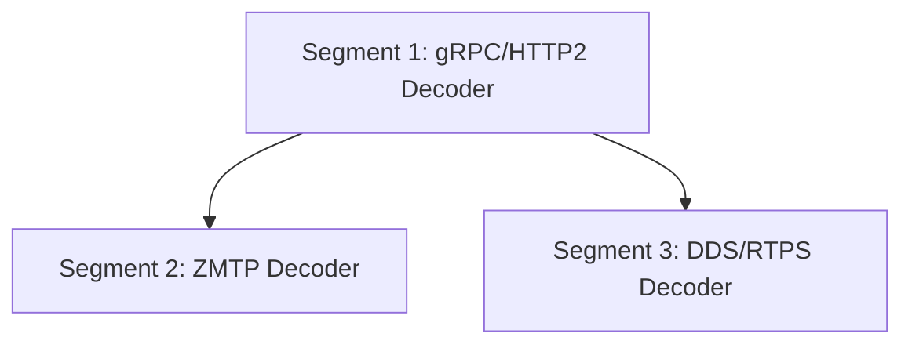

# Subsection 4: Protocol Decoders -- Manifest

## Dependency Diagram

Segments 2 and 3 depend on Segment 1 (which defines the protocol dispatch infrastructure) but are independent of each other and can run in parallel.

## Segment Index

| # | Title | File | Depends On | Risk | Complexity | Status |
|---|-------|------|------------|------|------------|--------|
| 1 | gRPC/HTTP2 Decoder | segments/01-grpc-http2-decoder.md | None | 6/10 | High | pending |
| 2 | ZMTP Decoder | segments/02-zmtp-decoder.md | 1 | 4/10 | Medium | pending |
| 3 | DDS/RTPS Decoder | segments/03-dds-rtps-decoder.md | 1 | 5/10 | Medium | pending |

## Parallelization

Segments 2 and 3 are independent and can run in parallel after Segment 1 completes.
Phase A: Segment 1 (1 agent)
Phase B: Segments 2 + 3 (2 agents in parallel)

## Preamble Injection

Before launching any builder subagent, the orchestration agent assembles the prompt:
1. Read `iterative-builder-prompt.mdc` from `.cursor/rules/`
2. Read `devcontainer-exec.mdc` from `.cursor/rules/` (if applicable)
3. Read the segment file from `segments/{NN}-{slug}.md`

Assembled prompt = [preamble contents] + [segment file contents]

## Execution Instructions

1. Launch Segment 1 (gRPC). Wait for completion.
2. Launch Segments 2 (ZMTP) and 3 (DDS/RTPS) in parallel. Wait for both.
3. Run deep-verify.
4. If verification finds gaps, re-enter deep-plan on the unresolved items.
