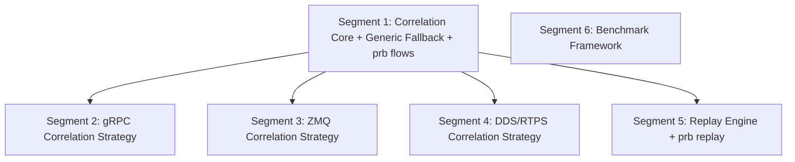

# Subsection 5: Analysis & Replay -- Deep Plan

**Goal:** Implement the correlation engine with per-protocol strategies, replay engine with timed structured output, `prb flows` and `prb replay` CLI commands, and performance benchmarking framework.
**Generated:** 2026-03-09
**Rules version:** 2026-03-08
**Entry point:** B (Enrich Existing Plan)
**Status:** Ready for execution
**Parent plan:** `universal-message-debugger-phase1-2026-03-08.md`

---

## Overview

This plan decomposes Subsection 5 of the Universal Message Debugger Phase 1 into 6 segments. Segment 1 establishes the correlation engine core with a generic fallback strategy and the `prb flows` CLI command as a walking skeleton. Segments 2, 3, and 4 implement per-protocol correlation strategies (gRPC, ZMQ, DDS respectively) and are independent of each other. Segment 5 builds the replay engine with timed output and the `prb replay` CLI command. Segment 6 sets up the benchmark framework. After Segment 1, up to 4 segments can run in parallel.

Research verification against RFC 7540, ZMTP RFCs, OMG DDS-RTPS v2.5, Wireshark dissector documentation, crates.io registry data, and tokio maintainer statements identified 6 corrections to the parent plan and 3 new concerns. The most significant findings: (1) gRPC stream IDs are never reused (the parent plan's pre-mortem was wrong), (2) ZMQ correlation must be per-socket-type rather than generic, (3) DDS correlation requires a two-phase discovery cache, and (4) `divan` has superseded `criterion` as the recommended Rust benchmarking framework.

---

## Research Verification Summary

### Confirmed Accurate

- gRPC correlation by HTTP/2 stream ID is the standard approach (Wireshark gRPC wiki, gRPC-over-HTTP/2 spec)
- Replay as structured stdout with timing is a valid Phase 1 starting point (tcpreplay evolutionary path)
- MCAP Rust crate provides `MessageStream` for reading stored events (docs.rs/mcap)
- Tokio timers have 1ms resolution (tokio issue #970, maintainer confirmation)
- DDS uses GUID prefix + entity ID for entity identification (OMG DDS-RTPS v2.5, RTI documentation)
- `criterion` is still actively maintained: v0.8.2 released Feb 2026 (crates.io)

### Corrections to Parent Plan

| # | Parent Plan Claim | Research Finding | Severity |
|---|---|---|---|
| 1 | Issue 9 pre-mortem: "gRPC stream IDs are reused after RST_STREAM" | **Wrong.** RFC 7540 Section 5.1.1: stream IDs are monotonically increasing, never reused. Client uses odd, server uses even. ~12.4 days to exhaust at 1ms/exchange. | High |
| 2 | Issue 9: ZMQ "correlate by (topic, socket identity) for REQ/REP" | **Over-simplified.** REQ/REP is strict lockstep on TCP connection -- correlation by connection alternation, not socket identity. Socket identity is optional in ZMTP. PUB/SUB uses prefix-based topic matching on first frame bytes. ROUTER/DEALER needs multi-frame envelope parsing. | High |
| 3 | Issue 9: DDS "correlate by (domain ID, topic name, GUID prefix)" | **Incomplete.** Topic name is NOT in RTPS DATA submessages. It appears only in SPDP/SEDP discovery submessages. Must build discovery cache (GUID to topic mapping) first, then correlate data against it. | High |
| 4 | Issue 12: "Use `criterion` for compatibility and ecosystem support" | **Outdated.** `divan` (v0.1.21, 2.67M+ downloads) is now recommended with allocation profiling, thread contention insights, simpler API. CodSpeed recommends divan as preferred. | Medium |
| 5 | Subsection 5: "No new external protocol libraries" | **Incomplete.** Needs `tabled` (20.6M+ downloads, derive macros) for CLI table output formatting. | Low |
| 6 | Issue 9 pre-mortem: "ZMQ socket identity is optional; breaking REQ/REP correlation" | **Misattributed.** REQ/REP does not use socket identity at all. It works by strict send/recv lockstep. This concern applies only to ROUTER/DEALER patterns. | Medium |

### New Concerns Identified

| # | Concern | Impact |
|---|---|---|
| A | MCAP Rust API `MessageStream` iterates all messages. Filtering for `--filter` must be application-level. Optimize using MCAP summary section to pre-build channel allowlist. | Medium |
| B | DDS discovery cache requires SEDP messages. If discovery traffic is missing from capture, correlation degrades to GUID-only (no topic names). | Medium |
| C | Flow state persistence model unspecified. Recommendation: compute on-demand for Phase 1 (simple, O(n) per query). Precomputed indexes deferred to Phase 2. | Medium |

---

## Dependency Diagram



Segment 6 has zero dependencies and can run in parallel with any segment including Segment 1. Segments 2, 3, 4, and 5 are mutually independent and can all run in parallel after Segment 1 completes. Maximum parallelism after Segment 1: 4 concurrent builders (Segments 2+3+4+5), then Segment 6 (or Segment 6 runs alongside Segment 1).

---

## Issue Analysis Briefs

### Issue S5-1: Correlation Engine Architecture and Flow State Model

**Core Problem:**
The parent plan defines a `CorrelationStrategy` trait in Subsection 1's core crate but does not specify how the correlation engine dispatches to strategies, iterates through stored events, or persists computed flows. Without this architecture, individual protocol strategies have no framework to plug into.

**Root Cause:**
The parent plan treats correlation as a collection of per-protocol strategies without defining the orchestrating engine that ties them together.

**Proposed Fix:**
Build a `CorrelationEngine` that: (1) reads events from MCAP storage via `MessageStream`, (2) identifies each event's transport type from `DebugEvent` metadata, (3) dispatches to the appropriate `CorrelationStrategy` implementation, (4) maintains a `FlowSet` mapping flow IDs to ordered event lists, (5) supports a generic fallback for unrecognized transports.

Flow state is computed on-demand for Phase 1. Precomputed flow indexes deferred to Phase 2 optimization. Rationale: on-demand computation is simpler, and MCAP's memory-mapped sequential read is fast enough for sessions up to 1M events.

API sketch:
```rust
pub struct CorrelationEngine {
    strategies: Vec<Box<dyn CorrelationStrategy>>,
    fallback: GenericCorrelationStrategy,
}

impl CorrelationEngine {
    pub fn correlate(&self, events: &[DebugEvent]) -> FlowSet {
        let mut flows = FlowSet::new();
        for event in events {
            let strategy = self.strategy_for(event);
            let flow_id = strategy.assign_flow(event, &mut flows);
            flows.add_event(flow_id, event);
        }
        flows
    }
}
```

**Existing Solutions Evaluated:**
- `retina` (Stanford, Rust, 100Gbps network analysis) -- provides flow tracking for live capture. Not usable for offline MCAP-based analysis. Rejected: live-only, heavyweight.
- No existing Rust library provides generic multi-protocol message correlation over stored events. Custom implementation required.

**Alternatives Considered:**
- Precompute flows during ingest and store in MCAP metadata. Rejected for Phase 1: adds complexity to the ingest pipeline and Subsections 1-3 are already built without flow-aware ingest. Suitable for Phase 2.
- Use SQLite for flow indexing. Rejected: adds a dependency and persistence format beyond MCAP. Overkill for Phase 1.

**Pre-Mortem -- What Could Go Wrong:**
- Memory: loading all events for correlation may fail for very large sessions. Mitigation: streaming correlation that processes events in MCAP order without full materialization.
- Dispatch overhead: checking each event against all strategies sequentially. Mitigation: O(1) dispatch via transport type enum match, not iteration.
- Flow explosion: if correlation keys are too fine-grained, every event becomes its own "flow." Need minimum flow size or grouping thresholds.

**Risk Factor:** 4/10

**Evidence for Optimality:**
- External evidence: Wireshark's "Follow Stream" feature uses this exact pattern -- dispatch to protocol-specific dissector, track conversation by protocol-specific key.
- External evidence: Zeek (formerly Bro) IDS uses per-protocol "analyzers" dispatched by transport type, the same architecture pattern.

**Blast Radius:**
- Direct: `prb-correlation` crate (new), `prb-cli` (new `flows` subcommand)
- Ripple: replay engine consumes flows for filtered replay

---

### Issue S5-2: gRPC Correlation -- Stream ID Semantics Correction

**Core Problem:**
The parent plan's Issue 9 pre-mortem states "gRPC stream IDs are reused after RST_STREAM; correlation must scope to a connection lifetime." This is factually incorrect per RFC 7540 Section 5.1.1. Stream IDs are monotonically increasing and never reused within an HTTP/2 connection. The actual risks are: (a) multiple TCP connections to the same server produce overlapping stream ID sequences, (b) GOAWAY frames signal connection teardown and affect in-flight streams.

**Root Cause:**
Confusion between stream ID reuse (which does not happen per RFC 7540) and connection multiplexing (which does).

**Proposed Fix:**
Implement gRPC correlation with key `(connection_id, stream_id)` where `connection_id` is derived from the TCP 4-tuple (src_ip, src_port, dst_ip, dst_port) assigned during Subsection 3's TCP reassembly. Extract method name from the `:path` pseudo-header in the HEADERS frame (populated by Subsection 4's gRPC decoder). Group request HEADERS + DATA and response HEADERS + DATA + TRAILERS by stream ID within a connection.

Edge cases:
- GOAWAY: streams with ID > last_stream_id are flagged as interrupted
- RST_STREAM: mark the flow as errored with the HTTP/2 error code
- Streaming RPCs (server-streaming, client-streaming, bidi): one stream ID carries multiple DATA frames -- this is one flow, not multiple

**Existing Solutions Evaluated:**
- N/A -- correlation logic is specific to our event model. Wireshark's gRPC dissector (C, GPL) is the reference implementation; architecture is transferable, not code.

**Alternatives Considered:**
- Correlate by method name only without stream ID. Rejected: multiple concurrent calls to the same method are indistinguishable without stream ID.

**Pre-Mortem -- What Could Go Wrong:**
- Connection ID relies on TCP 4-tuple from Subsection 3. If TCP reassembly doesn't propagate this into DebugEvent, correlation fails. Must verify DebugEvent carries connection context.
- HPACK decompression failure (mid-stream capture, see parent plan Issue 2) loses method name. Graceful degradation: correlate by stream ID without method label.
- Long-lived gRPC connections with thousands of streams produce large flow sets.

**Risk Factor:** 3/10

**Evidence for Optimality:**
- External evidence: RFC 7540 Section 5.1.1 states stream IDs "MUST be numerically greater than all streams that the initiating endpoint has opened or reserved."
- External evidence: Wireshark's gRPC dissector correlates by HTTP/2 stream ID within connection (wiki.wireshark.org/gRPC).

**Blast Radius:**
- Direct: gRPC correlation strategy in `prb-correlation`
- Ripple: requires DebugEvent to carry `connection_id` and `stream_id` from Subsection 4

---

### Issue S5-3: ZMQ Correlation -- Per-Socket-Type Strategy Required

**Core Problem:**
The parent plan says "correlate by (topic, socket identity) for REQ/REP patterns. PUB/SUB has no correlation; group by topic only." Research shows this is substantially wrong. ZMTP has fundamentally different correlation semantics per socket type:
- REQ/REP: strict lockstep alternation on TCP connection (recv, send, recv, send). Identity frames are NOT involved.
- PUB/SUB: messages prefixed with topic bytes (first frame). Subscription commands (0x01 + topic) visible in captured ZMTP traffic.
- ROUTER/DEALER: multi-frame envelopes with identity frames and empty delimiter. This is the ONLY pattern where socket identity matters.

**Root Cause:**
The parent plan conflates REQ/REP correlation (connection-level lockstep) with ROUTER/DEALER correlation (identity envelopes).

**Proposed Fix:**
Implement three ZMQ sub-strategies:

1. **REQ/REP:** Correlate by TCP connection. Within each connection, messages alternate request/reply. Pair by send order: message[0]=request, message[1]=reply, message[2]=request, etc.
2. **PUB/SUB:** No request-response correlation. Group by topic prefix (extracted from first frame bytes). Subscription commands (0x01/0x00 + topic) are metadata events, not data flows.
3. **ROUTER/DEALER:** Parse multi-frame message structure. Identity in envelope frames before empty delimiter. Correlate by identity bytes when present, fall back to connection-level grouping when absent.

Socket type is known from the ZMTP greeting frame (parsed by Subsection 4's ZMQ decoder). Strategy selected based on socket type pair. If socket type unknown (mid-stream capture), delegate to generic fallback.

**Existing Solutions Evaluated:**
- `zmtp` crate (v0.6.0, crates.io) -- provides frame/greeting parsing with `Traffic`, `TrafficReader` types. However: only 54 downloads/90 days, depends on old `byteorder 0.5.3`. Effectively unmaintained. Subsection 4 handles ZMTP parsing; correlation here consumes parsed metadata only.
- `zmtpdump` (GitHub: zeromq/zmtpdump) -- ZeroMQ transport protocol packet analyzer. Reference for ZMTP analysis architecture.
- Wireshark ZMTP dissector -- provides frame-level parsing with identity extraction.

**Alternatives Considered:**
- Single "(topic, socket identity)" strategy for all socket types. Rejected: incorrectly pairs PUB messages as "requests" to other PUB messages.
- Require users to specify socket types manually. Rejected: ZMTP greeting frame contains socket type; auto-detection is possible and preferred.

**Pre-Mortem -- What Could Go Wrong:**
- Socket type detection requires ZMTP greeting capture (connection start). Mid-stream captures lose socket type; fall back to generic.
- ROUTER/DEALER through proxies produce multi-hop envelopes with multiple identity frames. Deep parsing needed.
- ZMQ multipart messages (MORE flag) must be reassembled by Subsection 4 before correlation sees them.

**Risk Factor:** 5/10

**Evidence for Optimality:**
- External evidence: ZMTP RFC 28 (REQ/REP spec) defines strict alternating send/recv that forms lockstep correlation basis.
- External evidence: ZMTP RFC 29 (PUB/SUB spec) defines topic prefix matching on first frame bytes.

**Blast Radius:**
- Direct: ZMQ correlation strategy in `prb-correlation`
- Ripple: requires DebugEvent to carry `socket_type`, `topic`, optionally `identity` from Subsection 4

---

### Issue S5-4: DDS Correlation -- Two-Phase Discovery Cache

**Core Problem:**
The parent plan says "correlate by (domain ID, topic name, GUID prefix)" implying topic name is available in every RTPS message. It is not. Topic name and type name appear ONLY in SEDP (Simple Endpoint Discovery Protocol) DATA submessages -- specifically in `PublicationBuiltinTopicData` and `SubscriptionBuiltinTopicData`. Regular user data messages contain only the writer/reader GUID (prefix + entity ID). Correlation requires first building a discovery cache, then looking up topic names by GUID.

**Root Cause:**
The parent plan does not distinguish between RTPS discovery traffic and RTPS user data traffic. These carry fundamentally different information.

**Proposed Fix:**
Implement two-phase DDS correlation:

**Phase A -- Discovery Cache:**
1. Scan events for RTPS SPDP/SEDP submessages (well-known entity IDs: `0x000100c2` for SEDP publications, `0x000100c7` for subscriptions)
2. Extract: writer/reader GUID, topic name, type name, domain ID, QoS parameters
3. Build `HashMap<GUID, DiscoveryInfo>` mapping each writer/reader to its topic

**Phase B -- Data Correlation:**
1. For each RTPS DATA submessage, extract the writer GUID
2. Look up writer GUID in discovery cache to get topic name
3. Correlation key: `(domain_id, topic_name)` groups all writers and readers for the same topic
4. Within a topic, match DataWriter events to DataReader ACKNACKs by sequence number

**Graceful degradation:** If discovery traffic is missing, emit a warning and fall back to GUID-only correlation without topic names. Display GUID prefix as hex string.

**Domain ID inference:** Extract from `PID_DOMAIN_ID` in discovery messages, or infer from UDP destination port using RTPS spec formula: `port = 7400 + 250 * domain_id + offset`.

**Existing Solutions Evaluated:**
- `rtps-parser` (crates.io, v0.1.1) -- passive RTPS message parser extracted from Dust DDS. Suitable for Subsection 4's RTPS parsing.
- `rustdds` (v0.11.8) -- full DDS implementation with RTPS. Too heavyweight for passive correlation.
- `ddshark` (GitHub: NEWSLabNTU/ddshark) -- RTPS monitoring tool. Reference for discovery information extraction.
- RTI Wireshark RTPS dissector docs -- reference for GUID filtering and topic correlation approach.

**Alternatives Considered:**
- Require users to provide a DDS discovery dump file separately. Rejected: poor UX; if discovery traffic is in the capture, extract it automatically.
- Skip topic-level correlation, only show GUID-based grouping. Rejected: GUIDs are opaque hex strings; topic names are essential for usability.

**Pre-Mortem -- What Could Go Wrong:**
- Discovery traffic may be in a separate pcap (common when data and discovery use different multicast groups). Without discovery, topic names unknown.
- RTPS vendorId-specific extensions in discovery data may cause parsing failures for non-standard DDS implementations.
- Sequence number matching assumes RTPS reliable mode. Best-effort connections lack ACKNACKs.
- RTPS fragment reassembly (large messages) should be handled by Subsections 3-4. If not, large discovery messages may be incomplete.

**Risk Factor:** 7/10

**Evidence for Optimality:**
- External evidence: RTI Wireshark documentation describes enabling "Topic Information" to map DataWriter GUIDs to topics via discovery traffic -- the exact pattern proposed here.
- External evidence: OMG DDS-RTPS v2.5 specification defines SEDP entity IDs and the discovery protocol for writer/reader matching.

**Blast Radius:**
- Direct: DDS correlation strategy in `prb-correlation`
- Ripple: requires DebugEvent to carry RTPS-specific metadata (GUID prefix, entity ID, submessage type, sequence number) from Subsection 4

---

### Issue S5-5: Replay Timing Accuracy Below 1ms

**Core Problem:**
Tokio's timer driver has millisecond resolution. Events spaced less than 1ms apart (common in burst traffic -- gRPC can produce hundreds of messages in microseconds) will replay with incorrect timing. The parent plan identifies this as a risk but proposes no mitigation.

**Root Cause:**
Tokio optimizes for async I/O workloads where 1ms resolution is sufficient. Sub-millisecond timing is not its design target.

**Proposed Fix:**
Implement a hybrid timing strategy:
1. For inter-event gaps >= 1ms: use `tokio::time::sleep` (efficient, yields CPU)
2. For inter-event gaps < 1ms: use `Instant::now()` spin-wait with `std::hint::spin_loop()`
3. For `--speed max` mode: skip all timing, output as fast as possible

```rust
let mut last_ts = events[0].timestamp;
for event in &events {
    let delta = event.timestamp - last_ts;
    let adjusted = delta / speed_multiplier;
    if adjusted >= Duration::from_millis(1) {
        tokio::time::sleep(adjusted).await;
    } else if adjusted > Duration::ZERO {
        let target = Instant::now() + adjusted;
        while Instant::now() < target {
            std::hint::spin_loop();
        }
    }
    output_event(event, &mut writer)?;
    last_ts = event.timestamp;
}
```

**Existing Solutions Evaluated:**
- `sturgeon` (crates.io) -- async stream replay with speed multipliers. Designed for recording/replaying live async streams, not MCAP file playback. Not directly adoptable.
- `crossbeam_utils::Backoff` -- exponential backoff spin-wait. Too coarse for precise sub-ms timing; designed for contention, not time targets.
- `tokio-timerfd` -- Linux-only high-resolution timer using timerfd. macOS unsupported. Rejected for Phase 1 (cross-platform required).

**Alternatives Considered:**
- Always use spin-wait. Rejected: consumes 100% CPU even for long gaps. Unacceptable for multi-minute replays.
- Ignore sub-millisecond timing (round up to 1ms). Rejected: distorts burst patterns which are often the most interesting traffic for debugging.

**Pre-Mortem -- What Could Go Wrong:**
- Spin-wait on a loaded system may overshoot due to OS scheduling delays. This is inherent and should be documented.
- Speed multiplier < 1.0 (slow-motion) amplifies all gaps, making even sub-ms gaps sleepable. Less of a concern.
- Windows timer resolution is ~16ms, making even the 1ms threshold unreliable. Document as a known Windows limitation.

**Risk Factor:** 3/10

**Evidence for Optimality:**
- External evidence: tcpreplay uses the exact same hybrid approach -- busy-loop polling (rdtsc/gettimeofday) for precise timing, OS sleep as fallback. Documented in tcpreplay wiki and man page.
- External evidence: Linux kernel documentation recommends busy-wait for sub-millisecond delays (`asm volatile("pause")` pattern).

**Blast Radius:**
- Direct: replay engine timing module
- Ripple: none (isolated to replay)

---

### Issue S5-6: Replay Output Throughput and Formatting

**Core Problem:**
Rust's stdout is line-buffered by default. Each `println!()` triggers a syscall. At 100k events/sec (the stated performance target), this produces 100k syscalls/sec, throttling replay to a fraction of target speed. Research confirms: 500K lines with println takes ~17.6s vs ~3.7s with BufWriter (4.7x speedup).

**Root Cause:**
The parent plan mentions stdout buffering as a concern but does not prescribe a solution or specify output formatting libraries.

**Proposed Fix:**
1. Wrap stdout in `BufWriter` for all replay output. Flush on completion and on Ctrl+C (signal handler).
2. Two output formats:
   - `--format json`: one JSON object per line (NDJSON). Use `serde_json::to_writer()` directly to BufWriter.
   - `--format table` (default): human-readable table using `tabled` crate with derive macros.
3. Pre-format events into a buffer before writing to minimize per-event overhead.
4. For piped output (not a terminal), automatically switch to block buffering and suppress color codes.

CLI: `prb replay session.mcap [--speed 2.0] [--filter 'transport=grpc'] [--format json|table]`

**Existing Solutions Evaluated:**
- `tabled` (crates.io, v0.20.0, 20.6M+ downloads, 597 reverse deps) -- derive-macro table formatting with multiple themes, color, padding. Best fit for structured DebugEvent output. Adopted.
- `comfy-table` (v7.2.2, 60M+ downloads) -- manual table construction with auto-wrapping. More mature but lacks derive macros. Better for dynamic schemas; our events have known structure. Rejected as secondary choice.
- `serde_json` (already in workspace from Subsection 1) -- handles JSON output mode. No additional dependency.

**Alternatives Considered:**
- Custom formatting with `write!()` macros. Rejected: reinvents what tabled provides; error-prone alignment handling.
- Use `indicatif` for progress bars during replay. Deferred to Phase 2: useful but not core functionality.

**Pre-Mortem -- What Could Go Wrong:**
- `tabled` derive macros may conflict with existing `serde::Serialize` derives on DebugEvent. Mitigation: use a separate `EventDisplay` type for table output.
- BufWriter loses data on abnormal termination (Ctrl+C). Mitigation: register a signal handler that flushes before exit.
- JSON output for large events may produce very long lines. Consider `--pretty` flag for indented JSON.

**Risk Factor:** 2/10

**Evidence for Optimality:**
- External evidence: Rust Users Forum "Efficient stdout: buffers all the way down" confirms BufWriter wrapping as the standard approach for high-throughput CLI output.
- Existing solutions: `tabled` is the most-downloaded Rust table formatting library with active maintenance through 2025.

**Blast Radius:**
- Direct: replay output module, CLI argument parsing
- Ripple: `prb flows` command benefits from the same formatting infrastructure

---

### Issue S5-7: MCAP Message Filtering for Replay

**Core Problem:**
The Rust MCAP crate's `MessageStream` iterates all messages in file order. To implement `prb replay --filter 'transport=grpc'`, the engine must read every message and filter in application code. For a 1M-event session where only 1% match, this means scanning 99% of events unnecessarily.

**Root Cause:**
The MCAP Rust API does not expose topic/channel-level filtering. The MCAP format itself supports a summary section with channel listings, but the Rust API does not use it for selective reading.

**Proposed Fix:**
1. **Channel pre-filtering:** Before iterating messages, read the MCAP summary section to get the channel list. Map channels to transport types using channel metadata (topic names contain transport prefix, e.g., `/grpc/...`, `/zmq/...`). Build a `HashSet<u16>` allowlist of channel IDs.
2. **Per-message filtering:** During iteration, skip messages whose `channel_id` is not in the allowlist. O(1) per message.
3. **Time-range filtering:** Accept `--start` and `--end` timestamp flags. Skip messages outside the range. MCAP stores messages in timestamp order within chunks, enabling efficient skip-ahead.
4. **Filter syntax:** Simple key-value pairs: `transport=grpc`, `topic=/my/topic`, `flow=<flow_id>`. No regex for Phase 1.

**Existing Solutions Evaluated:**
- MCAP CLI has a `filter` subcommand (PR #445 in foxglove/mcap) that filters by topic regex and time range. Validates the architectural approach.
- MCAP Go library's `readMessages()` accepts topic filter options. The Rust API lacks this, confirming application-level implementation is required.

**Alternatives Considered:**
- Build a secondary index file alongside MCAP for fast lookups. Rejected for Phase 1: adds file management complexity. Suitable for Phase 2 with a `.prb-index` sidecar.
- Use chunk-level statistics to skip entire chunks lacking matching channels. Rejected for Phase 1: requires chunk index parsing and seek. Good Phase 2 optimization.

**Pre-Mortem -- What Could Go Wrong:**
- Channel metadata schema varies by how events were written in Subsection 2. If naming convention does not encode transport type, channel pre-filtering fails. Must coordinate with Subsection 2's storage schema.
- MCAP files without a summary section (truncated captures) require full scan with no optimization.

**Risk Factor:** 3/10

**Evidence for Optimality:**
- Existing solutions: MCAP's own CLI filter command uses the same approach (channel-level filtering with time ranges), validated by MCAP maintainers.
- External evidence: MCAP specification documents summary section and channel/statistics records enabling pre-filtering.

**Blast Radius:**
- Direct: MCAP reader wrapper in replay engine
- Ripple: `prb flows` command can reuse the same filtering infrastructure

---

### Issue S5-8: Benchmarking Framework Selection

**Core Problem:**
The parent plan recommends `criterion` for benchmarking. While criterion (v0.8.2, Feb 2026) is actively maintained, `divan` (v0.1.21) is now the preferred choice in the Rust ecosystem with features directly relevant to this project: allocation profiling (catches memory bloat in large-capture processing), thread contention insights (relevant for concurrent correlation), and a simpler API.

**Root Cause:**
The parent plan was written when criterion was the unquestioned default. The ecosystem has since shifted toward divan.

**Proposed Fix:**
Use `divan` as the primary benchmarking framework. Define standard test scenarios:

| Scenario | Events | Approx Size | Purpose |
|---|---|---|---|
| Small | 1,000 | ~100 KB | Unit benchmark for single-operation latency |
| Medium | 100,000 | ~50 MB | Integration benchmark for full pipeline |
| Large | 1,000,000 | ~500 MB | Stress test for memory and throughput |

Each event is a `DebugEvent` with: 8-byte timestamp, 4-byte transport enum, 32-byte metadata (connection_id, stream_id, topic), variable payload (avg 200 bytes for protobuf, 50 bytes for headers).

Benchmarks to implement:
- `bench_correlate_grpc`: correlate medium gRPC session, measure events/sec
- `bench_correlate_dds`: correlate medium DDS session with discovery phase, measure events/sec
- `bench_replay_stdout`: replay medium session at max speed, measure MB/s
- `bench_mcap_filter`: filter 1% of a large session, measure scan throughput
- `bench_flow_query`: compute flows from medium session, measure wall-clock time

Reference hardware: "modern laptop: 8+ cores, 16GB+ RAM, NVMe SSD." Targets: medium scenario ingest < 1s, replay at max speed < 2s, flow computation < 500ms.

**Existing Solutions Evaluated:**
- `divan` (crates.io, v0.1.21, 2.67M+ downloads, 266 reverse deps, actively maintained) -- attribute-macro benchmarking with allocation profiling. Adopted.
- `criterion` (crates.io, v0.8.2, 28M+ downloads, actively maintained) -- traditional statistical benchmarking. Viable fallback but lacks allocation profiling.

**Alternatives Considered:**
- Use criterion for broader ecosystem compatibility. Not rejected outright, but divan's allocation profiling is a differentiator for processing large captures.
- Skip formal benchmarks, use `std::time::Instant` in tests. Rejected: not statistically rigorous; noisy and non-reproducible.

**Pre-Mortem -- What Could Go Wrong:**
- divan MSRV is Rust 1.80.0. If project targets older MSRV, divan will not compile.
- Benchmark fixtures (test MCAP files with known event counts) must be generated and committed. If too large for git, need a generation script.
- Benchmark results vary between CI and developer machines. Document reference hardware and accept variance.

**Risk Factor:** 2/10

**Evidence for Optimality:**
- Existing solutions: CodSpeed (benchmark CI platform) recommends divan as "most convenient way to run Rust benchmarks."
- External evidence: divan's allocation profiling directly addresses memory efficiency concerns with large captures.

**Blast Radius:**
- Direct: `benches/` directory, `Cargo.toml` dev-dependencies
- Ripple: CI pipeline (benchmarks should run but not gate PRs)

---

## Segment Briefs

### Segment 1: Correlation Engine Core + Generic Fallback + `prb flows`
> **Execution method:** Launch as an `iterative-builder` subagent (Task tool, subagent_type="generalPurpose"). The orchestration agent reads and prepends `iterative-builder-prompt.mdc` and `devcontainer-exec.mdc` at launch time per `orchestration-protocol.mdc`.

**Goal:** Establish the correlation engine architecture with generic fallback and a working `prb flows` CLI command that displays flow-grouped events.

**Depends on:** None (within this subsection). Requires Subsections 1-4 complete (DebugEvent type, MCAP storage, protocol decoders).

**Issues addressed:** Issue S5-1 (correlation architecture and flow state model)

**Cycle budget:** 15 cycles

**Scope:**
- `prb-correlation` crate: `CorrelationEngine`, `FlowSet`, `Flow`, `GenericCorrelationStrategy`
- `prb-cli` crate: `prb flows` subcommand
- Shared output formatting infrastructure (tabled + JSON)

**Key files and context:**
- `crates/prb-correlation/src/lib.rs` -- crate root, re-exports
- `crates/prb-correlation/src/engine.rs` -- `CorrelationEngine` struct with strategy dispatch
- `crates/prb-correlation/src/flow.rs` -- `FlowSet`, `Flow`, `FlowId` types
- `crates/prb-correlation/src/generic.rs` -- `GenericCorrelationStrategy` (IP-tuple + timestamp proximity)
- `crates/prb-cli/src/commands/flows.rs` -- `prb flows` command implementation
- `crates/prb-core/src/traits.rs` -- `CorrelationStrategy` trait (defined in Subsection 1, consumed here)
- `crates/prb-core/src/event.rs` -- `DebugEvent` type (defined in Subsection 1)
- `crates/prb-storage/src/lib.rs` -- MCAP read API (defined in Subsection 2)

The `CorrelationStrategy` trait from prb-core:
```rust
pub trait CorrelationStrategy: Send + Sync {
    fn name(&self) -> &str;
    fn matches(&self, event: &DebugEvent) -> bool;
    fn correlation_key(&self, event: &DebugEvent) -> Option<CorrelationKey>;
}
```

The `CorrelationEngine` dispatches to the first matching strategy for each event. `GenericCorrelationStrategy` uses `(src_addr, dst_addr, timestamp_bucket)` as the correlation key, where `timestamp_bucket` groups events within a configurable window (default 100ms).

A `Flow` contains: `id: FlowId`, `transport: TransportKind`, `correlation_key: CorrelationKey`, `event_count: usize`, `first_timestamp: Timestamp`, `last_timestamp: Timestamp`, `metadata: HashMap<String, String>` (protocol-specific info like method name, topic).

`FlowSet` stores flows in a `BTreeMap<FlowId, Flow>` for ordered iteration by first timestamp.

**Implementation approach:**
1. Create `prb-correlation` crate with engine, flow types, and generic strategy.
2. Engine reads DebugEvents from MCAP via storage API, iterates in timestamp order, assigns each event to a flow via strategy dispatch.
3. `prb flows` subcommand: loads MCAP session, runs correlation engine, displays flows in table format.
4. Output infrastructure: shared formatting module with `format_table()` and `format_json()` using `tabled` and `serde_json`.
5. Add `tabled` to `prb-cli` dependencies.

**Alternatives ruled out:**
- Precomputing flows during ingest (adds complexity to Subsections 1-3 which are already built)
- SQLite-based flow index (heavyweight dependency for Phase 1)
- Single global strategy without dispatch (fails for multi-protocol sessions)

**Pre-mortem risks:**
- Memory pressure with very large sessions. Test with 1M events to verify.
- Generic strategy timestamp bucket may be too coarse (groups unrelated events) or too fine (one event per flow). Make configurable.
- DebugEvent may not carry all needed metadata fields. Verify against Subsection 4 output.

**Segment-specific commands:**
- Build: `cargo build -p prb-correlation -p prb-cli`
- Test (targeted): `cargo nextest run -p prb-correlation`
- Test (regression): `cargo nextest run -p prb-core -p prb-storage -p prb-cli`
- Test (full gate): `cargo nextest run --workspace`

**Exit criteria:**

All of the following must be satisfied:

1. **Targeted tests:**
   - `test_engine_dispatches_to_matching_strategy`: CorrelationEngine with two mock strategies correctly dispatches based on transport type.
   - `test_generic_strategy_groups_by_ip_tuple`: Events with same src/dst addr grouped; different addrs produce separate flows.
   - `test_generic_strategy_timestamp_bucket`: Events >100ms apart (same addrs) produce separate flows.
   - `test_flow_set_ordering`: Flows returned sorted by first_timestamp.
   - `test_prb_flows_json_output`: `prb flows session.mcap --format json` produces valid NDJSON with expected fields.
   - `test_prb_flows_table_output`: `prb flows session.mcap` produces formatted table with columns: Flow ID, Transport, Events, Duration, Key.
2. **Regression tests:** All existing workspace tests pass (`cargo nextest run --workspace`).
3. **Full build gate:** `cargo build --workspace`
4. **Full test gate:** `cargo nextest run --workspace`
5. **Self-review gate:** No dead code, no commented-out blocks, no TODO hacks, no changes outside stated scope.
6. **Scope verification gate:** Changed files within `crates/prb-correlation/`, `crates/prb-cli/src/commands/flows.rs`, and `crates/prb-cli/Cargo.toml`. Out-of-scope changes documented.

**Risk factor:** 4/10

**Estimated complexity:** Medium

**Commit message:**
`feat(correlation): add correlation engine with generic fallback and prb flows command`

---

### Segment 2: gRPC Correlation Strategy
> **Execution method:** Launch as an `iterative-builder` subagent (Task tool, subagent_type="generalPurpose"). The orchestration agent reads and prepends `iterative-builder-prompt.mdc` and `devcontainer-exec.mdc` at launch time per `orchestration-protocol.mdc`.

**Goal:** Implement gRPC-specific correlation by (connection_id, HTTP/2 stream_id) with method name extraction.

**Depends on:** Segment 1

**Issues addressed:** Issue S5-2 (gRPC stream ID semantics correction)

**Cycle budget:** 10 cycles

**Scope:**
- `crates/prb-correlation/src/grpc.rs` -- `GrpcCorrelationStrategy`

**Key files and context:**
- `crates/prb-correlation/src/grpc.rs` -- new file
- `crates/prb-correlation/src/engine.rs` -- register gRPC strategy in default engine constructor
- `crates/prb-core/src/event.rs` -- DebugEvent must carry: `connection_id` (TCP 4-tuple hash from Subsection 3), `stream_id` (u32 from Subsection 4's gRPC decoder), `method` (Option<String> from `:path` pseudo-header in HEADERS frame), `grpc_status` (Option from trailers)
- HTTP/2 stream IDs are odd (client-initiated) and monotonically increasing per RFC 7540 Section 5.1.1. They are NEVER reused within a connection. Do not implement stream ID reuse handling -- it is unnecessary.
- GOAWAY frame contains `last_stream_id`. Streams with ID > that value were not processed.
- RST_STREAM terminates a single stream with an error code.
- Streaming RPCs: one stream ID carries multiple DATA frames. This is one flow, not multiple.
- A connection can carry thousands of concurrent streams. Each is an independent flow.

**Implementation approach:**
1. `GrpcCorrelationStrategy` matches events where `transport == TransportKind::Grpc`.
2. Correlation key: `CorrelationKey::Grpc { connection_id, stream_id }`.
3. Flow metadata: extract `method` from first HEADERS event in the flow, `status` from TRAILERS event.
4. Streaming RPCs: multiple DATA frames on same stream = one flow (already handled by key design).
5. RST_STREAM: mark flow as `errored` with error code in metadata.
6. GOAWAY: flows with stream_id > goaway.last_stream_id get `interrupted` status in metadata.

**Alternatives ruled out:**
- Correlating by method name only (concurrent calls to same method indistinguishable)
- Worrying about stream ID reuse (does not happen per RFC 7540)
- Implementing HPACK decompression in correlation (belongs in Subsection 4)

**Pre-mortem risks:**
- Missing `connection_id` in DebugEvent from Subsection 4. Verify field exists during implementation.
- HPACK failure loses method name. Graceful degradation: flow without method label, log warning.
- Very long-lived connections with thousands of streams produce large flow sets. Test with high stream count.

**Segment-specific commands:**
- Build: `cargo build -p prb-correlation`
- Test (targeted): `cargo nextest run -p prb-correlation -- grpc`
- Test (regression): `cargo nextest run -p prb-correlation -p prb-cli`
- Test (full gate): `cargo nextest run --workspace`

**Exit criteria:**

All of the following must be satisfied:

1. **Targeted tests:**
   - `test_grpc_correlates_by_connection_and_stream`: Events from same (conn, stream) produce one flow; different streams produce separate flows.
   - `test_grpc_extracts_method_name`: Flow metadata contains method from HEADERS `:path`.
   - `test_grpc_handles_rst_stream`: RST_STREAM event marks flow as errored with code in metadata.
   - `test_grpc_streaming_rpc`: Multiple DATA frames on same stream = one flow with correct event count.
   - `test_grpc_multiple_connections`: Same stream_id on different connections = separate flows.
   - `test_grpc_goaway_marks_interrupted`: Streams above GOAWAY's last_stream_id flagged as interrupted.
2. **Regression tests:** All Segment 1 tests and existing workspace tests pass.
3. **Full build gate:** `cargo build --workspace`
4. **Full test gate:** `cargo nextest run --workspace`
5. **Self-review gate:** No dead code, no commented-out blocks, no TODO hacks, no changes outside stated scope.
6. **Scope verification gate:** Changes only in `crates/prb-correlation/src/grpc.rs` and strategy registration in `engine.rs`.

**Risk factor:** 3/10

**Estimated complexity:** Low

**Commit message:**
`feat(correlation): add gRPC correlation strategy by connection and stream ID`

---

### Segment 3: ZMQ Correlation Strategy
> **Execution method:** Launch as an `iterative-builder` subagent (Task tool, subagent_type="generalPurpose"). The orchestration agent reads and prepends `iterative-builder-prompt.mdc` and `devcontainer-exec.mdc` at launch time per `orchestration-protocol.mdc`.

**Goal:** Implement ZMQ correlation with per-socket-type sub-strategies: REQ/REP lockstep, PUB/SUB topic grouping, ROUTER/DEALER envelope identity.

**Depends on:** Segment 1

**Issues addressed:** Issue S5-3 (ZMQ per-socket-type strategy)

**Cycle budget:** 15 cycles

**Scope:**
- `crates/prb-correlation/src/zmq.rs` -- `ZmqCorrelationStrategy` with sub-strategies

**Key files and context:**
- `crates/prb-correlation/src/zmq.rs` -- new file
- `crates/prb-correlation/src/engine.rs` -- register ZMQ strategy
- `crates/prb-core/src/event.rs` -- DebugEvent must carry from Subsection 4's ZMQ decoder:
  - `socket_type: Option<ZmqSocketType>` -- from ZMTP greeting frame (REQ, REP, PUB, SUB, ROUTER, DEALER, PUSH, PULL, PAIR)
  - `topic: Option<Vec<u8>>` -- first frame prefix for PUB/SUB messages
  - `zmq_identity: Option<Vec<u8>>` -- envelope identity for ROUTER/DEALER
  - `connection_id` -- TCP 4-tuple hash (shared with gRPC)
  - `zmq_message_index: Option<u64>` -- sequential message index within connection for REQ/REP pairing

ZMTP socket type correlation semantics (from ZMTP RFCs 28, 29):
- **REQ/REP:** Strict lockstep. Within a TCP connection, messages alternate: request at even indices (0, 2, 4...), reply at odd indices (1, 3, 5...). No identity frames involved. ZMTP RFC 28 enforces recv-send-recv-send pattern on REP socket.
- **PUB/SUB:** No request-response. Publisher sends messages with topic prefix as first frame bytes. Subscriber filters by prefix match. Subscription commands are special frames starting with 0x01 (subscribe) or 0x00 (unsubscribe) followed by topic bytes.
- **ROUTER/DEALER:** Multi-frame envelopes. Identity frames appear before an empty delimiter frame, then message body. ROUTER socket automatically prepends identity of sender. Correlate by identity bytes.
- **PUSH/PULL:** Pipeline pattern. No correlation; each message is independent. Group by connection only.
- **PAIR:** 1:1 exclusive connection. Group all messages on the connection as one flow.

If `socket_type` is None (mid-stream capture lost the ZMTP greeting), delegate to the generic fallback strategy from Segment 1.

**Implementation approach:**
1. `ZmqCorrelationStrategy` matches events where `transport == TransportKind::Zmq`.
2. Internal dispatch based on `socket_type` field:
   - `ReqRep`: key = `CorrelationKey::ZmqReqRep { connection_id, pair_index }` where `pair_index = zmq_message_index / 2`
   - `PubSub`: key = `CorrelationKey::ZmqPubSub { topic_prefix }` -- grouping only, no pairing
   - `RouterDealer`: key = `CorrelationKey::ZmqRouter { identity }` if identity present, else `{ connection_id }`
   - `PushPull` / `Pair`: key = `CorrelationKey::ZmqConnection { connection_id }`
   - `None`: return `None` to let engine fall through to generic strategy
3. For PUB/SUB, subscription command events (0x01/0x00 frames) are attached as metadata to the topic flow, not separate flows.

**Alternatives ruled out:**
- Single "(topic, socket identity)" for all socket types (incorrect per ZMTP RFCs; breaks PUB/SUB and REQ/REP)
- Requiring users to specify socket type manually (auto-detectable from ZMTP greeting)
- Using the `zmtp` crate for correlation-side parsing (unmaintained; Subsection 4 handles parsing)

**Pre-mortem risks:**
- Missing socket type from mid-stream captures. Fall back is clean but users may be confused why ZMQ flows show as "generic."
- ROUTER/DEALER through proxies produce multi-hop envelopes. First implementation handles single-hop; document limitation.
- ZMQ multipart messages (MORE flag set) must be fully reassembled by Subsection 4 before correlation. If Subsection 4 emits per-frame events instead of per-message events, pairing breaks.

**Segment-specific commands:**
- Build: `cargo build -p prb-correlation`
- Test (targeted): `cargo nextest run -p prb-correlation -- zmq`
- Test (regression): `cargo nextest run -p prb-correlation -p prb-cli`
- Test (full gate): `cargo nextest run --workspace`

**Exit criteria:**

All of the following must be satisfied:

1. **Targeted tests:**
   - `test_zmq_req_rep_lockstep`: Alternating messages on same connection paired into request-reply flows. Message 0+1 = flow A, message 2+3 = flow B.
   - `test_zmq_pub_sub_topic_grouping`: Messages with same topic prefix grouped into one flow; different prefixes produce separate flows.
   - `test_zmq_pub_sub_subscription_metadata`: 0x01 subscription events attached as metadata to the topic flow, not separate flows.
   - `test_zmq_router_dealer_identity`: Messages with same identity bytes produce one flow; different identities produce separate flows.
   - `test_zmq_router_dealer_no_identity`: Missing identity falls back to connection-level grouping.
   - `test_zmq_unknown_socket_type_returns_none`: Missing socket_type returns None, causing engine to use generic fallback.
   - `test_zmq_push_pull_connection_grouping`: PUSH/PULL messages grouped by connection.
2. **Regression tests:** All Segment 1 tests and existing workspace tests pass.
3. **Full build gate:** `cargo build --workspace`
4. **Full test gate:** `cargo nextest run --workspace`
5. **Self-review gate:** No dead code, no commented-out blocks, no TODO hacks, no changes outside stated scope.
6. **Scope verification gate:** Changes only in `crates/prb-correlation/src/zmq.rs` and strategy registration in `engine.rs`.

**Risk factor:** 5/10

**Estimated complexity:** Medium

**Commit message:**
`feat(correlation): add ZMQ correlation with per-socket-type strategies`

---

### Segment 4: DDS/RTPS Correlation Strategy
> **Execution method:** Launch as an `iterative-builder` subagent (Task tool, subagent_type="generalPurpose"). The orchestration agent reads and prepends `iterative-builder-prompt.mdc` and `devcontainer-exec.mdc` at launch time per `orchestration-protocol.mdc`.

**Goal:** Implement DDS correlation with two-phase discovery cache (SEDP extraction followed by GUID-to-topic mapping) and data message correlation.

**Depends on:** Segment 1

**Issues addressed:** Issue S5-4 (DDS two-phase discovery cache)

**Cycle budget:** 20 cycles

**Scope:**
- `crates/prb-correlation/src/dds.rs` -- `DdsCorrelationStrategy` with discovery cache

**Key files and context:**
- `crates/prb-correlation/src/dds.rs` -- new file
- `crates/prb-correlation/src/engine.rs` -- register DDS strategy
- `crates/prb-core/src/event.rs` -- DebugEvent must carry from Subsection 4's DDS/RTPS decoder:
  - `guid_prefix: Option<[u8; 12]>` -- RTPS GUID prefix (host_id + app_id + instance_id)
  - `entity_id: Option<[u8; 4]>` -- RTPS entity ID (3 bytes object ID + 1 byte entity kind)
  - `rtps_submessage_kind: Option<RtpsSubmessageKind>` -- enum: DATA, HEARTBEAT, ACKNACK, INFO_TS, GAP, etc.
  - `sequence_number: Option<u64>` -- writer sequence number in DATA submessages
  - `domain_id: Option<u32>` -- extracted from PID_DOMAIN_ID in SPDP discovery or inferred from port
  - `topic_name: Option<String>` -- ONLY populated for SEDP discovery events (not regular data)
  - `type_name: Option<String>` -- ONLY populated for SEDP discovery events

RTPS discovery architecture (OMG DDS-RTPS v2.5):
- **SPDP (Simple Participant Discovery Protocol):** Announces DomainParticipants. Sent to well-known multicast addresses. Contains participant GUID prefix, domain_id, and locators.
- **SEDP (Simple Endpoint Discovery Protocol):** Announces DataWriters and DataReaders. Contains: writer/reader GUID, topic_name, type_name, QoS. Well-known entity IDs: `0x000100c2` (publications writer), `0x000100c7` (subscriptions writer).
- Regular DATA submessages contain only the writer GUID and sequence number. Topic name must be resolved from the discovery cache.

Domain ID inference when not in discovery data: `domain_id = (port - 7400) / 250` from the UDP destination port per RTPS spec formula `port_base = 7400 + 250 * domain_id`.

**Implementation approach:**
Two-pass correlation:

**Pass 1 -- Build Discovery Cache:**
1. Iterate all events once. For events with `rtps_submessage_kind == SEDP_DATA`:
   - Extract writer/reader GUID (prefix + entity_id)
   - Extract topic_name, type_name from event metadata
   - Store in `HashMap<RtpsGuid, DiscoveryInfo>` where `DiscoveryInfo = { topic_name, type_name, domain_id }`
2. For SPDP events, extract domain_id and participant GUID prefix. Store in participant map.

**Pass 2 -- Correlate Data Messages:**
1. For each RTPS DATA event with a writer GUID:
   - Look up writer GUID in discovery cache to get topic_name
   - If found: correlation key = `CorrelationKey::Dds { domain_id, topic_name }`
   - If not found: correlation key = `CorrelationKey::DdsUnresolved { guid_prefix, entity_id }` (GUID-only fallback)
2. Within a topic flow, events are ordered by timestamp. Optionally match DataWriter sequence numbers to DataReader ACKNACK ranges for reliable connections.

**Graceful degradation:** If no discovery events are found in the session, emit a `tracing::warn!` and fall back to GUID-only grouping. All data events from the same writer GUID become one flow. Display GUID as hex in flow metadata.

**Alternatives ruled out:**
- Requiring separate discovery dump file from user (poor UX)
- GUID-only grouping without discovery resolution (opaque hex, unusable)
- Full DDS stack (rustdds) for correlation (too heavyweight for passive analysis)

**Pre-mortem risks:**
- Discovery traffic may be in a separate pcap (different multicast group). Without it, all flows show GUID-only. Document this limitation clearly.
- RTPS vendor-specific extensions (RTI, eProsima) in discovery data may have non-standard PIDs that cause parsing errors. Use lenient parsing: skip unknown PIDs.
- Two-pass correlation doubles memory traversal. For 1M events this is still fast (2 sequential scans of memory-mapped data). If performance is a concern, can be optimized to single-pass with deferred resolution in Phase 2.
- Sequence number matching for ACKNACK correlation assumes reliable mode. Best-effort topics lack ACKNACKs entirely. Handle gracefully.

**Segment-specific commands:**
- Build: `cargo build -p prb-correlation`
- Test (targeted): `cargo nextest run -p prb-correlation -- dds`
- Test (regression): `cargo nextest run -p prb-correlation -p prb-cli`
- Test (full gate): `cargo nextest run --workspace`

**Exit criteria:**

All of the following must be satisfied:

1. **Targeted tests:**
   - `test_dds_discovery_cache_from_sedp`: SEDP events build a cache mapping writer GUID to topic_name/type_name.
   - `test_dds_data_resolved_via_cache`: DATA events with writer GUID found in cache produce flows keyed by (domain_id, topic_name).
   - `test_dds_data_unresolved_fallback`: DATA events with GUID not in cache produce GUID-only flows with warning logged.
   - `test_dds_domain_id_from_port`: When domain_id is absent from discovery, infer from UDP port using RTPS formula.
   - `test_dds_no_discovery_warns`: Session with zero discovery events emits tracing warning and falls back to GUID-only.
   - `test_dds_multiple_topics`: Events from different topics produce separate flows, even from same participant.
   - `test_dds_multiple_domains`: Events from different domain IDs produce separate flows, even for same topic name.
2. **Regression tests:** All Segment 1 tests and existing workspace tests pass.
3. **Full build gate:** `cargo build --workspace`
4. **Full test gate:** `cargo nextest run --workspace`
5. **Self-review gate:** No dead code, no commented-out blocks, no TODO hacks, no changes outside stated scope.
6. **Scope verification gate:** Changes only in `crates/prb-correlation/src/dds.rs` and strategy registration in `engine.rs`.

**Risk factor:** 7/10

**Estimated complexity:** High

**Commit message:**
`feat(correlation): add DDS/RTPS two-phase correlation with discovery cache`

---

### Segment 5: Replay Engine + `prb replay` CLI
> **Execution method:** Launch as an `iterative-builder` subagent (Task tool, subagent_type="generalPurpose"). The orchestration agent reads and prepends `iterative-builder-prompt.mdc` and `devcontainer-exec.mdc` at launch time per `orchestration-protocol.mdc`.

**Goal:** Build the replay engine with timed event output, speed control, filtering, and the `prb replay` CLI command.

**Depends on:** Segment 1 (for flow/filter infrastructure and output formatting)

**Issues addressed:** Issue S5-5 (replay timing accuracy), Issue S5-6 (output throughput and formatting), Issue S5-7 (MCAP message filtering)

**Cycle budget:** 15 cycles

**Scope:**
- `crates/prb-replay/src/lib.rs` -- replay engine crate
- `crates/prb-replay/src/timing.rs` -- hybrid timing (tokio sleep + spin-wait)
- `crates/prb-replay/src/filter.rs` -- MCAP message filtering with channel pre-filter
- `crates/prb-replay/src/output.rs` -- BufWriter-wrapped JSON and table output
- `crates/prb-cli/src/commands/replay.rs` -- `prb replay` command

**Key files and context:**
- `crates/prb-replay/src/timing.rs` -- Hybrid timing strategy:
  - Inter-event gaps >= 1ms: `tokio::time::sleep(adjusted_delta)` -- efficient, yields CPU
  - Inter-event gaps < 1ms: `Instant::now()` spin-wait with `std::hint::spin_loop()` -- precise but CPU-intensive
  - `--speed max` mode: skip all timing, output as fast as possible
  - Tokio timer resolution is 1ms (confirmed: tokio issue #970, maintainer statements). This is a hard platform limitation, not a bug.
  - Windows timer resolution is ~16ms. Document as known limitation.

- `crates/prb-replay/src/filter.rs` -- MCAP filtering:
  - Read MCAP summary section to get channel list
  - Map channels to transport types via channel metadata/topic naming convention
  - Build `HashSet<u16>` allowlist of matching channel IDs
  - During iteration, skip messages with `channel_id` not in allowlist (O(1) per message)
  - Time-range filtering via `--start` and `--end` timestamp flags
  - Filter syntax: `transport=grpc`, `topic=/my/topic`, `flow=<flow_id>`

- `crates/prb-replay/src/output.rs` -- Output formatting:
  - All output through `BufWriter<StdoutLock>` to avoid line-buffering overhead
  - `--format json`: NDJSON via `serde_json::to_writer()` directly to BufWriter
  - `--format table` (default): human-readable via `tabled` with derive macros
  - Register Ctrl+C signal handler to flush BufWriter before exit
  - Detect piped output (not a terminal) and suppress color codes automatically

- CLI: `prb replay session.mcap [--speed 2.0] [--filter 'transport=grpc'] [--format json|table] [--start <ts>] [--end <ts>]`

- `crates/prb-storage/src/lib.rs` -- MCAP read API from Subsection 2. Uses `mcap::MessageStream` over memory-mapped file. Messages contain `channel`, `sequence`, `log_time`, `publish_time`, `data`.

**Implementation approach:**
1. Create `prb-replay` crate.
2. `ReplayEngine` struct: takes MCAP session path, filter config, speed multiplier, output format.
3. Replay loop:
   a. Open MCAP file via `memmap2` + `mcap::MessageStream`
   b. If filter specified, read summary section, build channel allowlist
   c. Iterate messages. For each: check channel allowlist, check time range, deserialize to DebugEvent
   d. Compute delta from previous event timestamp. Adjust by speed multiplier.
   e. If delta >= 1ms: `tokio::time::sleep(delta)`. If delta < 1ms and > 0: spin-wait. If speed=max: skip.
   f. Format event and write to BufWriter.
   g. After all events or on Ctrl+C: flush BufWriter.
4. `prb replay` subcommand wires CLI args to ReplayEngine.
5. Add `tabled` to prb-replay dependencies for table output.

**Alternatives ruled out:**
- Always use spin-wait (100% CPU for long replays, unacceptable)
- Ignore sub-ms timing by rounding up to 1ms (distorts burst patterns)
- `tokio-timerfd` for sub-ms precision (Linux-only, macOS unsupported)
- `sturgeon` crate for replay (designed for live async streams, not MCAP file playback)
- Custom formatting without tabled (reinvents the wheel, error-prone alignment)
- Secondary index file for filtering (Phase 2 optimization, overkill for Phase 1)

**Pre-mortem risks:**
- Spin-wait on a loaded system overshoots due to OS scheduling. Inherent; document.
- BufWriter loses data on SIGKILL (not SIGINT). SIGINT handler covers Ctrl+C but not `kill -9`. Acceptable.
- Channel naming convention from Subsection 2 may not encode transport type. If so, transport-based filtering requires deserializing events (slower). Verify Subsection 2's channel schema.
- MCAP files without summary section require full scan. Handle gracefully with a progress indicator.
- `tabled` derive macros and `serde::Serialize` on DebugEvent: use a separate `EventDisplay` newtype if derive conflicts arise.

**Segment-specific commands:**
- Build: `cargo build -p prb-replay -p prb-cli`
- Test (targeted): `cargo nextest run -p prb-replay`
- Test (regression): `cargo nextest run -p prb-correlation -p prb-storage -p prb-cli`
- Test (full gate): `cargo nextest run --workspace`

**Exit criteria:**

All of the following must be satisfied:

1. **Targeted tests:**
   - `test_replay_preserves_event_order`: Events emitted in timestamp order matching MCAP source.
   - `test_replay_speed_max`: With `--speed max`, all events emitted without delays. Measures elapsed time < 100ms for 1000 events.
   - `test_replay_speed_multiplier`: With `--speed 2.0`, inter-event delay is halved (within 5ms tolerance for >= 10ms gaps).
   - `test_replay_filter_by_transport`: With `--filter transport=grpc`, only gRPC events appear in output.
   - `test_replay_filter_by_time_range`: With `--start` and `--end`, only events in range appear.
   - `test_replay_json_output`: `--format json` produces valid NDJSON, one JSON object per line, parseable by `serde_json::from_str`.
   - `test_replay_table_output`: `--format table` produces human-readable table with expected columns.
   - `test_replay_bufwriter_throughput`: Replay 10K events at max speed completes in < 1s (verifies BufWriter, not line buffering).
   - `test_replay_empty_session`: Empty MCAP file produces no output and exits cleanly.
   - `test_replay_ctrl_c_flushes`: Simulated signal triggers BufWriter flush (integration test).
2. **Regression tests:** All Segment 1 tests and existing workspace tests pass.
3. **Full build gate:** `cargo build --workspace`
4. **Full test gate:** `cargo nextest run --workspace`
5. **Self-review gate:** No dead code, no commented-out blocks, no TODO hacks, no changes outside stated scope.
6. **Scope verification gate:** Changed files within `crates/prb-replay/`, `crates/prb-cli/src/commands/replay.rs`, and `crates/prb-cli/Cargo.toml`. Out-of-scope changes documented.

**Risk factor:** 4/10

**Estimated complexity:** Medium

**Commit message:**
`feat(replay): add replay engine with timed output, filtering, and prb replay command`

---

### Segment 6: Benchmark Framework
> **Execution method:** Launch as an `iterative-builder` subagent (Task tool, subagent_type="generalPurpose"). The orchestration agent reads and prepends `iterative-builder-prompt.mdc` and `devcontainer-exec.mdc` at launch time per `orchestration-protocol.mdc`.

**Goal:** Set up the divan-based benchmarking framework with standard test scenarios, fixture generation, and initial benchmarks for correlation and replay.

**Depends on:** None (can run in parallel with any segment, including Segment 1). Benchmarks will initially use synthetic data; real-protocol benchmarks can be added after Segments 2-5 land.

**Issues addressed:** Issue S5-8 (benchmarking framework selection)

**Cycle budget:** 10 cycles

**Scope:**
- `crates/prb-bench/` -- benchmark crate (or `benches/` directory at workspace root)
- Fixture generation script for synthetic MCAP sessions
- Initial benchmark functions

**Key files and context:**
- `crates/prb-bench/Cargo.toml` -- benchmark crate with `divan` dependency. Uses `[[bench]]` targets with `harness = false`.
- `crates/prb-bench/benches/correlation.rs` -- correlation benchmarks
- `crates/prb-bench/benches/replay.rs` -- replay benchmarks
- `crates/prb-bench/src/fixtures.rs` -- synthetic MCAP session generator

divan (v0.1.21+, crates.io):
- MSRV: Rust 1.80.0
- Attribute-macro API: `#[divan::bench]` on functions
- Allocation profiling: `#[divan::bench(allocs)]` measures allocations per iteration
- Generic benchmarks: `#[divan::bench(types = [SmallSession, MediumSession])]`
- Thread contention: `#[divan::bench(threads = [1, 4, 8])]`

Standard test scenarios:

| Scenario | Events | Approx Size | DebugEvent composition |
|---|---|---|---|
| Small | 1,000 | ~100 KB | 8B timestamp + 4B transport + 32B metadata + ~200B avg payload |
| Medium | 100,000 | ~50 MB | Same structure, realistic transport mix (60% gRPC, 25% ZMQ, 15% DDS) |
| Large | 1,000,000 | ~500 MB | Same structure, stress test |

Reference hardware: modern laptop, 8+ cores, 16GB+ RAM, NVMe SSD.

Performance targets:
- Medium scenario correlation: < 500ms wall-clock
- Medium scenario replay at max speed: < 2s wall-clock
- Medium scenario flow computation: < 500ms
- Large scenario correlation: < 5s wall-clock

**Implementation approach:**
1. Create `crates/prb-bench/` as a library crate with `[[bench]]` targets.
2. Add `divan` as a dev-dependency. Configure `harness = false` for bench targets.
3. Implement `fixtures.rs`: generate synthetic MCAP files with configurable event count, transport mix, and payload size. Use `mcap::Writer` to create valid MCAP sessions in a tempdir. Cache generated fixtures to avoid regeneration on every bench run.
4. Implement `correlation.rs` benchmarks:
   - `bench_correlate_generic_small`: correlate small synthetic session with generic strategy
   - `bench_correlate_generic_medium`: correlate medium session, measure events/sec
   - `bench_correlate_generic_medium_allocs`: same with allocation profiling
5. Implement `replay.rs` benchmarks:
   - `bench_replay_max_speed_medium`: replay medium session at max speed to `/dev/null`, measure throughput
   - `bench_mcap_filter_medium`: filter 10% of medium session, measure scan throughput
6. Add a `bench` profile to workspace `Cargo.toml` with `opt-level = 3`.
7. Document reference hardware and how to run benchmarks in a `BENCHMARKS.md` or inline doc comments.

**Alternatives ruled out:**
- `criterion` instead of divan (lacks allocation profiling which is directly relevant)
- `std::time::Instant` in unit tests (not statistically rigorous, noisy)
- Committing large pre-built fixture files to git (use generation script instead)

**Pre-mortem risks:**
- divan MSRV 1.80.0 may conflict if project targets older Rust. Verify workspace MSRV.
- Fixture generation for Large scenario (1M events, ~500MB) is slow. Cache to a well-known temp path.
- Benchmark results vary between machines. Accept variance; document reference hardware.
- Benchmarks must not accidentally run in CI test suite (separate `cargo bench` vs `cargo test`).

**Segment-specific commands:**
- Build: `cargo build -p prb-bench`
- Test (targeted): `cargo bench -p prb-bench` (runs all benchmarks)
- Test (regression): `cargo nextest run --workspace` (benchmarks excluded from test suite)
- Test (full gate): `cargo nextest run --workspace && cargo bench -p prb-bench --no-run` (verify bench compilation)

**Exit criteria:**

All of the following must be satisfied:

1. **Targeted tests:**
   - `bench_correlate_generic_medium` runs and produces a throughput measurement (events/sec) without panic.
   - `bench_correlate_generic_medium_allocs` runs and reports allocation count per iteration.
   - `bench_replay_max_speed_medium` runs and produces throughput (MB/s).
   - `bench_mcap_filter_medium` runs and produces scan throughput.
   - Fixture generator creates valid MCAP files readable by `mcap::MessageStream`.
   - All benchmarks compile with `cargo bench --no-run`.
2. **Regression tests:** All existing workspace tests pass (`cargo nextest run --workspace`).
3. **Full build gate:** `cargo build --workspace`
4. **Full test gate:** `cargo nextest run --workspace`
5. **Self-review gate:** No dead code, no commented-out blocks, no TODO hacks, no changes outside stated scope.
6. **Scope verification gate:** Changes within `crates/prb-bench/` and workspace `Cargo.toml` (bench profile). No changes to production crates.

**Risk factor:** 2/10

**Estimated complexity:** Low

**Commit message:**
`feat(bench): add divan benchmark framework with synthetic fixtures and initial benchmarks`

---

## Parallelization Opportunities

After Segment 1 completes, the following segments are fully independent and can run as concurrent iterative-builder subagents (up to 4 at once):

- **Batch A (after Segment 1):** Segments 2, 3, 4, 5 -- all four are independent
- **Standalone:** Segment 6 -- zero dependencies, can run alongside Segment 1 or any other segment

Recommended execution:
1. Run Segment 1 (walking skeleton, must complete first)
2. Run Segments 2 + 3 + 4 + 5 in parallel (4 concurrent builders)
3. Run Segment 6 in parallel with batch step 2, or after if builder slots are full

---

## Execution Instructions

To execute this plan, switch to Agent Mode. For each segment in order, launch an `iterative-builder` subagent (Task tool, subagent_type="generalPurpose") with the full segment brief as the prompt. Do not implement segments directly -- always delegate to iterative-builder subagents. After all segments are built, run `deep-verify` against this plan file. If verification finds gaps, re-enter `deep-plan` on the unresolved items.

Pre-launch: read and prepend `iterative-builder-prompt.mdc` and `devcontainer-exec.mdc` to each builder prompt per `orchestration-protocol.mdc`.

---

## Execution Log

| Segment | Est. Complexity | Risk | Cycles Used | Status | Notes |
|---------|----------------|------|-------------|--------|-------|
| 1: Correlation Core + Generic + prb flows | Medium | 4/10 | -- | -- | -- |
| 2: gRPC Correlation Strategy | Low | 3/10 | -- | -- | -- |
| 3: ZMQ Correlation Strategy | Medium | 5/10 | -- | -- | -- |
| 4: DDS/RTPS Correlation Strategy | High | 7/10 | -- | -- | -- |
| 5: Replay Engine + prb replay | Medium | 4/10 | -- | -- | -- |
| 6: Benchmark Framework | Low | 2/10 | -- | -- | -- |

**Deep-verify result:** --
**Follow-up plans:** --

---

## Total Estimated Scope

- **Segments:** 6
- **Overall complexity:** Medium (1 High, 3 Medium, 2 Low)
- **Total risk budget:** 1 segment at 7/10 (DDS), 1 at 5/10 (ZMQ), rest at 4 or below. Within budget (no more than 2 at 8+).
- **Parallelism:** 4 concurrent builders after Segment 1; Segment 6 floats freely.
- **Estimated total cycles:** 85 (15 + 10 + 15 + 20 + 15 + 10)
- **Caveat:** DDS correlation (Segment 4) is the highest-risk segment. If RTPS discovery parsing proves intractable within the cycle budget, fall back to GUID-only correlation and document the limitation. This preserves gRPC and ZMQ correlation (the higher-value targets) without blocking the subsection.

---

## Decomposition Validation Checklist

1. **Acyclic:** Dependency graph is a DAG (Segment 1 -> 2/3/4/5; Segment 6 independent). No cycles.
2. **No orphan work:** All parent plan scope items covered: correlation engine (S1), per-protocol strategies (S2-S4), replay (S5), benchmarks (S6), CLI commands (S1+S5).
3. **No oversized segments:** Largest is Segment 4 (DDS, High complexity) scoped to one strategy in one file. Acceptable.
4. **Integration points explicit:** Segment 1 defines CorrelationStrategy dispatch; Segments 2-4 implement against it. Segment 1 defines output formatting; Segment 5 reuses it.
5. **Walking skeleton:** Segment 1 delivers end-to-end `prb flows` with generic strategy. Validates architecture.
6. **Risk budget:** 0 segments at 8+, 1 at 7 (DDS). Well within budget.
7. **Handoff completeness:** Each brief is self-contained with all key context, file paths, API contracts, and edge cases inline.
8. **Exit criteria concrete:** All segments have specific test names, exact build/test commands, and all five gates.
