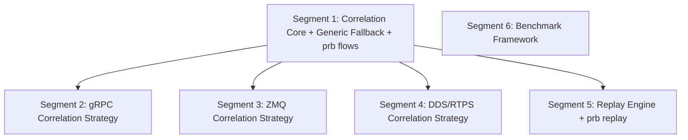

# Subsection 5: Analysis & Replay -- Manifest

## Dependency Diagram

Segment 6 has zero dependencies and can run in parallel with any segment including Segment 1. Segments 2, 3, 4, and 5 are mutually independent and can all run in parallel after Segment 1 completes. Maximum parallelism after Segment 1: 4 concurrent builders (Segments 2+3+4+5), then Segment 6 (or Segment 6 runs alongside Segment 1).

## Segment Index

| # | Title | File | Depends On | Risk | Complexity | Status |
|---|-------|------|------------|------|------------|--------|
| 1 | Correlation Engine Core + Generic Fallback + prb flows | segments/01-correlation-core.md | None | 4/10 | Medium | pending |
| 2 | gRPC Correlation Strategy | segments/02-grpc-correlation.md | 1 | 3/10 | Low | pending |
| 3 | ZMQ Correlation Strategy | segments/03-zmq-correlation.md | 1 | 5/10 | Medium | pending |
| 4 | DDS/RTPS Correlation Strategy | segments/04-dds-correlation.md | 1 | 7/10 | High | pending |
| 5 | Replay Engine + prb replay | segments/05-replay-engine.md | 1 | 4/10 | Medium | pending |
| 6 | Benchmark Framework | segments/06-benchmark-framework.md | None | 2/10 | Low | pending |

## Parallelization

After Segment 1: Segments 2, 3, 4, 5 can all run in parallel (4 concurrent builders).
Segment 6: zero dependencies, can run alongside any segment including Segment 1.

## Preamble Injection

Before launching any builder subagent, the orchestration agent assembles the prompt:
1. Read `iterative-builder-prompt.mdc` from `.cursor/rules/`
2. Read `devcontainer-exec.mdc` from `.cursor/rules/` (if applicable)
3. Read the segment file from `segments/{NN}-{slug}.md`

Assembled prompt = [preamble contents] + [segment file contents]

## Execution Instructions

1. Launch Segment 1 (walking skeleton, must complete first).
2. Launch Segments 2 + 3 + 4 + 5 in parallel (4 concurrent builders).
3. Launch Segment 6 in parallel with batch step 2, or after.
4. Run deep-verify.
