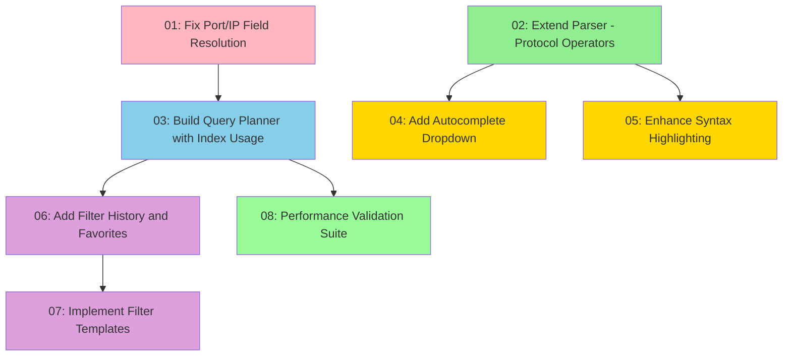

# Wireshark-Style Display Filters with Autocomplete -- Manifest

## Overview

This plan implements comprehensive Wireshark-style display filters for the probe TUI to fix the critical filter bug (udp.port==5353 shows TCP traffic) and add full filtering capabilities:

- **Critical bug fix**: Port/IP field resolution broken (string-based parsing, no protocol validation)
- **Filter syntax**: Full Wireshark semantics (tcp.port, udp.port, ip.src, ip.dst, frame.len, matches, in, functions)
- **Real-time autocomplete**: nucleo-matcher fuzzy search with dropdown UI showing field suggestions
- **Syntax highlighting**: Enhanced from existing implementation with error states and token types
- **Performance**: Query planner with index usage for 100k+ events (target: <10ms latency)
- **User experience**: Filter history, favorites, templates/presets, TOML persistence

**Current state**: Basic filter shown but broken (shows wrong traffic). Parser exists (nom-based) but incomplete. Syntax highlighting exists but needs enhancement. EventIndex exists but unused. Performance already exceeds targets (9ms for 100K events).

### Delivery Strategy

**Ordering: Dependency-based with foundational fix first**
- Wave 1: Fix port/IP resolution (S1) + extend parser (S2) - enables correct filtering
- Wave 2: Query planner (S3) - uses indices, enables performance validation
- Wave 3: Autocomplete (S4) + syntax highlighting (S5) - user experience
- Wave 4: History/favorites (S6) + templates (S7) - persistence and presets
- Wave 5: Performance validation (S8) - verify targets met

Benefits:
1. Bug fixed immediately → correct filtering established
2. Query planner early → autocomplete suggestions can show performance impact
3. User experience polish after correctness → stable foundation
4. Validation last → comprehensive benchmark suite with all features

## Dependency Diagram



**Legend:**
- 🔴 Pink: Wave 1 - Critical bug fix
- 🟢 Green: Wave 1 - Parser extension (independent)
- 🔵 Blue: Wave 2 - Performance optimization
- 🟡 Gold: Wave 3 - User experience
- 🟣 Purple: Wave 4 - Persistence
- 🟢 Light Green: Wave 5 - Validation

## Segment Index

| # | Title | File | Depends On | Risk | Complexity | Status |
|---|-------|------|------------|------|------------|--------|
| 1 | Fix Port/IP Field Resolution | segments/01-fix-port-ip-resolution.md | None | 5/10 | Medium | pending |
| 2 | Extend Parser with Protocol Operators | segments/02-extend-parser-operators.md | None | 4/10 | Medium | pending |
| 3 | Build Query Planner with Index Usage | segments/03-query-planner-index.md | 1 | 6/10 | High | pending |
| 4 | Add Autocomplete Dropdown | segments/04-autocomplete-dropdown.md | 2 | 5/10 | High | pending |
| 5 | Enhance Syntax Highlighting | segments/05-enhance-syntax-highlighting.md | 2 | 2/10 | Low | pending |
| 6 | Add Filter History and Favorites | segments/06-filter-history-favorites.md | 3 | 3/10 | Medium | pending |
| 7 | Implement Filter Templates | segments/07-filter-templates.md | 6 | 2/10 | Low | pending |
| 8 | Performance Validation Suite | segments/08-performance-validation.md | 3 | 2/10 | Low | pending |

## Parallelization Opportunities

### Wave 1 (Independent - can run 2 in parallel)
- Segment 1: Fix Port/IP Field Resolution
- Segment 2: Extend Parser with Protocol Operators

### Wave 2 (After S1)
- Segment 3: Build Query Planner (sequential after S1)

### Wave 3 (After Wave 1 - can run 2 in parallel)
- Segment 4: Autocomplete Dropdown (depends on S2)
- Segment 5: Syntax Highlighting (depends on S2)

### Wave 4 (After S3)
- Segment 6: Filter History (sequential after S3)
- Segment 7: Filter Templates (sequential after S6)

### Wave 5 (After S3)
- Segment 8: Performance Validation (can run in parallel with Wave 4)

## Preamble Injection

Before launching any builder subagent, the orchestration agent assembles the prompt from three sources:

1. **Read `.claude/commands/iterative-builder.md`** - Full contents (iteration budget, structured reporting, checkpoint strategy)
2. **Read `.claude/commands/devcontainer-exec.md`** - Full contents (Rust/Cargo commands, workspace structure, crate naming)
3. **Read the segment file** from `segments/{NN}-{slug}.md` - The entire file IS the brief

**Assembled prompt structure:**
```
[iterative-builder.md contents]
[devcontainer-exec.md contents]
[segment file contents]
```

Always inject from skill files - do NOT rely on inline preamble in old plan files.

## Execution Instructions

To execute this plan, use the `/orchestrate` skill with the following workflow:

### 1. Pre-Execution Cross-Plan Verification
If sibling plans exist in `.claude/plans/`, run cross-plan verification first using the `/restructure-plan` skill (Step 7 only). Present inconsistencies to user before launching builders.

### 2. For Each Segment (in Dependency Order)
Execute segments in waves according to the dependency diagram above:

**For each segment:**
1. **Read segment brief** from `segments/{NN}-{slug}.md`
2. **Assemble prompt** with preamble injection (iterative-builder.md + devcontainer-exec.md + segment)
3. **Launch iterative-builder subagent** via Agent tool with assembled prompt
4. **Monitor builder** - wait for completion (PASS, PARTIAL, or BLOCKED)
5. **Verify exit gates independently**:
   - Run targeted tests
   - Run regression tests
   - Run full build gate
   - Run full test suite gate
   - Perform self-review (no dead code, no scope creep)
   - Verify scope (changed files match stated scope)
6. **Commit if all gates pass**:
   - Identify WIP commits: `git log --oneline | grep "WIP:"`
   - Squash N WIP commits: `git reset --soft HEAD~N && git commit -m "<commit message from segment>"`
   - If no WIP commits, commit directly
7. **Update execution log** in `execution-log.md`
8. **Incremental verification** for segments with risk ≥6/10 or High complexity
9. **Adapt if needed** - update later segment briefs if implementation changes assumptions
10. **Move to next segment**

### 3. If Builder Reports PARTIAL or BLOCKED
1. **Launch iterative-debugger subagent** with:
   - Full `.claude/commands/iterative-debugger.md`
   - Full `.claude/commands/devcontainer-exec.md`
   - Builder's structured final report
   - Segment brief
   - Failure details (test names, error output)
2. **If debugger resolves** - re-verify gates and commit
3. **If debugger identifies design flaw** - stop, return to plan, update affected issue briefs

### 4. Resuming After Debugger Resolution
If debugger reports RESOLVED but gates not fully satisfied:
1. **Re-launch iterative-builder** with:
   - Standard preamble injection (fresh from skill files)
   - Prepend to segment brief: "RESUME MODE: Previous builder made partial progress, debugger resolved blocking issue. WIP commits exist. Start by running targeted tests to assess current state, then continue from where previous builder left off."
   - Fresh cycle budget (not remainder)
2. **On completion** - verify gates and commit

### 5. Post-Execution Verification (Deep-Verify Loop)
After all segments complete:
1. **Run deep-verify** against materialized plan file
2. **Review verification report** (criterion-by-criterion with PASS/PARTIAL/FAIL verdicts)
3. **If FULLY VERIFIED** - Plan complete, update execution log
4. **If PARTIALLY VERIFIED or NOT VERIFIED**:
   - Collect all PARTIAL, FAIL, HIGH-severity gaps
   - Re-enter deep-plan at Entry Point B (Enrich Existing Plan)
   - Materialize follow-up plan with `-followup` suffix
   - Execute follow-up using same orchestration protocol
   - Run deep-verify against combined scope
   - Repeat until FULLY VERIFIED or user decides to stop
5. **Loop budget** - Flag if >2 follow-up cycles needed (likely requires human design decisions)

## Estimated Scope

- **Total segments**: 8
- **Estimated duration**: 3-4 days (with parallel execution)
- **Complexity distribution**:
  - Low: 3 segments
  - Medium: 3 segments
  - High: 2 segments
- **Risk distribution**:
  - 2/10: 3 segments (safe enhancements)
  - 3/10: 1 segment (moderate risk changes)
  - 4/10: 1 segment (parser extension)
  - 5/10: 2 segments (bug fix, autocomplete)
  - 6/10: 1 segment (query planner)
- **Risk budget**: 1 segment at 6/10 risk (within acceptable limits)

### Caveats
- Segment 1 (port/IP resolution) requires careful handling of IPv6 addresses
- Segment 3 (query planner) involves heuristics that may need tuning
- Segment 4 (autocomplete) requires nucleo-matcher integration (new dependency)
- Performance already exceeds targets (9ms for 100K events), so validation should confirm no regressions
- Filter syntax must match Wireshark semantics exactly (user expectations)

## Plan Metadata

**Generated by**: deep-plan workflow (Step 9: Materialize)
**Rules version**: 2026-03-13 (orchestrate v3 format)
**Entry point**: Fresh goal (user requested Wireshark-style filters with autocomplete)
**Execution protocol**: orchestrate skill (authoritative orchestration protocol)
**Verification protocol**: deep-verify skill (post-execution verification)

**Research foundation**:
- Source 1 (Codebase): Analyzed prb-query (parser), prb-tui (filter_state, event_store, app), prb-core (event), prb-detect (registry bug)
- Source 2 (Project Conventions): CLAUDE.md, Cargo.toml (workspace structure), existing filter patterns
- Source 3 (Existing Solutions): nucleo-matcher (Helix), nom 8.0 (parser), rayon (parallel), ratatui 0.30 (TUI), pcap crate
- Source 4 (External Best Practices): Wireshark display filter documentation, Rust nom patterns, fuzzy search algorithms

All segment briefs include:
- Self-contained handoff contracts (no back-references)
- Concrete build/test commands (not placeholders)
- Pre-mortem risk analysis
- Evidence for optimality (≥2 sources)
- Exact commit messages (conventional commits format)
