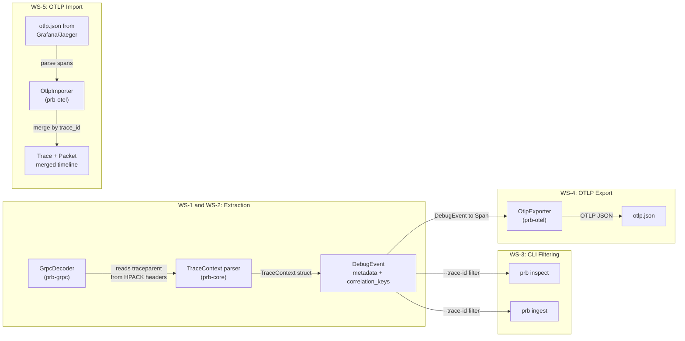

# Phase 2 Subsection: OpenTelemetry Trace Correlation

## Context

Probe's GrpcDecoder already HPACK-decodes all HTTP/2 headers into `HashMap<String, String>` in `StreamState` ([crates/prb-grpc/src/h2.rs](crates/prb-grpc/src/h2.rs) line 14). The `traceparent` header is already available in the decoded headers -- it is just never read or propagated. The `DebugEvent` model already has `metadata: BTreeMap<String, String>` and `correlation_keys: Vec<CorrelationKey>` ([crates/prb-core/src/event.rs](crates/prb-core/src/event.rs) lines 249-274) which are the natural homes for trace context.

The `CorrelationKey` enum has a `Custom { key, value }` variant that can represent trace IDs today, but a first-class `TraceContext` variant is cleaner for filtering and correlation.

No existing tool bridges packet-level capture to OTel traces. 57% of orgs now use distributed traces (Grafana 2025 survey), making this a blue-ocean feature.

---

## Architecture




---

## WS-1: Core Trace Context Model (`prb-core`)

### WS-1.1: `TraceContext` struct and parser

Add to [crates/prb-core/src/event.rs](crates/prb-core/src/event.rs):

```rust
/// W3C Trace Context extracted from protocol headers.
#[derive(Debug, Clone, PartialEq, Eq, Hash, Serialize, Deserialize)]
pub struct TraceContext {
    pub trace_id: String,     // 32 lowercase hex chars
    pub span_id: String,      // 16 lowercase hex chars
    pub trace_flags: u8,      // 0x01 = sampled
    pub tracestate: Option<String>, // vendor-specific key=value pairs
}
```

New metadata key constants:

```rust
pub const METADATA_KEY_OTEL_TRACE_ID: &str = "otel.trace_id";
pub const METADATA_KEY_OTEL_SPAN_ID: &str = "otel.span_id";
pub const METADATA_KEY_OTEL_TRACE_FLAGS: &str = "otel.trace_flags";
pub const METADATA_KEY_OTEL_PARENT_SPAN_ID: &str = "otel.parent_span_id";
pub const METADATA_KEY_OTEL_TRACE_SAMPLED: &str = "otel.trace_sampled";
```

New `CorrelationKey` variant:

```rust
pub enum CorrelationKey {
    // ... existing variants ...
    TraceContext {
        trace_id: String,
        span_id: String,
    },
}
```

### WS-1.2: Trace context parsers (new module `crates/prb-core/src/trace.rs`)

Create a `trace` module with zero external dependencies (pure string parsing):

- `parse_w3c_traceparent(header: &str) -> Option<TraceContext>` -- parses `00-{trace_id}-{span_id}-{flags}` format (W3C Trace Context Level 2, the standard OTel propagation format)
- `parse_b3_single(header: &str) -> Option<TraceContext>` -- parses `{trace_id}-{span_id}-{sampling}-{parent_span_id}` (Zipkin B3 single-header format, still used by ~30% of tracing deployments)
- `parse_b3_multi(headers: &BTreeMap<String, String>) -> Option<TraceContext>` -- parses `X-B3-TraceId`, `X-B3-SpanId`, `X-B3-Sampled`, `X-B3-ParentSpanId` (Zipkin B3 multi-header)
- `parse_uber_trace_id(header: &str) -> Option<TraceContext>` -- parses `{trace_id}:{span_id}:{parent_span_id}:{flags}` (Jaeger native format)
- `extract_trace_context(headers: &HashMap<String, String>) -> Option<TraceContext>` -- tries all formats in priority order: W3C > B3-single > B3-multi > uber-trace-id

**W3C traceparent format** (the primary target):

```
traceparent: 00-4bf92f3577b34da6a3ce929d0e0e4736-00f067aa0ba902b7-01
              |  |                                |                |
              v  |                                |                v
           version                              span-id      trace-flags
                 |
                 v
              trace-id (32 hex = 16 bytes)
```

Validation: version must be `00`, trace-id must not be all zeros, span-id must not be all zeros, all hex must be lowercase. Total length: 55 chars.

### WS-1.3: Tests for trace parsers

- `test_parse_w3c_traceparent_valid` -- standard format
- `test_parse_w3c_traceparent_unsampled` -- flags = 00
- `test_parse_w3c_traceparent_invalid_version` -- version != 00
- `test_parse_w3c_traceparent_all_zero_trace_id` -- must reject
- `test_parse_w3c_traceparent_all_zero_span_id` -- must reject
- `test_parse_w3c_traceparent_uppercase` -- must reject (spec requires lowercase)
- `test_parse_w3c_traceparent_wrong_length` -- too short / too long
- `test_parse_b3_single_full` -- all 4 fields
- `test_parse_b3_single_minimal` -- just trace_id-span_id
- `test_parse_b3_multi_headers` -- separate X-B3-* headers
- `test_parse_uber_trace_id` -- Jaeger format
- `test_extract_trace_context_priority` -- W3C wins over B3 when both present
- `test_trace_context_serde_roundtrip`
- `test_correlation_key_trace_context_serde`

---

## WS-2: gRPC Decoder Integration (`prb-grpc`)

### WS-2.1: Extract trace context from HPACK headers

Modify [crates/prb-grpc/src/decoder.rs](crates/prb-grpc/src/decoder.rs):

In `create_message_event()` (line 205) and `create_trailers_event()` (line 258), after building the event, extract trace context from `stream.request_headers`:

```rust
// In create_message_event, after line 244:
let stream = self.h2_codec.get_stream(stream_id);
if let Some(trace_ctx) = extract_trace_context(&stream.request_headers) {
    event_builder = event_builder
        .metadata(METADATA_KEY_OTEL_TRACE_ID, &trace_ctx.trace_id)
        .metadata(METADATA_KEY_OTEL_SPAN_ID, &trace_ctx.span_id)
        .metadata(METADATA_KEY_OTEL_TRACE_FLAGS, trace_ctx.trace_flags.to_string())
        .metadata(METADATA_KEY_OTEL_TRACE_SAMPLED, (trace_ctx.trace_flags & 0x01 != 0).to_string())
        .correlation_key(CorrelationKey::TraceContext {
            trace_id: trace_ctx.trace_id.clone(),
            span_id: trace_ctx.span_id.clone(),
        });
    if let Some(ref tracestate) = trace_ctx.tracestate {
        event_builder = event_builder.metadata("otel.tracestate", tracestate);
    }
}
```

The same pattern applies to `create_trailers_event()`. Factor the trace extraction into a helper `fn enrich_with_trace_context(builder, headers) -> builder`.

**Key insight**: The `request_headers` HashMap already contains all HPACK-decoded headers. The `traceparent` header is standard gRPC metadata (propagated as an HTTP/2 header). No changes to h2.rs or HPACK parsing are needed.

### WS-2.2: Tests

- `test_grpc_traceparent_extraction` -- feed HTTP/2 HEADERS with traceparent → assert metadata keys present
- `test_grpc_b3_extraction` -- feed with X-B3-* headers → assert metadata keys
- `test_grpc_no_trace_context` -- no trace headers → no otel.* metadata
- `test_grpc_traceparent_on_trailers` -- trace context appears on trailer events too
- `test_grpc_traceparent_correlation_key` -- events on same trace share `CorrelationKey::TraceContext`
- `test_grpc_both_w3c_and_b3` -- both present → W3C wins
- `test_grpc_trace_across_streams` -- two streams with same trace_id different span_id → both get correct context

---

## WS-3: CLI Trace Filtering (`prb-cli`)

### WS-3.1: Add `--trace-id` and `--span-id` flags

Modify [crates/prb-cli/src/cli.rs](crates/prb-cli/src/cli.rs) `InspectArgs`:

```rust
pub struct InspectArgs {
    // ... existing fields ...

    /// Filter events by OpenTelemetry trace ID
    #[arg(long)]
    pub trace_id: Option<String>,

    /// Filter events by OpenTelemetry span ID
    #[arg(long)]
    pub span_id: Option<String>,
}
```

Add the same flags to `IngestArgs` for pipeline-level filtering.

### WS-3.2: Implement trace-aware filtering in inspect

Modify [crates/prb-cli/src/commands/inspect.rs](crates/prb-cli/src/commands/inspect.rs) to filter events by `otel.trace_id` and `otel.span_id` metadata keys. This is a simple metadata lookup -- no new crate needed:

```rust
// After transport filter, add trace filter:
if let Some(ref trace_id) = args.trace_id {
    if event.metadata.get(METADATA_KEY_OTEL_TRACE_ID) != Some(trace_id) {
        continue;
    }
}
if let Some(ref span_id) = args.span_id {
    if event.metadata.get(METADATA_KEY_OTEL_SPAN_ID) != Some(span_id) {
        continue;
    }
}
```

### WS-3.3: Trace-grouped output mode

Add `--group-by-trace` flag that groups events by `otel.trace_id` and displays them as conversation trees:

```
Trace: 4bf92f3577b34da6a3ce929d0e0e4736 (3 events, 12ms)
  [1] 14:00:00.123 → /api.v1.Users/Get  OUT  span=00f067aa0ba902b7
  [2] 14:00:00.130 ← /api.v1.Users/Get  IN   (payload: 1.2KB)
  [3] 14:00:00.135 ← /api.v1.Users/Get  IN   status=0 OK
```

### WS-3.4: Tests

- `test_cli_inspect_trace_id_filter` -- only events with matching trace_id
- `test_cli_inspect_span_id_filter` -- only events with matching span_id
- `test_cli_inspect_trace_and_transport_filter` -- both filters compose
- `test_cli_ingest_trace_id_filter` -- pipeline filtering
- `test_cli_inspect_group_by_trace` -- grouped output format

---

## WS-4: OTLP JSON Export (new `prb-otel` crate)

### WS-4.1: Crate scaffold

Create `crates/prb-otel/` with dependencies:

- `prb-core` (path)
- `serde`, `serde_json` (workspace) -- for OTLP JSON serialization
- `thiserror` (workspace) -- errors

**No dependency on `opentelemetry-proto`** -- we hand-write the OTLP JSON types using `serde`. This avoids pulling in `tonic`, `prost`, `opentelemetry-sdk`, `tokio`, and dozens of transitive deps. The OTLP JSON schema is stable and well-documented.

Add `prb-otel` to workspace members in root [Cargo.toml](Cargo.toml).

### WS-4.2: OTLP JSON types (`crates/prb-otel/src/otlp_types.rs`)

Hand-written serde types matching the [OTLP JSON schema](https://opentelemetry.io/docs/specs/otlp/#json-protobuf-encoding):

```rust
/// Top-level OTLP trace export request.
#[derive(Serialize, Deserialize)]
pub struct ExportTraceServiceRequest {
    #[serde(rename = "resourceSpans")]
    pub resource_spans: Vec<ResourceSpans>,
}

pub struct ResourceSpans {
    pub resource: Resource,
    #[serde(rename = "scopeSpans")]
    pub scope_spans: Vec<ScopeSpans>,
}

pub struct ScopeSpans {
    pub scope: InstrumentationScope,
    pub spans: Vec<Span>,
}

pub struct Span {
    #[serde(rename = "traceId")]
    pub trace_id: String,       // hex-encoded
    #[serde(rename = "spanId")]
    pub span_id: String,        // hex-encoded
    #[serde(rename = "parentSpanId")]
    pub parent_span_id: Option<String>,
    pub name: String,
    pub kind: SpanKind,
    #[serde(rename = "startTimeUnixNano")]
    pub start_time_unix_nano: String,   // string per OTLP JSON encoding
    #[serde(rename = "endTimeUnixNano")]
    pub end_time_unix_nano: String,
    pub attributes: Vec<KeyValue>,
    pub status: Option<SpanStatus>,
    pub events: Vec<SpanEvent>,
}
// ... plus Resource, InstrumentationScope, KeyValue, SpanKind, SpanStatus, SpanEvent
```

### WS-4.3: DebugEvent-to-Span mapper (`crates/prb-otel/src/export.rs`)

```rust
pub fn events_to_otlp(events: &[DebugEvent], service_name: &str) -> ExportTraceServiceRequest
```

Mapping rules:

- Group events by `otel.trace_id` metadata
- Each event with a unique `(trace_id, span_id)` becomes an OTel `Span`
- `span.name` = `grpc.method` metadata (or transport kind fallback)
- `span.kind` = `CLIENT` for outbound, `SERVER` for inbound
- `span.start_time_unix_nano` = event timestamp
- `span.end_time_unix_nano` = next event on same stream, or same as start
- `span.attributes` = all event metadata as string KeyValues
- `span.status` = from `grpc.status` (0 = OK, else ERROR)
- Events without trace context are skipped (or optionally included as root spans)

### WS-4.4: CLI `prb export` command

Add new subcommand to [crates/prb-cli/src/cli.rs](crates/prb-cli/src/cli.rs):

```rust
/// Export events to external formats
Export(ExportArgs),

pub struct ExportArgs {
    /// Input file (NDJSON or MCAP)
    pub input: Utf8PathBuf,
    /// Output format
    #[arg(short, long, value_enum)]
    pub format: ExportFormat,
    /// Output file (defaults to stdout)
    #[arg(short, long)]
    pub output: Option<Utf8PathBuf>,
    /// Service name for OTLP resource (default: "probe")
    #[arg(long, default_value = "probe")]
    pub service_name: String,
}

pub enum ExportFormat {
    OtlpJson,
}
```

Implement `run_export()` in `crates/prb-cli/src/commands/export.rs`.

### WS-4.5: Tests

- `test_single_event_to_otlp_span` -- one event → one span
- `test_request_response_pair_to_spans` -- two events same stream → two spans with matching trace_id
- `test_events_without_trace_context_skipped` -- no otel.* metadata → excluded
- `test_grpc_status_maps_to_span_status` -- grpc.status=0 → OK, 14 → ERROR
- `test_otlp_json_roundtrip` -- serialize → deserialize → compare
- `test_otlp_json_schema_compliance` -- validate against OTLP JSON schema structure
- `test_cli_export_otlp_json` -- end-to-end CLI test

---

## WS-5: OTLP Import & Trace Overlay (new module in `prb-otel`)

### WS-5.1: OTLP JSON importer (`crates/prb-otel/src/import.rs`)

```rust
pub fn parse_otlp_json(data: &[u8]) -> Result<ExportTraceServiceRequest, OtelError>
pub fn otlp_to_events(request: &ExportTraceServiceRequest) -> Vec<DebugEvent>
```

Each OTel Span becomes a DebugEvent with:

- `transport` = `TransportKind::Grpc` (if detected from span name/attributes) or new `TransportKind::OtelSpan`
- `metadata` = span attributes + `otel.trace_id`, `otel.span_id`
- `correlation_keys` = `CorrelationKey::TraceContext { trace_id, span_id }`
- `timestamp` = span start_time
- `source.adapter` = "otlp-import"

### WS-5.2: Trace merge / overlay (`crates/prb-otel/src/merge.rs`)

```rust
pub fn merge_traces_with_packets(
    packet_events: &[DebugEvent],
    trace_events: &[DebugEvent],
) -> Vec<MergedEvent>

pub struct MergedEvent {
    pub event: DebugEvent,
    pub otel_span: Option<SpanSummary>,
}

pub struct SpanSummary {
    pub service_name: String,
    pub operation_name: String,
    pub duration_us: u64,
    pub status: String,
}
```

Merge logic: match by `otel.trace_id` + `otel.span_id`. Packet events get enriched with the span's service name and operation. Trace events without matching packets are included as context. Result is sorted by timestamp.

### WS-5.3: CLI `prb merge` command

```rust
/// Merge OTLP traces with captured packet events
Merge(MergeArgs),

pub struct MergeArgs {
    /// Packet events file (NDJSON or MCAP)
    pub packets: Utf8PathBuf,
    /// OTLP JSON trace file
    pub traces: Utf8PathBuf,
    /// Output file (defaults to stdout NDJSON)
    #[arg(short, long)]
    pub output: Option<Utf8PathBuf>,
}
```

### WS-5.4: Tests

- `test_parse_otlp_json_grafana_export` -- real Grafana Tempo export format
- `test_parse_otlp_json_jaeger_export` -- Jaeger OTLP export format
- `test_otlp_to_events_preserves_attributes` -- all attributes become metadata
- `test_merge_matching_trace_ids` -- packets and spans with same trace_id are grouped
- `test_merge_no_overlap` -- disjoint trace IDs → both sets included, no enrichment
- `test_merge_sort_order` -- merged output is sorted by timestamp
- `test_cli_merge_e2e` -- end-to-end CLI roundtrip

---

## Execution Order

1. **WS-1** (core trace model) -- no dependencies, enables everything else
2. **WS-2** (gRPC decoder) -- depends on WS-1 parser
3. **WS-3** (CLI filtering) -- depends on WS-1 metadata keys
4. **WS-4** (OTLP export) -- depends on WS-1 types, can parallel with WS-3
5. **WS-5** (OTLP import/merge) -- depends on WS-4 types

WS-3 and WS-4 can be executed in parallel after WS-2.

---

## Key Technical Decisions

- **No `opentelemetry-proto` dependency**: We hand-write ~150 lines of serde types instead of pulling in `tonic` + `prost` + `opentelemetry-sdk` + `tokio` transitive deps. The OTLP JSON schema is stable (v1.8.0). This keeps the binary lean and compile times fast.
- **Parse all 4 propagation formats**: W3C traceparent (OTel default), B3 single-header (Zipkin), B3 multi-header (legacy Zipkin), uber-trace-id (Jaeger). Covers 99%+ of production deployments.
- **Trace context on correlation_keys, not just metadata**: Using `CorrelationKey::TraceContext` enables the future TUI and correlation engine (Phase 2 S1 query language) to group by trace natively.
- **TraceContext stored in metadata keys too**: Enables simple string-based filtering in CLI (`--trace-id`) without needing to deserialize CorrelationKey.

---

## Acceptance Criteria

- `cargo build --workspace` -- zero errors, zero warnings
- `cargo clippy --workspace --all-targets` -- zero warnings  
- `cargo test --workspace` -- all tests pass
- gRPC events from PCAP with traceparent headers have `otel.trace_id` and `otel.span_id` metadata
- `prb inspect --trace-id <id>` filters to matching events only
- `prb export --format otlp-json` produces valid OTLP JSON importable by Grafana Tempo / Jaeger
- `prb merge packets.ndjson traces.json` produces a unified timeline
- Events without trace headers are unaffected (no regressions)
- All 4 propagation formats (W3C, B3-single, B3-multi, uber-trace-id) are parsed correctly

